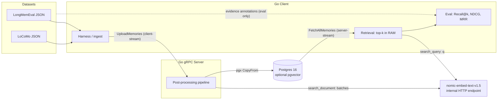
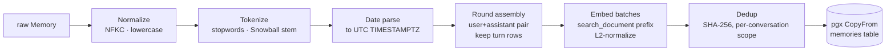
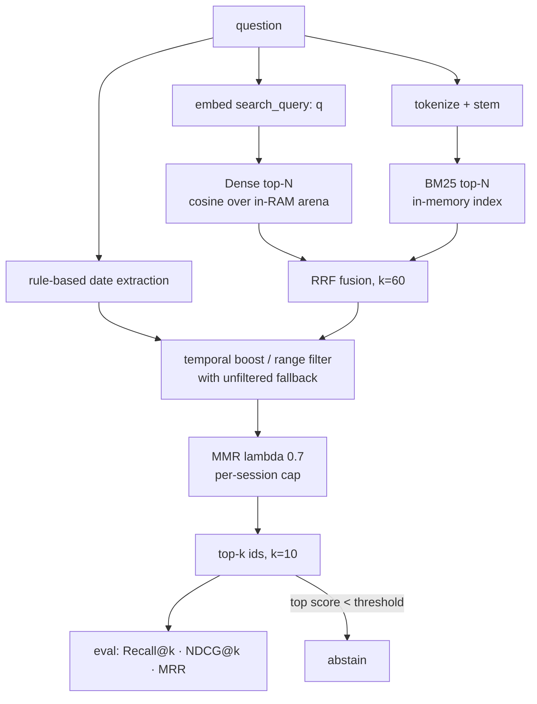
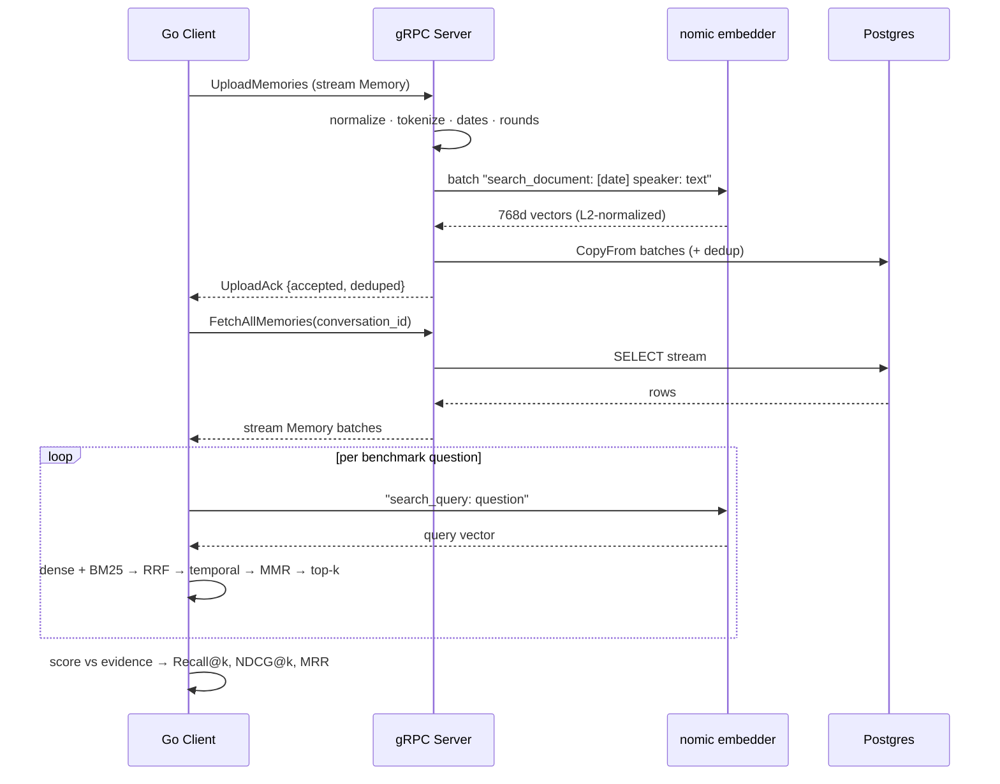
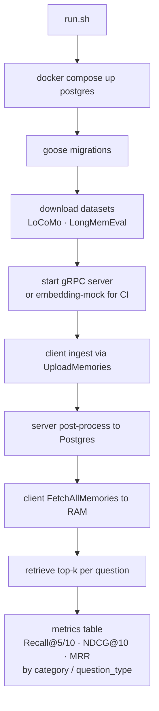

# Architecture Diagrams — Go gRPC Agent-Memory System (LoCoMo / LongMemEval)

Companion to the main design doc. Each diagram is given twice: as an ASCII block (renders anywhere) and as Mermaid source (paste into your repo README — GitHub renders it natively).

---

## 1. System overview

```
                ┌─────────────────────────── LOCAL MACHINE ───────────────────────────────┐
                │                                                                          │
 LoCoMo JSON ─┐ │  ┌───────────────────┐  UploadMemories (client-stream)  ┌────────────┐  │
 LongMemEval ─┼─┼─▶│ Go Client          │ ────────────────────────────────▶│ Go gRPC     │  │
 (datasets)   │ │  │ · harness/ingest   │                                  │ Server      │  │
              │ │  │ · retrieval (topK) │ ◀──────────────────────────────── │ · post-proc │  │
              │ │  │ · eval metrics     │  FetchAllMemories (server-stream)└──┬──────┬───┘  │
              │ │  └────────┬──────────┘                                      │      │      │
              │ │           │ embed query only                   embed docs   │      │ pgx  │
              │ │           │ ("search_query: …")     ("search_document: …")  │      │ COPY │
              │ │           ▼                                                 ▼      ▼      │
              │ │  ┌──────────────────────────────────────────┐        ┌──────────────┐    │
              │ │  │ nomic-embed-text-v1.5 (768d)              │        │ Postgres 16   │    │
              │ │  │ internal HTTP, OpenAI-compatible endpoint │        │ (+ optional   │    │
              │ │  └──────────────────────────────────────────┘        │   pgvector)   │    │
              │ │                                                       └──────────────┘    │
              │ └──────────────────────────────────────────────────────────────────────────┘
              └─▶ evidence annotations feed ONLY the eval module — never the retriever
```



---

## 2. Server-side post-processing pipeline (no LLM)

```
 raw Memory (text, speaker, session date)
        │
        ▼
 ┌──────────────┐  ┌───────────────┐  ┌────────────────┐  ┌────────────────┐
 │ Normalize     │─▶│ Tokenize       │─▶│ Date parse      │─▶│ Round assembly  │
 │ NFKC, lower,  │  │ stopwords,     │  │ → TIMESTAMPTZ   │  │ (user+assistant │
 │ whitespace    │  │ Snowball stem  │  │   (UTC)         │  │  pair; keep     │
 └──────────────┘  └───────────────┘  └────────────────┘  │  turn rows too) │
                                                           └───────┬────────┘
        ┌───────────────────────────────────────────────────────────┘
        ▼
 ┌────────────────────────┐  ┌────────────────┐  ┌──────────────────────────┐
 │ Embed batches (64–256)  │─▶│ Dedup           │─▶│ pgx v5 CopyFrom →         │
 │ "search_document:       │  │ SHA-256 exact;  │  │ memories(text, tsv,       │
 │  [date] speaker: text"  │  │ scope = per     │  │ lexemes, embedding BYTEA, │
 │ retries + L2-normalize  │  │ conversation_id │  │ ts, granularity, meta)    │
 └────────────────────────┘  └────────────────┘  └──────────────────────────┘
```



---

## 3. Client-side retrieval (per query)

```
                     question ──┬─▶ embed "search_query: q" ─▶ ┌─────────────────┐
                                │                              │ Dense top-N      │──┐
 in-RAM memory store            │                              │ cosine over      │  │
 (via FetchAllMemories):        │                              │ []float32 arena  │  │  ┌──────────┐
 ┌───────────────────────┐      └─▶ tokenize/stem ───────────▶ ┌─────────────────┐  ├─▶│ RRF fuse  │
 │ vector arena 768d      │                                    │ BM25 top-N       │──┘  │ k = 60    │
 │ BM25 inverted index    │                                    │ in-mem index     │     └────┬─────┘
 │ timestamps, session ids│                                    └─────────────────┘          │
 └───────────────────────┘                                                                  ▼
                          rule-based date extraction ─────▶ ┌────────────────────────────────┐
                          (araddon/dateparse, olebedev/when)│ Temporal boost ×1.3 / range     │
                                                            │ filter, unfiltered fallback     │
                                                            └───────────────┬────────────────┘
                                                                            ▼
                                                            ┌────────────────────────────────┐
                                                            │ MMR (λ≈0.7) + per-session cap   │
                                                            └───────────────┬────────────────┘
                                                                            ▼
                                                              top-k (k=10) ─▶ eval
                                                              score < τ  ──▶ abstain flag
```



---

## 4. gRPC interaction (sequence)

```
 Client                    Server                     Embedder            Postgres
   │  UploadMemories ────────▶│                           │                   │
   │  (stream Memory…)        │── normalize/tokenize ──┐  │                   │
   │                          │◀───────────────────────┘  │                   │
   │                          │── batch texts ───────────▶│                   │
   │                          │◀── vectors (768d) ────────│                   │
   │                          │── CopyFrom batches ──────────────────────────▶│
   │◀───── UploadAck ─────────│                           │                   │
   │                          │                           │                   │
   │  FetchAllMemories ──────▶│── SELECT stream ─────────────────────────────▶│
   │◀═ stream Memory batches ═│◀──────────────────────────────────────────────│
   │                          │                           │                   │
   │  (per question)          │                           │                   │
   │── "search_query: q" ─────────────────────────────────▶│                  │
   │◀── query vector ──────────────────────────────────────│                  │
   │  rank locally: dense + BM25 → RRF → temporal → MMR → top-k               │
```



---

## 5. One-click run/eval flow (`run.sh`)

```
 run.sh
   │
   ├─ docker compose up -d postgres          # postgres:16 (pgvector image optional)
   ├─ wait-for healthy ─▶ goose up           # migrations
   ├─ datasets/download.sh                   # LoCoMo (GitHub raw) + LongMemEval (HF CLI)
   ├─ docker compose up -d server            # gRPC server (+ embedding-mock for CI)
   │
   ├─ client ingest ──UploadMemories──▶ server ──post-process──▶ Postgres
   │
   ├─ client eval ──FetchAllMemories──▶ load to RAM
   │      └─ per qa/question: retrieve top-k ─▶ compare vs evidence annotations
   │
   └─ print metrics table:
        Recall@5 / Recall@10 / NDCG@10 / MRR
        × LoCoMo category (single-hop, multi-hop, temporal, open-domain)
        × LongMemEval question_type (skipping _abs for retrieval)
```


