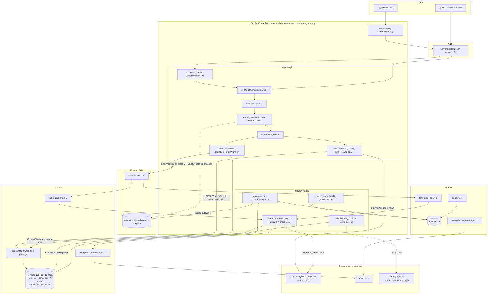
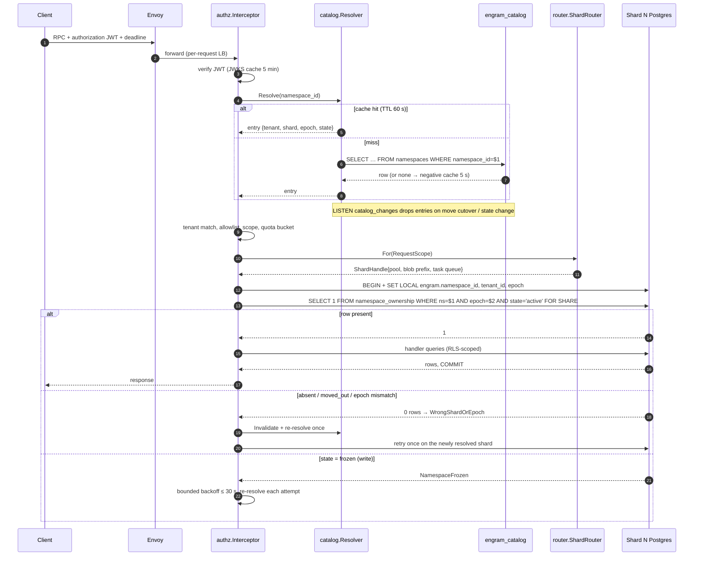
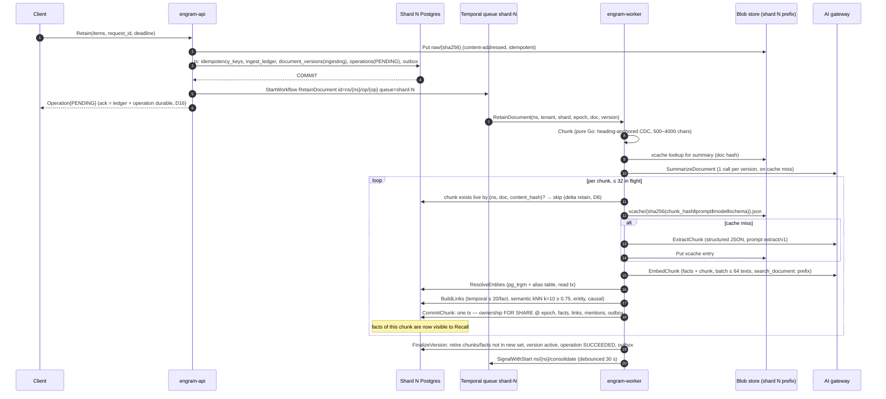
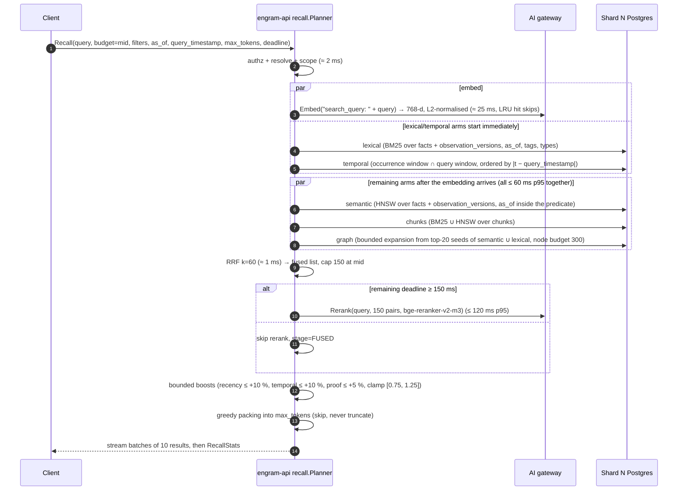

## 1. Architecture overview

All names, numbers and package paths in this section come from the decision register
(`00-decision-register.md`, cited as D1…D17). Assumptions are marked A-n; anything this
section adds beyond the register is listed under "New decisions" at the end of §2.

### 1.1 Thesis, binaries and external infrastructure

**Thesis.** Engram is a *cell-of-shards* memory service: every namespace is pinned by a
control-plane catalog to exactly one shard, a shard is one dedicated PostgreSQL 16 instance
(D2), and every other resource a namespace touches — blob prefix, search index, Temporal task
queue, outbox, caches, metrics — is derived from that same `shard_id`, so "no query, job or
cache spans shards" holds *by construction* rather than by review. The write path is
"acknowledge the raw input, then enrich durably": the API commits an append-only ingest-ledger
row plus an operation row and hands the rest to a Temporal workflow on the shard's task queue
(D11, D16). The read path (`Recall`) never calls a generative model (D10): five retrieval arms
run in parallel inside one shard, are fused with RRF, re-ranked by a cross-encoder through the
AI gateway, boosted within bounds and packed into a token budget, streamed to the client. The
correctness core is small and formalisable (§7): per-namespace ownership rows with epochs fence
every write (D2, D5), a transactional outbox is the only propagation mechanism (D6), and
`as_of` is enforced inside every arm (D9).

**The four binaries (D1).** Separate images; each owns a disjoint set of responsibilities.

| Binary | Owns | Does *not* own | Scale unit |
|---|---|---|---|
| `engram-api` | gRPC + Connect on one h2c port; `authz.Interceptor`; `catalog.Resolver` cache; `router.ShardRouter` with one pgbouncer pool per shard in its cell; synchronous paths: `Recall`, `Retain` ack (ledger + operation + `StartWorkflow`), `Delete` synchronous cascade, `Get/List/Invalidate/Restore`, `NamespaceService`, `OperationService`, `ExportService.StreamSnapshot`, `PageService` reads, admin services; quota token buckets; cross-cell forwarding (phase 3). | Any LLM call except the recall reranker and the query embedding; any background loop. | N stateless replicas behind Envoy; caches are per-process and safe to lose. |
| `engram-worker` | Temporal worker polling `shard-{id}` for every shard in its cell (2 pollers/queue, D3); all workflows and activities (`RetainDocument`, `Consolidate`, `PurgeDocument`, `PageRefresh`, `Export`, `Move`); the per-shard outbox relay (advisory-lock elected, D6); the move executor (activities of `move/{ns}/{epoch}`); the daily outbox trimmer. | Serving client RPCs; catalog calls on the hot path (D4: workflow inputs carry `(namespace_id, tenant_id, shard_id, epoch)`). | M replicas; any replica can host any queue of the cell; relays self-elect per shard. |
| `engram-mcp` | MCP server (streamable HTTP) exposing per-namespace endpoints `/mcp/{tenant_id}/{namespace_id}`; tool definitions derived from `memory.v1` protos; forwards the caller's JWT unchanged to `engram-api` over gRPC (D13). | Any authz decision, any storage access. | Stateless; scaled independently of the core. |
| `engramctl` | Operator CLI: shard provisioning (create DB, roles, extensions, partitions, RLS policies), per-shard migration rollout, catalog registration, move start/status/rollback, backups/restores with epoch bump, namespace purge after move grace, outbox trim, cache flush. | Anything a client can do through the public API. | Run by humans/CI against the admin gRPC surface (`memory.admin.v1`) and, for DDL, directly against catalog and shard DBs with an admin role. |

**External infrastructure** (assumed to exist; we configure, we do not build):

| System | Role in Engram | Coupling point |
|---|---|---|
| AI gateway (HTTP) | Chat with structured JSON output, embeddings, rerank, batch jobs. Model chosen per request from resolved config (D12, D15). | `internal/gateway.Client`; the only place model names and API keys appear. |
| Blob store (strongly consistent, key/value) | Raw item bodies, extraction cache, page markdown, export snapshots, backups. Keys are prefixed `{shard}/{tenant}/{ns}/…` (D11, D12); credentials are scoped to a shard prefix (§1.7). | `internal/blob.Store`; a `Scoped` wrapper rejects keys outside the prefix. |
| Per-shard PostgreSQL 16 (`paradedb/paradedb:latest-pg16`) + pgbouncer (transaction pooling) | System of record and the MVP search index (HNSW + pg_search BM25 + pg_trgm) (D2, D7). | `internal/store` (writes/reads), `internal/index.PostgresIndex` (search). One pool per shard per process, 16 conns (D3). |
| Catalog PostgreSQL `engram_catalog` (+ streaming replica) | Tenants, shards, namespaces, moves, `catalog_events`; `LISTEN catalog_changes` invalidation (D4). | `internal/catalog`. Only `engram-api`, `engramctl` and the move workflow talk to it. |
| Temporal | Durable orchestration; one task queue per shard `shard-{id}` (D11). | `internal/workflows`; clients in `engram-api` (start/signal/query) and `engram-worker` (poll). |
| Kafka (optional, off by default) | Fan-out of `engram.internal.events.v1.Event` to external consumers, topic per shard (D6). | `internal/outbox` `kafka` sink. Never on the write path. |
| Envoy | HTTP/2-aware per-request load balancing in front of `engram-api` and `engram-mcp`; TLS termination; per-route timeouts equal to the max deadline (§9). | Nothing in Go depends on Envoy; the interceptor requires a deadline so a missing Envoy timeout cannot make a call unbounded. |

Rationale for four binaries rather than one with modes (D1): the API must be restartable
without interrupting Temporal polling and the worker must be scalable to the gateway rate
limit without adding RPC capacity; separate images also keep the worker free of listening
ports. Rejected: a single binary with `--mode`, which the task statement forbids.

### 1.2 Component diagram

Reading the diagram: every arrow into a shard subgraph originates from a component that
already holds a `ShardHandle` for *that* shard (§2.2 `internal/router`); the only component
with two shard handles at once is the move executor, and it never issues a statement that
references both (it copies rows out of one connection and into another, fenced by epoch, D5).
The Connect and MCP adapters sit strictly in front of the same interceptor chain, so there is
one enforcement point (D13).

### 1.3 Namespace routing data flow

Clients send `tenant_id` + `namespace_id`; they never see a `shard_id` (D1). The steps below
run inside `authz.Interceptor` and `router.ShardRouter` for every unary call and at stream
open for every streaming call.

1. **Deadline check.** The interceptor rejects any call without a deadline
   (`INVALID_ARGUMENT`, `ValidationError{field:"deadline"}`) and clamps it to the per-method
   maximum (§4). Rationale: a missing deadline is the most common cause of pool exhaustion
   under a slow gateway; rejecting is cheaper than any timeout heuristic.
2. **JWT verify.** `authorization: Bearer <jwt>` is verified against a JWKS cached for
   5 min (D13). Failure → `UNAUTHENTICATED`. Claims: `tenant_id`, `ns` allowlist, `scopes`.
3. **Namespace extraction.** The request message is asserted to a small interface
   (`GetTenantId()`, `GetNamespaceId()`); methods without a namespace (e.g.
   `NamespaceService.CreateNamespace`, admin methods) are marked tenant-scoped or
   admin-scoped in the method policy table (§2.2 `internal/authz`).
4. **Catalog resolve.** `catalog.Resolver.Resolve(namespace_id)`:
   *cache hit* (LRU 100 k, TTL 60 s) → entry `{tenant_id, shard_id, epoch, state, config}`;
   *miss* → single-flight query to `engram_catalog` (primary; replica if primary is down),
   result cached; *negative* result cached 5 s (D4). Invalidation: a background goroutine holds
   `LISTEN catalog_changes` and drops the entry named in each payload
   `{namespace_id, shard_id, epoch, state}`; on connection loss it reconnects and flushes the
   whole cache once (a full flush after reconnect is the only way to guarantee no missed
   notification; rejected: replaying `catalog_events` since a watermark — more code for a
   rare event).
5. **Ownership verify.** `entry.tenant_id == claims.tenant_id` and
   (`"*" ∈ claims.ns` or `namespace_id ∈ claims.ns`); otherwise `NOT_FOUND` (not
   `PERMISSION_DENIED`, so that namespace ids of other tenants are not enumerable — rationale:
   an oracle that distinguishes "exists but not yours" from "does not exist" leaks tenancy
   information). Required scope for the method is checked next → `PERMISSION_DENIED`.
6. **Quota gate.** Token bucket for `recalls_per_min` / `retains_per_min` keyed by tenant and
   namespace (D13) → `RESOURCE_EXHAUSTED` + `QuotaFailure` + `RetryInfo`.
7. **Scope in context.** `RequestScope{tenant, namespace, shard, epoch, scopes, request_id}`
   is attached to the context; nothing downstream re-reads metadata.
8. **Shard handle selection.** `router.For(scope)` returns the `ShardHandle` for
   `scope.shard` if the shard is in this cell; otherwise (phase 3) the call is forwarded over
   gRPC to the owning cell's Envoy with identical metadata and remaining deadline, and the
   response is proxied verbatim.
9. **Transaction fencing.** Every store access runs through `store.WithNamespaceTx`:
   `BEGIN` → `SET LOCAL engram.namespace_id/tenant_id/epoch` → for writes
   `SELECT 1 FROM namespace_ownership WHERE namespace_id=$1 AND epoch=$2 AND state='active'
   FOR SHARE`, for reads the same without `FOR SHARE` and accepting `state IN
   ('active','frozen')` (D2) → the query → `COMMIT`. RLS makes any query missing the
   namespace predicate return nothing rather than leak.

**Failure handling on this path.**

| Situation | Detection | Behaviour |
|---|---|---|
| Stale cache after a move cutover (`shard_id` or `epoch` changed) | Ownership check fails on the shard: row absent, `state='moved_out'`, or epoch mismatch → store returns `errs.WrongShardOrEpoch{expected, observed}` | The router invalidates the entry, re-resolves **once** (bypassing cache), and retries the whole handler once. A second `WrongShardOrEpoch` is returned to the client as `FAILED_PRECONDITION` + `WrongShardOrEpoch` detail (clients treat it as retryable after 1 s). Rejected: unbounded retry loops (mask catalog bugs). |
| Namespace frozen (move step 4, D5) | Write-mode ownership check sees `state='frozen'` → `errs.NamespaceFrozen` | Writes are retried with jittered exponential backoff (100 ms → 2 s) for up to 30 s or the request deadline, whichever is earlier, re-resolving the catalog before each attempt so the retry lands on the target after cutover. Reads are not affected (frozen is readable). After the bound → `FAILED_PRECONDITION` + `NamespaceFrozen{retry_after}`. |
| Catalog primary unavailable | Resolve miss cannot be served | Cached entries are served past TTL up to `stale_max = 10 min` (a `catalog_stale` gauge is raised); a miss (or entry older than 10 min) → `UNAVAILABLE` + `RetryInfo{2 s}` (D4). Correctness is unaffected because the shard's ownership row, not the cache, decides writability. |
| Namespace `state ∈ {deleting, deleted}` | Catalog entry | `NOT_FOUND` for both reads and writes (D8). |
| Namespace `state='moving'` (before freeze) | Catalog entry | No special handling: writes still go to the source at epoch e (D5 step 1). |
| Shard not in this cell | `router.For` | Forward (phase 3) or `UNAVAILABLE` + `ErrorInfo{reason:"SHARD_NOT_LOCAL"}` in MVP (single cell, so this indicates a catalog misconfiguration). |

### 1.4 Retain data flow

`MemoryService.Retain` is unary (D16: the ack promises durability of the raw input, not
visibility). The API does three things in one shard transaction and one Temporal call:

1. `store.WithNamespaceTx(write)`: insert `idempotency_keys(request_id)` (24 h, D1) — a
   duplicate returns the stored `operation_id` immediately; append the `ingest_ledger` row
   (raw item body ≤ 64 KiB inline, larger bodies referenced by blob key
   `{shard}/{tenant}/{ns}/raw/{sha256}`; the blob `Put` happens *before* the transaction and
   is content-addressed so a retry re-puts the same key); insert `documents`/`document_versions`
   (`status='ingesting'`, D8) and the `operations` row (`state=PENDING`); write one outbox
   event `OperationSubmitted`. Commit.
2. `StartWorkflow(RetainDocument, id="ns/{namespace_id}/op/{operation_id}",
   task_queue="shard-{shard_id}", WorkflowIdReusePolicy=RejectDuplicate)` with input
   `(namespace_id, tenant_id, shard_id, epoch, document_id, version, ledger_ref)`;
   `AlreadyStarted` counts as success (retry after a crash between steps 1 and 2).
3. Return `Operation{operation_id, state=PENDING}`. If step 2 fails after step 1 committed,
   the API returns `UNAVAILABLE` + `RetryInfo{1 s}`; the client's retry with the same
   `request_id` hits the idempotency row and only repeats step 2. As belt and braces, the
   per-shard sweeper schedule `shard/{id}/op-sweeper` (every 60 s) starts a workflow for any
   `PENDING` operation older than 2 min with no workflow (new decision N3).

The worker then executes the D11 activity chain. Every activity is idempotent by
`(namespace_id, document_id, version, content_hash)` (the epoch is a fence, never part of the key, D11); per-chunk fan-out is bounded to
32 by the workflow (not by the worker's activity slots, so one large document cannot starve
the queue).

**Throughput (D3).** Per worker: `chunks/s = min(32 / L_extract, R_extract_rpm / 60)` where
32 is the extraction concurrency, `L_extract` the gateway structured-call latency (≈ 3–6 s
observed for a fast structured model, A-3) and `R_extract_rpm` the per-model RPM cap. With no
cap: 5–10 chunks/s/worker. With a 600 RPM cap the cell as a whole is limited to 10 chunks/s
regardless of worker count; adding workers beyond `ceil(600/60 × L_extract / 32)` ≈ 1–2 buys
nothing. Backfills bypass the cap by submitting extraction through the gateway batch API
(`ExtractChunk` has a `batch` variant that submits, checkpoints the job id in workflow state,
and polls; ~50 % cheaper). Embedding is not the bottleneck (batch of 64, ≈ 100 ms).

Rejected: acking only after the first chunk commits (would make the ack latency LLM-bound and
tie the client's deadline to the gateway); acking before the ledger row is durable (the raw
input is the one thing we promise never to lose).

### 1.5 Recall data flow

`MemoryService.Recall` is server-streaming with **no LLM call** (D10); the two network
round-trips are the query embedding and the cross-encoder rerank, both through the gateway.

Notes on the diagram: the graph arm depends on seeds from semantic ∪ lexical, so it starts
when both have returned (or when the per-arm deadline expires, in which case it seeds from
whichever finished). Each arm carries its own deadline (`min(60 ms, remaining − reserve)`);
an arm that times out contributes nothing and is reported in `RecallStats.arms[].status`.
Observations participate through the semantic and lexical arms over `observation_versions`
(D10), with the `as_of` rule of D9 (latest version with `effective_at ≤ T`) applied in the
same predicate.

**Latency budget at mid budget (D3, A-2 for gateway rerank latency):**

| Stage | p95 budget | Degradation if over budget |
|---|---|---|
| authz + catalog resolve + quota | 2 ms | none (fail-fast errors only) |
| Query embedding (gateway; per-process LRU keyed `(namespace, sha256("search_query: "+q))`) | 25 ms | semantic + chunk-HNSW arms are dropped; lexical, temporal, chunk-BM25, graph (seeded from lexical only) still run |
| 5 arms in parallel (per-arm caps 50/150/400 by budget; graph node budget 100/300/1000) | 60 ms | an arm past its deadline is cancelled and omitted; `RecallStats` names it |
| RRF fusion, k = 60 | 1 ms | never skipped |
| Cross-encoder rerank on top 50/150/300 | 120 ms | skipped if remaining deadline < 150 ms → `stage=FUSED` |
| Boosts + packing (tiktoken `cl100k_base`) | 3 ms | never skipped |
| Streaming overhead (batches of 10, trailing `RecallStats`) | 5 ms | — |
| **Total** | **≈ 215 ms** | target p95 < 300 ms at 50 QPS/shard |

The planner is deadline-aware at every boundary: before starting each stage it compares the
remaining deadline with the stage's reserve and either runs it, degrades it or emits what it
has (§2.2 `internal/recall`). Rejected: a fixed pipeline that returns `DEADLINE_EXCEEDED`
when the reranker is slow — a fused-but-unranked answer is strictly more useful to an agent
than an error, and the client can see `stage` per result.

### 1.6 Delete data flow

`DocumentService.DeleteDocument` (and `NamespaceService.DeleteNamespace`,
`TenantService.DeleteTenant`, which fan out to it) is unary and does the D8 cascade
**synchronously in one shard transaction**, then schedules the asynchronous purge:

1. `WithNamespaceTx(write)`: ownership `FOR SHARE`; `document_versions.status='deleted'`;
   `facts.retired_at = now()` for every fact of the document; delete `fact_links` rows
   touching those facts (both directions); delete `entity_mentions`; delete
   `observation_sources` rows citing those facts — the D12 trigger retires observations whose
   source count reaches 0, and observations that lost ≥ 1 source but still have sources are
   marked `stale=true`; delete `page_sources` rows and mark affected pages
   `stale_delete=true`; insert `operations(kind=DELETE, state=RUNNING)`; write outbox events
   `FactsRetired`, `DocumentDeleted`. Commit.
2. `StartWorkflow(PurgeDocument, id="ns/{ns}/op/{operation_id}", queue shard-{id})` with
   grace 0 for explicit delete (1 h for retire-by-replace).
3. Return `Operation{RUNNING}`.

**What the ack guarantees (D16):** from the moment the ack is returned, nothing from the
document is returned by `Recall`, `Reflect`, `GetMemory`, `ListMemories` or a *new* export
(all of them filter `retired_at IS NULL`; observations and pages are visible but flagged
stale). What it does *not* guarantee: physical row purge, blob deletion, index-engine
convergence for an external (`Async`) index, and reconsolidation of stale observations —
these complete asynchronously and are observable via the delete operation's state
(`WaitOperation`). Rejected: deferring the cascade to the purge workflow (would leave a window
where a deleted document is recalled — exactly the invariant §7 model-checks).

### 1.7 Where every shard-scoped resource lives

Everything below is derived from `shard_id` (D2) and, where per-namespace, from
`(tenant_id, namespace_id)`. The last column names the mechanism that makes it impossible for
the resource to span shards.

| Resource | Shard-scoped form | Nothing-spans-shards mechanism |
|---|---|---|
| Postgres database | One instance per shard, DB `engram`, role `engram_app` (`NOBYPASSRLS`), 16 hash partitions by `namespace_id` on the big tables | A connection belongs to one instance; `namespace_id` leads every PK/index; RLS policy on `current_setting('engram.namespace_id')`. |
| pgbouncer | One sidecar per shard, transaction pooling; one pool per shard per process, 16 conns (D3) | `ShardHandle.Pool` is created from the shard's DSN only; there is no "any shard" pool. |
| Blob prefix + credential | `{shard}/{tenant}/{ns}/{raw,xcache,pages,export,ledger-overflow}/…`; one credential per shard scoped to `{shard}/*` (A-4: the blob store supports prefix-scoped credentials; otherwise per-shard buckets) | `blob.Scoped(store, prefix)` rejects any key outside its prefix at the client; the credential rejects it at the server. |
| Search index | HNSW + BM25 + pg_trgm indexes on the shard's own tables (`Transactional`); for an external engine (`Async`), index name `engram-shard-{id}` fed only by that shard's outbox relay | The index object is a field of the `ShardHandle`; the relay for shard N only reads shard N's outbox. |
| Temporal task queue + workflow ids | Queue `shard-{id}`. Ids: `ns/{namespace_id}/op/{operation_id}` (retain, delete/purge, export), `ns/{namespace_id}/consolidate` (singleton per namespace, `SignalWithStart`), `ns/{namespace_id}/page/{page_id}` (refresh), `shard/{id}/outbox-relay` (lease-holder record, not a workflow — the relay is a goroutine, see §2.2), `shard/{id}/op-sweeper` (schedule), `move/{namespace_id}/{epoch}` (runs on `shard-{target}`) | Workflow inputs carry `(namespace_id, tenant_id, shard_id, epoch)` and every activity re-derives its `ShardHandle` from `shard_id` and re-checks ownership; a workflow started on the wrong queue fails its first activity with `WrongShardOrEpoch` (non-retryable). |
| Kafka topic/key (optional) | Topic `engram.events.shard-{id}`, key `namespace_id`, value `engram.internal.events.v1.Event`, header `schema=…` (D6) | Producer is the shard's relay; per-namespace ordering follows from the key. |
| In-process caches | Catalog resolver keyed by `namespace_id` (holds the shard, so it *maps* to shards, it does not span them); per-shard pools keyed by `shard_id`; embedding LRU keyed `(namespace_id, sha256(prefixed text))`; JWKS keyed by `kid`; extraction cache is in blob, per namespace | Cache keys include the namespace; a cache entry never carries data of another namespace, and the embedding cache stores a vector of the *query*, never of stored content. Rejected: a global embedding cache keyed by text (timing side channel between tenants, D11 rationale). |
| Metrics labels | `shard="7"` on every metric; `tenant` only on metering counters; never `namespace` (D13) | Label values come from `ShardHandle.Metrics`; a linter in `internal/telemetry` rejects any metric registered with a `namespace` label. |
| Token usage / quotas | `token_usage(day, op, model, …)` table in the shard DB; rate buckets in the API process keyed by tenant/namespace | Moves with the namespace (it is namespace-scoped data). |
| Outbox | `outbox` table + `outbox_cursors` per shard | Sequence is per shard; the move consumer `move:<ns>` reads only its namespace's rows by predicate. |

### 1.8 Consistency model and failure domains

**Consistency (D16, restated).** *Retain*: the ack means the raw item and the operation are
durable; facts appear per chunk as each `CommitChunk` commits; `WaitOperation` returning
`SUCCEEDED` is the read barrier after which a `Recall` on the same namespace sees every fact
of that version (reads hit the shard primary; there are no replicas on the recall path).
*Observations and pages* lag by the 30 s consolidation debounce plus processing; `Operation`
exposes `consolidation_lag` rather than promising a bound. *Delete*: the ack means the
synchronous cascade committed; visibility is gone everywhere from that instant; purge is
asynchronous and observable. *Cross-namespace and cross-shard*: no ordering or visibility
relation of any kind. *Idempotency*: unary writes are idempotent for 24 h by `request_id`;
async operations by `operation_id`; activities by their D11 key; consolidation by `op_key`.

**Failure domains.** "Degrades" means the operation completes with reduced function and says
so in the response; "fails" means a typed error with `RetryInfo`.

| Component down | Recall | Retain | Delete | Consolidate / Reflect / Pages | Move | Blast radius |
|---|---|---|---|---|---|---|
| One shard's Postgres | fails (`UNAVAILABLE`) for namespaces on that shard | fails at ack (ledger row cannot commit) | fails | workflows on `shard-{id}` retry with backoff, no data loss | a move *into* that shard stalls in `copying`/`catching_up` and rolls back after its timeout; a move *out of* it stalls | only namespaces on that shard (≈ 150 of 10 000+); other shards unaffected |
| Catalog Postgres (primary and replica) | serves from cache up to 10 min; misses fail `UNAVAILABLE` | same; the workflow itself never needs the catalog | same | unaffected (workflow inputs carry shard/epoch) | cannot plan or cut over; in-flight moves pause before `cutover` and roll back if the freeze bound is hit | new/rare namespaces only, after 10 min everyone |
| AI gateway | degrades: embedding miss drops the dense arms, rerank skipped (`stage=FUSED`); lexical/temporal/graph/chunk-BM25 still answer | ack succeeds; extraction/embedding activities retry with backoff (`PermanentLLMError` only on 4xx schema/model errors); operation stays `RUNNING` | unaffected | stall and retry; Reflect fails (`UNAVAILABLE`) since it is LLM-bound | unaffected | everything LLM-bound is delayed, nothing is lost |
| Temporal | unaffected | ack fails `UNAVAILABLE` (step 2 in §1.4) — rejected alternative: ack and rely solely on the sweeper, which would silently extend the visibility lag | synchronous cascade still commits; purge is delayed | stall | stall | write-side latency only |
| Blob store | unaffected (recall reads Postgres only) | fails at ack when the body exceeds the inline limit (raw blob `Put` precedes the tx); extraction proceeds without cache (cache errors are logged, never fatal) | cascade commits; blob purge retries | page refresh cannot persist markdown → retries | copy phase stalls | large-document ingest and pages |
| Kafka (if enabled) | unaffected | unaffected | unaffected | unaffected | unaffected | only external consumers; the relay's `kafka` cursor stops advancing, outbox rows are retained until it catches up (7-day trim guard raises an alert at 5 days) |
| Envoy / all `engram-api` | everything fails at the edge | | | workers keep draining queues | continues | client-facing only |
| All `engram-worker` | unaffected | acks continue; queues grow | cascade commits; purge waits | stall | stall | async work only; bounded by Temporal history retention |

### 1.9 Comparison with Hindsight

Hindsight (vectorize-io, MIT) is the functional reference. Rows are marked **same** (kept on
purpose), **improved** (same idea, stronger guarantee) or **different** (a design divergence
with a reason). Claims about Hindsight reflect its public docs and source at the time of
writing (A-5).

| Aspect | Hindsight | Engram | Verdict / reason |
|---|---|---|---|
| Tenancy unit | Memory "banks", flat; no physical placement concept | tenant → namespace → shard; shard chosen by a catalog, fenced by epochs | **different** — 10 000 tenants × 1 B facts need placement and isolation, not just a key column |
| API surface | REST/JSON (Python service) + MCP | gRPC + Connect on one port + MCP, all generated from one `memory.v1` proto | **different** — protobuf as the single source of truth for stubs, adapters, Temporal and Kafka payloads |
| Retrieval arms | semantic, keyword (BM25), graph, temporal | the same four plus a raw-chunk arm (BM25 ∪ HNSW over chunks) | **improved** — text the extractor missed is still findable |
| Fusion + rerank | RRF, cross-encoder rerank | RRF k=60, gateway cross-encoder on top 50/150/300 with deadline-aware skip | **same** idea; **improved** by streaming + explicit `stage` per result |
| `as_of` | not a first-class query-time filter | `mentioned_at ≤ T` inside every arm; versioned observations with `effective_at` | **improved** — required for leak-free evals |
| Observations | single evolving text with sources and history | `observation_versions` with `effective_at = max(mentioned_at of cited facts)`; never outlive sources (DB trigger) | **improved** — time-travel and a provable "no orphan observation" invariant |
| Extraction | 1 structured LLM call per chunk, ~32 parallel | same, plus a content-addressed per-namespace extraction cache in blob and batch-API backfills | **improved** — re-indexing never re-pays extraction |
| Chunking | ~3 000 chars, no overlap | heading-anchored content-defined boundaries + contextual header (summary + heading path) | **improved** — better section fidelity and embedding context |
| Change propagation | direct writes to the store/index | transactional outbox per shard; index/Kafka/move are consumers | **different** — no dual writes; the outbox doubles as the move log |
| Async orchestration | in-process async tasks | Temporal workflows per shard queue with per-chunk durable state | **different** — restartable across worker crashes and shard moves |
| Consolidation | batched LLM ops with bisect on failure | same batching (8/call, ≤ 100/round), plus `op_key` idempotency and a source-count trigger | **same** idea, **improved** exactly-once effect |
| Reflect | bounded agent loop with tools, mission/directives/disposition | same caps (10 iters, 100 k tokens, 300 s) with server-side citation verification against retrieved ids | **same** — deliberately kept |
| Formal methods | none | TLA+ for outbox, move, delete-vs-retain, consolidation; Lean 4 for RRF, packing, tag match, temporal windows | **different** — the register's invariants are checkable |
| Deployment | single Python service + Postgres | four Go binaries, Envoy, one Postgres per shard, Temporal, Compose | **different** — horizontal scale by cell and shard, no Kubernetes |
