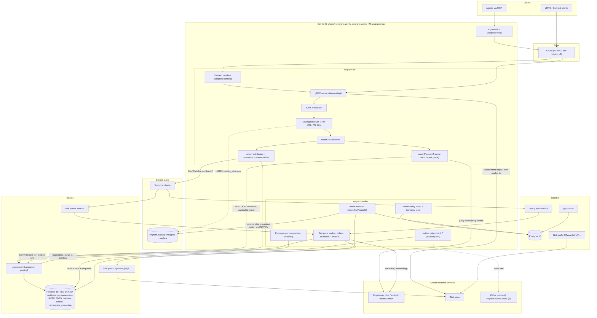
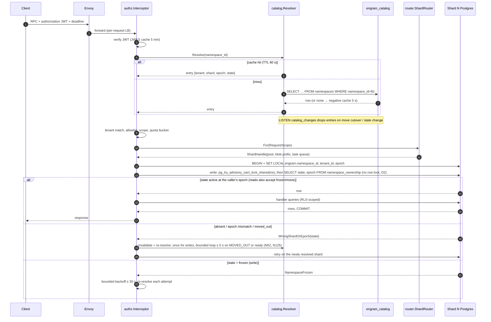
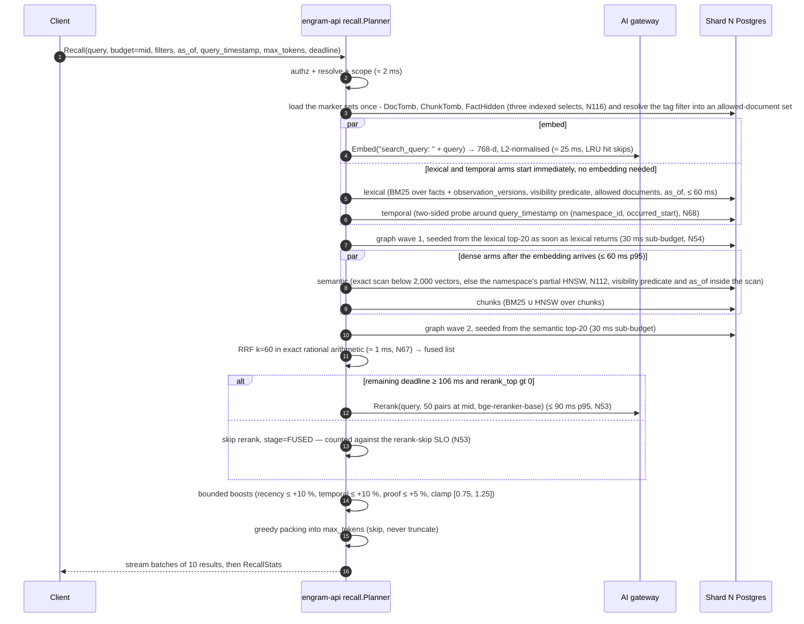
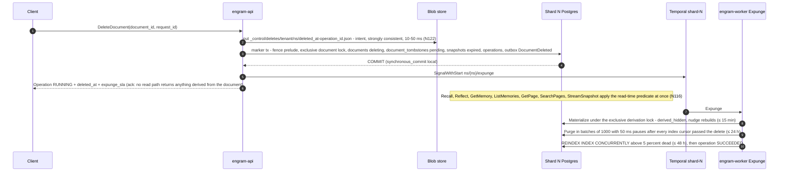
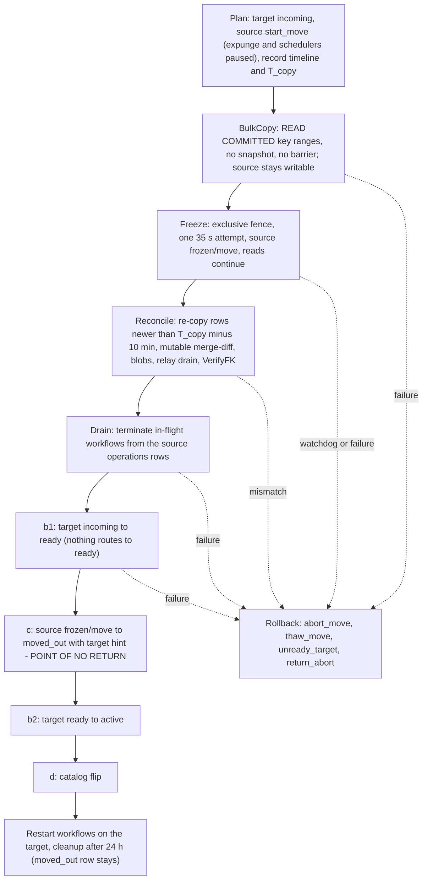

## 1. Architecture overview

All names, numbers and package paths in this section come from the decision register
(`00-decision-register.md`, cited as D1…D22 and N1…N132). Assumptions are marked A-n.

### 1.1 Thesis, binaries and external infrastructure

**Thesis.** Engram is a *cell-of-shards* memory service: every namespace is pinned by a
control-plane catalog to exactly one shard, a shard is one dedicated PostgreSQL 16 instance
(D2), and every other resource a namespace touches — blob prefix, search index, Temporal task
queue, outbox, caches, metrics — is derived from that same `shard_id`, so "no query, job or
cache spans shards" holds *by construction* rather than by review. The write path is
"acknowledge the raw input, then enrich durably": the API commits an append-only ingest-ledger
row plus an operation row and hands the rest to a Temporal workflow on the shard's task queue
(D11, D16). The read path (`Recall`) never calls a generative model (D10): five retrieval arms
run in parallel inside one shard, are fused with RRF, re-ranked by a cross-encoder through the
AI gateway, boosted within bounds and packed into a token budget, streamed to the client. The
correctness core is small and formalisable (§7): per-namespace ownership rows with epochs fence
every write (D2, D5), a transactional outbox is the only propagation mechanism (D6), and
`as_of` is enforced inside every arm (D9). Since the round-3 redesign (D22), rows that carry
vectors or BM25 text are written once and only ever purged, and visibility is a **read-time
predicate over small marker sets**: a delete is one marker row at the ack and a throttled
asynchronous `Expunge` does the physical work afterwards (N113, N115–N119).

**The four binaries (D1).** Separate images; each owns a disjoint set of responsibilities.

| Binary | Owns | Does *not* own | Scale unit |
|---|---|---|---|
| `engram-api` | gRPC + Connect on one h2c port; `authz.Interceptor`; `catalog.Resolver` cache; `router.ShardRouter` with one pgbouncer pool per shard in its cell; synchronous paths: `Recall`, `Retain` ack (ledger + operation + `StartWorkflow`), the delete/invalidate **marker transaction** (intent object + tombstone, O(1)), `Get/List/Invalidate/Restore`, `NamespaceService`, `OperationService`, `ExportService.StreamSnapshot`, `PageService` reads, admin services; quota token buckets; cross-cell forwarding (phase 3). | Any LLM call except the recall reranker and the query embedding; any background loop. | N stateless replicas behind Envoy; caches are per-process and safe to lose. |
| `engram-worker` | Temporal worker polling `shard-{id}` for every shard in its cell (2 pollers/queue, D3); all workflows and activities (`RetainDocument`, `Consolidate`, `Expunge`, `PageRefresh`, `ExportSnapshot`, `Move`, `TenantDelete`, `RetainBackfill`, `ReembedNamespace`); the per-shard outbox relay (advisory-lock elected, D6); the move executor (activities of `move/{ns}/{epoch}`); the daily outbox trimmer. | Serving client RPCs; catalog calls on the hot path (D4: workflow inputs carry `(namespace_id, tenant_id, shard_id, epoch)`). | M replicas; any replica can host any queue of the cell; relays self-elect per shard. |
| `engram-mcp` | MCP server (streamable HTTP) exposing per-namespace endpoints `/mcp/{tenant_id}/{namespace_id}`; tool definitions derived from `memory.v1` protos; forwards the caller's JWT unchanged to `engram-api` over gRPC (D13). | Any authz decision, any storage access. | Stateless; scaled independently of the core. |
| `engramctl` | Operator CLI: shard provisioning (create DB, roles, extensions, partitions, RLS policies), per-shard migration rollout, catalog registration, move start/status/rollback, backups/restores with epoch bump and delete-intent replay, per-namespace index builds, source cleanup after the move grace, outbox trim, cache flush. | Anything a client can do through the public API. | Run by humans/CI against the admin gRPC surface (`memory.admin.v1`) and, for DDL, directly against catalog and shard DBs with an admin role. |

**External infrastructure** (assumed to exist; we configure, we do not build):

| System | Role in Engram | Coupling point |
|---|---|---|
| AI gateway (HTTP) | Chat with structured JSON output, embeddings, rerank, batch jobs. Model chosen per request from resolved config (D12, D15). | `internal/gateway.Client`; the only place model names and API keys appear. |
| Blob store (strongly consistent, key/value) | Raw item bodies, extraction cache, page markdown, export snapshots, backups, and the **delete-intent log** `_control/deletes/{tenant}/{ns}/…` (N122; the one shard-independent key). Other keys are prefixed `{shard}/{tenant}/{ns}/…` (D11, D12); credentials are scoped to a shard prefix (§1.7). | `internal/blob.Store`; a `Scoped` wrapper rejects keys outside the prefix. |
| Per-shard PostgreSQL 16 (`paradedb/paradedb:latest-pg16`) + pgbouncer (transaction pooling) | System of record and the MVP search index (a partial HNSW per namespace and partition, pg_search BM25, pg_trgm) (D2, D7, N112). | `internal/store` (writes/reads), `internal/index.PostgresIndex` (search). One pool per shard per process, 16 conns (D3). |
| Catalog PostgreSQL `engram_catalog` (+ streaming replica) | Tenants, shards, namespaces, moves, `catalog_events`; `LISTEN catalog_changes` invalidation (D4). | `internal/catalog`. Only `engram-api`, `engramctl` and the move workflow talk to it. |
| Temporal | Durable orchestration; **one cluster per cell** (split services, `numHistoryShards = 512`, a dedicated HA Postgres; a cross-cell move restarts operations from the source `operations` rows — N71, N97); one task queue per shard `shard-{id}` (D11). Every activity result > 4 KiB travels by blob key, so text appears in histories only as ciphertext, ≤ 4 KiB per activity result plus `ChunkWork.header/context/metadata_json/entity_hints` (N59, N99); a `DataConverter` payload codec encrypts it with a per-namespace data key wrapped by the shard key (deleting the wrapped key shreds a namespace's histories; histories expire with retention 7 d), so the shared Temporal namespace holds no tenant cleartext. | `internal/workflows`; clients in `engram-api` (start/signal/query) and `engram-worker` (poll). |
| Kafka (optional, off by default) | Fan-out of `engram.internal.events.v1.Event` to external consumers, topic per shard (D6). | `internal/outbox` `kafka` sink. Never on the write path. |
| Envoy | HTTP/2-aware per-request load balancing in front of `engram-api` and `engram-mcp`; TLS termination; per-route timeouts equal to the max deadline (§9). | Nothing in Go depends on Envoy; the interceptor requires a deadline so a missing Envoy timeout cannot make a call unbounded. |

**Sizing pointer (D3, N114).** A shard is one 8 vCPU / **128 GB RAM** instance (`shared_buffers`
32 GB, container limit 112 GB) with a 300 GB NVMe volume and a soft cap of 10 M live facts; the hot
set at that size is ≈ 65 GB (per-namespace HNSW 18 + vector heaps 16 + facts heap 8 + BM25 4 +
B-trees 3.4 + links PK 10 + chunk/observation vectors 6), ≈ 3.5 k IOPS at 50 QPS. A cell serves
≤ 32 shards (4 shards per 512 GB host, 8 hosts); 1 B facts is 100 shards in 4 cells. Derivation and
footprint tables are in §3.7 and D3.

Rationale for four binaries rather than one with modes (D1): the API must be restartable
without interrupting Temporal polling and the worker must be scalable to the gateway rate
limit without adding RPC capacity; separate images also keep the worker free of listening
ports. Rejected: a single binary with `--mode`, which the task statement forbids.

### 1.2 Component diagram



Reading the diagram: every arrow into a shard subgraph originates from a component that
already holds a `ShardHandle` for *that* shard (§2.2 `internal/router`); the only component
with two shard handles at once is the move executor, and it never issues a statement that
references both (it copies rows out of one connection and into another, fenced by epoch, D5).
The Connect and MCP adapters sit strictly in front of the same interceptor chain, so there is
one enforcement point (D13).

### 1.3 Namespace routing data flow

Clients send `tenant_id` + `namespace_id`; they never see a `shard_id` (D1). The steps below
run inside `authz.Interceptor` and `router.ShardRouter` for every unary call and at stream
open for every streaming call.

1. **Deadline check.** The interceptor rejects any call without a deadline
   (`INVALID_ARGUMENT`, `ValidationError{field:"deadline"}`) and clamps it to the per-method
   maximum (§4). Rationale: a missing deadline is the most common cause of pool exhaustion
   under a slow gateway; rejecting is cheaper than any timeout heuristic.
2. **JWT verify.** `authorization: Bearer <jwt>` is verified against a JWKS cached for
   5 min (D13). Failure → `UNAUTHENTICATED`. Claims: `tenant_id`, `ns` allowlist, `ns_group`
   (tenant-defined namespace groups, for tenants with 10⁴–10⁵ namespaces whose id list would not
   fit gRPC metadata — N65), `scopes`.
3. **Namespace extraction.** The request message is asserted to a small interface
   (`GetTenantId()`, `GetNamespaceId()`); methods without a namespace (e.g.
   `NamespaceService.CreateNamespace`, admin methods) are marked tenant-scoped or
   admin-scoped in the method policy table (§2.2 `internal/authz`).
4. **Catalog resolve.** `catalog.Resolver.Resolve(namespace_id)`:
   *cache hit* (LRU 100 k, TTL 60 s) → entry `{tenant_id, shard_id, epoch, state, config}`;
   *miss* → single-flight query to `engram_catalog` (primary; replica if primary is down),
   result cached; *negative* result cached 5 s (D4). Invalidation: a background goroutine holds
   `LISTEN catalog_changes` and drops the entry named in each payload
   `{namespace_id, shard_id, epoch, state}`; on connection loss it reconnects and flushes the
   whole cache once (a full flush after reconnect is the only way to guarantee no missed
   notification; rejected: replaying `catalog_events` since a watermark — more code for a
   rare event).
5. **Ownership verify.** `entry.tenant_id != claims.tenant_id` → `NOT_FOUND` (not
   `PERMISSION_DENIED`, so that namespace ids of other tenants are not enumerable — rationale:
   an oracle that distinguishes "exists but not yours" from "does not exist" leaks tenancy
   information). Same tenant but neither `"*" ∈ claims.ns`, nor `namespace_id ∈ claims.ns`, nor
   `entry.group ∈ claims.ns_group` → `PERMISSION_DENIED` (within a tenant, existence is not
   secret; N5). Required scope for the method is checked next → `PERMISSION_DENIED`.
6. **Quota gate.** Token bucket for `recalls_per_min` / `retains_per_min` keyed by tenant and
   namespace (D13) → `RESOURCE_EXHAUSTED` + `QuotaExceeded` + `RetryInfo`.
7. **Scope in context.** `RequestScope{tenant, namespace, shard, epoch, scopes, request_id}`
   is attached to the context; nothing downstream re-reads metadata.
8. **Shard handle selection.** `router.For(scope)` returns the `ShardHandle` for
   `scope.shard` if the shard is in this cell; otherwise (phase 3) the call is forwarded over
   gRPC to the owning cell's Envoy with identical metadata and remaining deadline, and the
   response is proxied verbatim.
9. **Transaction fencing.** Every store access runs through `store.Store.InNamespace` (§2.2.7):
   `BEGIN` → `SET LOCAL engram.namespace_id/tenant_id/epoch` → for writes the **fence prelude**
   `SELECT engram_try_ns_fence(namespace_id)` (a `pg_try_advisory_xact_lock_shared` on the
   namespace key) followed by a plain `SELECT state, epoch FROM namespace_ownership WHERE
   namespace_id=$1` (no row lock — the row is the fence *value*, the advisory lock the fence
   *lock*; abort with `WrongShardOrEpoch` unless `state='active' AND epoch=$2`), for reads only the
   `SELECT`, accepting `state IN ('active','frozen/move')` and ignoring the epoch (a delete or
   restore freeze rejects reads, N122) → the query → `COMMIT`. **The fence never waits (N82):** a
   refused try-lock ends the statement at once with `NamespaceFrozen{retry_after 200 ms}`, so no
   pooled connection is held behind a queued freeze. The move's `Freeze`, the delete freeze and a
   restore take the *exclusive* advisory lock in **one attempt under `lock_timeout` 35 s**;
   markers and exports take no exclusive lock. RLS makes any query missing the namespace predicate
   return nothing rather than leak.

**Failure handling on this path.**

| Situation | Detection | Behaviour |
|---|---|---|
| Stale cache after a move cutover (`shard_id` or `epoch` changed) | Ownership check fails on the shard: row absent, `state='moved_out'`, or epoch mismatch → store returns `errs.WrongShardOrEpoch{expected, observed, state}`; for `moved_out` the router also receives the internal `MovedOutHint{target_shard_id, next_epoch}` from the permanent `moved_out` row and routes straight to the target, verifying ownership at the target's fence — cutover does not depend on the catalog (N93, N98); the hint never leaves the API (N128) | **Writes:** the router invalidates the entry, re-resolves **once** (bypassing cache), and retries the whole handler once; a second `WrongShardOrEpoch` is returned to the client as `FAILED_PRECONDITION` + `WrongShardOrEpoch` detail (clients treat it as retryable after 1 s). **Calls that see `state = MOVED_OUT` or `NamespaceNotReady`:** the namespace is between cutover sub-steps (c) and (b″) (§5.5) and the catalog still names the source, so one retry would fail identically; the router re-resolves in a **bounded loop (≤ 5 s, jittered 50 → 500 ms)** exactly like `NamespaceFrozen`, then surfaces the error (N52, N125). The cutover sub-steps are separate activities with sub-second retry, so the window is milliseconds when healthy; a "cutover in progress > 2 s" alert covers the unhealthy case and `FAILED_PRECONDITION` during a move counts against the availability SLI. Rejected: unbounded retry loops (mask catalog bugs). |
| Namespace frozen (move freeze, D5) | Write-mode ownership check sees `state='frozen'`, or the fence try-lock is refused behind a queued exclusive taker (N82) → `errs.NamespaceFrozen` | Writes are retried with jittered exponential backoff (100 ms → 2 s) for up to 30 s or the request deadline, whichever is earlier, re-resolving the catalog before each attempt so the retry lands on the target after cutover. Reads continue only for `frozen/move`; a delete or restore freeze rejects them. After the bound → `FAILED_PRECONDITION` + `NamespaceFrozen{retry_after}`. |
| Catalog primary unavailable | Resolve miss cannot be served | Cached entries of **existing namespaces are served indefinitely** past TTL (the `catalog_stale` gauge reports the age; only `deleting`-state freshness and quota refresh degrade); negative entries expire after 10 min; only a **miss** → `UNAVAILABLE` + `RetryInfo{2 s}` (D4 as amended). Correctness is unaffected because the shard's ownership row, not the cache, decides writability — which is exactly why expiring entries after 10 min bought nothing and turned a catalog outage longer than the promotion time into a fleet outage (review F-21); catalog replica promotion is automated. `WrongShardOrEpoch` remains the sole correction path for a stale entry. |
| Namespace `state = deleting` | Catalog entry | `FAILED_PRECONDITION` + `PreconditionFailed{NAMESPACE_DELETING}` for both reads and writes from the delete ack on, while the expunge runs (D8, N5, N122) — except `OperationService.GetOperation`/`WaitOperation`, which the method policy exempts so the delete operation itself can be awaited (N70). |
| Namespace `state = deleted` (catalog tombstone) | Catalog entry | `NOT_FOUND` (the namespace is gone; within a tenant there is no existence oracle to protect). |
| Namespace `state='moving'` (dirty copy, before freeze) | Catalog entry | No special handling: writes still go to the source at epoch e (D5, N124). |
| Shard not in this cell | `router.For` | Forward (phase 3) or `UNAVAILABLE` + `ErrorInfo{reason:"SHARD_NOT_LOCAL"}` in MVP (single cell, so this indicates a catalog misconfiguration). |



### 1.4 Retain data flow

`MemoryService.Retain` is unary (D16: the ack promises durability of the raw input, not
visibility). The API does three things in one shard transaction and one Temporal call:

1. `store.Store.InNamespace` in write mode: insert `idempotency_keys(request_id)` (24 h, D1) — a
   duplicate returns the stored `operation_id` immediately; append the `ingest_ledger` row
   (raw item body ≤ 64 KiB inline, larger bodies referenced by blob key
   `{shard}/{tenant}/{ns}/ledger/{sha256}` (N7); the blob `Put` happens *before* the transaction and
   is content-addressed so a retry re-puts the same key); insert `documents`/`document_versions`
   (`status='ingesting'`, D8; for `APPEND` the base is the **highest existing version**, even
   one still ingesting, so concurrent appends chain to `base ‖ A ‖ B` instead of one of them
   being retired by the other's finalise — N56) and the `operations` row (`state=PENDING`);
   write one outbox event `DocumentVersionStarted`. Commit.
2. `StartWorkflow(RetainDocument, id="ns/{namespace_id}/op/{operation_id}",
   task_queue="shard-{shard_id}", WorkflowIdReusePolicy=RejectDuplicate)` with input
   `(namespace_id, tenant_id, shard_id, epoch, document_id, version, ledger_ref)`;
   `AlreadyStarted` counts as success (retry after a crash between steps 1 and 2).
3. Return `Operation{operation_id, state=PENDING}`. If step 2 fails after step 1 committed,
   the API returns `UNAVAILABLE` + `RetryInfo{1 s}`; the client's retry with the same
   `request_id` hits the idempotency row and only repeats step 2. As belt and braces, the
   per-shard sweeper schedule `shard/{id}/op-sweeper` (every 60 s) starts a workflow for any
   `PENDING` operation older than 2 min with no workflow (new decision N3).

The worker then executes the D11 activity chain. Every activity is idempotent by
`(namespace_id, document_id, version, content_hash)` (the epoch is a fence, never part of the key, D11); per-chunk fan-out is bounded to
32 by the workflow (not by the worker's activity slots, so one large document cannot starve
the queue). Every activity result larger than 4 KiB (extraction, embeddings, entities, links)
travels by blob key and `CommitChunk`'s input is keys-only, so the Temporal history holds no
fact text or vectors; the workflow continues-as-new every 100 chunks or 20 MB of history, under
Temporal's 50 MB / 51 k-event limits with margin (N59, review F-18). `operations.progress` and
`document_versions.chunks_done` are written once per wave by the workflow and `namespace_stats`
is derived by the stats sweeper (never written on the commit path), so no chunk commit
serialises on a hot row or deadlocks on its own version row (N69).

```mermaid
sequenceDiagram
  autonumber
  participant C as Client
  participant API as engram-api
  participant DB as Shard N Postgres
  participant T as Temporal queue shard-N
  participant W as engram-worker
  participant B as Blob store (shard N prefix)
  participant G as AI gateway

  C->>API: Retain(items, request_id, deadline)
  API->>B: Put ledger/{sha256} if body > 64 KiB (content-addressed, idempotent)
  API->>DB: tx: idempotency_keys, ingest_ledger, document_versions(ingesting), operations(PENDING), outbox
  DB-->>API: COMMIT
  API->>T: StartWorkflow RetainDocument id=ns/{ns}/op/{op} queue=shard-N
  API-->>C: Operation{PENDING}   (ack = ledger + operation durable, D16)
  T->>W: RetainDocument(ns, tenant, shard, epoch, doc, version)
  W->>W: Chunk (pure Go: heading-anchored CDC, 500–4000 chars, forced boundary across item gaps > 24 h, chunk mentioned_at = max over covered items, N86, manifest to blob)
  opt REPLACE, or the document grew more than 25 % since the last summary (N60)
    W->>B: docsum cache lookup (doc hash)
    W->>G: SummarizeDocument on cache miss
  end
  loop per chunk, ≤ 32 in flight, results gt 4 KiB by blob key (N59)
    W->>DB: chunk already a member or live by (ns, doc, content_hash)? → skip; tombstoned? → un-retire (delta retain, D8)
    W->>B: xcache/{sha256(chunk_hash‖prompt‖model‖schema‖render_hash)}.json (N87)
    alt cache miss
      W->>G: ExtractChunk (structured JSON, prompt extract/v1, mentioned_at = item timestamp, D9)
      W->>B: Put xcache entry (= the result blob)
    end
    W->>G: EmbedChunk (facts without header, chunk with header, one text per call, bounded concurrency, search_document: prefix) → staging blob
    W->>DB: ResolveEntities (pg_trgm + alias table, read tx)
    W->>DB: BuildLinks (temporal ≤ 20/fact, semantic kNN k=10 ≥ 0.75, entity, causal)
    W->>DB: CommitChunk: one tx, inserts only — fence prelude (shared try-lock + ownership check @ epoch), shared per-document try-lock (N83) and plain read of version row status ingesting (N40), chunk, facts, vectors in the side tables (N111), sorted entity upserts, links, mentions, outbox last (InputBlobMissing → rerun extract + embed ≤ 2×, N100)
    Note over DB: facts of this chunk are now visible to Recall
  end
  Note over W: progress written once per wave (N69), continue-as-new every 100 chunks or 20 MB of history (N59)
  W->>DB: FinalizeVersion: newest version only (N40) — supersede older ingesting rows, insert chunk_tombstones for chunks not in the new set and fact_hidden for facts with a stale extraction_key (N58, N115), version active, outbox
  W->>T: SignalWithStart ns/{ns}/consolidate (debounced 30 s)
```

**Throughput (D3, N130).** Per cell: `chunks/s = min(32 / L_extract, RPM_cap / (60 ×
calls_per_chunk))` with `calls_per_chunk ≈ 3.5` (extract, summary and the two consolidation
stages, N121), `L_extract` the gateway structured-call latency (≈ 3–6 s, A-3) and `RPM_cap` the
per-model cap. A 600 RPM cap yields ≈ 2.9 chunks/s per cell regardless of worker count, so filling
1 B facts online takes ≈ 100 days at 4 cells; `RetainBackfill` bypasses the cap through the
gateway batch API (~50 % cheaper) and is a **launch prerequisite** in the committed scope (§5.1.6).
Embedding is not the bottleneck (one text per call to the unary embedder, bounded concurrency).

Rejected: acking only after the first chunk commits (would make the ack latency LLM-bound and
tie the client's deadline to the gateway); acking before the ledger row is durable (the raw
input is the one thing we promise never to lose).

### 1.5 Recall data flow

`MemoryService.Recall` is server-streaming with **no LLM call** (D10); the two network
round-trips are the query embedding and the cross-encoder rerank, both through the gateway.



Notes on the diagram: the graph arm needs seeds, so it runs in **two waves** (N54): wave 1 is
seeded from the lexical top-20 the moment lexical returns (lexical needs no embedding, so this
wave overlaps the embedding round-trip and the dense arms), wave 2 from the semantic top-20 when
semantic returns; each wave has a 30 ms sub-budget and the node budget (300 at MID) is shared.
The critical path is therefore embed → semantic → graph wave 2, not "all arms in one 60 ms
box" (review F-7: serialising graph behind semantic *and* lexical at a full 60 ms made the
real path ≈ 276 ms). Each arm carries its own deadline (`min(60 ms, remaining − reserve)`); an
arm that times out contributes nothing and is reported in `RecallStats.arms[].status`. Every arm applies the
**read-time visibility predicate** (N116): the three marker sets are loaded once per request and
passed as array parameters (above 16 k entries an arm falls back to an SQL anti-join), so a
deleted document, a replaced chunk and an invalidated fact are gone from every arm at the ack; the
tag filter is resolved once into an allowed-document set. The semantic arm picks its plan by
namespace size (N112): below 2,000 live vectors an exact scan over the namespace's `fact_vectors`
rows of its current embedding model (≤ 3.2 MB, never truncated by `hnsw.max_scan_tuples`), above
it the namespace's own **partial HNSW** (created by the stats sweeper through `engramctl index`,
`plan_cache_mode = force_custom_plan`, `ef_search` = the arm cap), so a query visits only its own
namespace's graph and there is no shared index. The temporal arm probes two-sided around
`query_timestamp` on the btree `(namespace_id, occurred_start)` (nearest N before and after, N =
arm cap) instead of sorting every overlapping fact (N68).
Observations participate through the semantic and lexical arms over `observation_versions`
(D10): a version is served only if its **evidence segment** names no tombstoned document and no
hidden fact (N117), and the D9 rule (latest visible version with `effective_at ≤ T`) is applied in
the same predicate. Under `as_of = T` three further rules apply (N85, N118): the chunk arm also
requires `embedding_effective_at ≤ T`, `ChunkInfo.header` is returned empty and `EntityRef`
carries only `mention`, and an observation version's evidence (sources, quotes, `proof_count`) is
that version's own `observation_version_sources` rows joined to visible facts with
`mentioned_at ≤ T`. **While a delete is being expunged** the observation and page arms pay a
per-candidate `observation_inputs` lookup (≈ 10–20 ms per arm) and the rerank-skip SLO is suspended
for the namespace (N119); the latency table below is the steady state. Rank 1 is always emitted
whole (N129).

**Latency budget at mid budget — a critical-path sum, not a sum of stage boxes (D3 as amended,
N54; A-2 for gateway rerank latency, A-R1 for rerank throughput):**

| Stage on the critical path | p95 budget | Degradation if over budget |
|---|---|---|
| authz + catalog resolve + quota | 2 ms | none (fail-fast errors only) |
| Query embedding (gateway; per-process LRU keyed `(namespace, sha256("search_query: "+q))`) | 25 ms | semantic + chunk-HNSW arms are dropped; lexical, temporal, chunk-BM25 and graph wave 1 (lexical seeds) still run |
| lexical ‖ temporal (start at t = 2 ms, overlap the embedding) and semantic ‖ chunks (start when the embedding arrives); per-arm caps 50/150/400; semantic plan by namespace size (N112) | 60 ms (the dense arms end at ≈ 87 ms) | an arm past its deadline is cancelled and omitted; `RecallStats` names it |
| graph wave 2 (semantic seeds; wave 1 from lexical seeds already ran under the dense arms) | 30 ms | the wave is cut at its sub-budget; nodes visited so far are kept |
| RRF fusion, k = 60, exact rational arithmetic (N67) | 1 ms | never skipped |
| Cross-encoder rerank on top 0 / **50** / 150 (LOW / MID / HIGH, N53), default `bge-reranker-base`, `bge-reranker-v2-m3` as a per-namespace upgrade | 90 ms | skipped if remaining deadline < **106 ms** (= rerank p95 90 + pack 3 + stream 5 + 8, N106) → `stage=FUSED`; **the skip rate is an SLO breach, not a degradation** (N53) when the client deadline is ≥ 300 ms: it is a p99 property of the pre-rerank path (skip only if that path exceeds `deadline − 106 ms` = 194 ms), M0.5 measures that path's p95/p99 and M1.2 judges < 1 % against it; skipping at client deadlines below 300 ms is by design |
| Boosts + packing (tiktoken `cl100k_base`) | 3 ms | never skipped |
| Streaming overhead (batches of 10, trailing `RecallStats`) | 5 ms | — |
| **Total (critical path)** | **≈ 216 ms** | target p95 < 300 ms at 50 QPS/shard (the SLO assumes a client deadline ≥ 300 ms); 84 ms of headroom |

Sizing the reranker (N53, review F-6): 50 QPS/shard × 32 shards = 1 600 recalls/s per cell ×
50 pairs = **80 k pairs/s per cell** that the gateway must sustain at 90 ms p95 (assumption
A-R1; with v2-m3 at 150 pairs it was 240 k pairs/s, ≈ 100 L4-class GPUs per cell for a
568 M-parameter model). The reranker is a sized dependency with its own capacity row, not a
free stage; until the gateway's sustained pairs/s is measured in Phase 0', `rerank_top.mid`
stays at 50.

The planner is deadline-aware at every boundary: before starting each stage it compares the
remaining deadline with the stage's reserve and either runs it, degrades it or emits what it
has (§2.2 `internal/recall`). Rejected: a fixed pipeline that returns `DEADLINE_EXCEEDED`
when the reranker is slow — a fused-but-unranked answer is strictly more useful to an agent
than an error, and the client can see `stage` per result.

### 1.6 Delete and move data flows

#### Delete

`DocumentService.DeleteDocument` (and `NamespaceService.DeleteNamespace`,
`TenantService.DeleteTenant`, which freeze their namespaces and fan out to the expunge) is unary.
The synchronous part is **one marker row**; the physical work is a separate throttled workflow.
Deletes are rare, so the design trades SLO headroom while a delete is processed for simplicity
(D22, N115–N122).



1. **Intent object.** The API `put`s `_control/deletes/{tenant}/{ns}/{deleted_at}-{operation_id}.json`
   to blob storage (shard-independent key, strongly consistent, ≈ 10–50 ms), *then* runs the
   marker transaction, *then* acks. Every role runs `synchronous_commit = local`; there is no
   synchronous standby, so commits cannot hang (N122). Acknowledged deletes and invalidations have
   RPO 0 because restore and failover replay the intents; a delete whose client saw a transport
   error may still take effect.
2. **Marker transaction** (`InNamespace`, write mode): fence prelude; the exclusive per-document
   advisory lock (N83); `documents.state = 'deleting'`; `document_versions.status = 'deleted'`;
   **`INSERT document_tombstones`**; every `building` or `ready` export snapshot that can contain
   the document is expired (N126); the `DELETE_DOCUMENT` operation, `deletion_log` and one
   `DocumentDeleted` outbox event (an O(1) event with no id list) as the last statement. Milliseconds
   at any document size. `Invalidate` is one `fact_hidden` row and `Restore` deletes it.
3. **Visibility is a read-time predicate** (N116, N117): `visible(f) ≡ f.document_id ∉ DocTomb ∧
   f.chunk_id ∉ ChunkTomb ∧ f.memory_id ∉ FactHidden`, over the three marker sets loaded once per
   request; an observation or page version is visible iff no input in its evidence segment
   (`inputs(O, w)` for `root_version(v) ≤ w ≤ v`) names a tombstoned document or hidden fact and no
   `derived_hidden` row covers it. Depth is fixed at two (fact → observation → page), so this is two
   `EXISTS`, not a walk. Nothing is computed at delete time: no lineage, no recorded set, no
   depth bound, and a version that commits after the marker is hidden too.
4. **Expunge** (`ns/{ns}/expunge`, one per namespace, every activity fenced `active` at the epoch
   and paused while a move is open): materialize → purge → index hygiene → finish (N119). **SLA:**
   materialize ≤ 15 min, rows and blobs purged ≤ 24 h, index rebuilt ≤ 48 h. **Degraded mode while
   markers are pending** (accepted): the observation and page arms pay a per-candidate lookup
   (≈ 10–20 ms per arm), consolidation runs only root rebuilds, the rerank-skip SLO is suspended
   for the namespace, and an alert fires after 15 min.

**What the ack guarantees (D16):** from the ack, nothing from the document is returned by
`Recall`, `Reflect`, `GetMemory`, `ListMemories`, `GetPage`, `SearchPages` or **any** export —
snapshots that contained it, or were being built, are `expired`, so `StreamSnapshot` refuses them
and `engram-sync` applies the next delta's delete records (N126). An external (`Async`) index
that has not caught up cannot leak either: every `index.Index` joins its hits with the same
predicate at read time (N44). What it does *not* guarantee: physical row purge, blob deletion,
index-engine convergence and reconsolidation of the affected observations, which complete
asynchronously and are observable through the delete operation (`WaitOperation`). Temporal
histories hold text only as ciphertext (N59, N99), so deleting the blobs at purge erases the large
copies and the key shredding plus 7-day retention covers the rest. Rejected: a synchronous cascade
(walking lineage inside the ack made the delete O(derived graph) and raced every concurrent
writer — the failure mode of rounds 1 and 2) and `synchronous_commit = on` with a standby
(doubles the Postgres footprint and still blocks commits when the standby is down).

#### Move

A namespace move is **dirty copy → freeze → reconcile by set difference → cutover with a `ready`
state**, with a rollback at every step before the point of no return (D5, N124, N125). The outbox
is not replayed: with immutable large tables and the expunge paused from `Plan` to `done`, the
difference after a dirty copy is exactly the rows inserted after the copy began.



Safety: writes need the fence and `active` at the caller's epoch; nothing routes to `incoming` or
`ready`; between (c) and (b″) there is no owner at all, which is the simplest way to make "at
most one writable owner" true; loss is excluded by the reconcile and duplication by primary keys.
The mover compares its session's timeline with the catalog at `Freeze` and at (c), so a zombie
primary can be neither frozen nor cut over (N123). Restore and failover first abort or complete
every open move against the catalog, then bring the shard up `frozen/restore` and replay the
delete intents (N122, N123; §5.5.5). The full step list, step table and crash table are §5.5.

### 1.7 Where every shard-scoped resource lives

Everything below is derived from `shard_id` (D2) and, where per-namespace, from
`(tenant_id, namespace_id)`. The last column names the mechanism that makes it impossible for
the resource to span shards.

| Resource | Shard-scoped form | Nothing-spans-shards mechanism |
|---|---|---|
| Postgres database | One instance per shard, DB `engram`, role `engram_app` (`NOBYPASSRLS`), 16 hash partitions by `namespace_id` on the big tables | A connection belongs to one instance; `namespace_id` leads every PK/index; RLS policy on `current_setting('engram.namespace_id')`. |
| pgbouncer | One sidecar per shard, transaction pooling; one pool per shard per process, 16 conns (D3) | `ShardHandle.Pool` is created from the shard's DSN only; there is no "any shard" pool. |
| Blob prefix + credential | `{shard}/{tenant}/{ns}/{ledger,xcache,docsum,consolidate,pages,export,staging}/…` (§3.6); one credential per shard scoped to `{shard}/*` (A-4: the blob store supports prefix-scoped credentials; otherwise per-shard buckets) | `blob.Scoped(store, prefix)` rejects any key outside its prefix at the client; the credential rejects it at the server. |
| Search index | One partial HNSW per namespace and partition on the vector side tables, BM25 and pg_trgm indexes on the shard's own tables (`Transactional`); for an external engine (`Async`), index name `engram-shard-{id}` fed only by that shard's outbox relay, every hit joined to the visibility predicate | The index object is a field of the `ShardHandle`; the relay for shard N only reads shard N's outbox; a namespace delete or move cleanup is `DROP INDEX`. |
| Temporal task queue + workflow ids (one cluster per cell, N71; payloads keys-only above 4 KiB and encrypted by a `DataConverter` codec under a per-namespace data key wrapped by the shard key, N59, N99) | Queue `shard-{id}`. Ids: `ns/{namespace_id}/op/{operation_id}` (retain, namespace delete, export), `ns/{namespace_id}/expunge` (document-level expunge, `SignalWithStart`, §5.4.2), `ns/{namespace_id}/consolidate` (singleton per namespace, `SignalWithStart`), `ns/{namespace_id}/page/{page_id}` (refresh), `shard/{id}/outbox-relay` (lease-holder record, not a workflow — the relay is a goroutine, see §2.2), `shard/{id}/op-sweeper` (schedule), `move/{namespace_id}/{epoch}` (runs on `shard-{target}`), `tenant/{tenant_id}/delete` (cell-wide `control` queue) | Workflow inputs carry `(namespace_id, tenant_id, shard_id, epoch)` and every activity re-derives its `ShardHandle` from `shard_id` and re-checks ownership; a workflow started on the wrong queue fails its first activity with `WrongShardOrEpoch` (non-retryable). |
| Kafka topic/key (optional) | Topic `engram.events.shard-{id}`, key `namespace_id`, value `engram.internal.events.v1.Event`, header `schema=…` (D6) | Producer is the shard's relay; per-namespace ordering follows from the key. |
| In-process caches | Catalog resolver keyed by `namespace_id` (holds the shard, so it *maps* to shards, it does not span them); per-shard pools keyed by `shard_id`; embedding LRU keyed `(namespace_id, sha256(prefixed text))`; JWKS keyed by `kid`; extraction cache is in blob, per namespace | Cache keys include the namespace; a cache entry never carries data of another namespace, and the embedding cache stores a vector of the *query*, never of stored content. Rejected: a global embedding cache keyed by text (timing side channel between tenants, D11 rationale). |
| Metrics labels | `shard="7"` on every metric; **never `tenant`, never `namespace`** (D13 as amended, N62: 10 000 tenants × ops × models was ≈ 800 k series per process — review F-22). Per-tenant metering is served from the exactly-once `token_usage` table by `engramctl report` and an optional OpenTelemetry delta-temporality export. | Label values come from `ShardHandle.Metrics`; a linter in `internal/telemetry` rejects any metric registered with a `tenant` or `namespace` label. |
| Token usage / quotas | `token_usage(day, op, model, …)` table in the shard DB; rate buckets in the API process keyed by tenant/namespace | Moves with the namespace (it is namespace-scoped data). |
| Outbox | `outbox` table + `outbox_cursors` per shard | Sequence is per shard; consumers are the shard's own `index` and `kafka` sinks; a move never reads the outbox. |
| Delete-intent log | `_control/deletes/{tenant}/{ns}/{deleted_at}-{operation_id}.json` in the blob store, kept 35 days (N122) | The one deliberately **shard-independent** key: it must follow the namespace across moves and survive the loss of a shard, so restore replays it per namespace by name order. |

### 1.8 Consistency model and failure domains

**Consistency (D16, restated).** *Retain*: the ack means the raw item and the operation are
durable; facts appear per chunk as each `CommitChunk` commits; `WaitOperation` returning
`SUCCEEDED` is the read barrier after which a `Recall` on the same namespace sees every fact
of that version (reads hit the shard primary; there are no replicas on the recall path).
*Observations and pages* lag by the 30 s consolidation
debounce plus processing; `Operation` exposes `consolidation_lag` rather than promising a bound.
*Delete*: the ack means the intent object and the marker transaction are durable; visibility is gone
everywhere from that instant (a read-time predicate, not a stamped flag); the expunge is
asynchronous and observable, with stated SLAs (materialize ≤ 15 min, purge ≤ 24 h, index ≤ 48 h) and
a degraded recall while markers are pending. *Invalidate/Restore*: visibility flips at commit of
the marker row and `Restore` is exact. *Durability*: retains RPO ≤ 60 s; acknowledged deletes and
invalidations RPO 0 through the intent log. *Cross-namespace and cross-shard*: no ordering or
visibility relation of any kind. *Idempotency*: unary writes are idempotent for 24 h by
`request_id`; async operations by `operation_id`; activities by their D11 key; consolidation by
`op_key` over a proposal persisted write-once before apply (N43 — a key over a volatile LLM answer
is decorative).

**What model checking changed (§7, register D19, D22).** The TLA+ passes over this model found
design flaws before any code existed, each with a counterexample configuration that runs in CI and
a paired Go test (N46): a late `CommitChunk` could resurrect deleted or superseded content and an
older version finalising late could retire the newer version's chunks (N40: `status = 'ingesting'`
checked under the per-document advisory lock — newest version alone retires); consolidation
idempotency keys named a volatile proposal and were written apart from the effect (N43); an async
index could return a fact the store had already hidden (N44: every hit is joined to the visibility
predicate); `effective_at` over cited sources only leaked a version written with a newer fact in
view (D9: every fact shown); and the round-3 review found that the lineage walk and the move's
outbox replay regressed twice under concurrency, so both were replaced by constructions the
specs can state in a few lines: the read-time predicate over evidence segments (`Derivation.tla`:
`NoDeletedDerivationServed`, `RestoreExact`, `NoOverHiding`, `MaterializeComplete`, with a
no-derivation-lock configuration that must fail), delete intents (`Durability.tla`:
`AckImpliesIntent`, `RestoreReplaysIntents`) and the reconcile-by-set-difference move
(`ShardMove.tla`: `SingleWriter`, `NoLossNoDup`, `RollbackPossibleBeforeC`, `ZombieCannotCutOver`).
None of them changes the consistency promises above; each changes how a promise is kept.

**Failure domains.** "Degrades" means the operation completes with reduced function and says
so in the response; "fails" means a typed error with `RetryInfo`.

| Component down | Recall | Retain | Delete | Consolidate / Reflect / Pages | Move | Blast radius |
|---|---|---|---|---|---|---|
| One shard's Postgres | fails (`UNAVAILABLE`) for namespaces on that shard | fails at ack (ledger row cannot commit) | fails | workflows on `shard-{id}` retry with backoff, no data loss | a move *into* that shard stalls in `copying` and rolls back after its timeout; a move *out of* it stalls | only namespaces on that shard (≈ 150 of 10 000+); other shards unaffected |
| One shard's Postgres: **primary failover** (N123) | brief `UNAVAILABLE` while the replica is promoted; reads stay closed until the intent replay finishes; no stale reads (the epoch bump fences old executions) | acknowledged retains survive up to the RPO of ≤ 60 s of WAL; the runbook (§9.6) reconciles open moves against the catalog, registers the new timeline, bumps every namespace's epoch to e + 1, comes up `frozen/restore`, and **restarts every in-flight workflow at e + 1 from its `operations` row** (the N97 procedure), so acknowledged retains do not end `FAILED` | acknowledged deletes and invalidations survive with RPO 0: `engramctl restore replay` re-applies every intent object newer than `restore_point − 10 min` before reads reopen (N122); no synchronous standby exists | restarted from `operations` at e + 1 | an open move is rolled back (before cutover sub-step (c)) or the restored source row becomes `moved_out(target, e+1)` (after it) | only namespaces on that shard |
| Catalog Postgres (primary and replica) | serves existing namespaces from cache **indefinitely** (`catalog_stale` gauge; `deleting`/quota freshness degrade); only misses fail `UNAVAILABLE`; negative entries expire after 10 min (D4 as amended) | same; the workflow itself never needs the catalog | same | unaffected (workflow inputs carry shard/epoch) | cannot plan or cut over; in-flight moves pause before `cutover` and roll back if the freeze bound is hit | namespaces not yet cached by the serving API replicas (new or rare) — never the fleet; promotion is automated |
| AI gateway | degrades: embedding miss drops the dense arms, rerank skipped (`stage=FUSED`); lexical/temporal/graph/chunk-BM25 still answer | ack succeeds; extraction/embedding activities retry with backoff (`PermanentLLMError` only on 4xx schema/model errors); operation stays `RUNNING` | unaffected | stall and retry; Reflect fails (`UNAVAILABLE`) since it is LLM-bound | unaffected | everything LLM-bound is delayed, nothing is lost |
| Temporal | unaffected | ack fails `UNAVAILABLE` (step 2 in §1.4) — rejected alternative: ack and rely solely on the sweeper, which would silently extend the visibility lag | the marker commits (the delete is effective); the expunge is delayed | stall | stall | write-side latency only |
| Blob store | unaffected (recall reads Postgres only) | fails at ack when the body exceeds the inline limit (raw blob `Put` precedes the tx); extraction proceeds without cache (cache errors are logged, never fatal) | **fails `UNAVAILABLE` at the ack: the intent object precedes the marker transaction** (N122), so no delete is acknowledged that restore could not replay; an already-acked delete's blob purge retries | page refresh cannot persist markdown → retries | copy phase stalls | large-document ingest, pages and the delete/invalidate ack |
| Kafka (if enabled) | unaffected | unaffected | unaffected | unaffected | unaffected | only external consumers; the relay's `kafka` cursor stops advancing, outbox rows are retained until it catches up (7-day trim guard raises an alert at 5 days) |
| Envoy / all `engram-api` | everything fails at the edge | | | workers keep draining queues | continues | client-facing only |
| All `engram-worker` | unaffected | acks continue; queues grow | the marker commits and the delete is effective; the expunge waits | stall | stall | async work only; bounded by Temporal history retention |

### 1.9 Comparison with Hindsight

Hindsight (vectorize-io, MIT) is the functional reference. Rows are marked **same** (kept on
purpose), **improved** (same idea, stronger guarantee) or **different** (a design divergence
with a reason). Claims about Hindsight reflect its public docs and source at the time of
writing (A-5).

| Aspect | Hindsight | Engram | Verdict / reason |
|---|---|---|---|
| Tenancy unit | Memory "banks", flat; no physical placement concept | tenant → namespace → shard; shard chosen by a catalog, fenced by epochs | **different** — 10 000 tenants × 1 B facts need placement and isolation, not just a key column |
| API surface | REST/JSON (Python service) + MCP | gRPC + Connect on one port + MCP, all generated from one `memory.v1` proto | **different** — protobuf as the single source of truth for stubs, adapters, Temporal and Kafka payloads |
| Retrieval arms | semantic, keyword (BM25), graph, temporal | the same four plus a raw-chunk arm (BM25 ∪ HNSW over chunks) | **changed, to be measured** — the expectation is that text the extractor missed stays findable; the §8.6 ablation decides (N73) |
| Fusion + rerank | RRF, cross-encoder rerank (MiniLM-L6 class) | RRF k=60 in exact arithmetic, gateway cross-encoder (`bge-reranker-base` default) on top 0/50/150 with deadline-aware skip (below 106 ms remaining) counted as an SLO breach at client deadlines ≥ 300 ms (N106) | **same** idea; **different** contract (streaming + explicit `stage` per result); quality to be measured |
| `as_of` | not a first-class query-time filter | `mentioned_at ≤ T` inside every arm, with `mentioned_at` = the item timestamp set by the server (never the client's or the extractor's date, which is `said_at` — D9, review F-2); versioned observations with `effective_at` | **different** — required for leak-free evals; the guarantee holds without trusting an LLM |
| Observations | single evolving text with sources and history | immutable `observation_versions` with `effective_at = max(mentioned_at over every fact shown to the writer, effective_at of the previous version)`, monotone (D9); each version carries an **evidence segment** and is hidden by a read-time predicate if the segment names deleted or hidden content (N117) | **different** — time-travel plus a model-checked "no observation derived from deleted content is ever served" invariant |
| Extraction | 1 structured LLM call per chunk, ~32 parallel | same, plus a content-addressed per-namespace extraction cache in blob and batch-API backfills | **changed, to be measured** — re-indexing should not re-pay extraction; the cache hit rate is reported, not assumed |
| Chunking | ~3 000 chars, no overlap | heading-anchored content-defined boundaries + contextual header (summary + heading path) embedded into the chunk vector only; the summary is refreshed only on REPLACE or > 25 % growth (N60) | **changed, to be measured** — section fidelity and embedding context are hypotheses until the §8.6 ablations run |
| Change propagation | direct writes to the store/index | transactional outbox per shard; the async index and Kafka are consumers | **different** — no dual writes; moves reconcile rows and do not read the outbox |
| Async orchestration | in-process async tasks | Temporal workflows per shard queue with per-chunk durable state | **different** — restartable across worker crashes and shard moves |
| Consolidation | batched LLM ops with bisect on failure | two stages (route 8 facts per call, then write one version per touched observation), bisect on failure, `op_key` idempotency over a write-once proposal | **same** idea, **improved** exactly-once effect; costs ≈ 2× the consolidation calls for a bounded derivation set (N121) |
| Reflect | bounded agent loop with tools (`search_mental_models` first), mission/directives/disposition, split synthesis at the context cap | same caps (10 iters, 100 k tokens, 300 s) with server-side citation verification against retrieved ids; tools `search_memories`, `search_observations`, `search_pages` (N73), `get_page`, `expand_fact`; a map/reduce fallback at the context cap instead of forcing `done` | **same** — deliberately kept |
| Deletion | cascade of rows (documents, memory units, links) | O(1) soft-delete marker at the ack, read-time visibility predicate, throttled asynchronous expunge with stated SLAs; delete intents in blob storage survive restore | **different** — an acknowledged delete is effective everywhere at once and survives a failover; recall may degrade while markers are pending |
| Formal methods | none | TLA+ for storage, derivation (delete/invalidate/`as_of`), durability, move, outbox and consolidation; Lean 4 for RRF, packing, tag match, temporal windows | **different** — the register's invariants are checkable |
| Deployment | single Python service + Postgres | four Go binaries, Envoy, one Postgres per shard, Temporal, Compose | **different** — horizontal scale by cell and shard, no Kubernetes |
