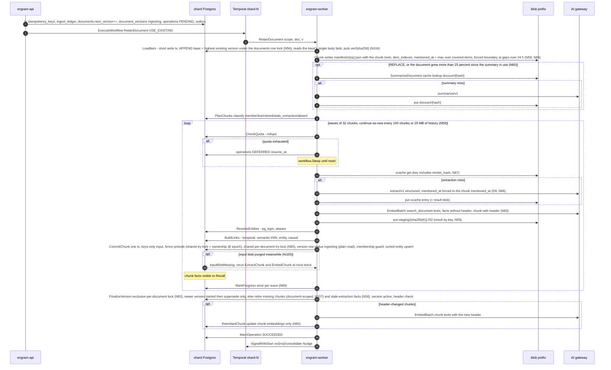
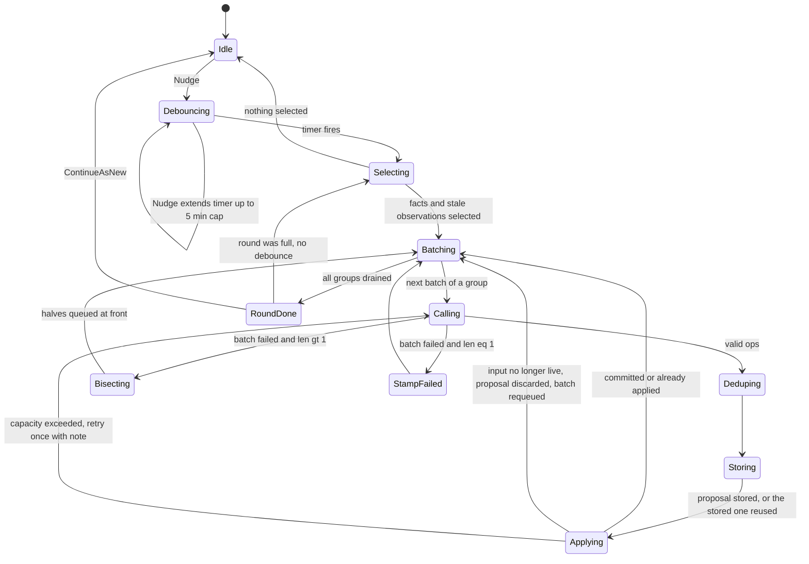
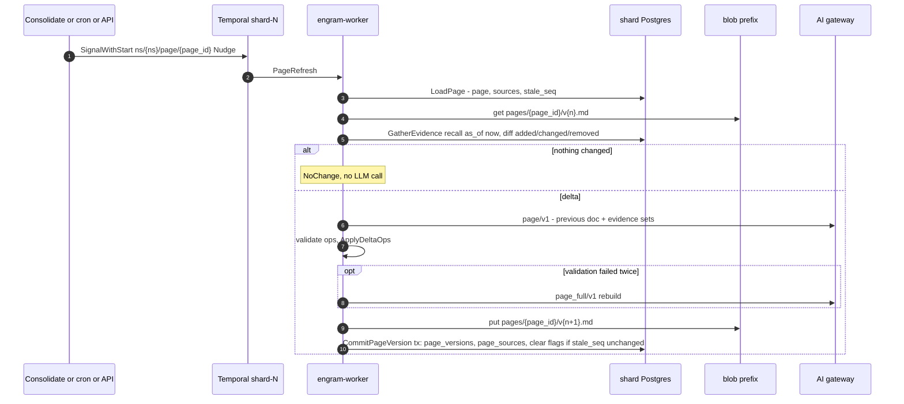
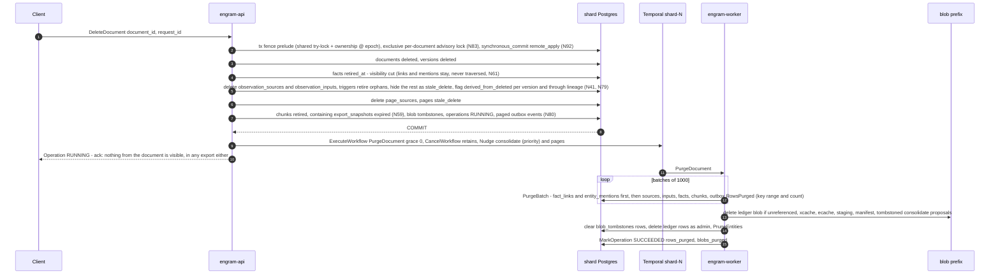
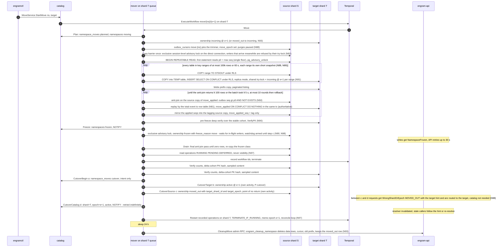
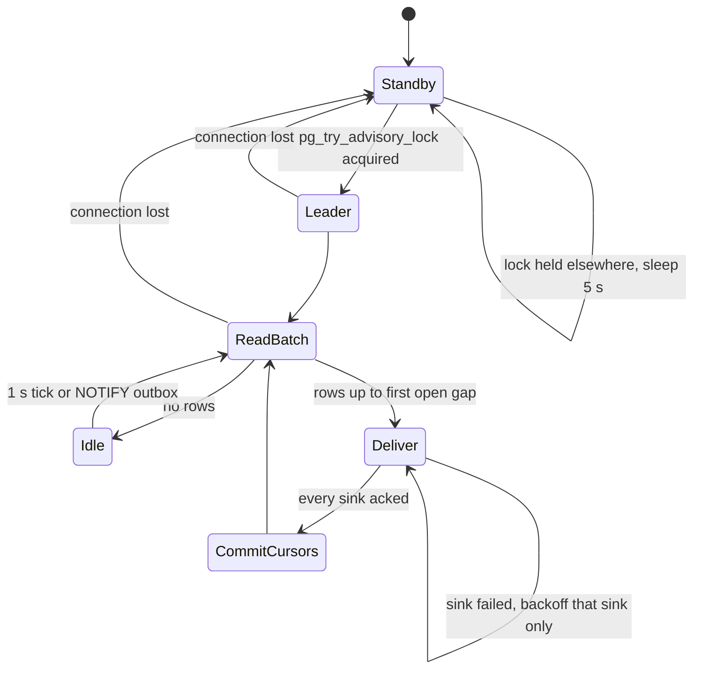

## 5. Pipelines

This section is the runtime behaviour of everything that writes: what runs as a Temporal
workflow versus an activity, what makes each step safe to execute twice, where the epoch fence
is checked, where a transaction begins and ends, which outbox events leave the transaction, and
what a crash at any point leaves behind. Tables are referenced by the names of §3 and messages
by the names of §4; neither DDL nor protos are restated. Every decision that is not already a
row of the register is collected under "New decisions" at the end (numbered `PD-n`,
pipeline decisions; the register's D18 adopted them as N25–N31, and the table says which).

### 5.0 Conventions shared by every pipeline

**Workflow vs activity.** Workflows are deterministic orchestration: no I/O, no clocks other
than `workflow.Now`, no randomness other than `workflow.SideEffect`. Every activity is a method
on a struct that holds a `router.ShardRouter`; it derives its `ShardHandle` from the
`shard_id` in the workflow input (`ForShard`), never from the catalog (D4). Every workflow input
embeds `workflowv1.WorkflowScope{namespace_id, tenant_id, shard_id, epoch, blob_prefix}` and every
workflow sets the Temporal search attributes `NamespaceId`, `TenantId`, `Epoch`,
`OperationKind`, `OperationId` at start (they are what the move drain and the namespace delete
query, §5.4–5.5).

**Fencing, not identity.** The epoch appears in every workflow input and in every fence
check, and in no idempotency key (D11): a restarted execution must recognise work committed
under the previous epoch. Every *write* activity opens `store.WithNamespaceTx(write)`, which
executes the D2 sequence as amended — the **fence prelude**: `SET LOCAL engram.namespace_id /
tenant_id / epoch`, then `SELECT engram_try_ns_fence(namespace_id)`
(the shared `pg_try_advisory_xact_lock_shared(k1, k2)` over `engram_ns_lock_keys(namespace_id)` — one lock-key form for every party in the §3.3 lock-discipline table, N103), then a plain
`SELECT state, epoch FROM namespace_ownership WHERE namespace_id=$1` (no row lock; the row is
the fence *value*, the advisory lock is the fence *lock*), aborting unless `state='active' AND
epoch=$2`. **The fence never waits (N82, review-2 G-4).** If the try-lock is refused — a
freeze, copy barrier, delete freeze, restore or cutover holds the exclusive form, or is queued
for it (a shared request that conflicts with a queued exclusive request is refused under
`dontWait`; documented lock-manager behaviour, confirmed by `TestFence_TryLockRefusedBehindWaiter`
on PG 16, with `SET LOCAL lock_timeout = '50ms'` around a blocking acquisition as the fallback
if that test fails) — the statement ends at once with the retryable
`NamespaceFrozen{reason = FENCE_BUSY, retry_after = 200 ms}`, handled by the existing API and
`P-frozen` retries with jitter, so no pooled connection is held while an exclusive taker is
queued. The shared lock is held to commit. **Exclusive takers** — the mover's copy barrier and
`Freeze` (§5.5), the delete freeze and a restore — use `pg_advisory_xact_lock` or the
session-level variant under `lock_timeout = 5 s` per attempt and retry with jitter; they still
queue fairly behind the writers in flight when they asked, so a `Freeze` cannot flip the state
under a committing writer, and because writers no longer queue behind the exclusive request a
continuous stream of writers cannot starve it (the former `FOR SHARE` row lock had neither
property: Postgres grants a compatible row lock past a waiting `FOR UPDATE`, and every extra
share locker allocated a MultiXactId — review F-5). **Exports take no exclusive fence** (§5.7).
Role defaults: `ALTER ROLE engram_app, engram_worker SET lock_timeout = '2s'` (row and advisory
waits; `statement_timeout = 30 s` stays as the outer bound), `engram_move` and `engram_admin`
10 s. Wherever a step below says "fence prelude" or "shared try-lock, `active` @ epoch" it
means exactly this sequence. Every write transaction runs with `statement_timeout =
idle_in_transaction_session_timeout = 30 s` and its outbox `INSERT` is the **last statement**
before `COMMIT` — one multi-row statement when the transaction emits several events (invariant
A-F1, D6): a drawn `seq` is therefore committed or aborted within one timeout of being drawn,
which is what the relay's 60 s gap watchlist (§5.6) and the move's copy barrier (§5.5 step 2)
assume; `engramlint sql` fails a builder whose outbox append is followed by another statement.
Outcomes: `active` at the caller's epoch → proceed; `frozen` or a refused try-lock →
`errs.NamespaceFrozen` (retryable: the freeze lasts seconds); anything else (`incoming`,
`moved_out`, missing row, epoch mismatch) → `errs.WrongShardOrEpoch` (**non-retryable**: the
workflow is running against the wrong shard or a stale epoch and must not be allowed to succeed
by retrying; for `moved_out` the detail carries `target_shard_id` and `next_epoch`, N98).
*Read* activities use `WithNamespaceTx(read)`, which accepts `active` and `frozen`. Two
activities run outside the fence by design and are marked so in their tables: the mover's
target-side writes (fence `state='incoming' AND epoch=e+1`, §5.5) and the admin-role purge of
a `moved_out` namespace (§5.5 Cleanup, through the `SECURITY DEFINER` function of N93).

**Retry-policy notation.** `initial / coefficient / max interval / max attempts / non-retryable
error types`. Named policies used in the tables (`ScheduleToClose` bounds the whole retry
chain; `StartToClose` bounds one attempt):

| Policy | initial / coeff / max interval / attempts | Non-retryable | Used for |
|---|---|---|---|
| `P-pure` | — / — / — / 3 | everything (a pure function fails only on a bug) | `Chunk`, `GroupBatches`, `ApplyDeltaOps` |
| `P-db` | 500 ms / 2.0 / 10 s / 10 | `WrongShardOrEpoch`, `Validation`, `IntegrityViolation` | every read/write tx activity |
| `P-frozen` | 1 s / 1.5 / 5 s / unlimited within `ScheduleToClose` | `WrongShardOrEpoch`, `Validation`, `InputBlobMissing` (handled by the workflow, N100) | write activities that may meet a freeze (`CommitChunk`, `FinalizeVersion`, `ApplyBatch`, `CommitPageVersion`, `PurgeBatch`) — same as `P-db` plus `NamespaceFrozen` (including the N82 `FENCE_BUSY` refusal, 200 ms) and `DocumentBusy` (N83, 100 ms) treated as retryable with a 10 min `ScheduleToClose` |
| `P-llm` | 2 s / 2.0 / 60 s / 8 | `PermanentLLMError`, `Validation`, `WrongShardOrEpoch` | gateway structured/chat calls |
| `P-embed` | 1 s / 2.0 / 30 s / 8 | `PermanentLLMError`, `Validation` | gateway embed calls |
| `P-blob` | 200 ms / 2.0 / 5 s / 10 | `Validation` | blob get/put/list/delete |
| `P-poll` | 30 s / 1.0 / 30 s / unlimited within `ScheduleToClose` 48 h | `PermanentLLMError` (job rejected) | batch-job polling |
| `P-catalog` | 500 ms / 2.0 / 5 s / 20 | `Validation`, `MovePrecondition` | catalog transactions in the move (`Plan`, `Freeze`, `CutoverBegin`, `Rollback`, `MarkDeleted`) |
| `P-cutover` | 100 ms / 1.5 / 1 s / unlimited within `ScheduleToClose` 60 s | `Validation`, `MovePrecondition` | the three cutover sub-step activities `CutoverTarget`, `CutoverSource`, `CutoverCatalog` (N52): a crash between (c) and (d) must be repaired in sub-seconds, not after a 5 s backoff |
| `P-temporal` | 1 s / 2.0 / 10 s / 10 | `Validation` | activities that call the Temporal client (list/terminate/start) |

**Transaction-boundary column values.** `none` (pure or blob/gateway only), `read tx` (RLS,
`active|frozen`), `write tx` (fenced, `active`), `target tx (incoming)` (move only, N91: the
mover runs as `engram_move` **without** `BYPASSRLS` and loads each key range through a session
`TEMP` table — `COPY tmp FROM STDIN BINARY`, then `INSERT INTO t SELECT … FROM tmp ON CONFLICT …`
under `ns_isolation`, so a stream carrying another `namespace_id` fails the RLS check. Each load
transaction runs `BEGIN; SELECT engram_try_ns_fence($1);
SELECT state, epoch FROM namespace_ownership WHERE namespace_id = $1` → abort unless
`('incoming', e + 1)`; `SET LOCAL session_replication_role = replica` (privilege granted with
`GRANT SET ON PARAMETER session_replication_role TO engram_move`, PG 15 or later), so
foreign-key, append-only and `*_touch` triggers do not fire during the load; the ownership
trigger `engram_check_ownership` is `ENABLE ALWAYS TRIGGER` and RLS is unaffected by replica
mode), `catalog tx`, `admin tx` (role `engram_admin`, `BYPASSRLS`, used only by the namespace
purge and the per-shard sweepers that must enumerate namespaces; the mover's source cleanup
goes through the `engram_migrate`-owned `SECURITY DEFINER` function
`engram_cleanup_namespace`, N93).

**Operation rows.** Every `operations` insert or transition — including `MarkProgress` — emits
`OperationTransitioned{operation_id}` in the same transaction (N81; the earlier "no outbox event
for operations" rule is withdrawn: an event-less row is invisible to the move replay).
Activities update `operations` with absolute values (`state`,
`progress.units_done = <count>`), never relative increments; `RetainDocument` writes progress
**once per wave** from the workflow (`MarkProgress`), never from `CommitChunk`, so the 32
parallel commits of a document do not serialise on the operation row (N69, review F-36).
`namespace_stats` counters are **derived** (`count(*) WHERE live`, refreshed by the **stats
sweeper** — `engram_admin`, every 60 s per namespace, one read per tick, which also flips the
`large` flag at 20 k live facts with hysteresis at 10 k, N55), never written on the commit path
by `CommitChunk`, `FinalizeVersion` or the delete cascade. `document_versions.chunks_done`
follows the same rule — written once per wave by the workflow, never per chunk: a per-chunk
`UPDATE` of the version row would serialise the 32 parallel commits of a document on one row
(§3.3.1). State transitions are monotone: `PENDING → RUNNING ⇄ DEFERRED → SUCCEEDED|FAILED|CANCELLED`; an
`UPDATE … WHERE state NOT IN (terminal)` guard makes a late activity from a terminated
workflow harmless.

**Heartbeats and history bounds.** Any activity that can run longer than 30 s heartbeats every
10 s with a resumable progress payload; heartbeat timeout = 30 s. Workflows continue-as-new
before their history reaches 10 k events **or 20 MB** (retain: every 100 chunks or 20 MB of
history, whichever first — ≈ 25–30 events per chunk, so 500 chunks was already 13–15 k events;
consolidate: every round; page refresh: every refresh; purge: every 200 batches; move: never —
≤ 200 events).

**Payload size and confidentiality (N59, N99, review F-13/F-18/F-25, review-2 G-20).** Every
activity result larger than **4 KiB** travels by blob key under the namespace prefix:
`ExtractChunk` returns the extraction-cache key (the cache entry *is* the result blob),
`EmbedChunk` the staging key (`{prefix}/staging/{sha256(K)}.f32` — a single 768-d vector is 3
KiB, so any chunk with a fact spills), `ResolveEntities` and `BuildLinks` their own result keys,
and `CommitChunkInput` is **keys-only**; `ChunkWork` carries no chunk text (activities read it
from the manifest blob by ordinal). A Temporal history therefore holds ids, hashes and keys
plus the small inline residue — text appears in histories **only as ciphertext, at most 4 KiB
per activity result, plus `ChunkWork.header/context/metadata_json/entity_hints`** — which keeps
it under the 50 MB / 51 k-event limits (a 50-fact chunk otherwise put ≈ 400 KiB into the
history: 150 KiB of vectors inline below the old 512 KiB threshold, 60 KiB of extraction, both
repeated in `CommitChunkInput`) and lets a document delete erase the large copies by deleting
blobs. Whatever travels inline is encrypted by a Temporal `DataConverter` payload codec
(AES-256-GCM) under a **per-namespace data key** wrapped by the shard key (key id in the payload
metadata, namespace id in the workflow header), so the shared Temporal namespace exposes no
tenant cleartext to the UI or CLI. Deleting the wrapped data key is the shredding step of a
namespace or tenant delete; a shard-key or data-key version is destroyed only after `rotation
time + max workflow run timeout (7 d) + Temporal retention (7 d)`. The deletion SLA therefore
reads: histories expire with retention 7 d; within that window they are unreadable after key
destruction.

**Token accounting (D13).** Every gateway call returns a `Usage`; the activity that owns the
call carries it into the next fenced write transaction of the same pipeline, where it is
inserted as `token_usage_events(namespace_id, usage_key, day, op, model, prompt_tokens,
completion_tokens, cost_micros)` with `usage_key = sha256(activity idempotency key ‖ call
label)` and `ON CONFLICT DO NOTHING`; only a row that was actually inserted increments the
daily rollup `token_usage(day, op, model, …)` in the same statement group. An activity that
paid for a call and then crashed before its commit therefore under-counts by at most one call
per retry, never double-counts (PD-1). Rationale: quotas are enforced from the rollup, so
double counting would defer tenants spuriously; slight under-counting is harmless. Rejected:
counting in the gateway `UsageHook` at call time (double counts on every activity retry).

**Outbox events are thin and bounded (N12, N80).** Every event named in the tables below
carries ids, versions and flags — never text, vectors or row images. All ids inside events are
16-byte `bytes` (≈ 18 B encoded); an event carries **≤ 256 ids in total across its lists**
and encodes to ≤ 16 KiB by construction (the `octet_length(payload) <= 16384` CHECK is only the
backstop; the T1 property test checks the maxima). A larger set is paged as consecutive events
of the same type in the same transaction with `page` (0-based) and `page_count` plus the group
key (`document_id`, `deleted_at` or `batch_key`); consumers treat a group as complete only when
all pages are seen, and the move replay treats each page independently. Above 4,096 ids (16
pages) one event is sent with `ids_elided = true` and counts only; consumers and the replay then
read the ids from the store by `document_id` — the rows live until `PurgeDocument` plus its
grace, so no blob write is needed inside the transaction. `RowsPurged` carries `(table,
document_id, count, min_key, max_key)` and no id list. Every consumer (the `index` adapter in
`Async` mode, the Kafka mirror's downstream consumers, the mover's catch-up, the export delta)
reads the current rows by id at the recorded epoch. This is what makes replay idempotent by
construction (§5.5, §5.6): applying "the current state of row X" twice is a no-op. The events'
row coverage is the single table in §5.5.1 step 3 (N81).

**Kafka, once for all pipelines.** No pipeline uses Kafka as a control channel, queue or
hand-off. Temporal is the durable orchestrator and the per-shard outbox is the ordered log;
the only Kafka touchpoint is the optional `kafka` sink of the relay (§5.6), which mirrors
outbox rows for external consumers. Each subsection still carries a one-line "Kafka" verdict
so a reader landing there gets the answer.

---

### 5.1 Retain

#### 5.1.1 API handler (`MemoryService.Retain`, unary, one operation per document)

The ack promises durability of the raw input and of the operation, nothing more (D16).
Items are grouped by `document_id` (N9): several items naming the same document in one
request are concatenated in request order (`REPLACE`) or appended in order (`APPEND`) and
produce **one** operation; `RetainResponse.operations` is aligned with the request's distinct
documents. A caller-supplied `operation_id` is used verbatim for a single document and as the
UUIDv5 namespace (`uuid5(operation_id, document_id)`) when the request spans several. The
steps below run once per document, all documents of a request inside one shard transaction
(step 4) so the ack is all-or-nothing for the request.

1. **Validate**: `content` ≤ 1 MiB (≤ 8 MiB per request, §4.1.8), `document_id` ≤ 256 B, ≤ 32 tags × 64 B (N32), `timestamp`
   parses (default `now()`), `update_mode ∈ {REPLACE, APPEND}`, `entities` hints ≤ 64,
   deadline present, scope `memory.write`. Failures → `INVALID_ARGUMENT` + `ValidationError`.
2. **Rate quota**: `retains_per_min` token bucket, tenant then namespace →
   `RESOURCE_EXHAUSTED` + `QuotaExceeded`. (`llm_tokens_per_day` and `max_facts` are workflow
   concerns, D13.)
3. **Raw body**: `content_hash = sha256(content)`. Bodies > 64 KiB are `Put` to
   `{shard}/{tenant}/{ns}/ledger/{content_hash}` *before* the transaction (N7;
   content-addressed: a retry re-puts the same key; a crash here leaves an orphan blob that
   the weekly orphan sweep of §9 removes). Smaller bodies are stored inline in the ledger row.
4. **One fenced write transaction**, statement order:
   1. `INSERT idempotency_keys(namespace_id, method, request_id, request_hash, operation_id, expires_at = now() + 24 h) ON CONFLICT (namespace_id, method, request_id) DO NOTHING` (D1: the key is scoped to tenant, namespace and method).
      Conflict → read the row: same `request_hash` → return its operation and stop;
      different → `ALREADY_EXISTS` + `OperationConflict{IDEMPOTENCY_KEY_REUSED}`.
   2. `INSERT ingest_ledger(namespace_id, ledger_id uuidv7, document_id, content_hash, content_bytes, body | body_blob_key, item_timestamp, context, tags, metadata, entity_hints, update_mode, request_id, operation_id)` (§3.3.3 column list).
   3. `INSERT documents(namespace_id, document_id, current_version = 0, state = 'active') ON CONFLICT (namespace_id, document_id) DO UPDATE SET updated_at = now() RETURNING current_version, state` (the `DO UPDATE` takes the row lock), then `v = coalesce(max(version), 0) + 1` over `document_versions` of the document.
      This assigns the **version** under the document's row lock, so versions are dense and
      monotone per document (D8). `state <> 'active'` (`deleting`/`deleted`) → `ABORTED` +
      `OperationConflict{DOCUMENT_PURGING}` (the purge must finish before the id is reused).
      For `APPEND` the base is **not** recorded here: `LoadItem` assigns it under the same row
      lock as the highest existing version (N56, below). The ack's version assignment keeps
      **only the `documents` row lock** (`FOR UPDATE`, N56) and takes no advisory lock (N83), so
      ack latency is never behind ingest commits; N40's check (`status = 'ingesting'`,
      `current_version`) is unchanged and is arbitrated by the exclusive takers of the
      per-document lock (`FinalizeVersion`, the delete cascade, `PurgeDocument`).
   4. `INSERT document_versions(namespace_id, document_id, version = v, content_hash, status = 'ingesting', operation_id, ledger_id)`.
   5. `INSERT operations(namespace_id, operation_id, kind = RETAIN_DOCUMENT, state = PENDING, target_id = document_id, request_id, workflow_id, task_queue, submitted_epoch)` (the `config_snapshot` travels in the workflow input, N25, not in the row).
      A client-supplied `operation_id` that already exists with a different `request_hash`
      → `ALREADY_EXISTS` + `OperationConflict{IDEMPOTENCY_KEY_REUSED}`.
   6. One multi-row `INSERT outbox` carrying `DocumentVersionStarted`, `IdempotencyKeyStored{method,
      request_id}` (4.1) and `OperationTransitioned{operation_id}` (4.5) — N81: without the last two
      a move would lose the idempotency key and the operation row, so a retry after cutover would
      start a second execution (`namespace_id`, `tenant_id` and `epoch` default from the
      transaction scope, §3.3.2). Commit.
   The `request_hash` compared in 4.1 and 4.5 is SHA-256 over the normalised protojson of the
   request with `meta` cleared (N72); a supplied `operation_id` is validated as any UUID.
5. **Start the workflow**: `ExecuteWorkflow(RetainDocument, WorkflowID = "ns/{ns}/op/{op}",
   TaskQueue = "shard-{shard}", WorkflowIdReusePolicy = REJECT_DUPLICATE,
   WorkflowIdConflictPolicy = USE_EXISTING, input = {scope, document_id, version = v,
   ledger_id, update_mode, mode = ONLINE, config_snapshot})`. `USE_EXISTING` makes a retry
   after a crash between steps 4 and 5 attach to the running execution instead of failing.
   `SignalWithStart` is **not** used here: there is nothing to signal to a retain (it is used for
   the consolidation and page singletons). Rejected: `ALLOW_DUPLICATE` (a replay after a
   completed run would re-run the version's finalize — harmless but wasteful and confusing).
6. **Return** `Operation{PENDING}`. If step 5 fails after step 4 committed →
   `UNAVAILABLE` + `RetryInfo{1 s}`; the client's retry with the same `request_id` hits step
   4.1 and repeats only step 5. The per-shard `op-sweeper` schedule (N3) starts a workflow for
   any `PENDING` operation older than 2 min without an execution.

`config_snapshot` (≤ 1 KiB: model ids, prompt ids, `chunk.*`, quota keys) is resolved from the
catalog entry at submit time and carried in the workflow input (PD-2, adopted as N25; in
`RetainDocumentInput` it is the `models` + `chunk_target_chars` fields). Rationale: workers must
not call the catalog (D4) and a configuration change must apply deterministically to
operations submitted after it, not to a workflow mid-flight. Rejected: workers reading
`namespaces.config` per activity (catalog on the hot path; non-deterministic mid-run changes).

#### 5.1.2 Workflow `RetainDocument`

Input `RetainDocumentInput{scope, operation_id, document_id, version v, update_mode, ledger_ids, models, chunk_target_chars, tags, …}` (§4; `models` + `chunk_target_chars` are the N25 `config_snapshot`); the continue-as-new state `resume{next_chunk, manifest_key, counters}` is workflow-local.

1. **`LoadItem`** (short write tx + blob get/put): the ledger row (and raw blob) and the current
   active version's chunk hash set (delta statistics). For `APPEND` it **assigns the base
   (N56, review F-10)**: `SELECT … FROM documents … FOR UPDATE`, then `UPDATE document_versions
   SET append_base_version = (SELECT max(version) FROM document_versions WHERE namespace_id AND
   document_id AND version < v) WHERE version = v AND append_base_version IS NULL` — the
   highest existing version, *even one still ingesting*. **It reads one object (N104, review-2
   G-26):** each `document_versions` row has `body_key`/`body_hash`, the full reconstructed body
   of that version stored as a content-addressed blob `{shard}/{tenant}/{ns}/ver/{sha256}`; the
   append loads the base's single blob (no walk of the ledger chain), re-chunks from the start of
   the last base chunk and reuses earlier chunks by `content_hash`. `LoadItem` puts the new
   version's full body (`base body ‖ "\n\n" ‖ new body` for `APPEND`, the item bodies for
   `REPLACE`) at its `ver/{sha256}` key, then sets `body_key`/`body_hash` on the version row
   (`WHERE body_key IS NULL`, idempotent; the blob put precedes the row update, so a crash leaves
   at worst an orphan blob for the weekly orphan sweep). Two appends A and B submitted 1 s apart
   therefore get bases `c` and `v₁`, chunk `body(c) ‖ A` and `body(c) ‖ A ‖ B`, and the newer
   finalise retires nothing of A's: with both based on `c` (the earlier rule, "resolved by version
   order"), the later finaliser computed the retire set as "live chunks not in `body(c) ‖ B`" and
   silently dropped the acknowledged append A. The assignment is idempotent (`IS NULL` predicate).
   Sets `operations.state = RUNNING, phase = "chunk"` (emitting `OperationTransitioned`).
2. **`Chunk`** (pure): for `APPEND` the input is `base_body ‖ "\n\n" ‖ new_body`
   (monotonic append over the chain of N56; a concurrent `REPLACE` is still resolved by
   version order in step 7, never by rejecting). Heading-anchored, content-defined boundaries
   per D11 (target 3 000, min 500, max 4 000 chars, no overlap), with **a hard boundary forced
   between consecutive items whose timestamps differ by more than 24 h** (N86). Output: a manifest
   `[{index, content_hash, heading_path, byte_range, text, item_indexes[], mentioned_at}]` and
   `document_hash = sha256(all chunk hashes)`, written to blob
   `{prefix}/manifests/{operation_id}.json`; the activity result is `{manifest_key,
   chunk_count, document_bytes, timestamps_clamped}` so the workflow payload stays under 2 KiB
   regardless of document size, and every per-chunk activity reads its text from the manifest by
   ordinal (`ChunkWork` carries no text, N59). **`mentioned_at(chunk)` is defined (N86, review-2
   G-8):** it equals the maximum timestamp of every item whose bytes the chunk covers
   (`item_indexes[]`, not a singular `item_index`); for an `APPEND` re-chunk it is `max(item ts,
   mentioned_at of every base chunk the new text overlaps)`; facts inherit the chunk value —
   never a value the extractor or the client chose (D9, review F-2). The prompt's
   `item_timestamp` is the chunk's `mentioned_at`, and the 24 h forced boundary bounds the
   relative-date error of that substitution. Per-document timestamp regressions are accepted and
   clamp up through the max rule (no rejection, so re-ingest and benchmark replays keep working);
   `timestamps_clamped` is reported in the operation result. Deterministic: a re-execution
   overwrites the same bytes.
3. **`SummarizeDocument`** (gateway, cached) — **only when needed (N60, review F-14)**: on
   `REPLACE`, or when `document_bytes` exceeds the bytes of the version whose summary is in use
   by more than 25 %; otherwise the current `summary_id` is reused and no call is made. Without
   this rule every `APPEND` (every chat turn) produced a new `document_hash`, a cache miss by
   construction, a different summary, a different `header_hash` on every chunk and a re-embedding
   of the whole document. When it runs: key
   `{prefix}/docsum/{sha256(document_hash ‖ "summarize/v1" ‖ model)}.json` (§3.6). Miss →
   `ChatStructured(summarize/v1)` → ≤ 200 chars → blob put; the new `summary_id` is the key's
   hash. `PermanentLLMError` (content policy, schema refusal) is **not fatal**: the summary
   falls back to the first heading or the first 200 chars and the version is flagged
   `summary_fallback = true`.
4. **`PlanChunks`** (read tx, one query): for every manifest hash, `SELECT content_hash,
   retired_at, extraction_key FROM chunks WHERE namespace_id AND document_id AND content_hash
   = ANY($1)` plus `document_version_chunks` membership for version `v`. Classifies each
   chunk as `member` (already committed for `v` — the restart path), `live` (unchanged:
   membership row only), `retired` (un-retire, no LLM), `stale_extraction` (same hash but an
   older `extraction_key = sha256(content_hash ‖ prompt_version ‖ model ‖ schema_version ‖
   render_hash)` than the config snapshot's (N87: `render_hash = sha256(day(mentioned_at) ‖
   context ‖ canonical(metadata) ‖ sorted(entity_hints) ‖ retain.mission ‖ header_hash)`, so every
   prompt input is covered): treated as `absent`, PD-3 / N26 / N58), or `absent`. Delta retain (D8) is this
   classification. `content_hash = sha256(text)` excludes the contextual header (N6), so the
   *identity* of a chunk survives a changed summary or heading path; `header_hash =
   sha256(heading_path ‖ summary_id)` (N60) is compared at `FinalizeVersion` (step 7). **N87
   interaction:** `header_hash` is also an input of `render_hash`, hence of `extraction_key`, so a
   changed summary or heading path now makes the chunk `stale_extraction` and re-extracts it
   through this ordinary path; the header-only re-embedding of step 8 remains as a safety net for
   a chunk whose `extraction_key` matches but whose `header_hash` does not (cannot occur while
   `render_hash` includes `header_hash`; kept until the interaction is re-decided, PD-26).
5. **Quota gate + fan-out**, waves of up to 32 chunks in flight, bounded by a workflow-side
   semaphore (the worker's activity slots are shared by every document on the queue, so one
   huge document may not monopolise them — the bound lives in workflow code).
   Before each wave, **`CheckQuota`** (read tx): `llm_tokens_per_day` is enforced entirely
   from the shard-local `token_usage` rollup. The namespace-level limit is exact. The
   *tenant*-level limit is enforced as a **per-namespace share** computed by the catalog and
   carried in `config_snapshot`: `share = tenant_limit × weight(ns) / Σ weight(tenant's
   namespaces)`, weight = `max(live_facts, 1 000)` recomputed daily (PD-4). Shares sum to
   the tenant limit, so the tenant limit is never exceeded; unused share in one namespace
   cannot be borrowed by another (conservative by design). Rationale: workers never call the
   catalog (D4, tightened in D18), and a cross-shard counter would need exactly that.
   Rejected: workers flushing usage to a catalog counter (violates D4); enforcing tenant
   tokens in the API (the API does not see worker usage). `max_facts` is read from the
   **derived** `namespace_stats.live_facts` (refreshed by the stats sweeper every 60 s, N69;
   one refresh interval of staleness is tolerated — tenant-level `max_facts` uses the same
   share rule).
   Exhausted → `MarkOperation(DEFERRED, DeferredInfo{quota, resume_at, scope})` and
   `workflow.Sleep(until resume_at)` (next UTC midnight for tokens; +1 h for `max_facts`,
   re-checked because deletes may free room); a `Cancel` signal wakes the sleep. After each
   wave **`MarkProgress`** (write tx) writes `progress.units_done/units_failed/units_skipped`
   as absolute values once (N69). Then per chunk with hash `h` (the activity idempotency key
   is `K = (namespace_id, document_id, v, h)` throughout — D11: the epoch is a fence checked
   at commit time, never part of a key, so a workflow restarted on the target shard after a
   move recognises chunks committed at the previous epoch):
   1. **`ExtractChunk`** (blob + gateway): key
      `{prefix}/xcache/{sha256(h ‖ prompt_version ‖ model ‖ schema_version ‖ render_hash)}.json`
      (D11, N87: a change to `retain.mission`, hints, the timestamp day or the summary is a new key
      and re-extracts through the ordinary retain path; the hit rate is therefore that of
      identical text under identical rendered variables — re-ingest of the same item, replays —
      not of forwarded or templated text under different timestamps, §6.8).
      Hit → return the cache key (and the facts inline only when the result is ≤ 4 KiB,
      N59). Miss → `ChatStructured(extract/v1)` with the chunk header (`[summary] >
      [heading path]`) prepended → validate (≤ 40 facts, causal indices point to earlier
      facts, timestamps parse, `said_at ≤ item_timestamp + 5 min`, text ≤ 2 000 chars,
      language preserved) → set every fact's `mentioned_at` to the chunk's `mentioned_at` (the
      N86 maximum over the items it covers), discarding anything the model emitted for it (D9)
      → blob put (same key: idempotent; the cache entry
      is the result blob) → return `{cache_key, fact_count, usage}`.
      `PermanentLLMError` or validation failure after one repair attempt → returns
      `chunk_failed{reason}` as a *result*, not an error: the workflow records the chunk's
      `content_hash` and reason in the operation row (`operations.error`, the §3.3.7
      `google.rpc.Status` JSON; there is no separate error table) and continues; the operation
      finishes `SUCCEEDED` with `progress.units_failed > 0` (N35: the proto has no other state
      for a partial failure).
   2. **`EmbedChunk`** (blob + gateway): texts = `search_document: {fact.text}` for each fact
      (**no header** — N60: the header is embedded into the chunk vector only, so a summary
      change never re-embeds facts) and `search_document: {header}\n{chunk text}` for the
      chunk; `EmbedBatch` ≤ 64 texts per call, L2-normalised by the client, `halfvec(768)`.
      Per-namespace embedding cache `{prefix}/ecache/{sha256(prefixed text ‖ model ‖ dims)}.f16`
      (same isolation argument as the extraction cache). Vectors are written to the staging
      blob `{prefix}/staging/{sha256(K)}.f32` and the result carries the key plus
      `header_hash` (N59 amends N13: the 512 KiB inline threshold let ≈ 150 KiB per chunk into
      the history; a result is inline only when ≤ 4 KiB, i.e. a chunk with no facts).
   3. **`ResolveEntities`** (read tx): per extracted entity `{name, type}`: normalise (NFKC,
      collapse whitespace, trim, drop names > 256 chars as extraction artefacts), then
      (a) exact hit in `entity_aliases(namespace_id, alias_norm)`; else (b)
      `SELECT entity_id, canonical_name, similarity(canonical_norm, $q) FROM entities
      WHERE namespace_id = $1 AND entity_type = $2 AND merged_into IS NULL AND canonical_norm % $q ORDER BY 3 DESC
      LIMIT 5` with `SET LOCAL pg_trgm.similarity_threshold = 0.3`; accept the best
      candidate at similarity ≥ 0.6 for a matching type, ≥ 0.85 when either side's type is
      `unknown`; else (c) plan a create. Intra-chunk merge: two planned creates of the same
      type with similarity ≥ 0.8 merge into the longer name. Caller hints (`entities` on the
      item) are force-resolved with their given type. **Type match is mandatory**: `person`
      never merges with `organization`, whatever the string similarity. Output per mention:
      `{entity_id | new{canonical, type}, alias}`; the create-or-merge itself happens in
      `CommitChunk` (`INSERT … SELECT FROM unnest($sorted) ON CONFLICT (namespace_id, canonical_norm) WHERE merged_into IS NULL DO UPDATE
      SET mention_count = entities.mention_count + 1, last_seen_at = now() RETURNING entity_id` resolves both
      cases in **one statement with the rows in `canonical_norm` order** (N69, review F-41:
      unordered per-entity upserts let two concurrent chunks deadlock on `entities`, exactly
      what Hindsight's `_lock_order_key` prevents), §3.8; aliases `ON CONFLICT DO NOTHING`).
      The result is returned by blob key when it exceeds 4 KiB (N59). Rationale for 0.6 over Hindsight's 0.15: trigram similarity
      at 0.15 merges "Ann" with "Anna Ng" and, worse, across tenants' worth of short names
      within a namespace; 0.6 plus the alias table keeps recall for spelling variants.
      Rejected: LLM adjudication of entity merges (cost per chunk, and the extractor already
      resolves coreference in-chunk).
   4. **`BuildLinks`** (read tx, then in memory), per new fact, hard-capped at 60 links:
      *temporal* ≤ 20: live facts of the namespace whose `occurred_start` (or `mentioned_at`
      for undated facts) is within ±24 h, nearest first, weight `max(0.3, 1 − |Δh|/24)`;
      *semantic* k = 10: HNSW kNN over `facts.embedding` (partition-pruned by namespace),
      cosine ≥ 0.75, plus within-chunk pairs computed in memory with the same threshold;
      *entity* ≤ 20: for each entity mention, the 10 most recent other facts mentioning that
      entity, weight 1.0, `entity_id` set; *causal*: `caused_by(target_index)` from the
      extraction, directed, weight 1.0. Links to retired or invalidated facts are never built.
      The result (≈ 150 KiB for 50 facts × 60 links) is returned by blob key (N59).
   5. **`CommitChunk`** (fenced write tx; input is **keys-only** — `ChunkWork` plus the
      extraction, staging, entities and links blob keys, N59 — the activity reads the four
      blobs first; **a missing blob is the retryable chunk-level error `InputBlobMissing`
      (N100, review-2 G-21)**: a concurrent `PurgeDocument` may have deleted a cache or staging
      blob, so the `RetainDocument` chunk sub-pipeline re-runs `ExtractChunk` and `EmbedChunk`
      for that chunk, at most 2 re-runs, then `chunk_failed`), statement order:
      1. `WithNamespaceTx(write)` — fence prelude (shared try-lock + ownership check) at the
         caller's epoch.
      2. **Per-document advisory lock instead of `FOR SHARE` (N83, review-2 G-5):**
         `SELECT engram_try_doc_lock_shared(namespace_id, document_id)` — the shared
         `pg_try_advisory_xact_lock_shared(k1, k2)` over the two `int4` keys
         `(hashtext(namespace_id), hashtext(document_id))` of `engram_doc_lock_keys`;
         refused → retryable `DocumentBusy` (backoff 100 ms), so no connection waits behind
         `FinalizeVersion`. Then plain reads (no row locks, no multixact churn): `SELECT state,
         current_version FROM documents` — `state <> 'active'` → return
         `aborted{document_deleted}`; `SELECT status FROM document_versions WHERE (namespace_id,
         document_id, version = v)` (N40) — `status <> 'ingesting'` → return `superseded`
         (`deleted` → `aborted`); the workflow skips straight to step 7. `FinalizeVersion`, the
         delete cascade and `PurgeDocument` take the *exclusive* form of the same key under
         `lock_timeout = 5 s`: they wait for every in-flight commit of the document, and a
         commit that starts afterwards either fails the try-lock (and retries) or sees the
         terminal status; this is what closes the window in which a slow older version could
         resurrect a chunk the newer version retired, or commit into a deleted document (TLC
         `DocLifecycle_NoCommitCheck`, §7). `current_version > v` alone is not sufficient: the
         newer version may not have finalised yet, and its finalise must see every chunk `v`
         commits before it computes the retire set. Test `TestDocLock_NoStarvation`:
         continuous `CommitChunk`s of one document must not delay `FinalizeVersion`, the ack or
         the cascade beyond `lock_timeout`.
      3. `SELECT 1 FROM document_version_chunks WHERE (namespace_id, document_id, v, h)` →
         exists → `COMMIT`, return `already` (the exactly-once guard for this transaction).
      4. `INSERT chunks(namespace_id, chunk_id uuidv7, document_id, content_hash = h, header_hash, ordinal,
         text, header, heading_path, tags, mentioned_at, embedding, embedding_model, extraction_key)
         ON CONFLICT (namespace_id, document_id, content_hash) DO UPDATE SET retired_at = NULL,
         purge_after = NULL, ordinal = EXCLUDED.ordinal, header = EXCLUDED.header, header_hash = EXCLUDED.header_hash,
         embedding = EXCLUDED.embedding, extraction_key = EXCLUDED.extraction_key
         RETURNING chunk_id, (created_at = now()) AS inserted` (the §3.8 idiom: `xmax` is not
         readable in `RETURNING` on a partitioned table). `retired` → un-retired here, and
         `UPDATE facts SET retired_at = NULL, purge_after = NULL WHERE chunk_id = … AND
         extraction_key = $current` (facts of an older extraction key stay retired). The chunk's
         `mentioned_at` and `embedding_effective_at` (the `mentioned_at` of the newest item
         covered by the summary used in the embedded header, N85) are written with the row.
      5. If `inserted` or the chunk has no live facts under the current `extraction_key`:
         `INSERT facts(memory_id uuidv7, …, mentioned_at = item timestamp, said_at,
         occurred_start, occurred_end, tags, embedding, prompt_version, extraction_key,
         document_id, chunk_id)`; entities in one sorted `unnest` upsert (N69, step 5.3);
         `entity_aliases`; `entity_mentions`; `fact_links … ON CONFLICT DO NOTHING`, inserted
         in `(src_memory_id, dst_memory_id, link_type)` order so two concurrent chunks never
         deadlock (undirected types are stored once with `src_memory_id < dst_memory_id`;
         `causal` is directed, N34).
      6. `INSERT document_version_chunks(namespace_id, document_id, v, h, chunk_id)`.
      7. `token_usage_events` / `token_usage` for the extract and embed calls (PD-1). No
         `namespace_stats`, `operations.progress` or `document_versions.chunks_done` update
         here (N69): the stats counter is derived by the sweeper, and progress and
         `chunks_done` are written once per wave by the workflow, so none of the 32 parallel
         commits waits on a hot row.
      8. `INSERT outbox(ChunkCommitted{document_id, v, chunk_id, fact_ids, entity_ids,
         link_count})` (paged at 256 ids, N80; a chunk has ≤ 40 facts). `COMMIT`. **The facts of this chunk are visible to Recall from this instant (D16).**
         The index is `Transactional` (HNSW/BM25 rows written by the same statements).
6. **`ContinueAsNew`** every **100 chunks or 20 MB of history**, whichever first (N59;
   `workflow.GetInfo` exposes both), with `RetainResume{next_chunk, manifest_key, summary_id,
   counters}`; the new run's `PlanChunks` sees the committed membership rows and never
   re-extracts, and reuses `summary_id` (no re-summary, N60).
7. **`FinalizeVersion`** (fenced write tx) — the per-document serialisation point:
   1. fence prelude (shared try-lock + ownership check).
   2. `SELECT pg_advisory_xact_lock(k1, k2) FROM engram_doc_lock_keys(namespace_id, document_id)` under
      `lock_timeout = 5 s` (N83; a timeout is a retryable error under `P-frozen`) — this waits
      for every in-flight `CommitChunk` of the document, which holds the shared form.
   3. `SELECT current_version AS c, state FROM documents … FOR UPDATE`. `state <> 'active'`
      → mark the version `deleted`, operation `CANCELLED{document_deleted}`, commit, return.
      A replay (`document_versions(v).status` already terminal) returns the recorded result.
   4. **Newer-version check (N40):** `SELECT max(version) FROM document_versions WHERE
      namespace_id AND document_id` — if it is `> v`, a newer version has already started:
      `UPDATE document_versions SET status = 'superseded' WHERE version = v AND status =
      'ingesting'`, retire **nothing**, leave `documents.current_version` alone, commit; the
      operation is marked `SUCCEEDED` with `document_version = c` and `superseded_by = max`
      (no re-embed: the current version's headers are its own). Only the newest version
      computes a retire set; an older version finalising late would otherwise retire the
      newer version's chunks (TLC `DocLifecycle_NoFinalizeCheck`, §7). The chunks `v`
      committed stay visible until the newer version's finalise retires its surplus.
   5. **Case `v` is the newest version (this version wins):** first `UPDATE
      document_versions SET status = 'superseded' WHERE namespace_id AND document_id AND
      version < v AND status = 'ingesting'` — the exclusive document lock of step 2 has already
      waited for every in-flight `CommitChunk` of an older version, so the retire set computed
      next sees every chunk they committed and any later commit of theirs stops at step 5.5.2.
      Then `UPDATE chunks SET retired_at = now(),
      purge_after = now() + 1 h WHERE namespace_id AND document_id AND retired_at IS NULL AND
      content_hash NOT IN (SELECT content_hash FROM document_version_chunks WHERE namespace_id =
      $1 AND document_id = $2 AND version = $3)` (**document-scoped, N107, review-2 G-29**: the
      unscoped subquery matched a chunk hash present in another document's version and failed to
      retire the chunk; T3 test with two documents sharing a chunk hash); `UPDATE facts SET retired_at = now(), purge_after = now() + 1 h WHERE chunk_id IN
      (those)` in the same statement group (denormalised `retired_at`, D8). `fact_links`,
      `entity_mentions`, `observation_sources` and `observation_inputs` of retired facts are
      **kept** until the purge (§5.4, N42): recall filters `retired_at IS NULL` on the fact
      side of every join, so they are invisible, and keeping them makes un-retire within the
      1 h grace free; the observations citing or derived from a retired fact are marked
      `stale_write` (`UPDATE observations SET stale_write = true, stale_since =
      coalesce(stale_since, now()) WHERE observation_id IN (SELECT observation_id FROM
      observation_sources WHERE memory_id IN (retired) UNION SELECT observation_id FROM
      observation_inputs WHERE fact_id IN (retired))`) and **stay visible** — a replace is a
      write, and observations may lag writes by the consolidation debounce (D16); the purge
      later cascades exactly like a delete (§5.4.2). **Stale-extraction retire — a second retire statement (N58, review
      F-12)**: a kept chunk re-extracted under a new `extraction_key` (prompt or model bump)
      keeps its `chunk_id` and *is* in `v`'s set, so the statement above does not touch its
      old facts (`extraction_key` includes `render_hash`, N87); `UPDATE facts SET retired_at = now(), purge_after = now() + 1 h WHERE
      namespace_id AND document_id AND retired_at IS NULL AND extraction_key <> (SELECT
      extraction_key FROM chunks c WHERE c.chunk_id = facts.chunk_id)` retires them (same
      grace, same `stale_write` marking, same `ChunksRetired` event with `version = v`) — without
      it `engramctl reextract` left two live fact sets per chunk, both recallable and both
      consolidated. `documents.current_version = v`; `document_versions(v).status = 'active'`,
      `document_versions(c).status = 'superseded'` (no `namespace_stats` update: the sweeper
      derives it, N69). **Header check (N6, N60)**: `SELECT content_hash FROM
      chunks WHERE namespace_id AND document_id AND retired_at IS NULL AND header_hash <>
      sha256(heading_path ‖ $summary_id)` for the member chunks → returned as
      `reembed_hashes` (the chunk text is unchanged, so extraction is not repeated; only the
      header-prefixed *chunk* embedding is stale — fact vectors carry no header). Last
      statements (A-F1): outbox `ChunksRetired{document_id, v, chunk_ids, fact_ids}`,
      `ObservationsMarkedStale{observation_ids, stale_write}` and
      `DocumentVersionActivated{document_id, v, superseded_version}` (one multi-row statement;
      `ChunksRetired` pages like every id-carrying event, N80). Commit.
   6. If any chunk was retired: `ExecuteChildWorkflow(PurgeDocument, id =
      "ns/{ns}/purge/{document_id}/{v}", grace = 1 h, ParentClosePolicy = ABANDON)`.
8. **`ReembedChunk`** for every hash in `reembed_hashes`, ≤ 32 in flight: embed the chunk
   text with the new header, then a fenced write tx `UPDATE chunks SET embedding, header,
   header_hash` — **chunk vectors only**; fact embeddings never carry the header and are not
   touched (N60: a 150-chunk conversation appended 100 times previously paid ≈ 15 000 fact
   re-embeddings for unchanged content) — idempotent by `(K, new header_hash)` (a re-run
   rewrites identical vectors). Then **`MarkOperation`** →
   `SUCCEEDED` with `OperationResult{document_version = v, facts_written, chunks_reused}`.
   The version is active from step 7 (D16); `SUCCEEDED` is delayed by the re-embed so the
   read barrier also covers fresh embeddings.
9. **Nudge consolidation**: `SignalWithStart("ns/{ns}/consolidate", Nudge{operation_id,
   facts_written})` (D11; §5.2).

**Per-document serialisation, stated precisely (D8, N40).** Versions are assigned in the API
transaction under the `documents` row lock, so they are monotone per document. Two
`RetainDocument` executions for versions `v₁ < v₂` of the same document may run steps 1–6
concurrently: their `CommitChunk` transactions touch shared chunk rows keyed by content hash
through `ON CONFLICT`, and their membership rows are per version. `FinalizeVersion` serialises
on the exclusive per-document advisory lock `engram_doc_lock_keys(namespace_id, document_id)`
(N83) and on the version rows;
whichever finalises first or second, the **newest version wins and is the only one that
retires**: a lower version finalising later marks itself superseded and retires nothing (its
surplus chunks are retired by the newer version's finalise, which superseded every older
`ingesting` row before computing its set), and a lower version still committing after the
higher one finalised is told `superseded` by the version-row read in `CommitChunk` step 2 (made
safe by the shared document lock it holds) and stops. The same exclusive advisory lock is taken by
the document delete cascade and by `PurgeDocument` (§5.4), so a delete and a finalise cannot
interleave, and the cascade's `UPDATE` of the version rows stops late commits the same way. Rejected: (a) a long-lived per-document mutex workflow
`ns/{ns}/doc/{document_id}` — one extra Temporal history per document (millions), a signal
round-trip per version, and one more thing to drain during a move; (b) strict serialisation
(`v₂` waits for `v₁`) — doubles latency for rapid re-saves for no gain, since the extraction
cache already makes the concurrent waste zero LLM calls (each distinct chunk hash is extracted
once) and only embedding/commit work is duplicated.

**Per-activity timeouts** are in the consolidated table of §5.8. The workflow has no
`WorkflowExecutionTimeout` (a deferred operation may legitimately wait a day);
`WorkflowRunTimeout = 7 d` per continue-as-new run.

#### 5.1.3 Step table

| Step | Workflow or Activity | Idempotency key | Retry policy | Fencing check | Transaction boundary | Outbox events |
|---|---|---|---|---|---|---|
| API validate + quota | handler | — | client retry | authz interceptor resolves shard+epoch | none | — |
| Raw blob put (> 64 KiB) | handler | `ledger/{sha256(content)}` (N7) | client retry | — | none | — |
| Ledger + version + operation | handler | `(namespace_id, method, request_id)`; `(namespace_id, operation_id)` | client retry with same `request_id` | shared try-lock, `active` @ epoch; `documents` row `FOR UPDATE` only (no advisory lock, N83) | write tx | `DocumentVersionStarted`, `IdempotencyKeyStored`, `OperationTransitioned` (N81) |
| Start workflow | handler | workflow id `ns/{ns}/op/{op}` (`USE_EXISTING`) | client retry; op-sweeper N3 | — | none | — |
| `LoadItem` | activity | `(ns, doc, v)`; `append_base_version IS NULL` and `body_key IS NULL` predicates (N56, N104); body blob `ver/{sha256}` is content-addressed | `P-db` | shared try-lock, `active` @ epoch; `documents` row `FOR UPDATE` for the base assignment | short write tx + blob get/put | `OperationTransitioned` |
| `Chunk` | activity | `(ns, doc, v)` → same manifest bytes (text included, N59; `item_indexes[]`, forced 24 h boundary, N86) | `P-pure` | none | none | — |
| `SummarizeDocument` (REPLACE or > 25 % growth only, N60) | activity | `docsum/…` key | `P-llm` | none | none | — |
| `PlanChunks` | activity | `(ns, doc, v)` | `P-db` | read fence | read tx | — |
| `CheckQuota` | activity | `(ns, doc, v, wave)` | `P-db` | read fence | read tx | — |
| `MarkProgress` (once per wave, N69) | activity | `(ns, op, wave)` absolute values | `P-db` | shared try-lock, `active` @ epoch | write tx | `OperationTransitioned` |
| `ExtractChunk` | activity | xcache key `sha256(h ‖ prompt ‖ model ‖ schema ‖ render_hash)` (= result blob, N59, N87) | `P-llm` | none | none | — |
| `EmbedChunk` | activity | ecache key per text; staging key `sha256(K)` (result by key, N59) | `P-embed` | none | none | — |
| `ResolveEntities` | activity | `K` (result by key above 4 KiB) | `P-db` | read fence | read tx | — |
| `BuildLinks` | activity | `K` (result by key) | `P-db` | read fence | read tx | — |
| `CommitChunk` (keys-only input, N59) | activity | `K` via `document_version_chunks` | `P-frozen` (`DocumentBusy` retryable; `InputBlobMissing` handled by the workflow, N100) | shared try-lock, `active` @ epoch + shared per-document try-lock, then plain reads of `documents` and `document_versions` with `status = 'ingesting'` (N40, N83) | write tx | `ChunkCommitted` (paged, N80) |
| `FinalizeVersion` | activity | `(ns, doc, v)` + exclusive per-document advisory lock (`lock_timeout` 5 s) | `P-frozen` | shared try-lock, `active` @ epoch; newer-version check (N40); document-scoped retire subquery (N107); stale-extraction retire (N58) | write tx | `ChunksRetired`, `ObservationsMarkedStale` (`stale_write`, N42), `DocumentVersionActivated` |
| `ReembedChunk` (N6, N60: chunk vectors only) | activity | `(K, header_hash)` | `P-embed` / `P-frozen` | shared try-lock, `active` @ epoch | write tx | `ChunkCommitted` (re-emitted; consumers re-read the chunk by id) |
| `MarkOperation` SUCCEEDED | activity | `(ns, op)` monotone state | `P-db` | shared try-lock, `active` @ epoch | write tx | `OperationTransitioned` (N81) |
| Nudge consolidate | workflow | signal is idempotent (debounced) | Temporal | — | none | — |

#### 5.1.4 Sequence

#### 5.1.5 Failure and crash scenarios

| Scenario | What happens | Net effect |
|---|---|---|
| API crashes (or `ExecuteWorkflow` fails) after the tx commits | The client sees `UNAVAILABLE` + `RetryInfo{1 s}` (N3: the ack is never weakened); its retry with the same `request_id` → idempotency hit → only step 5 repeats; if the client never retries, the per-shard `shard/{id}/op-sweeper` schedule (60 s) starts the workflow for any `PENDING` operation older than 2 min | exactly one execution |
| Worker dies during `ExtractChunk` after the gateway answered, before the blob put | Temporal retries on another worker; cache miss → the call is paid twice (bounded by one extra call per crash) | same facts (temperature 0 + schema; the cache key does not depend on the run) |
| Worker dies inside `CommitChunk` | Transaction rolled back; retry re-runs; membership guard makes a re-run after a *committed* attempt a no-op | exactly-once commit per `(v, h)` |
| Gateway returns 429/5xx for an hour | `P-llm` backs off to 60 s intervals for up to 6 h (`ScheduleToClose`); operation stays `RUNNING`; after 6 h the chunk is recorded in `operations.error`, `units_failed++`, the rest of the document proceeds | no data loss; `engramctl op retry` re-runs failed chunks |
| Gateway returns 4xx (schema refusal, content policy) | `PermanentLLMError` → one repair attempt → `chunk_failed` result; the chunk text is still stored and searchable through the chunk arm (D10) | partial extraction, visible in `progress.units_failed` |
| Tenant daily token quota exhausted mid-document | Next wave's `CheckQuota` → `DEFERRED` with `resume_at`; already-committed chunks stay visible (per-chunk visibility is the documented model) | resumes at window reset |
| Namespace frozen by a move during `CommitChunk` | Transaction gets `NamespaceFrozen` → `P-frozen` retries; the mover terminates the workflow within the freeze window and re-executes it on the target with the same id (§5.5 Restart); the new run's `PlanChunks` skips committed chunks | no duplicate facts (membership rows moved with the namespace) |
| Stale execution still running on the source after cutover | Its next write meets `moved_out`/epoch mismatch → `WrongShardOrEpoch` (non-retryable) → workflow `FAILED`; the operation row on the target was already re-driven by the restarted execution | no write lands on the wrong shard |
| Two versions `v₁ < v₂` submitted 1 s apart | Both run; `v₂` finalises → supersedes `v₁`'s row (waiting for its in-flight commits), retires every live chunk not in `v₂`, `current_version = v₂`; `v₁`'s remaining `CommitChunk`s see `superseded` on the version row and stop; `v₁`'s finalise sees a newer version and retires nothing (N40) | newest version wins; no resurrection, no wrong retire set |
| `v₁` finalises while `v₂` is still ingesting | `v₁` sees the newer row → marks itself `superseded`, retires nothing, `current_version` stays `c`; `v₂`'s finalise later retires `v₁`'s surplus together with `c`'s | the retire set is computed once, by the newest version |
| Two `APPEND`s A and B submitted 1 s apart (both while `c` is active) | Versions `v₁ < v₂`; `LoadItem(v₂)` assigns `append_base_version = v₁` under the `documents` row lock (N56), so `v₂` chunks `body(c) ‖ A ‖ B`; `v₂`'s finalise retires only the re-cut tail chunk of `v₁`, every byte of A survives in `v₂`'s set | no lost append (review F-10: with both based on `c`, `v₂` retired A's chunks) |
| Prompt or model bump re-extracts a kept chunk (`stale_extraction`) | The chunk row is updated in place with the new `extraction_key` and new facts are inserted; `FinalizeVersion` retires every live fact of the document whose `extraction_key` differs from its chunk's (N58) | one live fact set per chunk (review F-12: two sets, both recallable and consolidated) |
| Worker crashes with a 20 MB history | The run continued-as-new at the last wave boundary with `RetainResume`; the new run's history starts at a few events | never near Temporal's 50 MB / 51 k-event limits (review F-18) |
| Late `CommitChunk` of a superseded or deleted version (worker paused, then resumed) | The plain read of the version row (under the shared document lock) returns `superseded`/`deleted` → `superseded`/`aborted`, no insert (TLC `DocLifecycle_NoCommitCheck`) | no resurrection after the ack |
| Document deleted mid-retain | Cascade takes the exclusive document lock (waiting for in-flight commits), sets `documents.state = 'deleted'` and every version row `deleted`, and cancels the workflow; a `CommitChunk` racing the cascade either fails the try-lock (`DocumentBusy`, retries) or sees `deleted` on the document or version row → `aborted`; `FinalizeVersion` marks the version `deleted` | nothing from the document is visible after the delete ack |
| `CommitChunk` meets a cache or staging blob purged by a concurrent `PurgeDocument` (xcache entry unreferenced for > 24 h, or a delete racing a replay) | `InputBlobMissing` (retryable chunk-level, N100): the chunk sub-pipeline re-runs `ExtractChunk` and `EmbedChunk` (≤ 2 re-runs), then `chunk_failed`; `PurgeDocument` deletes `xcache` blobs only when no live chunk references the hash **and** the blob is older than `xcache_grace = 24 h` | no permanent failure of a live chunk from a purge race (review-2 G-21) |
| `FinalizeVersion` queued behind a stream of `CommitChunk`s of the same document | `CommitChunk` try-locks fail while the exclusive request is queued → `DocumentBusy`, backoff 100 ms; the exclusive request is granted within `lock_timeout` (5 s) | no starvation of finalise, ack or cascade (`TestDocLock_NoStarvation`) |
| A freeze, delete freeze, restore or cutover is queued on the namespace | Writers' `pg_try_advisory_xact_lock_shared` is refused → `NamespaceFrozen{FENCE_BUSY, 200 ms}` at once; no pooled connection waits (N82) | recall p95 on a second namespace of the same shard does not move (`TestFence_PoolNotExhausted`) |
| Two documents share a chunk hash and one is replaced | `FinalizeVersion`'s retire subquery is scoped to `(namespace_id, document_id, version)` (N107), so the other document's chunk with that hash is still retired where it is not a member | no live chunk outside its document's version set |
| `CancelOperation` | Cooperative at the next wave boundary; committed chunks stay; `FinalizeVersion(abort)` marks the version `superseded` and retires chunks that belong only to `v` (1 h grace) | consistent partial state, reported `CANCELLED` |

#### 5.1.6 Throughput and batch mode

`chunks/s per worker = min(32 / L_extract, R_extract_rpm / 60)` where 32 is the per-workflow
fan-out (and the worker's activity slots, set to 64 so two documents saturate a worker),
`L_extract ≈ 3–6 s` (A-3) and `R_extract_rpm` the gateway's per-model cap. Unconstrained:
5–10 chunks/s/worker ≈ 15–30 k chunks/h ≈ 60–120 k facts/h. A 600 RPM cap yields 10 chunks/s
cell-wide regardless of worker count; embedding (≤ 64 texts per call, ≈ 100 ms) and Postgres
(`CommitChunk` ≈ 15 ms) are not the bottleneck.

**`RetainBackfill`** (workflow `ns/{ns}/backfill/{backfill_id}` on `shard-{id}`, started by
`engramctl backfill` or by `Retain{priority = BATCH}`; Phase 2 per N74 — filling 1 B facts at
the online cap takes ≈ 29 days across 4 cells) exists to move extraction off the RPM cap and
onto the gateway batch API (~50 % cheaper). It does **not** re-implement retain: it
pre-warms the two caches and then runs ordinary `RetainDocument` children that hit them.

1. For each operation in the batch (≤ 10 000): `LoadItem` + `Chunk` (≤ 32 parallel) →
   manifests.
2. `PlanCacheMisses` (blob `Head` on every xcache key, batched 1 000 per activity) → the list
   of `(xcache_key, prompt input)` pairs.
3. `SubmitExtractBatch`: idempotent through the shard table
   `batch_jobs(namespace_id, batch_key = sha256(sorted xcache keys), gateway_job_id, kind)` — an
   existing row returns its `gateway_job_id`; otherwise `SubmitBatch` (≤ 10 k requests, `custom_id =
   xcache_key`, model + `extract/v1`) and insert. Cache keys are identical to the online path.
4. `PollBatch` (`P-poll`, heartbeat, `ScheduleToClose` 48 h).
5. `ApplyBatchResults`: stream results; validate each exactly as `ExtractChunk` does; blob put
   under `custom_id`; failures stay cache misses (the child will extract them online); usage
   per item recorded with `usage_key = sha256(job_id ‖ custom_id)`.
6. Steps 2–5 again for embeddings (`custom_id = ecache_key`).
7. `ExecuteChildWorkflow(RetainDocument, id = "ns/{ns}/op/{op}")` for each operation, ≤ 8
   concurrent: every chunk is a cache hit, so the children make no LLM calls and run at
   Postgres speed.

Rejected: a separate batch-only ingest path writing facts directly (two code paths for the
same invariants; the cache-warming design keeps one `CommitChunk`).

**Kafka: not used.** Retain is one durable Temporal workflow per operation; a queue in front of
it would add a second durable store to the write path (D6).

---

### 5.2 Consolidation

#### 5.2.1 Trigger and workflow shape

Workflow `Consolidate`, id `ns/{namespace_id}/consolidate`, queue `shard-{shard_id}` — one
long-lived execution per namespace, started and poked by `SignalWithStart(Nudge{operation_id,
facts_written})` (D11). Debounce: the first `Nudge` arms a 30 s timer; later nudges extend it
by 30 s up to a cap of 5 min after the first, so a continuous ingest stream still consolidates
every 5 min instead of never. A second source of nudges is the per-shard nightly sweep
`shard/{id}/consolidate-sweep` (Temporal schedule, 02:00 UTC + `shard_id` minutes), which runs
one admin-tx activity that joins `namespace_ownership` and acts **only on rows with `state =
'active'`** (N97: the source of a half-finished move never starts a copied operation) —
the namespaces with a live fact above their `consolidation_state.watermark_memory_id` that has
no `fact_consolidation` row (N95), `UNION` the namespaces with stale (`stale_write OR
stale_delete`) observations — and signals each namespace's singleton with `Nudge{reason = sweep}`.
The same sweep **advances the watermark** (N95): it moves `watermark_memory_id` up to just below
the smallest pending live fact id, never past `uuidv7(now() − 2 × statement_timeout)`, because a
`CommitChunk` that drew a lower id may still commit within one writer timeout (A-F1) and must
not fall below the watermark (PD-5, adopted as N28). Rejected: one Temporal schedule per namespace (10 000+ schedules for a nightly poke; a
namespace that never ingests would still be polled).

The execution `ContinueAsNew`s after every round, carrying `{pending_nudge, debounce_until,
rounds_done}` and draining its signal channel first (signals received during a round are not
lost). An idle execution costs nothing; a namespace with no facts never starts one.

#### 5.2.2 One round

1. **`SelectRound`** (read tx): ≤ 100 pending facts (N95: **live facts above the watermark with
   no `fact_consolidation` row**, plus up to 10 retry facts whose only stamp is a `failed` note
   older than 7 days, PD-6) — `SELECT … FROM facts f WHERE namespace_id AND memory_id >
   $watermark AND retired_at IS NULL AND invalidated_at IS NULL AND NOT EXISTS (SELECT 1 FROM
   fact_consolidation c WHERE c.namespace_id = f.namespace_id AND c.memory_id = f.memory_id)
   ORDER BY memory_id LIMIT 100` (`memory_id` is a UUIDv7, so id order is creation order;
   `facts.consolidated_at` and `facts_unconsolidated_idx` no longer exist) with their tags —
   plus ≤ 25 stale observations (`stale_write OR stale_delete`, `retired_at IS NULL`, `ORDER BY
   stale_delete DESC, stale_since` — hidden ones first, `observations_stale_idx`) with their
   remaining live sources; rebuilds are limited to `consolidate.max_rebuilds_per_round` (default
   50 per namespace per wave, oldest first, N79) and the unrebuilt observations stay hidden.
   Empty → the round ends without LLM calls.
2. **`GroupBatches`** (pure, in-workflow): group key = *observation scope* — `combined`
   (default): the sorted tag set of the fact; `shared`: the empty set; `per_tag`: one group
   per tag (a fact appears in several); `custom`: explicit tag lists; the scope is the namespace config key
   `consolidate.observation_scope` (default `combined`; `RetainItem` has no per-item field,
   A-P1). Facts of
   different scopes **never share an LLM call** (kept from Hindsight: it is the boundary that
   stops a `user:alice`-tagged fact from shaping a `user:bob` belief). Within a group,
   batches of 8 in `created_at` order; stale observations form separate batches of ≤ 8 with
   kind `stale`. Groups run in parallel ≤ 4; batches within a group run sequentially because
   consecutive batches may update the same observation.
3. Per batch:
   1. **`FindCandidates`** (read tx): for each fact's stored embedding, HNSW top-10 over the
      current `observation_versions` of live observations in the same scope (`ALL_STRICT` on
      the scope tags when scoped, `ANY` for `shared`); union, ranked by max cosine, top-10
      (D12). Returns `{observation_id, current text, source ids, proof_count}` plus the
      scope's live observation count against `max_observations_per_scope` (default 2 000,
      config `consolidate.max_observations_per_scope`, A-P2; `−1` = unlimited).
   2. **`ConsolidateBatch`** (gateway, `consolidate/v1`, temperature 0, `models.consolidate`):
      input = the facts (id, text, mentioned_at, occurred window, tags) and the candidate
      observations (id, text, sources); output = `{creates[], updates[], deletes[]}` with
      `source_fact_ids`, `quotes`, `reason` per op (§6.3). **Validation** (in the activity,
      before returning): every cited `source_fact_id` ∈ batch ∪ candidates' source sets (a
      quote may cite a candidate's existing source — that is how an update keeps old
      evidence), unknown id → the *op* is rejected, not the batch; `update`/`delete` must
      target a shown candidate; a `create` or `update` with an empty valid source list is
      rejected; every quote must be a substring (whitespace-normalised) of the cited fact's
      text, else the quote is dropped (the op survives); text ≤ 1 000 chars; ≤ 16 ops per
      response; a `create` whose whitespace-collapsed text equals a shown observation or
      another op's text is dropped (exact-text dedup). A response in which *every* op was
      rejected, or a schema failure, is a batch failure → returned as a result
      `{failed: reason}`; transient gateway errors retry under `P-llm`.
   3. **Bisect** (workflow logic): batch failure with `len > 1` → split at `len/2`, push both
      halves to the front of the group's queue (8 → 4 → 2 → 1, D12); `len = 1` and still
      failing → **`StampFailed`** (write tx: `INSERT fact_consolidation(namespace_id, memory_id,
      batch_key, consolidated_at, note = 'failed') ON CONFLICT DO NOTHING`, covered by
      `BatchApplied`, N81; the failure stamp is an insert, never an update — N95 removed
      `facts.consolidated_at`). A `failed` stamp is not a consolidation: `SelectRound` treats a
      fact whose only stamps are `failed` older than 7 days as pending again, derived by the
      anti-join, with no clearing sweep (a newer prompt version may succeed; PD-6). Rejected:
      a plain stamp on failure (hides the fact from every future round).
   4. **`Dedup`** (blob + gateway + read tx): embed each `create`/`update` text
      (`search_document:` prefix, ecache); kNN over live current observation versions in the
      scope, excluding the op's own target; a twin at cosine ≥ 0.97 → `dedup_adjudicate/v1`
      (§6.4) → `merge` rewrites the op: a `create` becomes `update(twin, merged text, sources
      ∪ twin.sources)`; an `update(X)` with twin `Y` becomes `update(Y, merged, sources ∪) +
      delete(X)`. **Adjudication rule**: an LLM failure, a schema error or a `keep` leaves the
      op unchanged — never merge silently; if `X` and `Y` are each other's twins, the
      lexicographically smaller `observation_id` survives (deterministic across retries).
   5. **`StoreProposal`** (fenced write tx, N43): the validated, deduplicated op list is
      persisted **before** anything is applied — `INSERT consolidation_proposals(namespace_id,
      batch_key, ops, op_count, input_fact_ids, candidate_versions, prompt_version, model)
      ON CONFLICT (namespace_id, batch_key) DO NOTHING`, with `batch_key = sha256(sorted fact
      ids ‖ prompt_version ‖ model)` (D12), `ops` in `op_index` order with a pre-minted
      `observation_id` for every `create`, `input_fact_ids` = the **rendered evidence**: the
      batch facts ∪ the quoted sources actually shown for each candidate (≤ 5 per candidate,
      N47 — not every source of every candidate: that inflated the inputs to ≈ 210 per version,
      so each fact was an input of ≈ 16 versions and one 100-fact session delete hid ≈ 1 600
      observations for 1–2 hours of reconsolidation; review F-9, N41 as amended) and
      `candidate_versions` = the `(observation_id, version)` pairs shown;
      `consolidation_batches.state = 'proposed'`; outbox `ProposalStored{batch_key}` (N81).
      `candidate_versions` is every candidate version whose text was **shown**, including the
      observation's own previous version (the edge `(o, v) → (o, v−1)`, N79).
      Zero rows → an earlier attempt already stored a proposal for this batch; **the stored
      list wins** and this attempt's ops are discarded. `op_key = sha256(batch_key ‖
      op_index)` is computed over the stored list, never over a live LLM answer — a retried
      `ConsolidateBatch` may answer differently (temperature 0 is not determinism across
      candidates and model builds), and TLC `Consolidation_VolatileProposal` (§7) applies two
      different lists under one key without this step. The row is immutable (an `UPDATE`
      trigger); the only delete is step 6.4 (`ProposalDiscarded{batch_key}`).
   6. **`ApplyBatch`** (fenced write tx) — statement order:
      1. fence prelude (shared try-lock + ownership check) at the caller's epoch.
      2. `SELECT ops, input_fact_ids, candidate_versions FROM consolidation_proposals WHERE
         (namespace_id, batch_key)` — absent → `Validation` (non-retryable: apply before
         store is a programming error).
      3. `INSERT consolidation_applied(namespace_id, batch_key, op_key, op_index, kind,
         observation_id) ON CONFLICT (namespace_id, op_key) DO NOTHING` for every stored op.
         Zero rows for every op → the batch was applied by an earlier attempt → `COMMIT`,
         return `already`. The key rows and the effects below commit together (N43; TLC
         `Consolidation_NonAtomicKey` shows the double application when they do not).
      4. **Re-verify every input and every shown candidate version (N41, N79, N84)**: `SELECT
         memory_id FROM facts WHERE namespace_id AND memory_id = ANY($input_fact_ids) AND live
         FOR SHARE` (`live` = not retired, not invalidated); **and** `SELECT … FROM
         observation_versions WHERE (namespace_id, observation_id, version) IN
         ($candidate_versions) FOR SHARE`, requiring `NOT derived_from_deleted AND
         hidden_by_invalidation = 0 AND retired_at IS NULL` for every entry. The row locks make a
         concurrent delete cascade, `Invalidate` or `FinalizeVersion` wait or be waited for. Fewer
         rows than inputs, or a candidate version that no longer qualifies → the proposal was
         written with content that is no longer live or from text derived from it: `ROLLBACK`,
         then in a small separate transaction `DELETE FROM consolidation_proposals WHERE
         (namespace_id, batch_key)` (the `RESTRICT` FK from `consolidation_applied` guarantees no
         op of it was applied), `consolidation_batches.state = 'discarded'` and outbox
         `ProposalDiscarded{batch_key}`; return `discarded{missing_fact_ids,
         flagged_candidate_versions}`. The workflow drops the missing ids from the batch (if any
         were batch facts — a new `batch_key`), re-queues it at the front of its group and runs
         `FindCandidates` (which never returns a flagged or hidden version) → `ConsolidateBatch`
         again; the facts stay pending. Dropping only the dead citations and keeping the text (D8
         as first written) leaks: the text was written with the deleted content in the prompt
         (TLC `DocLifecycle_CitedOnly`, `_NoApplyCheck`). An `update`/`delete` whose target
         observation is now retired is skipped (recorded in the `consolidation_applied` row); a
         `stale_delete` target is allowed — rewriting it is the point (as a **root rebuild**, N79).
      5. `create`: `INSERT observations(observation_id = pre-minted, tags, current_version = 1,
         proof_count)`; `INSERT observation_versions(observation_id, version = 1, text,
         embedding, effective_at, prompt_version, model, reason, op_key)`;
         `INSERT observation_sources(observation_id, memory_id, quote, added_version = 1)` and
         `INSERT observation_version_sources(observation_id, version, memory_id, quote)` (N85: the
         per-version evidence, quote ≤ 500 chars, copied from `consolidation_proposals.ops`);
         `INSERT observation_inputs(observation_id, version = 1, fact_id)` for every
         `input_fact_ids` entry; **lineage (N79):** `INSERT observation_version_lineage(
         namespace_id, observation_id, version, parent_observation_id, parent_version)` — one row
         per `candidate_versions` entry, in the same transaction as the new `observation_versions`
         row (a root rebuild writes none to a flagged ancestor).
         `update`, in **this order (N57, review F-11)**: `INSERT observation_versions(…
         version = current_version + 1 …)`; `INSERT observation_sources … ON CONFLICT DO
         NOTHING` for the new source set (and `observation_version_sources` for the new version);
         `INSERT observation_inputs(… version = current_version + 1 …)` for every input;
         `INSERT observation_version_lineage` for every `candidate_versions` entry, including
         `(o, v+1) → (o, v)`; **then** `DELETE FROM observation_sources WHERE observation_id =
         $1 AND memory_id = ANY($shown_and_dropped)` — **only sources the model was shown and
         dropped, never unshown ones** (N79: `proof_count` no longer erodes through the ≤ 5 quotes
         per candidate cap) — the evidence trigger fires
         with the new sources already present, so `NOT EXISTS (observation_sources …)` is
         false and it cannot retire the observation (with the delete first, an update whose
         new source set is disjoint from the old one — a move, a new job — retired the
         observation and every version inside its own update, and nothing cleared
         `retired_at` afterwards); the trigger's `stale_delete` mark on the observation is
         cleared by the next statement; `UPDATE observations SET current_version = v + 1,
         proof_count = (count of sources with retired_at IS NULL), stale_write = false,
         stale_delete = false, stale_since = NULL`. **No statement touches
         `observation_versions.derived_from_deleted` or `hidden_by_invalidation`** (N41, N84,
         review F-1): those flags are per version; the new version `v + 1` is born with neither
         (a version whose candidate was flagged never reaches here — step 6.4) and is therefore
         live, older versions keep whatever the cascade set, so `Recall(as_of = T)` in an older
         version's `[effective_at, superseded_at)` range still never returns text written with
         since-deleted content in the prompt. (The earlier `UPDATE observation_versions SET
         stale_delete = false WHERE observation_id = $1` resurrected exactly such a version.)
         `delete`: `UPDATE observations SET retired_at = now()`;
         `DELETE FROM observation_sources WHERE observation_id = $1` (the trigger would also
         retire it; the reason travels in the `consolidation_applied` row and the
         `ObservationRetired` event).
         **`effective_at` (D9 as amended, PD-7 / N29)**: `effective_at(v) =
         max(max(mentioned_at) over observation_inputs(v), max(effective_at) over the
         candidate observation versions shown (`candidate_versions`), effective_at(v − 1))`
         — over every fact and observation the prompt saw, not only the cited sources, and
         monotone across versions. Neither bound is cosmetic: the LLM that wrote `v` saw
         every input and the text of `v − 1`, which may carry information from later-mentioned
         sources; with cited sources only, a version written with a newer fact in view but
         citing older ones would surface at an `as_of` earlier than the knowledge it was
         derived from (TLC `AsOf_CitedOnly`, §7), and without the clamp the same happens
         through the previous text.
      6. `INSERT fact_consolidation(namespace_id, memory_id, batch_key, consolidated_at)
         SELECT … FROM unnest($batch) ON CONFLICT DO NOTHING` (N95) — the stamp and the writes
         it accounts for commit together (kept from Hindsight). `facts` is not updated: it has no
         HOT-defeating column except `live`/`retired_at` and `embedding`.
      7. `UPDATE pages SET stale_write = true, stale_seq = stale_seq + 1 WHERE
         engram_tag_match(tag_filter, $touched_tags)` (§5.3; `engram_tag_match` is the
         SQL twin of the Lean-verified decision procedure, §7).
      8. `token_usage_events` / `token_usage` for the consolidate and adjudicate calls;
         `consolidation_batches.state = 'applied'`.
      9. outbox `ObservationUpserted{observation_id, version, source_fact_ids, effective_at, op_key,
         created}` per create/update, `ObservationRetired{observation_id, op_key}` per delete,
         `PagesMarkedStale{page_ids, stale_write}`, `BatchApplied{batch_key, fact_ids}` (N81,
         N95) — one multi-row statement, the last (A-F1). `COMMIT`.
      **Capacity**: if after step 5 the scope's live observation count exceeds
      `max_observations_per_scope`, the transaction is rolled back and the activity returns
      `capacity_exceeded`; the workflow re-runs `ConsolidateBatch` once with the capacity note
      in the prompt ("at capacity: only updates and deletes are allowed"); a second overflow
      stamps the facts with a `fact_consolidation` row carrying `note = 'capacity'` (no
      observation is created; the facts remain recallable).
4. **Round end**: `MarkRound` (write tx: the `operations` row of kind `CONSOLIDATE` is marked
   `SUCCEEDED`; its `finished_at` is the namespace's last-round time, from which
   `consolidation_lag` is derived — distinct from the N95 `consolidation_state` watermark);
   `SignalWithStart("ns/{ns}/page/{page_id}", Nudge{reason = consolidation})` for every page
   whose `refresh_policy.after_consolidation` is set and whose `stale_write` was raised in
   this round (§5.3); if the round selected a full 100 facts, the next round starts
   immediately (no debounce); else the execution goes back to waiting. `ContinueAsNew`.

**Stale observations (reconsolidation).** Two observation-level flags, same as pages (N41,
N42): `stale_write` — evidence changed under the observation (a `REPLACE` retired a source
during the grace, a restore brought one back); the observation **stays visible**.
`stale_delete` — a source or an input was deleted or purged; the observation's
*current* version is **hidden from recall** until this path writes a new one, because its text
was derived from content that must not be shown (D16; TLC `DocLifecycle_CitedOnly`). A third
flag is **per version and permanent**: `observation_versions.derived_from_deleted`, set by the
cascade on exactly the versions whose `observation_inputs` named a deleted fact **and, through
`observation_version_lineage`, on every descendant version** (N79: a version written with a
flagged version's text in its prompt carries that content transitively; depth bound 64, beyond
which the cascade fails closed with `stale_delete` on the frontier); it is never cleared, so a
version written with the victim in the prompt, directly or through lineage, is excluded at every
`as_of` forever, while versions written without it stay servable in their own `[effective_at,
superseded_at)` range. A fourth, **reversible** per-version mechanism covers curation (N84):
`hidden_by_invalidation`, a counter incremented by `Invalidate` and decremented by `Restore`;
`live` requires it to be 0. **Blast radius (decided, N79):** a flagged version taints every later
version of its lineage until the observation is rebuilt as a root version from live sources
(the prompt shows no text of any flagged version, no lineage edge to a flagged ancestor is
written); rebuilds are rate-limited (`consolidate.max_rebuilds_per_round`) and the unrebuilt
observations stay hidden, which is the accepted cost of D16 and supersedes the F-9 trade-off in N41/N47. (Why the flags are per version, N41 as amended, review F-1: with observation-level un-hiding, deleting
f5 and reconsolidating `o` to v4 resurrected v2 — written with f5 in the prompt — at
`as_of` between v2 and v3). A stale batch shows the LLM the stale observation with its
*remaining* live sources and quotes and permits only `update` (rewrite to what the remaining
evidence supports) or `delete`; removed sources are not shown, so they cannot be cited
(validation rule 3.2); hidden observations are selected first and may fill the whole round
(up to 100 facts' worth of stale batches) so that a session delete does not leave the
observation layer dark for hours. The apply path clears the two observation flags only (never a version flag or counter). An
observation whose last source disappears never reaches this path: the DB trigger retires it
inside the deleting transaction. The delete cascade reports `observations_marked_stale` per
delete and `engram_observations_hidden_total{shard}` tracks the blast radius against an SLO.

**Evidence trigger (D12, N41).** `AFTER DELETE ON observation_sources` and `AFTER DELETE ON
observation_inputs`, each `REFERENCING OLD TABLE AS deleted FOR EACH STATEMENT`, both running
`engram_observation_sources_after_delete` (§3.3.6): `UPDATE observations SET retired_at =
now() WHERE observation_id IN (SELECT DISTINCT observation_id FROM deleted) AND NOT EXISTS
(SELECT 1 FROM observation_sources s WHERE s.observation_id = observations.observation_id)`
(and the same `retired_at` on their `observation_versions`); then `UPDATE observations SET
stale_delete = true, stale_since = coalesce(stale_since, now()) WHERE observation_id IN
(deleted) AND retired_at IS NULL` (the current version is hidden); and, for the
`observation_inputs` trigger only, `UPDATE observation_versions SET derived_from_deleted =
true WHERE (observation_id, version) IN (SELECT observation_id, version FROM deleted)` —
**per version**, exactly the versions whose prompt rendered the victim, permanent (N41); the
trigger flags the direct versions only, and the lineage closure over their descendants (N79) is
run in the same transaction by the delete cascade (§5.4.1 step 7) and by the purge's input
delete (§5.4.2). It
fires inside whichever transaction deleted the rows — the delete cascade, `ApplyBatch`'s
source replacement (where N57's insert-before-delete order keeps the zero-sources branch from
firing), the FK cascade of a physical purge — so "no observation cites or is derived from a
deleted fact after the ack" is a property of a single commit.

**Caps.** ≤ 100 facts per round → ≤ 13 batches + ≤ 4 stale batches ≈ 20 LLM calls ≈ 60–120 s
per round; ≤ 4 groups in parallel; `max_observations_per_scope` per scope; ≤ 16 ops per
response; ≤ 1 000 chars per observation; `WorkflowRunTimeout` 24 h per continue-as-new run.

#### 5.2.3 Step table

| Step | Workflow or Activity | Idempotency key | Retry policy | Fencing check | Transaction boundary | Outbox events |
|---|---|---|---|---|---|---|
| Nudge / debounce | workflow (signal handler + timer) | workflow id `ns/{ns}/consolidate` | Temporal | — | none | — |
| Nightly sweep | schedule `shard/{id}/consolidate-sweep` → activity | `(shard, day)`; joins `namespace_ownership`, `state = 'active'` only (N97); advances `consolidation_state.watermark_memory_id` (N95) | `P-db` | admin tx | admin tx | — |
| `SelectRound` | activity | `(ns, round_no)` — re-selection returns the same facts until a `fact_consolidation` row exists (N95) | `P-db` | read fence | read tx | — |
| `GroupBatches` | workflow (pure) | deterministic from selection | `P-pure` | — | none | — |
| `FindCandidates` | activity | `batch_key` | `P-db` | read fence | read tx | — |
| `ConsolidateBatch` | activity | `batch_key` (LLM call not cached: results depend on candidates) | `P-llm`; batch failure → bisect | none | none | — |
| `StampFailed` | activity | `(ns, memory_id)` — `fact_consolidation` insert, `ON CONFLICT DO NOTHING` | `P-db` | shared try-lock, `active` @ epoch | write tx | `BatchApplied` (note `failed`) |
| `Dedup` | activity | `batch_key` + op index | `P-embed`/`P-llm`; failure → `keep` | read fence | read tx | — |
| `StoreProposal` (N43) | activity | `batch_key` via `consolidation_proposals` (write-once; the stored list wins) | `P-frozen` | shared try-lock, `active` @ epoch | write tx | `ProposalStored` (N81) |
| `ApplyBatch` | activity | `op_key = sha256(batch_key ‖ op_index)` over the **stored** list, via `consolidation_applied`; keys and effects in one tx (N43) | `P-frozen`; `discarded` → re-queue | shared try-lock, `active` @ epoch; every input fact and every shown candidate version `FOR SHARE` live and unflagged (N41, N79, N84); lineage edges written with the version (N79); sources inserted before stale ones are deleted, only shown-and-dropped ones (N57, N79); never clears a version flag or counter | write tx (+ a separate tx for the discard) | `ObservationUpserted`, `ObservationRetired`, `PagesMarkedStale`, `BatchApplied`; discard: `ProposalDiscarded` |
| `MarkRound` | activity | `(ns, round_no)` | `P-db` | shared try-lock, `active` @ epoch | write tx | `OperationTransitioned` |
| Page nudges | workflow | signal debounced by the page workflow | Temporal | — | none | — |

#### 5.2.4 State diagram

#### 5.2.5 Failure and crash scenarios

| Scenario | What happens | Net effect |
|---|---|---|
| Worker dies after `ApplyBatch` committed, before the activity result is recorded | Retry re-runs `ApplyBatch`; it reads the same stored proposal and every `op_key` conflicts in `consolidation_applied` → `already` | exactly-once effect (the §7 `Consolidation.tla` property) |
| Worker dies during the LLM call, or between the call and `StoreProposal` | Retry repeats the call (temperature 0, not cached); a different valid answer is possible, and nothing was stored, so the new answer is the one stored and applied | at most one list per `batch_key`, hence one application |
| Worker dies between `StoreProposal` and `ApplyBatch` (or `ConsolidateBatch` is re-executed after a store) | `StoreProposal`'s `ON CONFLICT DO NOTHING` returns zero rows; the retried attempt's own ops are discarded and `ApplyBatch` applies the stored list (N43) | the keys name a list that cannot change (TLC `Consolidation_VolatileProposal` without this) |
| Fact deleted between `SelectRound` and `ApplyBatch` (a batch fact, or a quoted source of a candidate) | The `FOR SHARE` re-verification finds it not live → the whole proposal is discarded, the batch is re-queued without it (N41); the delete's own transaction already removed every `observation_sources`/`observation_inputs` row naming it and hid the observations derived from it | no observation ever cites or is derived from a deleted fact (TLC `DocLifecycle_NoApplyCheck`) |
| A *candidate version* shown to the prompt is flagged (derived from deleted content, or hidden by an invalidation) between `FindCandidates` and `ApplyBatch` — the version's text was in the prompt but its `observation_inputs` do not name the victim | Re-verification of `candidate_versions` finds `derived_from_deleted` or `hidden_by_invalidation > 0` → proposal discarded, batch re-queued, `FindCandidates` no longer returns that version (N79, review-2 G-1). The delete cascade's lineage closure (§5.4.1 step 7) flagged every already-written descendant | a deleted fact's content cannot re-enter through a rewritten observation (`DocLifecycle_NoLineage.cfg` must fail with the G-1 trace) |
| `update` of an observation whose source set was larger than the ≤ 5 quotes shown | Only sources the model was shown and dropped are deleted; unshown sources stay (N79) | `proof_count` does not erode |
| Model returns ids not shown | The op is rejected in validation; if every op is rejected the batch bisects; a persistent single-fact failure is stamped with a `failed` `fact_consolidation` row | bounded LLM spend (≤ 15 calls for a batch of 8) |
| Near-duplicate observations created by two parallel groups | Groups are different scopes by construction, so their observations are not duplicates *within a scope*; within a group, batches are sequential and dedup sees earlier creates | duplicates only across scopes, which is intended |
| Namespace frozen during `ApplyBatch` | `P-frozen` retries until the mover terminates the singleton and restarts it by workflow id on the target (D5 step 5–6); the restarted execution re-selects the same pending facts (`fact_consolidation` and `consolidation_state` rows moved with the namespace, N81) and `consolidation_applied` rows moved with the namespace | no double application |
| Scope at capacity | Retry with the capacity note; second overflow stamps the facts with a `fact_consolidation` row (`note = 'capacity'`) | facts stay recallable; no observation |
| `Recall(as_of = T)` after a hidden observation was reconsolidated | `o` had v1 (inputs {f1}), v2 ({f1, f5}), v3 ({f1, f5, f9}); f5's document was deleted → v2 and v3 `derived_from_deleted`, `o` `stale_delete`; the round writes v4 (inputs without f5) and clears `stale_delete` only; `as_of = T` with `eff(v2) ≤ T < eff(v3)` returns nothing for `o` (v2 stays flagged), `as_of ≥ eff(v4)` returns v4, `as_of < eff(v2)` returns v1 | an acknowledged delete is never served through time travel (review F-1; the earlier observation-level un-hide returned v2) |
| `update` whose new source set is disjoint from the old (a move, a new job) | Sources are inserted before the stale ones are deleted (N57); the trigger sees a non-empty set and marks nothing retired | the belief survives its own update (review F-11) |
| 10 000 facts arrive in one hour | Rounds of 100 run back-to-back without debounce (≈ 2 min each); `consolidation_lag` on operations exposes the backlog | eventual, no bound promised (D16) |

**Kafka: not used.** The singleton workflow plus the outbox already give a per-namespace,
ordered, durable trigger; a Kafka topic would add a consumer group for a job that is
inherently serialised per namespace.

---

### 5.3 Page refresh (phase 3)

#### 5.3.1 Triggers and staleness (D12)

A page (`pages(namespace_id, page_id, name, source_query, tag_filter, refresh_policy,
current_version, stale_write, stale_delete, stale_seq)`) is refreshed by the workflow
`PageRefresh`, id `ns/{namespace_id}/page/{page_id}`, queue `shard-{id}`, driven by
`SignalWithStart(Nudge{reason ∈ {consolidation, cron, manual, delete}, operation_id?})`.

| Trigger | Who sends it | Condition |
|---|---|---|
| After consolidation | `Consolidate` round end (§5.2 step 4) | `refresh_policy.after_consolidation` and the page's `stale_write` was raised by this round (its `tag_filter` matched a touched scope, evaluated by `engram_tag_match` inside `ApplyBatch`) |
| Cron | per-shard schedule `shard/{id}/page-cron` every 5 min (admin tx: `SELECT namespace_id, page_id FROM pages WHERE refresh_policy ? 'cron' AND retired_at IS NULL`; each page's cron expression is evaluated against its current version's `page_versions.created_at`) | `refresh_policy.cron` set; nudge only when `stale_write OR stale_delete` unless `refresh_policy.force_on_cron` |
| Manual | `PageService.RefreshPage` (creates an `operations` row of kind `REFRESH_PAGE`) | always |
| Delete | delete cascade / invalidate (§5.4) | `refresh_policy.on_delete = immediate` (default true) — otherwise the page waits for cron |

`stale_write = true` means "evidence matching my filter changed since my last refresh";
`stale_delete = true` means "something I cite was retired or invalidated" — the second is
the one Hindsight cannot detect (deletes leave no write artefact there). Both flags are set
with `stale_seq = stale_seq + 1`. A refresh captures `stale_seq` at evidence-gather time and
clears the flags only with `WHERE stale_seq = $captured`; a mark that landed during the
refresh leaves the page stale and a follow-up refresh runs. Debounce 60 s;
`refresh_policy.min_interval` (default 10 min) is honoured by sleeping until
the current version's `page_versions.created_at + min_interval` (manual refreshes bypass it).

#### 5.3.2 Steps

1. **`LoadPage`** (read tx + blob get): page row, current `page_versions` row and its markdown
   (`{prefix}/pages/{page_id}/v{n}.md`), `page_sources`, `stale_seq`.
2. **`GatherEvidence`** (read tx, no LLM): `recall.Planner` over `source_query` with the
   page's `tag_filter`, `as_of = now()`, `prefer_observations = true` (`RecallRequest`
   field 18, §4), budget `mid`,
   `max_tokens = 2 × refresh_policy.max_tokens`. Diff against `page_sources`: **added** = retrieved
   ids not in sources; **changed** = cited observations whose `current_version` advanced
   (old text and new text are both shown); **removed** = cited ids that are now retired or
   invalidated. Cited-but-not-retrieved live sources are *kept* ("absence is not
   contradiction"). If all three sets are empty and no flag is set → `NoChange`, no LLM call,
   no version.
3. **`DeltaEdit`** (gateway, `page/v1`, `models.reflect`, temperature 0.2): input =
   the current markdown parsed into a structured document (sections by heading; blocks with
   stable ids `b{sha256(normalised block text)[:8]}`), the three evidence sets, the page
   `source_query`; output = `{operations: [replace_section | append_block | remove_block |
   rename_section]}` with `cites[]` per added/replaced block (§6.6). **Validation**: every
   `section`/`block_id` exists; ≤ 40 ops; rendered length ≤ 2 × (previous + added evidence)
   tokens; every `cite` ∈ added ∪ changed ∪ kept sources; a `remove_block` must name a
   block that cites a removed/changed source or be justified by a `changed` source (the
   Hindsight refutation threshold, enforced structurally). Failure → one retry with the
   validation errors appended; second failure → step 5.
4. **`ApplyDeltaOps`** (pure): apply ops to the structured document, render markdown,
   compute `page_sources' = (sources − removed) ∪ cites`. Unchanged blocks stay
   byte-identical.
5. **`FullRebuild`** fallback (gateway, `page_full/v1`): synthesis from all live evidence
   (kept ∪ added ∪ changed), same output validation minus the block references; used when
   delta validation failed twice, when there is no baseline (first version), or when
   `source_query` changed since the last version.
6. **`CommitPageVersion`** (blob put, then fenced write tx): put
   `{prefix}/pages/{page_id}/v{n+1}.md` (idempotent key); `INSERT page_versions(page_id,
   version = n + 1, markdown_blob_key, effective_at, evidence_hash) ON CONFLICT (namespace_id,
   page_id, version) DO NOTHING` (prompt version, model and `mode = delta|full` go in the
   markdown's front matter) — zero rows
   → a previous attempt committed → read it and return; `DELETE/INSERT page_sources`;
   `UPDATE pages SET current_version = n + 1, stale_write =
   false, stale_delete = false WHERE stale_seq = $captured` (else leave the flags);
   `token_usage_events`; `operations` (manual) → `SUCCEEDED{page_version}`; outbox
   `PageVersionCreated{page_id, version}`. `effective_at = max(effective_at of every
   observation version and mentioned_at of every fact shown to the prompt — added ∪ changed
   ∪ kept evidence, not only the blocks' cites — , effective_at(n))` — monotone, the amended
   D9 rule (the model saw every evidence item and the previous text; TLC `AsOf_CitedOnly`).
7. `ContinueAsNew` with `{pending_nudge}`.

#### 5.3.3 Step table

| Step | Workflow or Activity | Idempotency key | Retry policy | Fencing check | Transaction boundary | Outbox events |
|---|---|---|---|---|---|---|
| Nudge / debounce / min-interval | workflow | workflow id `ns/{ns}/page/{page_id}` | Temporal | — | none | — |
| `LoadPage` | activity | `(ns, page_id, n)` | `P-db` + `P-blob` | read fence | read tx | — |
| `GatherEvidence` | activity | `(ns, page_id, n, stale_seq)` | `P-db` | read fence | read tx | — |
| `DeltaEdit` | activity | `sha256(page_id ‖ n ‖ evidence digest ‖ prompt_version)` (not cached) | `P-llm`; validation failure → retry once → full | none | none | — |
| `ApplyDeltaOps` | activity (pure) | deterministic | `P-pure` | — | none | — |
| `FullRebuild` | activity | as `DeltaEdit` | `P-llm` | none | none | — |
| `CommitPageVersion` | activity | `(ns, page_id, n + 1)` unique | `P-blob` then `P-frozen` | shared try-lock, `active` @ epoch | write tx | `PageVersionCreated` |

#### 5.3.4 Sequence

#### 5.3.5 Failure and crash scenarios

| Scenario | What happens | Net effect |
|---|---|---|
| Crash after the blob put, before the tx | Retry re-puts the same key and inserts the version | one version |
| Crash after the tx, before the result is recorded | Retry hits `ON CONFLICT DO NOTHING` on `(page_id, n + 1)` → returns the committed version | one version |
| A delete lands mid-refresh | The cascade bumps `stale_seq`; the commit leaves `stale_delete = true`; the delete's nudge triggers another refresh | the page converges within two refreshes |
| Delta ops reference unknown blocks twice | Full rebuild; the version's front matter (`mode: full`) records it (alert if > 10 % of refreshes are full) | correctness over cost |
| Evidence exceeds the model context | `GatherEvidence` caps at `2 × max_tokens`; full rebuild uses the packer's skip-not-truncate rule | bounded prompt |
| Two nudges 1 s apart | One workflow execution, one refresh (the signal handler coalesces) | no duplicate LLM spend |

**Kafka: not used.** Pages are per-namespace singletons driven by signals from other
workflows in the same shard queue.

---

### 5.4 Delete cascade

#### 5.4.1 Document delete (`DocumentService.DeleteDocument`, unary)

The synchronous part is one fenced write transaction, in this exact statement order, and it
covers **only what visibility needs** (N61, review F-19): `retired_at` on facts and chunks, the
observation evidence rows with their triggers, the per-version `derived_from_deleted` flags
(directly and through lineage, N79), page flags, snapshot expiry, the `deletion_log` row and the
outbox events. `facts.invalidated_at` is left unchanged (N108): curation history is preserved
and visibility is unaffected because `retired_at` already hides the fact. `fact_links` and
`entity_mentions` are left to `PurgeDocument`: every arm joins `facts` and filters `live` on
both endpoints, so a dangling link is never traversed, whereas deleting ≈ 3 M link rows
(30/fact, both directions) and 200 k mentions for a 100 k-fact transcript inside the 30 s
writer `statement_timeout` is impossible and made such a document undeletable through the API.
The order is chosen so that (i) locks are acquired in the same order as `CommitChunk`,
`FinalizeVersion` and `ApplyBatch` (documents → facts → observation sources → pages), (ii) the
`observation_sources`/`observation_inputs` triggers fire inside the same commit, and (iii) the
invariant "no observation cites or is derived from a deleted fact after the ack" is a property
of a single atomic commit rather than of a sequence of them. The transaction runs with `SET
LOCAL synchronous_commit = remote_apply` against a synchronous standby (`synchronous_standby_names
= 'ANY 1 (…)'` on every shard): if no standby is available the delete returns `UNAVAILABLE`
(retryable) instead of acknowledging optimistically, so an acknowledged delete survives a
failover (N92, review-2 G-13; the same rule covers namespace and tenant delete and
`Invalidate`). **The statement order is
load-bearing for the triggers (§3.3.6):** facts are retired (step 6) *before* their source and
input rows are deleted (step 7) — the evidence triggers read `facts.retired_at` of the rows
named by the deleted evidence to tell a delete (→ `derived_from_deleted` on the versions) from
a consolidation update's source replacement (→ nothing); reversing the two steps would make a
delete look like an update. **Cascade SLO (N80):** p95 ≤ 50 ms per
1,000 facts plus one outbox row per 256 ids (a 100 k-fact document ≈ 5 s and ≈ 400 outbox rows,
inside the timeout; an estimate until `TestDelete_CascadeScales` runs it — the earlier 5 s figure
was never executed; §9 holds the SLO row).

1. `WithNamespaceTx(write)` — fence prelude (shared try-lock + ownership check) at the
   caller's epoch.
2. `SELECT pg_advisory_xact_lock(k1, k2) FROM engram_doc_lock_keys(namespace_id, document_id)` — the
   exclusive per-document lock (N83) under `lock_timeout = 5 s`; it waits for every in-flight
   `CommitChunk` of the document (they hold the shared form) and serialises against
   `FinalizeVersion`, so a retain cannot activate a version after the delete has committed.
3. `UPDATE documents SET state = 'deleting', deleted_at = now() WHERE namespace_id AND
   document_id AND state = 'active' RETURNING current_version` — zero rows → already
   `deleting`/`deleted` → return the existing delete operation (looked up by `target_id`;
   idempotent); no row at all → `NOT_FOUND`.
4. `UPDATE document_versions SET status = 'deleted' WHERE namespace_id AND document_id` —
   including any `ingesting` version (its workflow is cancelled in step 12). Every in-flight
   `CommitChunk` finished before step 2 was granted, and a commit that starts afterwards fails
   its shared try-lock (`DocumentBusy`, retried) or sees `deleted` on the `documents` row
   (locked in step 3) or on the version row and stops; nothing of the document can be inserted
   after this transaction commits.
5. `victims := SELECT memory_id FROM facts WHERE namespace_id AND document_id` — every fact of
   the document, live or retired-not-purged.
6. `UPDATE facts SET retired_at = coalesce(retired_at, now()), purge_after = now() WHERE
   memory_id IN victims` (`invalidated_at` is **not** touched, N108) — **the visibility cut**: from this
   commit, every recall arm, `GetMemory`, `ListMemories`, Reflect tools and exports exclude
   these rows (D8: `retired_at IS NULL` everywhere). `fact_links` touching the victims stay
   until the purge: the graph arm's `Neighbours` requires `live` on both endpoints, so
   `NoOrphanLinks` is "no traversal through a non-live fact" (N61, review F-38 — the same rule
   invalidate and replace-retire already relied on). `entity_mentions` likewise stay (the
   purge decrements `mention_count` and prunes zero-count entities; an in-flight
   `CommitChunk` may be about to mention them anyway).
7. `DELETE FROM observation_sources WHERE namespace_id AND memory_id IN victims`; `DELETE
   FROM observation_inputs WHERE namespace_id AND fact_id IN victims` (every version's
   inputs, N41) → the statement triggers retire observations left with no source (reported
   as `ObservationRetired{zero_sources = true}`), mark every other affected observation
   `stale_delete` (its current version is **hidden from recall** from this commit until a
   consolidation round writes a new one from the remaining evidence) and set
   `observation_versions.derived_from_deleted = true` on exactly the versions whose
   `observation_inputs` named a victim — **per version and permanent** (N41, review F-1):
   reconsolidation never clears it, so an older version written with the deleted content in
   the prompt is excluded at every `as_of` forever, while versions written without it stay
   servable in their own range (`stale_write` observations stay visible). **Transitive
   flagging (N79, review-2 G-1):** after that direct flagging, still in this transaction, a
   recursive CTE over `observation_version_lineage` children (`WITH RECURSIVE … depth`, seeded
   with the directly flagged `(observation_id, version)` pairs, joining on `(parent_observation_id,
   parent_version)`) sets `derived_from_deleted = true` on every descendant version — a version
   whose prompt showed a flagged version's text carries the victim's content even though its own
   `observation_inputs` do not name it. Depth bound 64: if the frontier is non-empty at depth 64
   the cascade fails closed by setting `stale_delete` on each observation still on the frontier
   (over-hiding is safe) and records the count in the `deletion_log` details. Each flagged
   observation emits `VersionsFlagged{reason = DERIVED_FROM_DELETED}` (paged, N80). Because
   inputs are the rendered evidence (≤ 5 quotes per candidate, N47), a 100-fact session delete
   touches on the order of a few hundred versions plus their lineage descendants, not ≈ 1 600
   observations (review F-9). After this statement, no `observation_sources` or
   `observation_inputs` row references a victim, in this transaction's snapshot and therefore
   in every snapshot taken after commit.
8. `DELETE FROM page_sources WHERE namespace_id AND (memory_id IN victims OR observation_id
   IN (observations retired by step 7))`; `UPDATE pages SET stale_delete = true, stale_seq =
   stale_seq + 1 WHERE page_id IN (affected)`.
9. `UPDATE chunks SET retired_at = coalesce(retired_at, now()), purge_after = now() WHERE
   namespace_id AND document_id`.
10. `UPDATE export_snapshots SET state = 'expired', expired_at = now() WHERE namespace_id AND
    state = 'ready' AND created_at >= (SELECT min(created_at) FROM document_versions WHERE
    namespace_id AND document_id)` — every snapshot that can contain the document (N59, review
    F-13): `StreamSnapshot` refuses an `expired` version with `PreconditionFailed
    {SNAPSHOT_EXPIRED}`, `ListSnapshots` still lists it with `expired = true`, and the thin
    client re-syncs from the next full snapshot (event `SnapshotsExpired{versions}`, N81;
    the earlier `DocumentDeleted.snapshots_expired[]` is dropped). `INSERT blob_tombstones` for the document's
    `xcache`, `ecache`, `staging` and manifest keys and for the `consolidate/{batch_key}.json`
    proposal blobs whose `input_fact_ids` intersect the victims (consolidation blobs are
    retained only for the purge grace, N59); event `BlobTombstoned{keys}` (≤ 64 keys per event).
11. `INSERT operations(operation_id, kind = DELETE_DOCUMENT, state = RUNNING, target_id =
    document_id, progress.phase = 'purge')`; `UPDATE operations SET state = CANCELLED, error
    = {document_deleted} WHERE target_id = document_id AND kind = RETAIN_DOCUMENT AND state IN
    (PENDING, RUNNING, DEFERRED)`; `INSERT deletion_log(namespace_id, tenant_id, kind = 'document',
    subject_id = document_id, epoch, operation_id)` (N21); **paged outbox events (N80, N81)** in
    one multi-row statement, the last (A-F1): `DocumentDeleted{document_id, fact_ids, chunk_ids,
    observations_retired, observations_marked_stale, pages_marked_stale, deleted_at, page,
    page_count}` (one page per 256 ids; above 4,096 ids a single event with `ids_elided = true`
    and counts, read by `document_id`), `VersionsFlagged`, `SnapshotsExpired`, `BlobTombstoned`,
    `OperationTransitioned` for the delete operation and the cancelled retains, and
    `IdempotencyKeyStored` for the request. `COMMIT`.

After the commit: `ExecuteWorkflow(PurgeDocument, id = "ns/{ns}/op/{op}", grace = 0,
USE_EXISTING)`; `CancelWorkflow` for the cancelled retain operations' ids (their Temporal
histories hold text only as ciphertext, ≤ 4 KiB per activity result plus the `ChunkWork`
header fields, under the namespace's data key — N59, N99 — so the blob purge erases the large
copies and the 7-day retention plus key destruction the rest); `SignalWithStart("ns/{ns}/consolidate", Nudge{reason =
delete})` at priority (hidden observations are selected first, §5.2) and page nudges
(`reason = delete`) for the affected pages. Return `Operation{RUNNING}`.

**What the operation reports.** `RUNNING` with `phase ∈ {purge-rows, purge-blobs}` and
`units_done` = purge batches; `SUCCEEDED` with `rows_purged` and `blobs_purged`; the D16
promise (invisible everywhere — facts, chunks and the observations derived from them) holds
from the *ack*, which precedes the operation's first progress update; the response's
`observations_marked_stale` counts the observations hidden (`stale_delete`) by the cascade.
A client that needs "physically gone" waits on the operation.

#### 5.4.2 `PurgeDocument` workflow

Input `{scope, document_id, versions = all | [v…], grace, xcache_grace}`. Idempotent by
construction: every statement is a predicate delete that re-runs to zero rows. **Purges are
paused while a move of the namespace is non-terminal (N88):** each `PurgeBatch` and `PurgeBlobs`
activity first reads `namespace_ownership.move_epoch` (set at `StartMove`) and, when it is set,
returns `paused`, whereupon the workflow sleeps 1 min and retries; the hourly `purge-sweep`
likewise skips such namespaces and, like every shard-wide scheduler, acts only on `active`
ownership (N97). No parent row can therefore vanish between a move's range snapshots.

1. `workflow.Sleep(grace)` — 1 h for retire-by-replace (the un-retire window for documents
   that flap), 0 for explicit delete. A `CancelOperation` during the grace un-retires nothing;
   it just stops the purge (the hourly `shard/{id}/purge-sweep` backstop deletes any row with
   `purge_after < now() − 24 h`, so a lost purge workflow cannot leave rows forever).
2. **`PurgeBatch`** loop (fenced write tx, 1 000 rows per batch, heartbeat):
   `DELETE FROM fact_links WHERE … from_id/to_id IN (next 1 000 retired facts of the
   document)` (both directions — this is where links go after an explicit delete too, N61);
   `DELETE FROM entity_mentions …` with `UPDATE entities SET mention_count = mention_count − n`
   per entity; `DELETE FROM observation_sources …` and `DELETE FROM observation_inputs …` —
   after an explicit delete none remain (defensive), but after a `REPLACE`-retire they still
   exist (N42: kept during the grace so an un-retire is free), and deleting them here fires
   the evidence triggers exactly as the cascade does (orphan → retired, otherwise
   `stale_delete` on the observation and `derived_from_deleted` on the versions whose inputs
   named the fact, N41; the `stale_write` mark set by `FinalizeVersion` has normally been
   consumed by a consolidation round long before the 1 h grace ends); `DELETE FROM facts WHERE namespace_id AND document_id AND
   retired_at IS NOT NULL AND purge_after <= now() AND ctid IN (SELECT ctid … LIMIT 1000)` —
   the `retired_at IS NOT NULL` predicate is the un-retire protection: a chunk brought back
   by a concurrent `CommitChunk` clears `retired_at` and is skipped; `DELETE FROM chunks …`
   with the same predicate; `DELETE FROM document_version_chunks` for `deleted`/`superseded`
   versions; `DELETE FROM observation_version_sources` of the purged facts (N85); outbox
   `RowsPurged{table, document_id, count, min_key, max_key}` per table (key range and count, no id
   list, N80); commit; repeat until every statement deletes zero rows. The input deletes also run
   the lineage closure over the versions the evidence trigger just flagged (N79), in the same
   transaction. Every 200 batches → `ContinueAsNew`.
3. **`PurgeBlobs`** (blob + write tx): (a) the raw body — `ledger/{content_hash}` is
   content-addressed and may be shared by another document with the same body, so it is
   deleted only when no other live `ingest_ledger` row of the namespace references the hash;
   (b) for an **explicit delete only**, the ledger rows of the document are **deleted** under
   the admin role, the only role the append-only trigger admits for `DELETE` (§3.1) — after the
   `document_versions` rows, in FK order; a `REPLACE`/`APPEND` retire deletes the superseded
   versions' `ver/{sha256}` body blobs after the grace but **never** their ledger rows (the
   ledger holds only the per-request delta, so its growth is linear in retained input, N104); there is no `ledger_tombstones` table —
   the `deletion_log` row written by the cascade is the audit trail (N21). (PD-8 as reworded:
   right-to-erasure outranks append-only purity, and the ledger's replay role is void for a
   deleted document); (c) `xcache`/`ecache`/`staging` entries
   whose chunk hash is no longer referenced by any live chunk of the namespace **and which are
   older than `xcache_grace = 24 h`** (longer than the maximum in-flight activity age; younger
   or still-referenced entries fall under the idle TTL of 30 d — N100; a `CommitChunk` that
   still meets a missing blob re-runs extract and embed, §5.1.2 step 5.5). They contain
   extracted content and are the only copies a Temporal history refers to, N59; (d) the
   manifest; (e) the `consolidate/{batch_key}.json` proposal blobs tombstoned by the cascade
   (retention = purge grace, N59). Each key was recorded in `blob_tombstones` by the
   cascade (§3.3.7), so a concurrent move's blob copy skips it (§5.5); the row is removed once
   the object is gone.
4. **`PruneEntities`** (fenced write tx): `DELETE FROM entity_aliases/entities WHERE
   namespace_id AND mention_count = 0 AND NOT EXISTS (SELECT 1 FROM entity_mentions …)`.
5. **`MarkOperation`** → `SUCCEEDED{rows_purged, blobs_purged}` (counts are sums of actual
   `RETURNING` counts carried in workflow state, so a retried batch that deletes zero rows
   does not inflate them). Outbox `OperationTransitioned` (N81).

#### 5.4.3 Namespace delete

`NamespaceService.DeleteNamespace` → **catalog tx**: `namespaces.state = 'deleting'`,
`delete_operation_id`, `NOTIFY catalog_changes` (the resolver now rejects reads and writes
with `FAILED_PRECONDITION` + `PreconditionFailed{NAMESPACE_DELETING}` — except
`OperationService.GetOperation`/`WaitOperation`, whose method policy carries `allow_deleting`
so the returned operation can be polled at all: the interceptor rejects before the handler,
so without the exemption the special case below was unreachable — N70, review F-27/F-39); then
`ExecuteWorkflow(PurgeNamespace, id = "ns/{ns}/op/{op}", queue = shard-{id})`. The
operation for a namespace delete is answered from the **catalog** because the shard rows that
would hold it are being purged: `OperationService.GetOperation` special-cases
`DELETE_NAMESPACE` and derives the state from `namespaces.state` (`deleting` → `RUNNING`,
`deleted` → `SUCCEEDED` with `finished_at = deleted_at`; no progress counters, the catalog has
no per-namespace progress column) (PD-9).

1. **`FenceForDelete`** (shard tx, admin role): `UPDATE namespace_ownership SET state =
   'frozen', freeze_reason = 'delete' WHERE namespace_id AND state = 'active'` — blocks every
   fenced writer (`P-frozen` retries will be cut short by step 2). A move in progress for
   the namespace → `ABORTED` + `OperationConflict{NAMESPACE_BUSY}` at the API before anything
   happens (the catalog's partial unique index on active moves is the check).
2. **`DrainWorkflows`** (Temporal client): `ListWorkflow("NamespaceId = '{ns}' AND
   ExecutionStatus = 'Running'")`, `TerminateWorkflow(reason = "namespace_delete")` each
   (ignore already-closed); their operations are not updated (the rows are about to go).
   **Task-queue cleanup**: queues are per shard, so nothing is deleted; Temporal schedules
   are per shard too; the only per-namespace Temporal objects are workflows, and they are
   gone after this step.
3. **`PurgeRows`** (admin tx, batches of 5 000, heartbeat, `ContinueAsNew` every 200
   batches) in dependency order: `page_sources, page_versions, pages, observation_version_sources,
   observation_version_lineage, observation_sources, observation_inputs, observation_versions,
   observations, fact_consolidation, consolidation_state, fact_links, entity_mentions, facts, chunks,
   document_version_chunks, document_versions, documents, entity_aliases, entities,
   consolidation_applied, consolidation_proposals, consolidation_batches, batch_jobs, token_usage_events, token_usage,
   quota_counters, namespace_stats, idempotency_keys, operations, ingest_ledger,
   blob_tombstones, export_snapshots, outbox_skipped, deletion_log` (§3.3; `deletion_log` rows
   were already replicated to the catalog by the `deletion-log` consumer, N21). `outbox` rows are **not** deleted here (the relay and
   any Kafka consumer still need them in order; the daily trimmer removes them once every
   cursor has passed).
4. **`PurgeBlobs`**: list `{shard}/{tenant}/{ns}/` with pagination (1 000 keys per page,
   continuation token in heartbeat details), delete per page; repeat the listing until empty.
5. **`RemoveOwnership`** (shard tx): `DELETE FROM namespace_ownership WHERE namespace_id`.
6. **`MarkDeleted`** (catalog tx — the one non-move worker→catalog call, executed through the
   admin RPC `memory.admin.v1.ShardService.ReleaseNamespace` on `engram-api` rather than a
   direct catalog connection, to honour D4): `namespaces.state = 'deleted', deleted_at`; the row is kept as
   a tombstone (ids are UUIDv7 and never reused); `NOTIFY catalog_changes`.

#### 5.4.4 Tenant delete

`TenantService.DeleteTenant` → catalog `tenants.state = 'deleting'` (every request for the
tenant now fails `PreconditionFailed{TENANT_DELETING}`); workflow `TenantDelete`, id
`tenant/{tenant_id}/delete`, on the cell's `control` task queue (PD-10: a queue for the few
workflows that are not shard-scoped; served by every worker), which runs `DeleteNamespace`
for every namespace of the tenant as child workflows on their own shard queues, ≤ 8 in
parallel, then `tenants.state = 'deleted'`. Rejected: a loop inside the API handler (not
durable across API restarts).

#### 5.4.5 Soft invalidate / restore

`MemoryService.Invalidate(memory_id, reason)` — one fenced write tx with `SET LOCAL
synchronous_commit = remote_apply` (N92): `UPDATE facts SET invalidated_at = now(),
invalidation_reason WHERE memory_id AND invalidated_at IS NULL AND retired_at IS NULL AND
fact_type IN (world, experience)` (zero rows → `NOT_FOUND`, or `PreconditionFailed{ALREADY_
INVALIDATED | MEMORY_NOT_A_FACT}`). **Reversible per-version invalidation (N84, review-2 G-6):**
only when `invalidated_at` goes from NULL to set (so a repeat call does not double count), the
transaction increments `observation_versions.hidden_by_invalidation` on every version whose
`observation_inputs` name the fact and on all lineage descendants of those versions (the same
recursive CTE as the delete cascade, N79), superseded versions included, emits
`VersionsFlagged{reason = INVALIDATED}`, and marks the observation `stale_write` so it is
rebuilt from live sources, without the fact, by the next round (N79 root rebuild). A version
with `hidden_by_invalidation > 0` is not `live`: the observation's current version is hidden
from recall and `as_of` skips that version until the counter returns to 0 or the observation is
rebuilt. The source and input rows are **kept** (D8: restore must be cheap and lossless) and
**no permanent flag is set**: the earlier observation-level `stale_delete` for invalidation and
the "permanent once rewritten" rule of N48 are removed, because they made curation
irreversible and left a superseded version visible at an old `as_of` after the invalidation.
`UPDATE pages SET stale_delete = true, stale_seq = stale_seq + 1 WHERE page_id IN (SELECT
page_id FROM page_sources WHERE memory_id = $1)`; outbox `FactInvalidated`, `VersionsFlagged`,
`ObservationsMarkedStale`, `PagesMarkedStale`; commit; `Nudge` consolidate (reason
`invalidate`). Recall, Reflect tools, consolidation selection, candidate sources and exports
filter `invalidated_at IS NULL`. `Restore` runs under the same durability rule; only when
`invalidated_at` goes from set to NULL it decrements `hidden_by_invalidation` on **exactly the
same set** (stable, because no new version may have a hidden version as candidate — apply
re-verification, N79), emits `VersionsFlagged{reason = RESTORED}`, `FactRestored`, and marks the
observations `stale_write` (the belief is re-examined with the evidence back; versions whose
counter is back to 0 are visible again at once). Links are kept in both directions (the graph
arm joins facts and applies the filter there). Tests: `AsOf_InvalidateSuperseded.cfg` must fail
without the counter; the T3 v1/v2/v3 interleaving of G-6; invalidate-twice. Rejected: pruning
links on invalidate (Hindsight) — makes restore rebuild links and is unnecessary because every
arm already joins `facts`.

#### 5.4.6 Grace timers and how derived state reacts

| Event | Facts | Links / mentions | Observations | Pages | Exports / blobs | Purge |
|---|---|---|---|---|---|---|
| Replace retires a chunk (`FinalizeVersion`) | `retired_at`, `purge_after = +1 h` | kept until purge | `observation_sources`/`observation_inputs` kept; citing or derived observations marked `stale_write`, **visible** (N42); at purge the rows are deleted and the trigger cascades like a delete (orphan → retired, else `stale_delete` + per-version `derived_from_deleted`) | untouched until then | snapshots untouched (a retire is a write) | `PurgeDocument` child, grace 1 h |
| Explicit delete | `retired_at`, `purge_after = now()`; `invalidated_at` untouched (N108) | **kept until the purge** (N61): never traversed, since the graph arm requires `live` on both endpoints | sources and inputs deleted; triggers fire **in the cascade**: orphan → retired, else `stale_delete` (current version hidden until a new one is written) and `derived_from_deleted` on the versions whose inputs named a victim **and on all their lineage descendants** — **permanent, per version** (N41, N79) | `stale_delete` in the cascade | containing snapshots `expired` in the cascade; cache/staging/manifest/proposal blobs tombstoned (N59) | `PurgeDocument`, grace 0 (links and mentions first) |
| Invalidate | `invalidated_at` | kept | per-version `hidden_by_invalidation` + 1 on every version naming the fact and its lineage descendants (reversible, N84); observation `stale_write`; sources and inputs kept | `stale_delete` | — | never (until document delete) |
| Restore | cleared | kept | the same versions' `hidden_by_invalidation` − 1; observation `stale_write` | `stale_delete` | — | — |
| Namespace delete | rows purged | purged | purged | purged | purged with the prefix | `PurgeNamespace` |

Note the asymmetry between the first two rows (N41 vs N42, decided by D16): a replace is a
*write*, and observations may lag writes by the consolidation debounce, so `FinalizeVersion`
keeps the `observation_sources`/`observation_inputs` rows and only flags the observation
`stale_write`; it keeps citing a *retired* fact — invisible to every reader meanwhile — for up
to 1 h + purge time, which stops a document re-saved with a small edit from blanking its
observations for a consolidation cycle. A *delete* must be invisible at the ack, so its
cascade removes the rows synchronously and the observations derived from the deleted content
are hidden until rewritten. The purge of a replace-retired fact cascades exactly like a
delete, so the two paths converge.

#### 5.4.7 Step table

| Step | Workflow or Activity | Idempotency key | Retry policy | Fencing check | Transaction boundary | Outbox events |
|---|---|---|---|---|---|---|
| Cascade (§5.4.1) — visibility only (N61) | API handler | `(namespace_id, method, request_id)`; `documents.state` guard | client retry | shared try-lock, `active` @ epoch + exclusive per-document advisory lock (`lock_timeout` 5 s); `synchronous_commit = remote_apply` (N92) | write tx | `DocumentDeleted` (paged), `VersionsFlagged`, `SnapshotsExpired`, `BlobTombstoned`, `OperationTransitioned`, `IdempotencyKeyStored` |
| Start purge + cancel retains + nudges | API handler | workflow id `ns/{ns}/op/{op}` (`USE_EXISTING`) | client retry / op-sweeper | — | none | — |
| `Sleep(grace)` | workflow timer | — | — | — | none | — |
| `PurgeBatch` (links and mentions first, N61) | activity | predicate deletes; `(ns, doc, batch_no)` | `P-frozen` | shared try-lock, `active` @ epoch; paused while `move_epoch` is set (N88) | write tx | `RowsPurged{table, document_id, count, min_key, max_key}` |
| `PurgeBlobs` | activity | key set is derived; `blob_tombstones`; `xcache` entries only when unreferenced **and** older than `xcache_grace` 24 h (N100) | `P-blob` then `P-db` | shared try-lock, `active` @ epoch; ledger rows under `engram_admin`; paused while a move is open | write tx (tombstone rows) + admin tx (ledger rows) | — |
| `PruneEntities` | activity | predicate delete | `P-db` | shared try-lock, `active` @ epoch | write tx | `RowsPurged{table = 'entities'}` |
| `MarkOperation` | activity | monotone state | `P-db` | shared try-lock, `active` @ epoch | write tx | `OperationTransitioned` |
| `FenceForDelete` | activity (namespace) | predicate update (`active → frozen/delete`, N101; no outgoing edge except deletion) | `P-db` | admin role | admin tx | — |
| `DrainWorkflows` | activity (namespace) | terminate is idempotent | `P-temporal` | — | none | — |
| `PurgeRows` | activity (namespace) | predicate deletes per table | `P-db` | admin role | admin tx | — |
| `RemoveOwnership` | activity (namespace) | predicate delete | `P-db` | admin role | admin tx | — |
| `MarkDeleted` | activity (namespace, via API admin endpoint) | `namespaces.state` predicate | `P-catalog` | — | catalog tx | catalog event |

#### 5.4.8 Sequence

#### 5.4.9 Failure and crash scenarios

| Scenario | What happens | Net effect |
|---|---|---|
| API crashes after the cascade commits, before starting the purge | Client retry with the same `request_id` returns the recorded operation and repeats the start; op-sweeper backstop; hourly purge-sweep as the last resort | invisible from the first commit; purge eventually |
| Retain finalising concurrently | The exclusive per-document advisory lock orders them: finalise-then-delete (the cascade retires what was just activated) or delete-then-finalise (`FinalizeVersion` sees `state = 'deleted'` → version `cancelled`) | never a visible resurrected version |
| `CommitChunk` racing the cascade | The cascade's exclusive document lock waits for the in-flight commit (shared holder); a commit that starts later fails its try-lock (`DocumentBusy`) or, after the cascade commits, sees `deleted` on the document or version row → `aborted` (N40, N83) | no post-ack insert |
| Purge worker dies mid-batch | Transaction rolls back; retry repeats the predicate delete | exactly-once effect |
| Consolidation `ApplyBatch` concurrent with the cascade | `ApplyBatch` step 6.4 locks every input fact `FOR SHARE`; a victim locked by the cascade blocks it, and after the cascade commits the re-read sees it not live and discards the whole proposal (N41); in the other order the cascade waits for the apply to commit and then hides the observation it just wrote | invariant holds under concurrency (the §7 `DocLifecycle.tla` case) |
| Blob store down during `PurgeBlobs` | `P-blob` retries; rows are already gone; operation stays `RUNNING` with `phase = purge-blobs` | eventual |
| Namespace delete while a move is copying | Rejected at the API (`NAMESPACE_BUSY`); the operator aborts the move first | no interleaving |
| Delete of a 100 k-fact document (a transcript, a repository dump) | The cascade updates 100 k facts and chunks and the evidence rows (≈ 5 s and ≈ 400 outbox rows at the N80 SLO, an estimate until `TestDelete_CascadeScales`), never the ≈ 3 M `fact_links`; the purge removes those in 1 000-row batches over ~minutes | deletable through the API; invisible from the ack (review F-19) |
| A later version of an observation was written with a flagged version in its prompt | The lineage closure of step 7 flags the descendant in the same transaction; the observation's current version is hidden until a root rebuild (rate-limited, N79) | transitive taint cannot be served at any `as_of` (review-2 G-1) |
| Primary fails right after a delete ack | The cascade committed with `remote_apply` on a synchronous standby, so the promoted primary holds it; with no standby the delete was never acknowledged (`UNAVAILABLE`) | RPO 0 for acknowledged deletes (N92) |
| Invalidate, then the fact's observation is rewritten, then Restore | The counter was incremented on every naming version and descendant, never cleared by an apply; Restore decrements exactly that set | curation is reversible and `as_of` does not serve a superseded version (review-2 G-6) |
| `StreamSnapshot(version = n − 1)` after the ack | The version is `expired` → `PreconditionFailed{SNAPSHOT_EXPIRED}`; the client re-syncs from a new full snapshot | no acknowledged delete served through an old export (review F-13) |

**Kafka: not used.** The cascade is one Postgres transaction; the purge is one Temporal
workflow; the outbox already tells every consumer what was deleted.

---

### 5.5 Shard move

This expands D5 into the workflow `Move`, id `move/{namespace_id}/{epoch}` where `{epoch}`
is the *target* epoch `e + 1`, on task queue **`shard-{target}`** (N2). The worker that runs it
holds its normal pool to the target shard and opens a second, move-scoped pool to the source
with the `engram_move` role, which has **no `BYPASSRLS`** (N91): on the **source**, `SELECT` on
every namespace-scoped table and on `outbox`/`outbox_cursors` (RLS still applies — the mover
sets `engram.namespace_id`, and it stays namespace-confined, N50), the ownership transitions of
the §3.3.1 table that the role owns (`active → frozen/move`, `frozen/move → active`,
`frozen/move → moved_out`, N101) under the **exclusive advisory lock**
`pg_advisory_xact_lock(k1, k2)` over `engram_ns_lock_keys(namespace_id)` that the copy barrier and the freeze
take (steps 2 and 4; D2 as amended), and `INSERT/UPDATE` on `move_applied` (the source's
lagging copy; the table exists on both shards, §3.3.1) and on its own `outbox_cursors` row —
nothing else: the mover cannot write a data row on the source. On the **target** it has DML only
on the namespace tables, and loads them as described in step 2: each key range goes through a
session `TEMP` table and an `INSERT … SELECT … ON CONFLICT` **under `ns_isolation`**, so a stream
that carries another `namespace_id` fails the RLS check, after a re-check of the target ownership
row and `SET LOCAL session_replication_role = replica` (N91). The earlier `engram_move_load`
role (`BYPASSRLS`, `COPY` straight into the table; N51) is removed. The source's rows are deleted
at cleanup by the `engram_migrate`-owned `SECURITY DEFINER` function
`engram_cleanup_namespace(ns, batch)` (batched, called until it returns 0), which the mover role cannot bypass, never by a role holding
`BYPASSRLS` (N93).

**Why the target queue.** (1) Every write of the move lands on the target, and the worker that
polls `shard-{target}` already has the target pool and lives in the target's cell. (2) The
source is often the overloaded shard being evacuated; the move's CPU and I/O should cost it
nothing beyond reads. (3) After cutover every restarted workflow runs on the target queue, so
Restart is a local `ExecuteWorkflow`. (4) A cross-cell move (phase 3) needs exactly one extra
credential — the source read pool — because there is **one Temporal cluster per fleet** (N71,
review F-35): `Drain` reads the source `operations` rows and terminates the source-queue
workflows and `Restart` starts them on the target queue through the same client; two clusters
would have needed a cross-cluster drain/restart protocol. Rejected: the source queue (the
orchestrator would outlive the source's role, and the 24 h cleanup timer would fire on a shard
that no longer owns the namespace); a `control` queue (every worker would need every shard's
credentials).

#### 5.5.1 Steps

1. **`Plan`** (catalog tx + target tx + source tx; one of the three activities allowed to call
   the catalog, D4): catalog `INSERT namespace_moves(move_id, namespace_id, tenant_id,
   source_shard_id, target_shard_id, from_epoch = e, to_epoch = e + 1, state = 'planned',
   created_by)` — refused by the partial unique index on `(namespace_id) WHERE state NOT IN
   ('done', 'rolled_back')` if a move is already running (`MovePrecondition`, non-retryable);
   `namespaces.state = 'moving'`; `NOTIFY`. Target: `INSERT namespace_ownership(namespace_id,
   tenant_id, epoch = e + 1, state = 'incoming') ON CONFLICT DO NOTHING`; **a namespace that
   once lived on the target** has a permanent `moved_out` row there (N93), which is advanced by
   the transition `moved_out → incoming` (role `engram_move`, new epoch strictly greater than
   the stored one, and no data rows of the namespace present). Source: `INSERT
   outbox_cursors(consumer = 'move:{ns}', last_seq = 0) ON CONFLICT DO NOTHING` — registering
   the cursor *before* the copy is what stops the daily trimmer from deleting rows the catch-up
   will need — and `namespace_ownership.move_epoch = e + 1` (the target epoch, set by the `start_move` edge and cleared by abort, thaw or activate; the views `purgeable_namespaces` and `schedulable_namespaces` exclude such namespaces, N88), which
   pauses every purge of the namespace (§5.4.2) and makes every shard-wide scheduler skip it
   (N97). Plan also reads the stats row and fixes the freeze watchdog,
   `max(120 s, 60 s + 1 s per 10,000 live facts)`, capped at 15 min (N90). Catalog `state =
   'copying'`.
2. **`Copy`** (source range snapshots + target `incoming` txs; `StartToClose` 12 h; heartbeat
   every 10 s with `CopyProgress{table, last_key, rows_done, table_index, blob_token}`): first the
   **copy barrier**, taken **once** (D5 step 2, N45, N88; D2 as amended; §3.3 lock-discipline
   table): on the mover's **direct** source connection (N15: session locks do not survive
   transaction pooling) take the namespace's exclusive **session-level** advisory lock,
   `SELECT pg_advisory_lock(k1, k2) FROM engram_ns_lock_keys($ns)` (under `lock_timeout = 5 s` per attempt,
   retried with jitter — an exclusive taker may wait, a writer never does), and check `SELECT 1
   FROM namespace_ownership WHERE namespace_id = $ns AND epoch = e AND state = 'active'`. The
   exclusive lock queues behind every in-flight writer's shared transaction-level lock (held until
   its commit or abort); a writer that arrives after the request fails its try-lock and retries
   after 200 ms (N82), so the barrier cannot be starved by a stream of writers (the former `FOR
   UPDATE` on the row could be bypassed indefinitely by compatible `FOR SHARE` requests, review
   F-5). Then, on the same connection, `BEGIN ISOLATION LEVEL REPEATABLE READ READ ONLY; SELECT
   max(seq) FROM outbox WHERE namespace_id = $ns` — the first statement fixes the snapshot *and*
   `p0 = coalesce(max(seq), 0)` in one step while the lock is held — then
   `pg_advisory_unlock(…)`, and that first snapshot is used for the first range. **`p0` is
   recorded once, before the first snapshot, and is the single replay floor for the whole move
   (N88): the `min(p0_old, p0_new)` rule of the earlier crash table is deleted.** Because the
   outbox `INSERT` is the last statement of every write transaction (A-F1), every `seq ≤ p0` is
   committed or aborted at snapshot time and no lower `seq` can commit later, so the copy plus a
   replay of `seq > p0` is exactly once. Without the barrier a writer that drew `seq < p0` and
   committed after the snapshot is lost (TLC `ShardMove_NoBarrier`, §7).
   **Range copy (N88, N89, review-2 G-10/G-11).** Each table is copied in **key ranges**
   (≤ 100,000 rows or ≤ 60 s each), each range under its **own short `REPEATABLE READ READ ONLY`
   snapshot** on the source — no snapshot lives longer than one range (≤ 60 s typical, alert at 5
   min), so the mover never pins `xmin` for hours; the `engram_move` role's source session is
   exempt from `idle_in_transaction_session_timeout` (set to 10 min for that role) because the
   target side of each range commits between reads. Ranges of `facts` are copied by up to 4
   parallel streams (one per hash-partition group). Tables in dependency order — `documents,
   document_versions, ingest_ledger, chunks, document_version_chunks, entities, entity_aliases,
   facts, entity_mentions, fact_links, observations, observation_versions,
   observation_version_sources, observation_version_lineage, observation_sources,
   observation_inputs, fact_consolidation, consolidation_state, consolidation_batches,
   consolidation_proposals, consolidation_applied, pages, page_versions, page_sources,
   operations, idempotency_keys, token_usage_events, token_usage, blob_tombstones,
   export_snapshots, deletion_log, outbox_skipped` (§3.3) — each range is `COPY (SELECT … WHERE
   namespace_id = $1 AND <pk> > $last_key ORDER BY <pk> LIMIT …) TO STDOUT BINARY` into a
   session `TEMP` table on the target, then `INSERT INTO t SELECT … FROM tmp ON CONFLICT …` with
   the N81 upsert semantics, **in one target transaction per range** that runs the fence prelude
   with the `incoming` predicate — `BEGIN; SELECT
   engram_try_ns_fence($1); SELECT state, epoch FROM
   namespace_ownership WHERE namespace_id = $1` → abort unless `('incoming', e + 1)`; `SET LOCAL
   session_replication_role = replica` (N91: foreign-key, append-only and `*_touch` triggers do
   not fire, which also removes the parent-before-child dependency between ranges); load;
   `COMMIT`. The ownership trigger is `ENABLE ALWAYS` and RLS applies in replica mode, so a
   foreign `namespace_id` fails. **Ranges are idempotent**: a crashed `Copy` resumes at the first
   range without a completion mark (the heartbeat carries `(table, last_key)`), with no
   delete-and-recopy of the table. Skew between ranges (different snapshots) is repaired by the
   replay of step 3 (N81 is total and foreign-key closed). The "frozen re-copy class"
   (`quota_counters`, `namespace_stats`, `batch_jobs`, and the namespace's `outbox_cursors`
   rows) is **not** range-copied; it is copied once after the final anti-join pass (step 5), and
   the move refuses with `PreconditionFailed{MOVE_STATE_TOO_LARGE}` if that class exceeds 10,000
   rows. Shared HNSW/BM25/B-tree indexes stay live-maintained during the load (the rows live in
   shared hash partitions, so indexes cannot be dropped); **partial per-namespace HNSW indexes
   are not created on the target until copy and catch-up are done**, then built by `engramctl
   index` before cutover (N89). Planning rate (A-O17′): ≈ 1,000 facts/s per stream with all
   indexes live, ≈ 4,000 facts/s per namespace, **to be measured in M0.6 on the real image**;
   M1.5's exit criterion records the measured rate, and "a 1 M-fact namespace moves in < 2 h"
   stays only if the measurement supports it. The long single snapshot and logical-replication
   copy are not used. Before cutover the mover runs **`VerifyFK`** (`engram_verify_fk(ns)`) on the target (an anti-join
   count of orphans per foreign key, must be 0) outside the freeze window, and again over the
   rows touched by the final pass. **Purges of the namespace are paused while the move is
   non-terminal** (`move_epoch`, step 1), so no parent can vanish between range snapshots.
   Blobs: list `{src}/{tenant}/{ns}/` with pagination (1 000 keys per page; continuation token in
   `CopyProgress.blob_token`), copy each key to `{dst}/{tenant}/{ns}/…` (server-side copy when
   the blob API offers it, A-5; else get/put), skipping keys whose target etag/size already match.
   Keys named in `blob_tombstones` are skipped. Catalog `state = 'catching_up'` is written by
   `Plan`'s client at the end of the copy (the same activity struct).
3. **`CatchUp`** (pull replay; heartbeat `{rows_applied}`; `StartToClose` 6 h): the mover is
   a *pull* consumer of the source outbox, not a sink of the elected relay (PD-13: the relay is
   a goroutine in the *source* cell, which has no target credentials; the mover holds both
   pools). Each batch is the **anti-join** (N50, review F-3):
   `SELECT seq, event_type, payload FROM outbox o WHERE namespace_id = $1 AND seq > $p0 AND
   NOT EXISTS (SELECT 1 FROM move_applied m WHERE m.namespace_id = o.namespace_id AND m.seq =
   o.seq) ORDER BY seq LIMIT 500`, **a single source-side statement**: `move_applied` exists on
   *both* shards (§3.3.1) — the target's copy is authoritative, the source keeps the mover's
   lagging copy so that the anti-join never has to span two databases — cheap on
   `outbox_ns_seq_idx` plus the `move_applied` PK, and **never** `seq > applied`. The copy barrier
   of step 2 makes `p0` exact (nothing with a lower `seq` can commit after the snapshot; the
   earlier `p_low` rule, PD-12, stays withdrawn), but a *watermark* above `p0` is not: writer W1
   draws seq 102 in its last statement, W2 draws 103 and commits, the mover applies 103 and sets
   `applied = 103`, W1 commits 102 — a legal late commit under the 30 s `statement_timeout` — and
   `seq > 103` never sees it. The relay's gap watchlist cannot help here: under RLS the
   namespace-confined `engram_move` sees only this namespace's rows, so a hole between two of its
   seqs is indistinguishable from another namespace's seq; the anti-join simply re-finds 102 on
   the next round.
   **Replay is event-driven through a total mapping (N81, review-2 G-3).** The mover no longer
   "re-reads the rows an event names" informally: `internal/move/replay_map.go` is the single
   event → `(table, key expression)` table below, generated from the `replay:` annotations in
   `events.proto`, **closed under foreign keys** (each replay also upserts missing FK ancestors,
   parents first: `ingest_ledger`, `documents`, `document_versions`, `chunks`,
   `consolidation_batches`, `consolidation_proposals`). Events with `ids_elided = true` replay by
   `document_id` (or `observation_id`), and the pages of a paged group replay independently.

   | Event | Rows replayed (the current row, by key) |
   |---|---|
   | `DocumentVersionStarted` | `ingest_ledger`, `documents`, `document_versions` |
   | `ChunkCommitted` | `chunks`, `facts`, `fact_links`, `entity_mentions`, `entities`, `document_version_chunks` |
   | `ChunksRetired` | `chunks`, `facts` (retire columns) |
   | `DocumentVersionActivated` | `documents`, `document_versions` |
   | `DocumentDeleted` | `documents`, `document_versions`, `facts`, `chunks`, `operations`, `deletion_log` |
   | `FactInvalidated`, `FactRestored` | `facts` |
   | `ObservationUpserted` | `observations`, `observation_versions` (including `superseded_at` of the previous version), `observation_sources`, `observation_inputs`, `observation_version_lineage`, `observation_version_sources`, `consolidation_applied` |
   | `ObservationRetired`, `ObservationsMarkedStale` | `observations`, `observation_versions` |
   | `EntityUpserted`, `EntitiesMerged` | `entities`, `entity_aliases`, `entity_mentions` |
   | `PageVersionCreated`, `PagesMarkedStale`, `PageDeleted` | `pages`, `page_versions`, `page_sources` (`PageDeleted`: delete on the target) |
   | `SnapshotCreated` | `export_snapshots` |
   | `TokenUsageRecorded` | `token_usage_events`, `token_usage` |
   | `RowsPurged` | `DELETE` by `(table, document_id)` on the target |
   | **New (N81):** `ProposalStored`, `ProposalDiscarded` | `consolidation_batches`, `consolidation_proposals` (delete on discard) |
   | `BatchApplied` | `fact_consolidation`, `consolidation_batches` |
   | `IdempotencyKeyStored` | `idempotency_keys` |
   | `OperationTransitioned` | `operations` (the full row; replaces the "no outbox event for operations" rule, `MarkProgress` included) |
   | `BlobTombstoned` | `blob_tombstones` |
   | `VersionsFlagged` | `observation_versions` (`derived_from_deleted`, `hidden_by_invalidation`) of the named versions, superseded ones and lineage descendants included |
   | `SnapshotsExpired` | `export_snapshots` |
   | frozen re-copy class | `quota_counters`, `namespace_stats`, `batch_jobs`, `outbox_cursors` rows: deleted and re-copied after the final pass (step 5) |

   **Replay semantics.** Immutable tables (`ingest_ledger`, `consolidation_proposals`,
   `consolidation_applied`, `observation_inputs`, `observation_version_lineage`, `fact_links`,
   `idempotency_keys`) use `INSERT … ON CONFLICT DO NOTHING`. Mutable tables use `ON CONFLICT DO
   UPDATE` of **only their mutable columns** with `WHERE (cols) IS DISTINCT FROM
   (EXCLUDED.cols)` and `updated_at = EXCLUDED.updated_at`; the `*_touch` triggers honour
   `engram.replay = 'on'`, set `SET LOCAL` by `engram_move` on a target row in state `incoming`,
   and are otherwise unchanged; the load runs under replica mode (N91). Replaying a row the copy
   already contains (a batch restarted after a crash) is harmless because application is
   key-based and writes the row's *current* state (N12): out-of-order application converges.
   Each batch runs `INSERT INTO move_applied … ON CONFLICT DO NOTHING RETURNING seq` in the
   **same target transaction** as the apply (no row returned → already applied, skip: the
   exactly-once guard). *After* the target transaction commits, the mover inserts the same keys
   into the **source's lagging copy** of `move_applied` and updates
   `namespace_ownership.move_applied_seq` on the target, which is a **lag indicator only** — the
   replay never reads it. A crash between the target commit and the source-copy insert only
   makes the next anti-join round re-read an event that the target's `ON CONFLICT` then drops.
   The source cursor row `outbox_cursors('move:{ns}')` stays at `p0` for the whole move: it
   exists only to pin the trimmer (§5.6), never as a read position. **CI rule:** each entry of
   `store.Queries` (N19) declares `writes` (tables) and the event type that covers them,
   `frozen_recopy`, or `derived`; the build fails when a statement writes a table with no
   covering declaration. Loop until the anti-join returns < 100 rows or the last batch took <
   5 s; **after 10 rounds without meeting either bound the move gives up and rolls back** (D5
   step 3, N45: an unbounded catch-up never reaches `frozen` under a sustained write rate — the
   liveness configuration `ShardMove_Live` of §7 needs the bound; the round counter lives in
   workflow state and `engram_move_catchup_rounds` exposes it). Interleavings added to
   `ShardMove.tla` (W-8): delete of a superseded version during catch-up; retain ack during
   catch-up then retry after cutover.
   **Pre-freeze deep verify (N90).** When the last catch-up round converges and the namespace is
   still `active`, the mover runs the deep verify of step 6(a); a mismatch triggers one more
   catch-up round, then `Rollback`.
4. **`Freeze`** (catalog tx + source tx via the move pool; catalog-allowed activity): catalog
   `namespaces.state = 'frozen'`, `namespace_moves.state = 'frozen'`, `NOTIFY`; source, in one
   transaction: `SELECT pg_advisory_xact_lock(k1, k2) FROM engram_ns_lock_keys($1)` (the same key as the
   barrier, here transaction-scoped, `lock_timeout = 5 s`, retried with jitter) then `UPDATE
   namespace_ownership SET state = 'frozen', freeze_reason = 'move' WHERE namespace_id AND
   epoch = e AND state = 'active'` (`freeze_reason` is mandatory by `CHECK`, review F-23; the
   transition and its role are in the §3.3.1 table, N101). The exclusive advisory lock waits for
   every in-flight writer, each holding the shared lock to commit or abort (≤ `statement_timeout`
   = 30 s), and writers that arrive later are refused at once by their try-lock
   (`NamespaceFrozen`), so **after `Freeze` returns there is no in-flight write transaction on
   the source** and no stream of new writers could have delayed it beyond the longest in-flight
   one — the only in-flight work is activities between transactions (LLM calls, blob puts), all
   idempotent. New source writes fail `NamespaceFrozen`; the API retries them for ≤ 30 s (D5 step
   4); reads continue. The workflow arms a **freeze watchdog** of `max(120 s, 60 s + 1 s per
   10,000 live facts)`, capped at 15 min (N90; PD-15): if cutover sub-step (c) has not committed
   by then, the workflow rolls back (liveness bound, D5 step 4). **The watchdog stays armed until
   (c) commits (N98).** M1.5 measures the freeze at 1 M facts; its exit criterion "freeze < 30 s"
   applies to namespaces ≤ 100,000 facts.
5. **`Drain`** (move pool + Temporal client; **reconciled against the `operations` table, not
   Temporal visibility, N97, review-2 G-18**): (a) **one final anti-join pass** (the step 3 query
   against the source copy of `move_applied`) until it returns zero rows — after `Freeze` no
   writer holds a drawn `seq`, `max(seq)` for the namespace is final, so one complete pass is
   exhaustive (N50) and nothing new can appear — then the **frozen re-copy class** is deleted and
   re-copied on the target (≤ 10,000 rows, step 2); (b) read the in-flight operations from the
   **source `operations` rows in `RUNNING`, `PENDING` and `DEFERRED`**, never from `ListWorkflow`
   (a visibility lag could hide a workflow started 0.5 s before the freeze); the namespace's
   singletons (`Consolidate`, `PageRefresh`) are added by id; (c) wait up to `move.drain_wait`
   (default 15 s, max 60 s) while any of them has a pending activity, polling
   `DescribeWorkflowExecution` every 2 s — a *cost* optimisation only (an `ExtractChunk` that
   finishes writes its cache entry, so the restart hits the cache); correctness does not depend
   on it, since no listed workflow can commit on the source any more; (d) record for each
   `{workflow_id, workflow_type, operation_id}` into `namespace_moves.terminated_workflows`
   (`text[]` of workflow ids, upserted by id; type and original input are read back from Temporal
   history at `Restart`); (e) `TerminateWorkflow(reason = "move:{move_id}")` each, ignoring
   already-closed. "Drained or redirected" therefore means, concretely: every write that could
   reach the source is either committed and replayed, or belongs to a workflow that has been
   terminated and will be re-executed from its original input on the target, where durable
   per-chunk / per-op / per-version state makes the re-execution skip finished work. **Every
   shard-wide scheduler** (op-sweeper, DEFERRED resumer, `purge-sweep`, `consolidate-sweep`,
   `page-cron`, `outbox-trim`, stats sweeper) joins `namespace_ownership` and acts only on rows
   with `state = 'active'`, so the source never starts a copied operation. Chaos row (§8.4):
   "workflow started 0.5 s before freeze".
6. **`Verify`** (move pool + target pool), two stages so that the freeze window stays short and
   exact where it matters (N90, review-2 G-12). **(a) Pre-freeze deep verify**, run while the
   namespace is still `active`, after the last catch-up round converges: per table `count(*)`
   and an index-only `bit_xor(hashtextextended(pk::text, 0))` over the **stable cohort**
   (`created_at < now() − 5 min`, watermark `W` recorded), plus a full-content comparison of a
   sample (`hashtextextended(pk::text, 0) % 64 = 0`, minimum 1,000 and maximum 20,000 rows per
   table); blobs: listing diff by key and etag (mismatches re-copied once); `VerifyFK`. A
   mismatch triggers one more catch-up round, then `Rollback`. **(b) Freeze-window verify**
   (both sides static): per table `count(*)` on source (`epoch = e`, frozen) and target
   (`incoming`) must match; the PK hash of the **delta cohort** (`created_at >= W` or
   `updated_at >= W`); the content of 4,096 sampled rows; for tables with ≤ 2 M rows of the
   namespace the full PK hash; `VerifyFK` over the rows touched by the final pass. **Content
   hashes exclude `updated_at` and replace `embedding` by `sha256(embedding::bytea)`; vectors are
   never rendered through `row_to_json`.** Any mismatch → `Rollback` (the register's "no lost or
   duplicated data" is verified, not assumed). Verify (b) runs **before** cutover because it is
   the only moment both copies are frozen; after cutover the target diverges immediately.
7. **Cutover** — four transactions across the three databases **in exactly this order**
   (D5 step 6 as amended, N45, **N98**), run as **four activities** so that each has its own
   retry policy and a crash between them is completed in sub-seconds (N52, review F-20):
   **`CutoverBegin`** (`P-catalog`): (a) catalog `UPDATE namespace_moves SET state = 'cutover'
   WHERE move_id AND state = 'frozen'` (0 rows → the move was changed by someone else → fail) —
   records intent and is **not** the point of no return; **`CutoverTarget`** (`P-cutover`): (b)
   target `UPDATE namespace_ownership SET state = 'active' WHERE namespace_id AND epoch = e + 1
   AND state = 'incoming'`; **`CutoverSource`** (`P-cutover`): (c) source `UPDATE
   namespace_ownership SET state = 'moved_out', freeze_reason = NULL, target_shard_id = …,
   target_epoch = e + 1 WHERE namespace_id = $1 AND epoch = e` (the `freeze_reason` CHECK holds;
   **the point of no return**); **`CutoverCatalog`** (`P-cutover`): (d) catalog `UPDATE
   namespaces SET shard_id = target, epoch = e + 1, state = 'active' WHERE namespace_id AND epoch
   = e AND state = 'frozen'` (0 rows and the row is not already at `e + 1` for this move → fail
   loudly; a restore-from-backup that bumped the epoch meanwhile is the only way here) +
   `NOTIFY catalog_changes`, **retried indefinitely and idempotently, and no longer on any read
   path**; then (e) `Restart` (step 8). **Cutover does not depend on the catalog (N98):** the
   `moved_out` row stores `target_shard_id` and `target_epoch` (N93), and a request that meets it
   fails `WrongShardOrEpoch{namespace_state = MOVED_OUT, target_shard_id, next_epoch}`; the API
   routes the read or write to the target using only that detail and still verifies ownership at
   the target's fence. A catalog failover (≥ 30 s detection) therefore causes no read outage
   beyond the N52 bounded loop. **Rollback before (c):** a failure anywhere before (c), including
   a target outage after (b), rolls back by `ReleaseNamespace(target, e + 1)` (admin RPC: deletes
   the target's rows and ownership) and then thaws the source — safe because nothing routes to the
   target before (c). Safety: the source is `frozen`, never `active`, during (b)–(c), so there is
   still at most one writable owner; before (c) nobody resolves to the target, so its `active`
   row is unreachable. The order of (c) before (d) is what model checking fixed: with the catalog
   switched first, a client whose cache still says (source, e) reads at the frozen source — which
   accepts reads — and is served by a shard that is no longer `shard(ns)` at the current epoch,
   and after one write at the target that read misses an acknowledged write (TLC
   `ShardMove_D5Order`, §7). With (c) first, every request that reaches the source between (c)
   and (d) fails `WrongShardOrEpoch{MOVED_OUT}`; nothing can be stale because nothing is served.
   **The (c)–(d) window is a read outage only if the target hint is unusable**, so it is bounded
   as before: the three sub-step activities retry at 100 ms → 1 s (`P-cutover`), and a read that
   meets `MOVED_OUT` and cannot follow the hint re-resolves in a **bounded loop of ≤ 5 s**; a
   "cutover in progress > 2 s" alert fires while (c) has committed and (d) has not, and
   `FAILED_PRECONDITION` during a move counts against the availability SLI. Client-visible errors
   during the window: writes → `NamespaceFrozen` until (c) (API retries ≤ 30 s, then surfaces it
   with `retry_after`; clients retry), routed to the target after (c); reads → none until (c)
   (frozen is readable). The freeze watchdog is **not** cancelled at (a); it is cancelled when (c)
   commits (W-12).
8. **`Restart`** — D5 step 6(e) (Temporal client, **N97**): for each recorded operation,
   `ExecuteWorkflow(type, id = ns/{ns}/op/{op}, task_queue = "shard-{target}", input with
   shard_id = target and epoch = e + 1, WorkflowIDReusePolicy = TERMINATE_IF_RUNNING, memo
   epoch = e + 1)`; the `Consolidate` singleton via `SignalWithStart`. `AlreadyStarted` counts as
   done **only if** `DescribeWorkflowExecution` shows task queue `shard-{target}` and memo epoch
   `e + 1`; otherwise the execution is terminated and restarted. After `Restart`, a **reconcile
   loop** re-scans the target `operations` (`RUNNING`/`PENDING`/`DEFERRED`) and compares each
   with `DescribeWorkflowExecution` until stable. Because idempotency keys exclude the epoch
   (D11), a restarted `RetainDocument`'s `PlanChunks` sees the membership rows the source
   committed and skips them; `consolidation_applied`, `consolidation_proposals`, `page_versions`
   and `operations` moved with the namespace. `namespace_moves.state = 'cleaning'`.
9. **`Cleanup`**: `workflow.Sleep(24 h)` (or an early `Cleanup` signal from `engramctl move
   cleanup`), then the workflow's last activity calls the `MoveService.CleanupMove` admin RPC
   on the API, which runs the `engram_migrate`-owned `SECURITY DEFINER` function
   `engram_cleanup_namespace` (D4/D5 step 7, N93): it deletes the namespace's **data rows** on
   the source in the §5.4.3 table order (5 000 per batch), the `outbox_cursors('move:{ns}')`
   row, **both** copies of the namespace's `move_applied` rows, and the old blob prefix, but
   **never the `namespace_ownership` row**: the `moved_out` row is a permanent fence value that
   keeps answering `WrongShardOrEpoch` with the target hint (a later move back to the same shard
   uses the transition `moved_out → incoming`, step 1). `namespace_moves.state = 'done'` is
   written by the same RPC (PD-16: the worker never writes the catalog outside
   Plan/Freeze/Cutover). The workflow completes. The statements of §5.5 are generated from the
   §3.3.1 transition table (N103), and `TestIso_Ownership_Transitions` drives the move
   workflow's real activities.
10. **`Rollback`** (any failure before cutover sub-step (c) — including a catch-up that did not
    converge in 10 rounds, a failed deep verify, the watchdog, or `engramctl move abort`):
    `Freeze(release)` — the same activity with the reverse predicates: **if (b) had committed,
    first `ReleaseNamespace(target, e + 1)`**, then source ownership `'frozen' → 'active'`,
    catalog `namespaces.state = 'active'`, `namespace_moves.state = 'rolled_back'`; restart any
    workflows recorded in step 5 on the **source** queue with epoch `e` (the N97 procedure); delete
    the target's rows for the namespace (`incoming` fence) and its ownership row (or reset a
    `moved_out` one); delete the move cursor, `move_epoch` and both copies of `move_applied`
    (which lifts the purge pause); delete the copied blob prefix in the background. **After (c)
    there is no rollback:** the move is complete and a reverse move is an ordinary new move.

#### 5.5.2 Step table

| Step | Workflow or Activity | Idempotency key | Retry policy | Fencing check | Transaction boundary | Outbox events |
|---|---|---|---|---|---|---|
| `Plan` | activity (catalog-allowed) | `move_id`; `ON CONFLICT DO NOTHING` on ownership + cursor; `moved_out → incoming` transition on a re-visited target (N93) | `P-catalog` | partial unique index on active moves | catalog tx; target tx (no fence: row is being created); source tx (`engram_move`: cursor, `move_epoch`) | catalog event `MovePlanned` |
| `Copy` | activity | `(move_id, table, last_key)` — resumable key-range copy, no completion mark (N88) | `P-db` + `P-blob`, `ScheduleToClose` 24 h | source: copy barrier taken once = exclusive **session-level** advisory lock on the mover's direct connection under `lock_timeout` 5 s, released after the first snapshot's first statement (N45, D2 amended, §3.3); target: shared try-lock + `state = 'incoming' AND epoch = e + 1` per range as `engram_move` under RLS, replica mode (N91) | source: barrier lock (milliseconds) + one short `REPEATABLE READ` snapshot **per range** (≤ 100,000 rows or 60 s, N89); target: one tx per range via a `TEMP` table | — (the target's outbox is not written during copy) |
| `CatchUp` | activity | `(namespace_id, seq)` in the target's `move_applied` (authoritative, `ON CONFLICT DO NOTHING` in the apply tx), mirrored to the source's lagging copy after commit; anti-join on the source copy from the single floor `p0` (N50, N88); event → row mapping is the total N81 table | `P-db`, `ScheduleToClose` 12 h; ≤ 10 rounds, then `Rollback` (N45) | target: `incoming` @ `e + 1` | one target tx per batch of ≤ 500 events with its `move_applied` rows; then the source-copy insert and the `move_applied_seq` lag update | — |
| `Verify` (a) pre-freeze deep | activity | pure recomputation over the stable cohort `created_at < W` (N90) | `P-db` | namespace `active`, both sides readable | read txs | — |
| `Freeze` | activity (catalog-allowed) | state predicates (`active → frozen`, `freeze_reason = 'move'`, N101) | `P-catalog` / `P-db` | exclusive advisory lock waits for shared holders (`lock_timeout` 5 s, retry with jitter); later writers are refused by their try-lock | catalog tx; source tx | catalog event `NamespaceFrozen` |
| `Drain` | activity | final anti-join pass (complete after freeze, N50); frozen re-copy class re-copied; `terminated_workflows` upsert by workflow id; terminate idempotent; in-flight set read from `operations` (N97) | `P-db` / `P-temporal` | — | target tx per batch; catalog jsonb upsert (through `Plan`'s client) | — |
| `Verify` (b) freeze-window | activity | pure recomputation (counts, delta-cohort PK hash, sampled content, `VerifyFK` over touched rows) | `P-db` | both sides static | read txs | — |
| `CutoverBegin` | activity (catalog-allowed) | (a) `namespace_moves` state predicate (N45) | `P-catalog` | `namespace_moves.state = 'frozen'` | catalog tx (a) — records intent, **not** the point of no return (N98) | catalog event `NamespaceCutover` |
| `CutoverTarget` / `CutoverSource` / `CutoverCatalog` | three activities (N52) | (b) target → (c) source → (d) catalog switch, each a state-predicate update | `P-cutover` (100 ms → 1 s, ≤ 60 s); (d) retried indefinitely and idempotently | (b) target `incoming @ e + 1`; (c) source `epoch = e`; (d) catalog `epoch = e AND state = 'frozen'` | target tx (b); source tx (c) — **the point of no return**, writes `target_shard_id`/`target_epoch`; catalog tx + `NOTIFY` (d) — never one transaction, they live in three databases | — |
| `Restart` | activity | workflow ids, `TERMINATE_IF_RUNNING`; `AlreadyStarted` ok only on task queue `shard-{target}` and memo epoch `e + 1`; reconcile loop (N97) | `P-temporal` | — | none | — |
| `Cleanup` | timer + activity (admin RPC) | predicate deletes via `engram_cleanup_namespace`; ownership row kept as `moved_out` (N93); `state = 'cleaning' → 'done'` | `P-db` / `P-blob` | source `moved_out` (`SECURITY DEFINER` function, no `BYPASSRLS` role) | admin txs in batches | — |
| `Rollback` | activity | state predicates; `ReleaseNamespace(target, e + 1)` if (b) committed | `P-catalog` / `P-db` | only before (c) | catalog tx; source tx; target txs (`incoming` rows deleted by the admin RPC) | catalog event `MoveRolledBack` |

#### 5.5.3 Sequence

#### 5.5.4 Mover crash at each step

| Crash during | State left behind | On resume (Temporal retries the activity; workflow state is durable) |
|---|---|---|
| `Plan` | some of: catalog row, target ownership row, cursor row, `move_epoch` | every statement is `ON CONFLICT DO NOTHING` or a state predicate keyed by `move_id` → completes |
| `Copy` | target holds complete ranges `< k` of table `i` and possibly one loaded range not yet recorded | heartbeat says `(table, last_key)`; **resume at the first range without a completion mark** — ranges are idempotent upserts, so no delete-and-recopy and no new barrier; `p0` is the single floor recorded before the first snapshot; skew between range snapshots is repaired by the replay (N81 is total and foreign-key closed); `VerifyFK` before cutover (N88) |
| `CatchUp` | some events applied on the target; the source copy of `move_applied` may lag them | the next anti-join pass (on the source copy) re-finds everything not mirrored yet, including a seq that committed late below the highest applied one; the target's `ON CONFLICT DO NOTHING` drops what it already holds (N50); key-based application converges; the round counter is workflow state, so the 10-round bound survives the crash |
| pre-freeze deep verify | nothing | recompute; a mismatch → one more catch-up round, then `Rollback` |
| `Freeze` | catalog frozen but source row not yet, or vice versa | predicates are idempotent; the watchdog timer is in workflow state and still bounds the window |
| `Drain` | some workflows recorded, some terminated; frozen class half re-copied | upsert by workflow id; terminate ignores closed; the set is re-read from `operations`; the frozen class is deleted and re-copied again |
| `Verify` | nothing | recompute |
| `CutoverBegin` committed (a) | `namespace_moves = cutover`; both ownership rows and the catalog unchanged | still rollback-able (N98): nothing routes to the target; the workflow proceeds to `CutoverTarget` or the watchdog rolls back |
| `CutoverTarget` committed (b) | target `active @ e + 1`, source `frozen`, catalog still `e, frozen` | unreachable target row; reads still served by the frozen source; `CutoverSource` retries at 100 ms → 1 s; a target outage or watchdog expiry here rolls back by `ReleaseNamespace(target, e + 1)` then thawing the source |
| `CutoverSource` committed (c) | source `moved_out` (with `target_shard_id`, `target_epoch`), catalog still names the source at `e` | **point of no return**: the move can only complete. Requests that reach the source fail `WrongShardOrEpoch{MOVED_OUT}` carrying the target hint and are routed to the target without the catalog; a request that cannot follow the hint re-resolves in a bounded loop ≤ 5 s; `CutoverCatalog` retries indefinitely at 100 ms → 1 s; beyond 2 s the "cutover in progress" alert fires and the window counts against the availability SLI (N52, N98) |
| `CutoverCatalog` committed (d) | catalog points to target; everything consistent; workflows not restarted | retry of (d): 0 rows but `namespaces.epoch = e + 1` already — the activity treats "catalog already at `e + 1` for this `move_id`" as success, then (e) |
| `Restart` | some workflows started | `AlreadyStarted` is success only on queue `shard-{target}` with memo epoch `e + 1`; otherwise terminate and restart; the reconcile loop re-compares `operations` with `DescribeWorkflowExecution` until stable (N97) |
| `Cleanup` | partial deletes | predicate deletes; the RPC is idempotent; the `moved_out` row is never deleted |
| Watchdog fires (freeze > `max(120 s, 60 s + 1 s per 10,000 live facts)`, ≤ 15 min, before (c)) | frozen namespace | `Rollback`: `ReleaseNamespace(target)` if (b) had committed, unfreeze, restart recorded workflows on the source, purge target |
| Catch-up reaches 10 rounds without converging | `catching_up`, source `active` | `Rollback` (N45): delete the target's rows, cursor, `move_epoch` and `move_applied`; the operator throttles the namespace (§9.6) and starts a new move |
| Whole worker fleet down | workflow stalls in whatever state | Temporal re-dispatches when a worker returns; a stall in `frozen` is bounded by the watchdog, which also runs as workflow logic and therefore executes on the first worker back |

**Stale-cache client path.** After (d) the `NOTIFY` invalidates every resolver within
milliseconds, but a request that resolved before it may hit the source: the fence returns
`moved_out`/epoch mismatch → `errs.WrongShardOrEpoch`. For `moved_out` the detail carries the
`moved_out` row's `target_shard_id` and `next_epoch` (N98): the API invalidates the entry and
routes the call to the target using only that detail — verifying ownership at the target's
fence — so neither reads nor writes depend on the catalog during the window; an epoch mismatch
without a hint re-resolves bypassing the cache and retries the handler **once** for a write,
and a read in the `MOVED_OUT` window that cannot follow the hint re-resolves in a bounded loop of
≤ 5 s (N52); a failure past the bound is surfaced as `FAILED_PRECONDITION` +
`WrongShardOrEpoch` (§1.3) with the shard hint stripped. Workers never resolve: a workflow
execution that somehow still runs on the source after termination fails its next fenced
transaction with the non-retryable error and ends `FAILED`; its operation was already re-driven
by the restarted execution on the target.

**Epoch bump on restore-from-backup (D1) and failover (N92).** Restoring shard `S` from a
backup taken at `B` runs `engramctl restore --shard S`: for every namespace the catalog lists on
`S`, a catalog transaction sets `epoch = e + 1, state = 'restoring'` (N64, N103) + `NOTIFY`;
after PITR completes the procedure rewrites the shard's `namespace_ownership.epoch` to the
catalog's value and sets `active` (the one `active → active` epoch + 1 edge, role
`engram_admin`, N101). Effect: every execution started before the restore carries epoch `e` and
fails its next fence (`WrongShardOrEpoch`, non-retryable) instead of writing into a database
whose state it no longer matches; `engramctl restore` then re-submits the operations whose
ledger rows survived the restore (`operations.state IN (PENDING, RUNNING, DEFERRED)` on the
restored shard) with new executions at epoch `e + 1`. Work acknowledged after `B` is lost with
the WAL tail and is reported as such (§9); clients re-retain, and because their
`idempotency_keys` rows were lost too, the re-submission is accepted — which is the correct
outcome. **Failover is restore for in-flight work (N92, review-2 G-13):** the failover runbook
(§9.6 "A shard down", step 4) gains the same final step — after the epoch bump to `e + 1` it
terminates every in-flight workflow of the shard and restarts them at `e + 1` from their
`operations` rows (the N97 procedure), so acknowledged retains do not end `FAILED`. Acknowledged
**deletes** survive failover because delete-class transactions commit with `synchronous_commit =
remote_apply` (§5.4.1); N23's RPO is split: ≤ 60 s for retains, 0 for acknowledged deletes.

**Kafka: not used.** The move replays the shard's own outbox; a Kafka topic would be a second
copy of the same log with weaker per-namespace filtering (D6's rejected row).

---

### 5.6 Outbox relay pipeline

**Election.** Each `engram-worker` runs one `relay.Run(shard)` goroutine per shard it serves.
It acquires `pg_try_advisory_lock(hashtext('engram-outbox-relay'))` on a **dedicated direct
connection** to the shard's Postgres, bypassing pgbouncer (PD-18, adopted as N15: transaction
pooling does not preserve session-level advisory locks); the loser sleeps 5 s and retries. The lock is
released when the connection drops, so a crashed leader is replaced within ≈ 5 s. The
connection authenticates as `engram_relay` (N4): `SELECT` on `outbox` and `outbox_cursors`
across every namespace, bypassing RLS for those two tables only, plus `UPDATE
outbox_cursors`; it holds no other privilege.

**Batch read.** `SELECT seq, namespace_id, epoch, event_type, payload FROM outbox WHERE seq >
$floor ORDER BY seq LIMIT 500` with `floor = min(last_seq) over the push sinks' cursors`
(`index`, `kafka`); the mover's `move:{ns}` cursors are pull consumers and are not part of the
floor, but the trimmer honours them. Events are thin (N12).

**Gap watchlist (D6, A-F1).** The leader tracks `expected = last_seen + 1`. A batch whose `seq`
values skip numbers adds each missing `seq` to the watchlist with `first_seen = now()`; each
loop re-queries `WHERE seq = ANY($watchlist)`; a gap that appears is delivered in order; a gap
older than `2 × statement_timeout = 60 s` is declared aborted and dropped. The bound is sound
only under invariant A-F1: writers run with `statement_timeout =
idle_in_transaction_session_timeout = 30 s` and the outbox `INSERT` is the **last statement**
of every write transaction (§5.0), so a drawn `seq` is committed or aborted within one timeout
of being drawn and the relay, which may first observe the hole up to one timeout later, waits
two (TLC `Outbox_Watch1x`: a 1× horizon loses events; `Outbox_NoWatch`: no watchlist loses
them, §7). **Delivery is a strict prefix — no sink's cursor advances past an open gap**: the
deliverable prefix of a batch ends at the first open gap, so ordering and no-loss per sink
hold (the §7 `Outbox.tla` property). The watchlist is
persisted in the relay's `outbox_cursors.gaps` row (≤ 1 000 entries, §3.3.2), so a new leader
resumes it with its deadlines intact and failover never loses a late commit (§3.5).

**Per-sink delivery.**

| Sink | Transactional index (MVP) | Async external index | Kafka (optional) |
|---|---|---|---|
| Action | no-op: the HNSW/BM25 rows were written in the producing transaction; the cursor advances immediately | for each event, read the named rows by id at the recorded epoch (`WithNamespaceTx(read)`; `retired`/`invalidated` rows become deletes; an `ids_elided` event is read by `document_id`, N80) and bulk-upsert into `engram-shard-{id}` keyed by `memory_id` with `version = seq` (idempotent; a lower version never overwrites a higher one) | produce the `Event` proto unchanged to `engram.events.shard-{id}`, key `namespace_id`, headers `schema`, `seq`, `epoch`; idempotent producer, `acks = all`; downstream consumers dedup by `(namespace_id, seq)` and fetch content through the API |
| Cursor commit | after each batch | after the engine acknowledges the bulk request | after the broker acknowledges the batch |
| Failure | — | engine down: the `index` cursor stalls, others continue; alert at 15 min lag | broker down: `kafka` cursor stalls; outbox rows accumulate (trimmer respects the cursor); alert at 5 days (2 days before the 7-day trim) |

**Cursor commit** is `UPDATE outbox_cursors SET last_seq = $s WHERE consumer = $c AND
last_seq < $s` — one statement per sink per batch; a crash between delivery and commit
re-delivers, and every sink is idempotent by `seq`.

**Retention.** The per-shard schedule `shard/{id}/outbox-trim` (daily, 03:00 + `shard_id`
min) runs `DELETE FROM outbox WHERE seq <= (SELECT min(last_seq) FROM outbox_cursors) AND
created_at < now() − 7 d` in batches of 10 k by `ctid` until zero rows (D6). A registered
but idle cursor (a move that never finished) pins retention and raises the 5-day alert; the
mover's cursor row is removed at cleanup or rollback.

**Failure modes.**

| Failure | Behaviour |
|---|---|
| Leader crashes mid-batch | Lock released; new leader re-reads from the committed cursors; sinks see duplicates and dedup |
| Postgres failover | Connections drop, lock lost, re-election against the new primary; cursors are in the database |
| Poison event (payload fails to decode, or a consumer rejects it deterministically) | Retried 5 times, then the relay alerts and stops advancing that consumer's cursor; an operator skips it with `engramctl outbox skip` (§9.6), which records `outbox_skipped(namespace_id, consumer, seq, reason, skipped_by)` and lets the cursor move on (a stuck consumer harms every namespace on the shard; one skipped event harms one) |
| Two leaders (impossible by the lock; possible if an operator bypasses it) | Cursor updates are `last_seq < $s` guarded, so the worst case is duplicate delivery, which sinks dedup |
| Clock skew on `created_at` | Irrelevant to ordering (`seq`), relevant only to the 7-day trim, which is conservative by design |

**Kafka: used only here, only if enabled (D6).** It earns its place solely for external
consumers that need replay and fan-out (analytics, CDC, an external search engine);
nothing inside Engram consumes it.

---

### 5.7 Export snapshot pipeline (phase 3)

`ExportService.CreateSnapshot(namespace, mode = FULL | INCREMENTAL)` creates an operation of
kind `CREATE_SNAPSHOT` and runs workflow `ExportSnapshot`, id `ns/{ns}/op/{op}`.

1. **`BeginSnapshot`** (read tx): `version n = max(export_snapshots.version) + 1`; for
   `INCREMENTAL`, the base is the latest `ready` version; it must be ≤ 7 days old and its
   `to_seq` must still be ≥ the shard's trimmed floor, else
   `PreconditionFailed{SNAPSHOT_BASE_UNAVAILABLE}` and the operation fails with a hint to run
   `FULL`.
2. **`WriteFiles`** (one activity, one `REPEATABLE READ READ ONLY` transaction, heartbeat per
   1 MiB part, `StartToClose` 2 h): a single snapshot gives a consistent cut. **Exports take no
   exclusive fence (N82, review-2 G-4):** the snapshot transaction records `pg_current_snapshot()`
   and reads, inside the same snapshot, the outbox seqs visible to it, so writers are never
   blocked (the earlier exclusive session lock held the namespace's writers for the barrier
   and, queued behind a long `Freeze`, would have held pooled connections). The cut keeps the
   strict prefix property: `to_seq` = the highest `seq` of the namespace visible in the snapshot,
   and every `seq < to_seq` that is *not* visible (a writer in flight at snapshot time) is
   recorded in the manifest's `outbox_range.open_gaps[]`; those seqs are committed or aborted
   within one writer timeout (A-F1), and the next delta resolves them with the N50 anti-join —
   it reads `seq > to_seq OR seq = ANY(open_gaps)`, never `seq > to_seq` alone — so a late
   committer is never missed. `effective_as_of = snapshot time` (recorded in the manifest). Files, each zstd-compressed
   and multipart-uploaded in 8 MiB parts to `{shard}/{tenant}/{ns}/export/v{n}/`:
   `facts.jsonl` (`retired_at IS NULL AND invalidated_at IS NULL`, ordered by `memory_id`;
   one object per line with text, type, who/what/when/where/why, occurred window,
   `mentioned_at`, tags, entities, `document_id`, `chunk_id`, `links[{to, type, weight}]`),
   `observations.jsonl` (current versions with `effective_at ≤ effective_as_of`, with
   sources and quotes — the D9 rule, so a client replaying `as_of` sees what the server would),
   `chunks.jsonl` (`chunk_id, document_id, index, heading_path, header, text, mentioned_at,
   embedding_effective_at`; a client evaluating `as_of` applies the N85 chunk rule and drops the
   `header`),
   `pages/{page_id}.md` (current version with YAML front matter: `page_id, version,
   effective_at, sources`). `INCREMENTAL` adds `delta-v{n−1}-v{n}.jsonl`: the outbox range
   `(from_seq = base.to_seq, to_seq]` plus the base's `open_gaps[]`, reduced to one line per affected id — `{kind, id, op:
   upsert | delete, row}` with the row's current state read by id (N12), sorted by id — and
   omits the full files. A retry after a crash restarts the activity with a **fresh**
   snapshot (and a fresh `effective_as_of`); partially uploaded parts are abandoned by the
   blob store's multipart expiry (A-6).
3. **`WriteManifest`** (blob put): `manifest.json` `{version, base_version, effective_as_of,
   outbox_range{from_seq, to_seq, open_gaps[]}, files[{name, bytes, sha256, rows}], schema_version, prompt_versions,
   model_ids, created_at}` written **last** — its presence is the commit point; a listing
   that finds `v{n}/` without a manifest treats it as garbage.
4. **`RecordSnapshot`** (fenced write tx): `INSERT export_snapshots(namespace_id, version = n,
   manifest_key, from_seq, to_seq, bytes, fact_count, observation_count, chunk_count,
   page_count, state = 'ready', completed_at = now()) ON CONFLICT DO NOTHING`
   (a retry after commit is a no-op); outbox `SnapshotCreated{version, manifest_blob_key, base_version}` and `OperationTransitioned`; operation
   `SUCCEEDED{snapshot_version = n}`. Retention: the last 3 `FULL` versions and every delta
   since the oldest kept full; older prefixes are deleted by the weekly export-trim schedule.
   **Expiry on delete (N59, review F-13):** the document delete cascade (§5.4.1 step 10) sets
   `state = 'expired', expired_at` on every `ready` snapshot that can contain the document
   (event `SnapshotsExpired`, N81);
   `StreamSnapshot` of an expired version fails `PreconditionFailed{SNAPSHOT_EXPIRED}`,
   `ListSnapshots`/`GetSnapshotManifest` still report it (`expired = true`) so a client knows
   why its delta chain is broken, the next `CreateSnapshot` is forced `FULL` (an incremental
   over an expired base would re-list the deleted rows' absence correctly but the base file
   itself still holds them), and the export-trim schedule deletes expired prefixes at the next
   run — an acknowledged delete is never served through an old export.

**Thin-client sync protocol** (`ExportService.ListSnapshots` + `StreamSnapshot(version,
file, offset)` streaming 1 MiB parts, resumable by offset, N11 deadline 600 s):

1. `ListSnapshots` → latest `ready` version `L` and the chain of deltas back to the client's
   local `manifest.version` `C`.
2. If an unbroken delta chain `C → L` exists **and no manifest in `[C, L]` is `expired`**:
   stream each `delta-*.jsonl.zst`, verify `sha256` from the manifest, and apply by a
   single-pass merge: local files are sorted by
   id, deltas are sorted by id, so upserts/deletes are an O(n) streaming merge into a temp
   file followed by an atomic rename. Pages are replaced whole.
3. Otherwise (no chain, or the client's own version `C` was expired by a delete) stream the
   full files of `L` (same verification and rename) — the local copy of a deleted document is
   gone with the rename.
4. Save `L`'s manifest locally. The client's `as_of` is a `jq`/grep predicate on
   `mentioned_at` (facts/chunks) and `effective_at` (observations/pages); `effective_as_of`
   in the manifest tells an evaluator the server-side cut.
5. On any checksum failure the client discards the download and restarts from step 1
   (never applies a partial file).

**Kafka: not used.** Exports are blob files streamed over gRPC; the delta is derived from the
outbox table directly.

---

### 5.8 Consolidated retry policies and non-retryable errors

| Activity | Policy | StartToClose | ScheduleToClose | Heartbeat |
|---|---|---|---|---|
| `LoadItem`, `PlanChunks`, `CheckQuota`, `ResolveEntities`, `BuildLinks`, `SelectRound`, `FindCandidates`, `LoadPage`, `GatherEvidence`, `BeginSnapshot`, `MarkOperation`, `MarkRound`, `StampFailed`, `PruneEntities` | `P-db` | 30–60 s | 10 min | — |
| `Chunk`, `GroupBatches`, `ApplyDeltaOps` | `P-pure` | 60 s | 5 min | — |
| `SummarizeDocument`, `ExtractChunk`, `ConsolidateBatch`, `DeltaEdit`, `FullRebuild`, `Dedup` (LLM part) | `P-llm` | 120 s (reflect-class models: 300 s) | 6 h | 10 s |
| `EmbedChunk`, `ReembedChunk` (embed part), `Dedup` (embed part) | `P-embed` | 60 s | 6 h | 10 s |
| `CommitChunk`, `FinalizeVersion`, `ReembedChunk` (write part), `StoreProposal`, `ApplyBatch`, `CommitPageVersion`, `PurgeBatch`, `PurgeBlobs` (tombstone tx), `RecordSnapshot` | `P-frozen` (`DocumentBusy`, `FENCE_BUSY` retryable; `FinalizeVersion`/cascade `lock_timeout` 5 s) | 30–60 s | 10 min | — |
| Blob-only steps (`xcache`/`ecache` get/put, `WriteManifest`, blob copy/delete) | `P-blob` | 60 s | 1 h | 10 s when listing |
| `PollBatch` | `P-poll` | 30 s | 48 h | — |
| `WriteFiles`, `Copy` (resumable key ranges, `CopyProgress`), `CatchUp`, `Drain` (replay), `PurgeRows`, `PurgeBlobs` (listing) | `P-db`/`P-blob` | 2–12 h | 24 h | 10 s, resumable payload |
| `Plan`, `Freeze`, `CutoverBegin`, `Rollback`, `MarkDeleted` | `P-catalog` | 30 s | 10 min | — |
| `CutoverTarget`, `CutoverSource`, `CutoverCatalog` (N52) | `P-cutover` | 5 s | 60 s | — |
| `MarkProgress` (once per wave, N69) | `P-db` | 30 s | 10 min | — |
| `DrainWorkflows`, `Restart`, `Drain` (Temporal part) | `P-temporal` | 60 s (+ `drain_wait`) | 10 min | 5 s |
| `Verify` (pre-freeze deep, freeze-window), `VerifyFK` | `P-db` | 10 min | 30 min | 10 s |

**Non-retryable error types** (`internal/errs`, mapped to Temporal `NonRetryableErrorTypes`):

| Type | Raised by | Why retrying cannot help |
|---|---|---|
| `WrongShardOrEpoch` | every fenced tx | the execution is on the wrong shard or a stale epoch; only a restart with new inputs (move/restore) is correct |
| `Validation` | input/schema checks | deterministic on the same input |
| `IntegrityViolation` | unexpected constraint violations (not the designed `ON CONFLICT`s) | a bug; retrying repeats it and hides it |
| `PermanentLLMError` | gateway 400/404/413/422, content policy | the model will refuse the same input again |
| `MovePrecondition` | `Plan`/`CutoverBegin`/`CutoverCatalog` | the catalog state contradicts the move (another move, wrong epoch, namespace deleting) |
| `BatchJobRejected` | `SubmitBatch`/`PollBatch` terminal failure | the job is gone; a new submission is a new key |
| `InputBlobMissing` | `CommitChunk` (N100) | re-running the commit cannot recreate the purged blob; the *workflow* catches it and re-runs `ExtractChunk` and `EmbedChunk` (≤ 2 re-runs, then `chunk_failed`) |
| `CancelledError` | Temporal cancellation | cooperative stop |

Everything else (`Unavailable`, `NamespaceFrozen`, `DocumentBusy`, `DeadlineExceeded` of a
dependency, driver I/O errors) is retryable under the named policies. `NamespaceFrozen` is special in one way:
it is retryable only under `P-frozen`; under `P-db` it is treated as non-retryable so that a
read-side activity never spins through a freeze (reads succeed on `frozen` anyway, so the
case cannot arise there).

### New decisions (beyond the register; adoption status per row)

| Id | Decision | Where | Register |
|---|---|---|---|
| PD-1 | Exactly-once token metering: `token_usage_events(usage_key)` with `ON CONFLICT DO NOTHING` feeding the `token_usage` rollup in the same transaction; crashes under-count by ≤ 1 call, never double-count. | §5.0 | | N25 (adopted) |
| PD-2 | `config_snapshot` (models, prompt ids, chunk params, quota shares) is resolved at submit time and carried in the workflow input; workers never read config from the catalog. | §5.1.1 | | N25 (adopted) |
| PD-3 | `chunks.extraction_key = sha256(content_hash ‖ prompt_version ‖ model ‖ schema_version ‖ render_hash)`; a chunk with the same `content_hash` but an older key is re-extracted; the old facts are retired at `FinalizeVersion`. This is the only way a prompt bump changes stored facts (never in place). | §5.1.2, §6 | | N26 (adopted); **amended by N87**: `render_hash = sha256(day(mentioned_at) ‖ context ‖ canonical(metadata) ‖ sorted(entity_hints) ‖ retain.mission ‖ header_hash)` so every prompt input is in the key |
| PD-4 | Tenant-level `llm_tokens_per_day`/`max_facts` are enforced as per-namespace shares computed by the catalog (weighted by live facts, recomputed daily) because workers may not call the catalog (D4). | §5.1.2 | | D13 (the share rule is the register's "namespace's share"; not listed separately) |
| PD-5 | Per-shard maintenance schedules (`consolidate-sweep`, `page-cron`, `purge-sweep`, `outbox-trim`, `op-sweeper`) with one admin-role read each, instead of per-namespace schedules. | §5.2.1 | | N28 (adopted; `op-sweeper` is N3) |
| PD-6 | Facts whose only consolidation stamp is a `failed` note are pending again after 7 days. | §5.2.2 | | section-local; **reworded by N95**: the stamp is a `fact_consolidation` row (insert-only, `note = 'failed'`), pending is derived by the anti-join, nothing is cleared. Needs a `note` column on `fact_consolidation` in §3 (see PD-28) |
| PD-7 | `observation_versions.effective_at` and `page_versions.effective_at` are monotone: `max(sources' mentioned_at, previous version's effective_at)`. Required for `as_of` leak-freedom because the model saw the previous version's text. | §5.2.2, §5.3.2 | | N29 (adopted); **amended by D9/D19**: the maximum runs over every input shown to the prompt (`observation_inputs`) and the candidate observations' `effective_at`, not only cited sources (TLC `AsOf_CitedOnly`) |
| PD-8 | Document delete removes the document's `ingest_ledger` rows under the admin role at purge; the `deletion_log` row is the audit trail. | §5.4.2 | | **changed**: §3 has no `ledger_tombstones`; ledger rows are deleted by the purge under `engram_admin` and `deletion_log` (N21) is the audit trail |
| PD-9 | The namespace-delete operation is served by `GetOperation` from the catalog row's state. | §5.4.3 | | not adopted; reworded to the catalog columns that exist (`namespaces.state`, `deleted_at`) |
| PD-10 | A cell-wide `control` task queue hosts the few non-shard workflows (`TenantDelete`). | §5.4.4 | | section-local (D1's per-shard queue rule covers shard-scoped work only) |
| PD-11 | `Verify` runs between `Drain` and `Cutover`; counts always, full checksums ≤ 1 M facts, 1 % sample above. | §5.5.1 | | D5 step 5 (adopted); **replaced by N90**: pre-freeze deep verify over the stable cohort plus a short freeze-window verify (counts, delta-cohort PK hash, 4,096 sampled rows, full PK hash ≤ 2 M rows); content hashes exclude `updated_at`, vectors by `sha256(embedding::bytea)` |
| PD-12 | ~~Move catch-up starts at the safe low watermark `p_low ≤ p0`~~ — **withdrawn by N45**: the copy barrier (the exclusive advisory lock on the namespace key, snapshot opened while holding it, `p0 = max(seq)` inside it) makes `p0` exact; **replaced by N50**: the replay is an anti-join `seq > p0 AND NOT EXISTS move_applied`, never a `seq > applied` cursor; key-based re-read (N12) stays. | §5.5.1 | | D5 steps 2–3 as amended (copy barrier; anti-join replay) |
| PD-13 | The move consumer is a pull consumer run by the mover (own cursor row), not a sink of the elected relay. | §5.5.1, §5.6 | | N28 (adopted) |
| PD-14 | ~~Cutover order: target `active` → catalog tx → source `moved_out`~~ — **superseded by N45**: (a) persist `cutover` in `namespace_moves`, (b) target `active`, (c) source `moved_out`, (d) catalog switch + `NOTIFY`, (e) restart workflows; the catalog switch before source `moved_out` lets a stale client read at the frozen source (TLC `ShardMove_D5Order`). | §5.5.1 | | D5 step 6 as amended; **N98**: (a) is intent only, **(c) is the point of no return**, the `moved_out` row carries the target shard and epoch, (d) is retried indefinitely off every read path |
| PD-15 | Freeze watchdog 120 s → automatic rollback; `move.drain_wait` default 15 s, max 60 s. | §5.5.1 | | D5 step 4 (adopted); **scaled by N90**: `max(120 s, 60 s + 1 s per 10,000 live facts)`, cap 15 min, armed until cutover (c) (N98) |
| PD-16 | `namespace_moves.state = 'done'` and the source purge are performed by the `MoveService.CleanupMove` admin RPC (API side), invoked by the workflow after the 24 h grace or by `engramctl move cleanup`; `Rollback` reuses the `Freeze` activity's catalog path. | §5.5.1 | | section-local; the RPC is `memory.admin.v1.MoveService.CleanupMove` |
| PD-17 | `PurgeDocument` runs as an abandoned child of `RetainDocument` for replace-retires; an hourly `purge-sweep` deletes rows whose `purge_after` is > 24 h old as a backstop. | §5.4.2 | | section-local (N28 names `purge-sweep`) |
| PD-18 | The relay's advisory lock lives on a dedicated direct Postgres connection (not through pgbouncer). | §5.6 | | N15 (adopted) |
| PD-19 | Export writes all files inside one snapshot transaction; the manifest is written last and is the commit point; the thin client applies deltas by sorted streaming merge. | §5.7 | | N30 (adopted) |
| PD-20 | Stale observations are reconsolidated in dedicated batches that permit only `update`/`delete` and show only remaining live sources; `stale_delete` ones (hidden, N41) are selected first. | §5.2.2 | | N29 (adopted); N41/N42 for the two flags |
| PD-21 | Pages carry `stale_seq`; a refresh clears `stale_write`/`stale_delete` only if `stale_seq` is unchanged since evidence gathering. | §5.3.1 | | section-local |
| PD-22 | `RetainBackfill` only pre-warms the extraction and embedding caches through the gateway batch API (`batch_jobs` table for exactly-once submission) and then runs ordinary `RetainDocument` children. | §5.1.6 | | N31 (adopted) |
| PD-23 | `CommitChunk` stops with `superseded` when `documents.current_version > v`, and `FinalizeVersion`/the delete cascade share one advisory lock per document. | §5.1.2, §5.4.1 | | N27 (adopted); **strengthened by N40**: `CommitChunk` requires `status = 'ingesting'`; `FinalizeVersion(v)` retires nothing when a newer version has started; **mechanism replaced by N83**: `CommitChunk` takes the shared try-lock `engram_doc_lock_keys(ns, doc)` and reads the rows plainly (no `FOR SHARE`), the other three take the exclusive form |
| PD-24 | A consolidation proposal whose apply re-verification fails (N41, N79: input facts **and** shown candidate versions) is deleted from `consolidation_proposals` in a separate transaction before the batch is re-queued; the `RESTRICT` FK from `consolidation_applied` makes the delete impossible once any op was applied, so write-once holds for every list an `op_key` ever named. | §5.2.2 step 6.4 | | section-local (N43 says write-once; this is the one admitted delete) |
| PD-25 | ~~`Invalidate` marks the observations citing or derived from the fact `stale_delete`; `Restore` marks them `stale_write`.~~ **Superseded by N84**: `Invalidate` increments `hidden_by_invalidation` on every version naming the fact and its lineage descendants (once, on the NULL → set transition) and marks the observation `stale_write`; `Restore` decrements exactly that set. | §5.4.5 | | N84 (adopted; the observation-level `stale_delete` for invalidation and N48's "permanent once rewritten" are removed) |
| PD-26 | **Open interaction N87 × N60.** `render_hash` includes `header_hash`, so a changed summary or heading path changes `extraction_key` and re-extracts the chunk; the header-only `ReembedChunk` path of N60 then has nothing left to do while that holds. §5.1.2 keeps step 8 as a safety net and states the cost; the register must either drop `header_hash` from `render_hash` (restoring N60: a summary change re-embeds only) or accept re-extraction on every summary change and retire step 8. | §5.1.2 steps 4 and 8 | | adopted as N110(a): summary excluded from `render_hash`; the header-only `ReembedChunk` path stays live |
| PD-27 | The consolidation watermark (N95) is advanced by the sweep only to just below the smallest pending live fact id and never past `uuidv7(now() − 2 × statement_timeout)`, because a `CommitChunk` that drew a lower id can still commit within one writer timeout (A-F1). | §5.2.1 | | adopted as N110(c) |
| PD-28 | `StampFailed` and the capacity stamp are `fact_consolidation` rows with a `note` (`failed`, `capacity`), and a fact whose only stamps are `failed` older than 7 days is pending again by the anti-join. N95 lists `fact_consolidation(namespace_id, memory_id, batch_key, consolidated_at)` only, and the current `shard_schema.sql` has `PK (namespace_id, memory_id)` with a `batch_key` FK to `consolidation_batches` and keeps `facts.consolidation_note`; a failed single-fact batch has no stored proposal, so a failure stamp needs either a `note` column with a relaxed batch FK (this text) or `facts.consolidation_note` plus a pending predicate that honours it and a timestamp for the 7-day retry. | §5.2.2 | | adopted as N110(b); `shard_schema.sql` has the `note` column |
| PD-29 | `LoadItem` writes the version's body blob `ver/{sha256}` and then sets `body_key`/`body_hash` on the already-created version row (`WHERE body_key IS NULL`), because the version row is created in the ack transaction, before any activity runs. N104 words this as "before the version row is created". | §5.1.2 step 1 | | adopted as N110(d) |
| PD-30 | Export deltas use `to_seq` plus `open_gaps[]` (the N50 anti-join idea) instead of an exclusive fence, so `to_seq` alone no longer closes the range. | §5.7 | | N82, concretised here |

**Review follow-ups applied (reviews/round-1.md → register D20 → this section):**

| Finding | Register | What changed here |
|---|---|---|
| F-5 | D2 (amended) | §5.0 fence prelude = shared advisory lock + plain `SELECT state, epoch`; every "`FOR SHARE` active @ epoch" cell and every barrier/freeze description (§5.5.1 steps 2 and 4, §5.5.2, §5.5.3, §5.7 step 2, PD-12) now uses the shared/exclusive advisory lock — the copy barrier and the export snapshot take the **session-level** exclusive form on a direct connection (released after the snapshot's first statement), freeze/cutover/rollback the transaction-scoped form (§3.3); version-row and input `FOR SHARE` locks (N40, N41) are unchanged. |
| F-10 | N56 | §5.1.1 step 4.3 no longer records the append base; `LoadItem` assigns it as the highest existing version under the `documents` row lock; chained-append crash row. |
| F-12 | N58 | `FinalizeVersion` step 7.5 retires live facts whose `extraction_key` differs from their chunk's; crash row for a prompt bump. |
| F-14 | N60 | `SummarizeDocument` only on `REPLACE` or > 25 % growth; `header_hash = sha256(heading path ‖ summary id)`; facts embedded without the header; `ReembedChunk` touches chunk vectors only. |
| F-18, F-13, F-25 | N59 | §5.0 payload rule (results > 4 KiB by blob key, keys-only `CommitChunkInput`, text-free `ChunkWork`, continue-as-new every 100 chunks or 20 MB, `DataConverter` codec); cascade expires containing snapshots and tombstones cache/staging/manifest/proposal blobs; §5.7 expiry and thin-client rule; consolidation blob retention = purge grace. |
| F-36, F-41 | N69 | No `namespace_stats`, `operations.progress` or `document_versions.chunks_done` update anywhere on the commit path; `MarkProgress` (progress + `chunks_done`) once per wave; stats derived by the sweeper (`engram_admin`, 60 s, flips `large`); sorted single-statement entity upsert. |
| F-1 | N41 | Per-version permanent `derived_from_deleted` set by the cascade/trigger; `ApplyBatch` never clears version flags; reconsolidation and `as_of` crash rows. |
| F-9 | N41, N47 | `input_fact_ids` = rendered evidence (≤ 5 quotes per candidate); hidden-first stale batches may fill a round; blast-radius metric. |
| F-11 | N57 | `ApplyBatch` update order: insert version, sources, inputs, then delete stale sources. |
| F-19, F-38 | N61 | Synchronous cascade = visibility only; `fact_links`/`entity_mentions` deleted by `PurgeDocument`; `NoOrphanLinks` = no traversal through a non-live fact; statement order load-bearing (facts retired before evidence rows are deleted, §3.3.6); cascade SLO per 1 k facts; 100 k-fact crash row. |
| F-27, F-39 | N70 | `OperationService.Get/Wait` exempt from the `deleting` rejection (§5.4.3). |
| F-3 | N50 | §5.5.1 step 3 and step 5(a): anti-join replay from `p0` as a single source-side statement against the source's lagging copy of `move_applied` (target copy authoritative, `ON CONFLICT` in the apply tx; `move_applied_seq` a lag indicator only — §3.3.1), no `seq > applied` cursor, no `p_low`; the F-3 interleaving spelled out; crash table and diagram updated. |
| F-4 | N51 | `engram_move_load` BYPASSRLS loader; per-batch fence = shared advisory lock + `state = 'incoming' AND epoch = e + 1` (§5.0 column values, §5.5 intro, step 2, step table, diagram). |
| F-20 | N52 | Cutover (b)(c)(d) as `CutoverTarget/Source/Catalog` with `P-cutover`; bounded read re-resolve on `MOVED_OUT`; alert and SLI rule; crash table rows. |
| F-35 | N71 | One Temporal cluster per fleet (§5.5 intro, step 5(b)). |
| F-23 | N64 | `Freeze` sets `freeze_reason = 'move'` (the `CHECK` requires it). |
| F-2 | D9 (amended) | `mentioned_at` = item timestamp copied by `Chunk`/`ExtractChunk`, never the model's or the client's; `said_at` validated and stored. |
| F-43, F-44 | N72 | `request_hash` over normalised protojson; `operation_id` validated as any UUID (§5.1.1). |
| F-34 | N74 | `RetainBackfill` noted as Phase 2. |

**Review-2 follow-ups applied (reviews/round-2.md → register D21 → this section):**

| Finding | Register | What changed here |
|---|---|---|
| G-1 | N79 | Lineage: `ApplyBatch` writes `observation_version_lineage` edges for every shown candidate version in the same tx and re-verifies each one `FOR SHARE` (`NOT derived_from_deleted AND hidden_by_invalidation = 0 AND retired_at IS NULL`, discard path extended); update deletes only shown-and-dropped sources; root rebuild with `consolidate.max_rebuilds_per_round`; the delete cascade flags descendants with a recursive CTE (depth 64, fail closed); blast-radius decision stated (§5.2.2, §5.2.5, §5.4.1 step 7). |
| G-2 | N80 | Events ≤ 256 ids and ≤ 16 KiB, paged with `page`/`page_count`, elided above 4,096 and read by `document_id`; `RowsPurged` = key range + count; cascade SLO restated to 50 ms per 1,000 facts plus one outbox row per 256 ids (§5.0, §5.4.1, §5.4.2, §5.4.9). |
| G-3 | N81 | Total event → row replay table with FK closure, immutable/mutable upsert semantics, `engram.replay`, frozen re-copy class (≤ 10,000 rows, `MoveStateTooLarge`), CI rule on `store.Queries`; new events `ProposalStored`, `ProposalDiscarded`, `BatchApplied`, `IdempotencyKeyStored`, `OperationTransitioned`, `BlobTombstoned`, `VersionsFlagged`, `SnapshotsExpired` emitted by their writers (§5.1.1 step 4.6, §5.2.2, §5.4.1, §5.5.1 step 3 and table). |
| G-4 | N82 | Writers take `pg_try_advisory_xact_lock_shared` and get `NamespaceFrozen{FENCE_BUSY, 200 ms}` instead of waiting; exclusive takers under `lock_timeout` 5 s with jitter; role `lock_timeout` defaults; exports take no exclusive fence (`open_gaps[]`) (§5.0, §5.5.1, §5.7). |
| G-5 | N83 | Per-document advisory lock replaces `FOR SHARE` on `documents`/`document_versions`: `CommitChunk` try-locks shared (`DocumentBusy`), `FinalizeVersion`/cascade/`PurgeDocument` exclusive; ack keeps only the `documents` row lock (§5.1.1, §5.1.2 steps 5 and 7, §5.4.1, tables, PD-23). |
| G-6 | N84 | `Invalidate`/`Restore` as a reversible `hidden_by_invalidation` counter over naming versions and lineage descendants, `VersionsFlagged`, `stale_write`; observation-level `stale_delete` for invalidation removed (§5.4.5, §5.4.6, PD-25). |
| G-7 | N85 | `observation_version_sources` written at apply, deleted at purge; chunk `embedding_effective_at` written by `CommitChunk`; export `chunks.jsonl` carries it (§5.1.2, §5.2.2, §5.4.2, §5.7). |
| G-8 | N86 | `mentioned_at(chunk)` = max over covered items (+ base chunks on APPEND), `item_indexes[]`, forced boundary at 24 h gaps, clamp and `timestamps_clamped` (§5.1.2 step 2). |
| G-9 | N87 | `render_hash` in `extraction_key` and the `xcache` key; hit-rate statement; PD-26 records the open N87 × N60 interaction (§5.1.2 steps 4 and 5.1, PD-3). |
| G-10 | N88 | Resumable key-range copy with heartbeat `(table, last_key)`, single floor `p0`, replica-mode upsert load, `VerifyFK`, purges paused via `move_epoch`; per-table restart and the `min(p0_old, p0_new)` rule deleted (§5.5.1 step 2, §5.5.4, §5.4.2). |
| G-11 | N89 | Short per-range snapshots (alert at 5 min), `engram_move` exempt from the idle timeout (10 min), up to 4 parallel `facts` streams, measured rate A-O17′, partial HNSW only after catch-up (§5.5.1 step 2). |
| G-12 | N90 | Pre-freeze deep verify over the stable cohort, short freeze-window verify, content hashes without `updated_at`, vectors by `sha256`, watchdog `max(120 s, 60 s + 1 s per 10,000 facts)` ≤ 15 min (§5.5.1 steps 4 and 6, PD-11, PD-15). |
| G-22 | N91 | `engram_move_load` removed; `TEMP` table + `INSERT … SELECT` under `ns_isolation`, ownership re-check, `session_replication_role = replica`, no `BYPASSRLS` (§5.0 column values, §5.5 intro, step 2). |
| G-13 | N92 | Failover restarts in-flight workflows at `e + 1` from `operations` rows; delete-class transactions commit with `remote_apply` and return `UNAVAILABLE` without a standby; RPO split (§5.4.1, §5.5.4 restore paragraph). |
| G-14 | N93 | `moved_out` row kept; cleanup through `engram_cleanup_namespace`; cutover (c) sets `freeze_reason = NULL`, `target_shard_id`, `target_epoch`; `moved_out → incoming` on a re-visited target (§5.5.1 steps 1, 7, 9). |
| G-18 | N97 | `Drain` reads `operations` rows, `Restart` with `TERMINATE_IF_RUNNING` + memo epoch and reconcile loop, schedulers act on `active` ownership only (§5.2.1, §5.4.2, §5.5.1 steps 5 and 8). |
| G-19 | N98 | Point of no return at (c); (a) is intent; rollback by `ReleaseNamespace(target)` + thaw before (c); watchdog armed until (c); target routing from the `moved_out` row (§5.5.1 step 7, §5.5.4, stale-cache path). |
| G-20 | N99 | Payload confidentiality wording corrected; per-namespace data key wrapped by the shard key; key-destruction timing (§5.0, §5.4.1). |
| G-21 | N100 | `InputBlobMissing` retry (≤ 2 re-runs) in the chunk sub-pipeline; `xcache` deletion only when unreferenced and older than `xcache_grace` 24 h (§5.1.2 step 5.5, §5.4.2 step 3, §5.8). |
| G-23 | N101 | Ownership transitions named with their roles in the move steps (freeze, rollback, cutover, `moved_out → incoming`, delete freeze) (§5.4.7, §5.5). |
| G-26 | N104 | `LoadItem` reads and writes the single `ver/{sha256}` body blob; purge deletes superseded body blobs but never ledger rows on retire (§5.1.2 step 1, §5.4.2 step 3, PD-29). |
| G-16 | N95 | `fact_consolidation` + `consolidation_state` watermark replace `facts.consolidated_at`; `SelectRound`, sweep, `StampFailed`, `ApplyBatch` step 6.6 rewritten; PD-27, PD-28 (§5.2). |
| G-29 | N107 | `FinalizeVersion` retire subquery scoped to `(namespace_id, document_id, version)` (§5.1.2 step 7.5). |
| G-30 | N108 | The cascade leaves `invalidated_at` unchanged (§5.4.1 step 6). |
| G-25 | N103 | One lock-key form `engram_ns_lock_keys` / `engram_doc_lock_keys` throughout; `xcache` lifetime per N100; restore sets catalog `state = 'restoring'`; `engram_move` DML limited as stated in the §5.5 intro. |
| G-27, G-28, G-24, G-17 | N105, N106, N102, N96 | No change here (schedule and §1 latency in §1.5; the residual BM25 channel is in §9; formal work items are in §7). |
