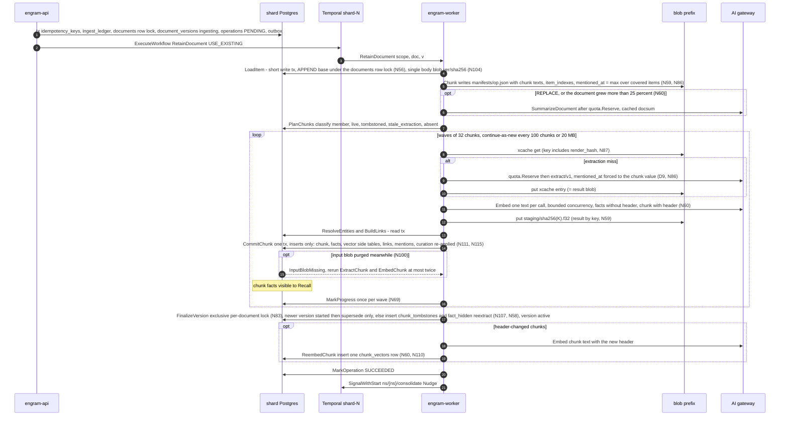
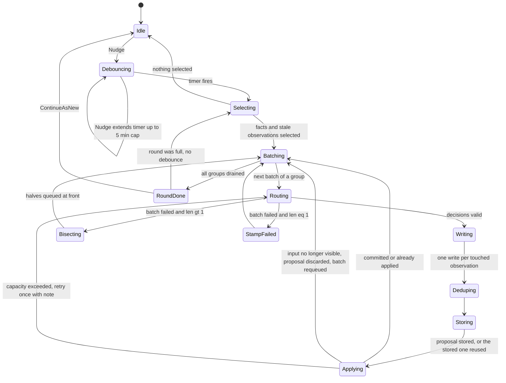
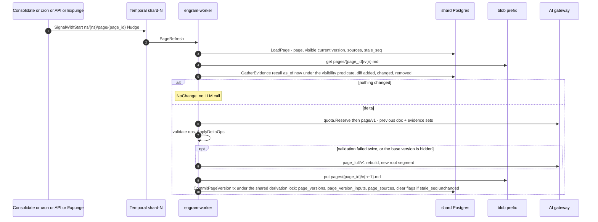
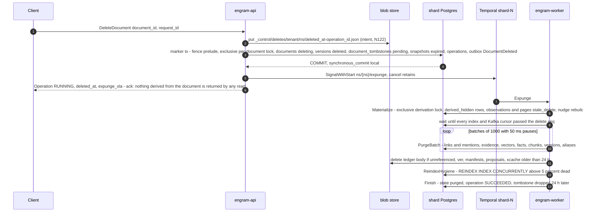
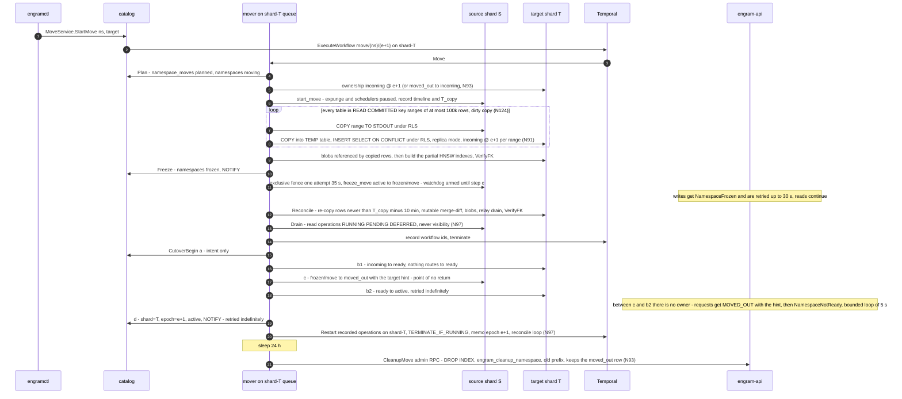
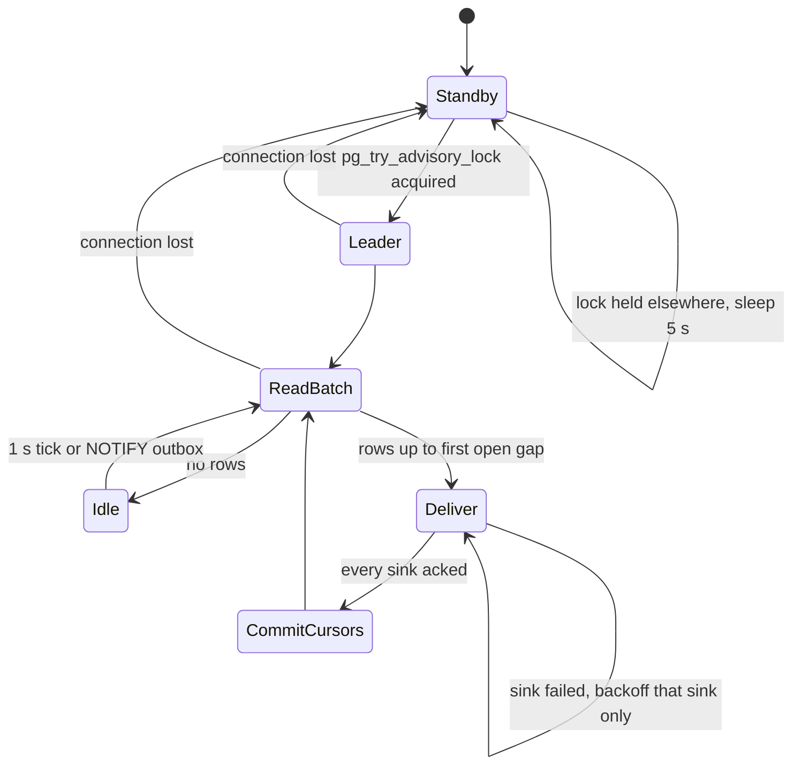

## 5. Pipelines

This section is the runtime behaviour of everything that writes: what runs as a Temporal
workflow versus an activity, what makes each step safe to execute twice, where the epoch fence
is checked, where a transaction begins and ends, which outbox events leave the transaction, and
what a crash at any point leaves behind. Tables are referenced by the names of §3 and messages
by the names of §4; neither DDL nor protos are restated. After the round-3 redesign (D22) one
principle runs through every pipeline: **rows that carry vectors or BM25 text are written once
and only ever purged; mutable state lives in narrow side tables; visibility is a read-time
predicate over small marker sets, never a flag stamped at delete time** (N113, N116). Deletes are
rare: the synchronous part of a delete is one marker row, and the physical work is a throttled
asynchronous `Expunge` during which SLOs may degrade (§5.4).

### 5.0 Conventions shared by every pipeline

**Workflow vs activity.** Workflows are deterministic orchestration: no I/O, no clocks other
than `workflow.Now`, no randomness other than `workflow.SideEffect`. Every activity is a method
on a struct that holds a `router.ShardRouter`; it derives its `ShardHandle` from the
`shard_id` in the workflow input (`ForShard`), never from the catalog (D4). Every workflow input
embeds `workflowv1.WorkflowScope{namespace_id, tenant_id, shard_id, epoch, blob_prefix}` and every
workflow sets the Temporal search attributes `NamespaceId`, `TenantId`, `Epoch`,
`OperationKind`, `OperationId` at start (they are what the move drain and the namespace delete
query, §5.4–5.5). Every top-level input carries `schema_version` (2 for this build, N128).

**Fencing, not identity.** The epoch appears in every workflow input and in every fence check,
and in no idempotency key (D11): a restarted execution must recognise work committed under the
previous epoch. Every *write* activity opens `store.Store.InNamespace(ctx, scope, fn)` with
`scope.Mode = Write` (§2.2.7; the `WithNamespaceTx(write)` of N97 and N131), which executes the **fence prelude**: `SET LOCAL engram.namespace_id / tenant_id /
epoch`, then `SELECT engram_try_ns_fence(namespace_id)` (the shared
`pg_try_advisory_xact_lock_shared` on the one-argument key `hashtextextended(ns, 0)`, N113), then a
plain `SELECT state, epoch FROM namespace_ownership WHERE namespace_id=$1` (no row lock; the row
is the fence *value*, the advisory lock is the fence *lock*), aborting unless `state='active' AND
epoch=$2`.

- **The fence never waits (N82).** If the try-lock is refused because an exclusive taker (move
  `Freeze`, delete freeze, restore) holds or is queued for the exclusive form, the statement ends
  at once with the retryable `NamespaceFrozen{retry_after = 200 ms}` (internally `FenceBusy`), so
  no pooled connection is held behind a queued exclusive request. **Exclusive takers make one
  attempt with `lock_timeout = 35 s`**, longer than any legal 30 s writer, instead of a 5 s retry
  storm (D22); they queue fairly behind the writers in flight when they asked, and writers that
  arrive later are refused by their try-lock, so a continuous stream of writers cannot starve
  them. Role defaults: `lock_timeout = 2 s` for `engram_app` and `engram_worker`, 10 s for
  `engram_move` and `engram_admin`.
- **Marker transactions take no derivation lock** (N82, N120): a delete, an invalidate and a
  tombstone are correct without one because visibility is evaluated at read time. A document delete
  takes the exclusive per-document lock (it flips `documents.state` and must not interleave with
  `FinalizeVersion`); `Restore` is the one marker transaction that takes the exclusive derivation
  lock, because it deletes `derived_hidden` rows (§5.4.5).
- **Reads take no lock and accept `active` and `frozen/move` only** (N122, N125). A namespace in
  `frozen/delete` or `frozen/restore` rejects reads, and `incoming` or `ready` shards route
  nothing.
- **Lock key spaces are disjoint (N113):** namespace fence `hashtextextended(ns, 0)`, derivation
  lock `hashtextextended(ns, 1)` (used only by writers of derived versions, N120), document lock
  `(hashtext(ns), hashtext(doc))`. One- and two-argument advisory locks are distinct lock tags,
  so no cross-kind collision exists.
- Every write transaction runs with `statement_timeout = idle_in_transaction_session_timeout =
  30 s` and its outbox `INSERT` is the **last statement** before `COMMIT`, one multi-row
  statement when it emits several events (invariant A-F1, D6): a drawn `seq` is committed or
  aborted within one timeout of being drawn, which the relay's 60 s gap watchlist (§5.6) assumes;
  `engramlint sql` fails a builder whose outbox append is followed by another statement, and every
  scheduler write to `operations` or the outbox goes through the same write-mode `InNamespace` (N131).
  Every role runs `synchronous_commit = local`; no synchronous standby exists (N122).
- Outcomes: `active` at the caller's epoch → proceed; `frozen` or a refused try-lock →
  `errs.NamespaceFrozen` (retryable); `ready` → `errs.NamespaceNotReady` (retryable);
  anything else (`incoming`, `moved_out`, missing row, epoch mismatch) → `errs.WrongShardOrEpoch`
  (**non-retryable** for a workflow: it is running against the wrong shard or a stale epoch; the
  internal `MovedOutHint` carries the target, N93).

**Retry-policy notation.** `initial / coefficient / max interval / max attempts / non-retryable
error types`. Named policies (`ScheduleToClose` bounds the whole retry chain; `StartToClose`
bounds one attempt):

| Policy | initial / coeff / max interval / attempts | Non-retryable | Used for |
|---|---|---|---|
| `P-pure` | — / — / — / 3 | everything (a pure function fails only on a bug) | `Chunk`, `GroupBatches`, `ApplyDeltaOps` |
| `P-db` | 500 ms / 2.0 / 10 s / 10 | `WrongShardOrEpoch`, `Validation`, `IntegrityViolation` | every read/write tx activity |
| `P-frozen` | 1 s / 1.5 / 5 s / unlimited within `ScheduleToClose` | `WrongShardOrEpoch`, `Validation`, `InputBlobMissing` (handled by the workflow, N100) | write activities that may meet a freeze (`CommitChunk`, `FinalizeVersion`, `ApplyBatch`, `CommitPageVersion`, `PurgeBatch`, `Materialize`): `P-db` plus `NamespaceFrozen` (including the 200 ms `FenceBusy` refusal), `NamespaceNotReady`, `DocumentBusy` (100 ms) and a refused derivation try-lock treated as retryable, 10 min `ScheduleToClose` |
| `P-llm` | 2 s / 2.0 / 60 s / 8 | `PermanentLLMError`, `Validation`, `WrongShardOrEpoch` | gateway structured/chat calls (after `quota.Reserve`) |
| `P-embed` | 1 s / 2.0 / 30 s / 8 | `PermanentLLMError`, `Validation` | gateway embed calls |
| `P-blob` | 200 ms / 2.0 / 5 s / 10 | `Validation` | blob get/put/list/delete |
| `P-poll` | 30 s / 1.0 / 30 s / unlimited within `ScheduleToClose` 48 h | `PermanentLLMError` (job rejected) | batch-job polling |
| `P-catalog` | 500 ms / 2.0 / 5 s / 20 | `Validation`, `MovePrecondition` | catalog transactions in the move (`Plan`, `Freeze`, `Rollback`, `MarkDeleted`) |
| `P-cutover` | 100 ms / 1.5 / 1 s / unlimited within `ScheduleToClose` 60 s | `Validation`, `MovePrecondition` | the cutover sub-step activities (N52, N125): a crash between (c) and (b″) must be repaired in sub-seconds |
| `P-temporal` | 1 s / 2.0 / 10 s / 10 | `Validation` | activities that call the Temporal client (list/terminate/start) |

**Transaction-boundary column values.** `none` (pure or blob/gateway only), `read tx` (RLS,
`active|frozen/move`), `write tx` (fenced, `active`), `marker tx` (a write tx whose only effect is
marker rows; no lock beyond the fence), `derivation tx` (a write tx that also takes the
derivation lock, N120), `target tx (incoming)` (move only: the mover runs as `engram_move`
**without** `BYPASSRLS` and loads each key range through a session `TEMP` table, `INSERT … SELECT
… ON CONFLICT` under `ns_isolation`, after re-checking `('incoming', e + 1)` and with
`SET LOCAL session_replication_role = replica`; the ownership trigger stays `ENABLE ALWAYS` and
RLS applies in replica mode, N91), `catalog tx`, `admin tx` (role `engram_admin`, `BYPASSRLS`,
used only by the per-shard sweepers that must enumerate namespaces and by the restore replay; the
mover's source cleanup goes through the `engram_migrate`-owned `SECURITY DEFINER` function
`engram_cleanup_namespace`, N93).

**Operation rows.** Activities update `operations` with absolute values (`state`,
`progress.units_done = <count>`), never relative increments; `RetainDocument` writes progress
**once per wave** from the workflow (`MarkProgress`), never from `CommitChunk`, so the 32
parallel commits of a document do not serialise on the operation row (N69). Operation
transitions emit no outbox event (a move does not replay the outbox any more, N124).
`namespace_stats` counters are **derived** (periodic `count(*)` of the visible rows by the **stats
sweeper**, which also creates and drops the per-namespace partial HNSW indexes, N112), never written
on the commit path. State transitions are monotone: `PENDING → RUNNING ⇄ DEFERRED →
SUCCEEDED|FAILED|CANCELLED`; an `UPDATE … WHERE state NOT IN (terminal)` guard makes a late
activity from a terminated workflow harmless.

**Heartbeats and history bounds.** Any activity that can run longer than 30 s heartbeats every
10 s with a resumable progress payload; heartbeat timeout = 30 s. Workflows continue-as-new
before their history reaches 10 k events **or 20 MB** (retain: every 100 chunks or 20 MB;
consolidate: every round; page refresh: every refresh; expunge: every 200 batches; move: never,
≤ 200 events).

**Payload size and confidentiality (N59, N99).** Every activity result larger than **4 KiB**
travels by blob key under the namespace prefix: `ExtractChunk` returns the extraction-cache key
(the cache entry *is* the result blob), `EmbedChunk` the staging key, `ResolveEntities` and
`BuildLinks` their own result keys, and `CommitChunkInput` is **keys-only**; `ChunkWork` carries
no chunk text. A Temporal history therefore holds ids, hashes and keys plus a small inline residue
— text appears there **only as ciphertext, at most 4 KiB per activity result, plus
`ChunkWork.header/context/metadata_json/entity_hints`**. Whatever travels inline is encrypted by
a `DataConverter` payload codec (AES-256-GCM) under a **per-namespace data key** wrapped by the
shard key; deleting the wrapped key is the shredding step of a namespace or tenant delete, and a
key version is destroyed only after `rotation time + max workflow run timeout (7 d) + Temporal
retention (7 d)`.

**Token accounting and the quota gate (D13, N25, N130).** Every gateway call returns a `Usage`;
the activity that owns the call carries it into the next fenced write transaction of the same
pipeline, where it is inserted as `token_usage_events(usage_key = sha256(activity idempotency key
‖ call label))` with `ON CONFLICT DO NOTHING`, and only a row actually inserted increments the
daily rollup (PD-1): a crash under-counts by at most one call per retry, never double-counts.
**`quota.Reserve(tokens_estimate)` precedes every gateway call class**: extract, summarize, each
consolidation routing and writing call, page refresh, and each Reflect iteration. A refusal
**defers** a workflow (`DEFERRED`, `resume_at` = the window reset; a `Cancel` signal wakes it) and
returns `RESOURCE_EXHAUSTED` to a synchronous Reflect. `llm_tokens_per_day` is enforced from the
shard-local rollup; the tenant-level limit is a **per-namespace share** carried in
`config_snapshot`, computed by the catalog from trailing usage plus a floor (so a new namespace is
not starved), with unused share borrowable at the daily recompute. `max_facts` is read from the
derived `namespace_stats`.

**Outbox events are thin and bounded (N12, N80).** Every event carries ids, versions and flags,
never text, vectors or row images; ids are 16-byte `bytes`, an event carries ≤ 256 ids and encodes
to ≤ 16 KiB, larger sets are paged (`page`/`page_count`) and above 4,096 ids elided (`ids_elided`,
read by `document_id`). A delete is an O(1) `DocumentDeleted` marker event with no id list. Every
consumer (the async `index` adapter, Kafka's downstream consumers, the export) reads current rows
by id at the recorded epoch; content rows are immutable (N113), so the read is idempotent. The
outbox is a change feed for those consumers, not a replay log: moves do not read it.

**Kafka, once for all pipelines.** No pipeline uses Kafka as a control channel, queue or hand-off.
Temporal is the durable orchestrator and the per-shard outbox is the ordered log; the only Kafka
touchpoint is the optional `kafka` sink of the relay (§5.6).

---

### 5.1 Retain

Retain is insert-only. A chunk commit inserts a chunk row, fact rows, vector rows in the side
tables `fact_vectors`/`chunk_vectors` keyed by the namespace's embedding model (N111), links,
mentions and evidence; nothing already stored is updated. A replace or a prompt bump hides old
rows with a marker row (`chunk_tombstones`, `fact_hidden`) and the expunge purges them later.

#### 5.1.1 API handler (`MemoryService.Retain`, unary, one operation per document)

The ack promises durability of the raw input and of the operation, nothing more (D16).
Items are grouped by `document_id` (N9): several items naming the same document in one request
are concatenated in request order (`REPLACE`) or appended in order (`APPEND`) and produce **one**
operation; `RetainResponse.operations` is aligned with the request's distinct documents. A
caller-supplied `operation_id` is used verbatim for a single document and as the UUIDv5
namespace (`uuid5(operation_id, document_id)`) when the request spans several; an item without a
`document_id` gets `UUIDv5(operation_id, "item/" ‖ index)` when an `operation_id` is present
(N127) and a fresh UUIDv7 otherwise, in which case the retain is documented as **not replay-safe**.
The steps below run once per document, all documents of a request inside one shard transaction
(step 4) so the ack is all-or-nothing for the request.

1. **Validate**: `content` ≤ 1 MiB (≤ 8 MiB per request, §4.1.8), `document_id` ≤ 256 B, ≤ 32
   tags × 64 B (N32), `timestamp` parses and is present, `update_mode ∈ {REPLACE, APPEND}`,
   `entities` hints ≤ 64, deadline present, scope `memory.write`. Failures → `INVALID_ARGUMENT` +
   `ValidationError`.
2. **Rate quota**: `retains_per_min` token bucket, tenant then namespace → `RESOURCE_EXHAUSTED` +
   `QuotaExceeded`. (`llm_tokens_per_day` and `max_facts` are workflow concerns, D13, N130.)
3. **Raw body**: `content_hash = sha256(content)`. Bodies > 64 KiB are `Put` to
   `{shard}/{tenant}/{ns}/ledger/{content_hash}` *before* the transaction (N7; content-addressed:
   a retry re-puts the same key; a crash leaves an orphan blob that the weekly orphan sweep
   removes). Smaller bodies are stored inline in the ledger row.
4. **One fenced write transaction**, statement order:
   1. `INSERT idempotency_keys(namespace_id, method, request_id, request_hash, operation_id,
      expires_at = now() + 24 h) ON CONFLICT (namespace_id, method, request_id) DO NOTHING`.
      Conflict → read the row: same `request_hash` → return its operation and stop; different →
      `ALREADY_EXISTS` + `OperationConflict{IDEMPOTENCY_KEY_REUSED}`.
   2. `INSERT ingest_ledger(namespace_id, ledger_id uuidv7, document_id, content_hash,
      content_bytes, body | body_blob_key, item_timestamp, context, tags, metadata, entity_hints,
      update_mode, request_id, operation_id)` (§3.3.3).
   3. `INSERT documents(namespace_id, document_id, current_version = 0, state = 'active') ON
      CONFLICT (namespace_id, document_id) DO UPDATE SET updated_at = now() RETURNING
      current_version, state` (the `DO UPDATE` takes the row lock), then `v = coalesce(max(version),
      0) + 1` over `document_versions`. This assigns the **version** under the document's row
      lock, so versions are dense and monotone per document (D8). `state <> 'active'`
      (`deleting`) or a row in `document_tombstones` → `ABORTED` +
      `OperationConflict{DOCUMENT_PURGING, existing_operation_id = the DELETE_DOCUMENT
      operation}`: the document id is reusable only after the expunge has finished and the
      tombstone is dropped (N115); a client that wants to re-use the content immediately uses a new
      `document_id`. For `APPEND` the base is **not** recorded here: `LoadItem` assigns it under
      the same row lock (N56). The ack keeps **only the `documents` row lock** (`FOR UPDATE`) and
      takes no advisory lock (N83).
   4. `INSERT document_versions(namespace_id, document_id, version = v, content_hash, status =
      'ingesting', operation_id, ledger_id)`.
   5. `INSERT operations(namespace_id, operation_id, kind = RETAIN_DOCUMENT, state = PENDING,
      target_id = document_id, request_id, workflow_id, task_queue, submitted_epoch)`. A
      client-supplied `operation_id` that already exists with a different `request_hash` →
      `ALREADY_EXISTS` + `OperationConflict{IDEMPOTENCY_KEY_REUSED}`.
   6. One multi-row `INSERT outbox` carrying `DocumentVersionStarted` (`namespace_id`,
      `tenant_id` and `epoch` default from the transaction scope, §3.3.2). Commit.
   The `request_hash` is SHA-256 over the normalised protojson of the request with `meta` cleared
   (N72); a supplied `operation_id` is validated as any UUID.
5. **Start the workflow**: `ExecuteWorkflow(RetainDocument, WorkflowID = "ns/{ns}/op/{op}",
   TaskQueue = "shard-{shard}", WorkflowIdReusePolicy = REJECT_DUPLICATE,
   WorkflowIdConflictPolicy = USE_EXISTING, input = {scope, document_id, version = v, ledger_id,
   update_mode, mode = ONLINE, config_snapshot})`. `USE_EXISTING` makes a retry after a crash
   between steps 4 and 5 attach to the running execution. `SignalWithStart` is not used (there is
   nothing to signal to a retain).
6. **Return** `Operation{PENDING}`. If step 5 fails after step 4 committed → `UNAVAILABLE` +
   `RetryInfo{1 s}`; the client's retry with the same `request_id` hits step 4.1 and repeats only
   step 5. The per-shard `op-sweeper` schedule (N3) starts a workflow for any `PENDING` operation
   older than 2 min without an execution.

`config_snapshot` (≤ 1 KiB: model ids, prompt ids, `chunk.*`, quota shares) is resolved from the
catalog entry at submit time and carried in the workflow input (PD-2, adopted as N25; in
`RetainDocumentInput` it is the `models` + `chunk_target_chars` fields). Workers must not call the
catalog (D4), and a configuration change applies deterministically to operations submitted after
it. `models.embed` is fixed at namespace creation (N111) and is not part of the mutable snapshot.

#### 5.1.2 Workflow `RetainDocument`

Input `RetainDocumentInput{scope, operation_id, document_id, version v, update_mode, ledger_ids,
models, chunk_target_chars, tags, …}` (§4); the continue-as-new state `resume{next_chunk,
manifest_key, counters}` is workflow-local.

1. **`LoadItem`** (short write tx + blob get/put): the ledger row (and raw blob) and the current
   active version's chunk hash set. For `APPEND` it **assigns the base (N56)**: `SELECT … FROM
   documents … FOR UPDATE`, then `UPDATE document_versions SET append_base_version = (SELECT
   max(version) … WHERE version < v) WHERE version = v AND append_base_version IS NULL` — the
   highest existing version, *even one still ingesting* (two appends A and B 1 s apart therefore
   chunk `body(c) ‖ A` and `body(c) ‖ A ‖ B` and the newer finalise drops nothing of A's). **It
   reads one object (N104):** each version has `body_key`/`body_hash`, the full reconstructed body
   as a content-addressed blob `{shard}/{tenant}/{ns}/ver/{sha256}`; `LoadItem` puts the new
   version's full body there and then sets `body_key`/`body_hash` `WHERE body_key IS NULL`
   (idempotent; a crash leaves at worst an orphan blob). Sets `operations.state = RUNNING, phase =
   "chunk"`.
2. **`Chunk`** (pure): for `APPEND` the input is `base_body ‖ "\n\n" ‖ new_body`. Heading-anchored,
   content-defined boundaries per D11 (target 3,000, min 500, max 4,000 chars, no overlap), with
   **a hard boundary forced between consecutive items whose timestamps differ by more than 24 h**
   (N86). Output: a manifest `[{index, content_hash, heading_path, byte_range, text,
   item_indexes[], mentioned_at}]` and `document_hash = sha256(all chunk hashes)`, written to blob
   `{prefix}/manifests/{operation_id}.json`; the activity result is `{manifest_key, chunk_count,
   document_bytes, timestamps_clamped}` so the payload stays under 2 KiB and every per-chunk
   activity reads its text from the manifest by ordinal (N59). **`mentioned_at(chunk)` (N86)** is
   the maximum timestamp of every item whose bytes the chunk covers (for an `APPEND` re-chunk also
   the `mentioned_at` of every base chunk the new text overlaps); facts inherit it, never a value
   the extractor or the client chose (D9). Per-document timestamp regressions clamp up through the
   max rule and are reported as `timestamps_clamped`. Deterministic: a re-execution overwrites the
   same bytes.
3. **`SummarizeDocument`** (gateway, cached; `quota.Reserve` first) — **only when needed (N60)**:
   on `REPLACE`, or when `document_bytes` exceeds the bytes of the version whose summary is in use
   by more than 25 %; otherwise the current `summary_id` is reused. Key
   `{prefix}/docsum/{sha256(document_hash ‖ "summarize/v1" ‖ model)}.json`. `PermanentLLMError` is
   **not fatal**: the summary falls back to the first heading or the first 200 chars
   (`summary_fallback = true`).
4. **`PlanChunks`** (read tx, one query): for every manifest hash, `SELECT chunk_id, content_hash
   FROM chunks WHERE namespace_id AND document_id AND content_hash = ANY($1)`, the chunk's row in
   `chunk_tombstones`, the `extraction_key` of its visible facts, and `document_version_chunks`
   membership for version `v`. Each chunk is classified `member` (already committed for `v`: the
   restart path), `live` (unchanged: membership row only), `tombstoned` (un-retire by deleting the
   tombstone row, no LLM), `stale_extraction` (same hash but its facts carry an older
   `extraction_key = sha256(content_hash ‖ prompt_version ‖ model ‖ schema_version ‖
   render_hash)` than the snapshot's; `render_hash`
   covers the item day, context, metadata, entity hints, `retain.mission` and the heading path but
   **not** the document summary, N110: a summary refresh re-embeds the chunk without re-extracting)
   or `absent`. Delta retain (D8) is this classification. `content_hash = sha256(text)` excludes
   the contextual header (N6), so a chunk's identity survives a changed summary; `header_hash =
   sha256(heading_path ‖ summary_id)` (N60) is compared at `FinalizeVersion`.
5. **Fan-out**, waves of up to 32 chunks in flight, bounded by a workflow-side semaphore. Before
   each wave **`MarkProgress`** (write tx) writes `progress.units_done/failed/skipped` as absolute
   values (N69). A refused `quota.Reserve` → `MarkOperation(DEFERRED, DeferredInfo{quota,
   resume_at, scope})` and `workflow.Sleep(until resume_at)`. Per chunk with hash `h` (the activity
   idempotency key is `K = (namespace_id, document_id, v, h)` throughout, D11: the epoch is a
   fence, never part of a key):
   1. **`ExtractChunk`** (blob + gateway): key `{prefix}/xcache/{sha256(h ‖ prompt_version ‖ model
      ‖ schema_version ‖ render_hash)}.json` (N87). Hit → return the cache key. Miss →
      `quota.Reserve`, `ChatStructured(extract/v1)` with the chunk header prepended → validate (≤ 40
      facts, causal indices point to earlier facts, timestamps parse, `said_at ≤ item_timestamp + 5
      min`, text ≤ 2,000 chars) → set every fact's `mentioned_at` to the chunk's, discarding
      anything the model emitted (D9) → blob put → return `{cache_key, fact_count, usage}`.
      `PermanentLLMError` or validation failure after one repair attempt → a `chunk_failed{reason}`
      *result*; the workflow records it in `operations.error` and continues; the operation ends
      `SUCCEEDED` with `progress.units_failed > 0` (N35).
   2. **`EmbedChunk`** (blob + gateway; **unary embedder, one text per call, concurrency bounded at
      the gateway**): `search_document: {fact.text}` for each fact (**no header**, N60) and
      `search_document: {header}\n{chunk text}` for the chunk, L2-normalised, `halfvec(768)`.
      Per-namespace embedding cache `{prefix}/ecache/{sha256(prefixed text ‖ model ‖ dims)}.f16`.
      Vectors go to the staging blob `{prefix}/staging/{sha256(K)}.f32`; the result carries the key
      plus `header_hash` and the model id.
   3. **`ResolveEntities`** (read tx): per extracted entity: normalise (NFKC, trim), exact hit in
      `entity_aliases`, else trigram lookup through the `SECURITY DEFINER` function (N131) at
      similarity ≥ 0.6 for a matching type (≥ 0.85 when a type is `unknown`), else plan a create;
      **type match is mandatory**; caller hints are force-resolved. The create-or-merge happens in
      `CommitChunk` as **one statement with rows in `canonical_norm` order** (N69). Entity
      resolution is not `as_of`-aware at write time; `as_of` reads suppress names (N118).
   4. **`BuildLinks`** (read tx, then in memory), per new fact, ≤ 60 links: *temporal* ≤ 20 visible
      facts within ±24 h; *semantic* k = 10 over `fact_vectors` of the namespace's current model
      (the per-namespace partial HNSW when it exists, an exact scan below 2,000 vectors, N112),
      cosine ≥ 0.75; *entity* ≤ 20; *causal* from the extraction. Links to invisible facts are never
      built. The result is returned by blob key.
   5. **`CommitChunk`** (fenced write tx; **keys-only** input; a missing blob is the retryable
      `InputBlobMissing`, N100 — the chunk sub-pipeline re-runs `ExtractChunk` and `EmbedChunk` at
      most twice, then `chunk_failed`). Statement order:
      1. fence prelude at the caller's epoch.
      2. `SELECT engram_try_doc_lock_shared(namespace_id, document_id)`; refused → retryable
         `DocumentBusy` (100 ms). Then plain reads: `documents.state` (`deleting` →
         `aborted{document_deleted}`), the document tombstone row (present → `aborted`), and
         `document_versions.status` for `v` (N40: `status <> 'ingesting'` → `superseded`/`aborted`;
         the workflow skips straight to step 7). `FinalizeVersion` and the delete marker
         transaction take the *exclusive* form of the same key under `lock_timeout = 5 s`, so a
         slow older version cannot resurrect a chunk the newer one tombstoned or commit into a
         deleted document.
      3. `SELECT 1 FROM document_version_chunks WHERE (namespace_id, document_id, v, h)` → exists →
         `COMMIT`, return `already` (the exactly-once guard).
      4. `INSERT chunks(chunk_id uuidv7, …, content_hash = h, header_hash, text, header,
         heading_path, mentioned_at) ON CONFLICT (namespace_id, document_id, content_hash) DO
         NOTHING`, then the chunk vector `INSERT chunk_vectors(…, embedding_model,
         embedding_effective_at) ON CONFLICT DO NOTHING` (N85: `embedding_effective_at` = the
         `mentioned_at` of the newest item the summary in the embedded header covers), and
         `INSERT document_version_chunks` with the chunk's `ordinal` in this version. A
         `tombstoned` chunk is un-retired by `DELETE FROM chunk_tombstones`. **No `UPDATE` of a
         content row exists.**
      5. If the chunk has no visible facts under the current `extraction_key`: `INSERT facts(…,
         mentioned_at, said_at, occurred_*, prompt_version, extraction_key, document_id,
         chunk_id)` and `INSERT fact_vectors(…, embedding_model)`; entities in one sorted upsert;
         `entity_aliases` (with the producing `document_id`, N118), `entity_mentions` (with the fact's
         `mentioned_at`, N118); `fact_links ON CONFLICT DO NOTHING` in key order (undirected
         edges once with `src < dst`, N34). **Curation sticks (N115):** for each new fact whose
         `(document_id, content_hash)` matches the last action of a `curation_log` row, insert the
         same `fact_hidden` marker.
      6. `token_usage_events` / `token_usage` (PD-1). No counter, progress or `chunks_done` update.
      7. `INSERT outbox(ChunkCommitted)` (paged at 256 ids). `COMMIT`. **The facts of this chunk
         are visible to Recall from this instant (D16).**
6. **`ContinueAsNew`** every **100 chunks or 20 MB of history**, with `RetainResume`.
7. **`FinalizeVersion`** (fenced write tx) — the per-document serialisation point:
   1. fence prelude; then the exclusive per-document advisory lock under `lock_timeout = 5 s` (it
      waits for every in-flight `CommitChunk` of the document).
   2. `SELECT current_version AS c, state FROM documents … FOR UPDATE`. `state <> 'active'` → mark
      the version `deleted`, the operation `CANCELLED{CANCEL_REASON_DOCUMENT_DELETED}`, return. A
      replay (version already terminal) returns the recorded result.
   3. **Newer-version check (N40):** if `max(version) > v`, mark `v` `superseded`, tombstone
      **nothing**, leave `current_version`, and end the operation `SUCCEEDED` with
      `document_version = v` and `superseded_by = max` (N49, N127).
   4. **`v` is the newest:** supersede older `ingesting` rows, then **insert**
      `chunk_tombstones(reason = 'replace')` for the document's chunks not in `v`'s membership
      (document-scoped subquery, N107: `content_hash NOT IN (SELECT content_hash FROM
      document_version_chunks WHERE namespace_id = $1 AND document_id = $2 AND version = $3)`) and
      `fact_hidden(reason = 'reextract')` for visible facts of kept chunks whose `extraction_key`
      differs from the current key (N58). Observations that cite, or were derived from, a
      tombstoned chunk's facts are marked `stale_write` in the narrow `observations` table and
      **stay visible**: a replace is a write, not a deletion, and observations lag writes by the
      consolidation debounce (D16); the expunge removes the evidence rows later and the rebuild
      follows like any other (N42 as restated). Set `documents.current_version = v`,
      `document_versions(v).status = 'active'`, `(c).status = 'superseded'`.
   5. **Header check (N6, N60):** member chunks whose newest `chunk_vectors.embedding_effective_at`
      is older than the `mentioned_at` of the newest item the summary in use covers are returned
      as `reembed_hashes` (the chunk text is unchanged, so extraction is not repeated).
   6. Last statement (A-F1): outbox `ChunksTombstoned`, `ObservationsMarkedStale`,
      `DocumentVersionActivated`. Commit. The index is `Transactional`: the per-namespace HNSW and
      the BM25 entries were written by the inserts themselves.
8. **`ReembedChunk`** for every hash in `reembed_hashes`, ≤ 32 in flight: embed the chunk text
   with the new header, then a fenced write tx **inserts a new `chunk_vectors` row** with the newer
   `embedding_effective_at` (N111, N110a): the chunk row is immutable and fact vectors never carry
   the header, so nothing else is touched; idempotent by `(K, embedding_effective_at)`, and under
   `as_of` the chunk arm takes the best admitted row per chunk (N85). Then **`MarkOperation`** → `SUCCEEDED` with `OperationResult{document_version =
   v, facts_written, chunks_reused}`. `SUCCEEDED` is delayed by the re-embed so the read barrier
   also covers fresh embeddings.
9. **Nudge consolidation**: `SignalWithStart("ns/{ns}/consolidate", Nudge{operation_id,
   facts_written})` (D11; §5.2).

**Per-document serialisation, stated precisely (D8, N40).** Versions are assigned in the API
transaction under the `documents` row lock, so they are monotone per document. Two
`RetainDocument` executions for versions `v₁ < v₂` may run steps 1–6 concurrently: their
`CommitChunk` transactions touch shared chunk rows keyed by content hash through `ON CONFLICT DO
NOTHING`, and their membership rows are per version. `FinalizeVersion` serialises on the exclusive
per-document advisory lock and on the version rows; the **newest version wins and is the only one
that tombstones**: a lower version finalising later marks itself superseded and tombstones nothing
(its surplus chunks are tombstoned by the newer version's finalise), and a lower version still
committing after the higher one finalised is told `superseded` by `CommitChunk` step 2 and stops.
The delete marker transaction takes the same exclusive lock, so a delete and a finalise cannot
interleave. Rejected: a long-lived per-document mutex workflow (one Temporal history per document,
a signal round-trip per version) and strict serialisation (doubles latency for rapid re-saves; the
extraction cache already makes the concurrent waste zero LLM calls).

**Per-activity timeouts** are in §5.8. The workflow has no `WorkflowExecutionTimeout`;
`WorkflowRunTimeout = 7 d` per continue-as-new run.

#### 5.1.3 Step table

| Step | Workflow or Activity | Idempotency key | Retry policy | Fencing check | Transaction boundary | Outbox events |
|---|---|---|---|---|---|---|
| API validate + quota | handler | — | client retry | authz interceptor resolves shard+epoch | none | — |
| Raw blob put (> 64 KiB) | handler | `ledger/{sha256(content)}` (N7) | client retry | — | none | — |
| Ledger + version + operation | handler | `(namespace_id, method, request_id)`; `(namespace_id, operation_id)` | client retry with same `request_id` | shared try-lock, `active` @ epoch; `documents` row `FOR UPDATE` only (N83); tombstone check | write tx | `DocumentVersionStarted` |
| Start workflow | handler | workflow id `ns/{ns}/op/{op}` (`USE_EXISTING`) | client retry; op-sweeper N3 | — | none | — |
| `LoadItem` | activity | `(ns, doc, v)`; `append_base_version IS NULL` and `body_key IS NULL` predicates (N56, N104) | `P-db` | shared try-lock, `active` @ epoch; `documents` row `FOR UPDATE` for the base | short write tx + blob get/put | — |
| `Chunk` | activity | `(ns, doc, v)` → same manifest bytes (N59, N86) | `P-pure` | none | none | — |
| `SummarizeDocument` (REPLACE or > 25 % growth only, N60) | activity | `docsum/…` key | `P-llm` after `quota.Reserve` | none | none | — |
| `PlanChunks` | activity | `(ns, doc, v)` | `P-db` | read fence | read tx | — |
| `MarkProgress` (once per wave, N69) | activity | `(ns, op, wave)` absolute values | `P-db` | shared try-lock, `active` @ epoch | write tx | — |
| `ExtractChunk` | activity | xcache key `sha256(h ‖ prompt ‖ model ‖ schema ‖ render_hash)` (= result blob, N87) | `P-llm` after `quota.Reserve` | none | none | — |
| `EmbedChunk` | activity | ecache key per text; staging key `sha256(K)` | `P-embed` | none | none | — |
| `ResolveEntities` | activity | `K` (result by key above 4 KiB) | `P-db` | read fence | read tx | — |
| `BuildLinks` | activity | `K` (result by key) | `P-db` | read fence | read tx | — |
| `CommitChunk` (keys-only input) | activity | `K` via `document_version_chunks` | `P-frozen` (`DocumentBusy` retryable; `InputBlobMissing` handled by the workflow, N100) | shared try-lock, `active` @ epoch + shared per-document try-lock, then plain reads of `documents`, the tombstone and `document_versions` (N40, N83) | write tx, inserts only | `ChunkCommitted` (paged, N80) |
| `FinalizeVersion` | activity | `(ns, doc, v)` + exclusive per-document advisory lock (`lock_timeout` 5 s) | `P-frozen` | shared try-lock, `active` @ epoch; newer-version check (N40); document-scoped tombstone subquery (N107); re-extraction `fact_hidden` (N58) | write tx, inserts and narrow-table updates | `ChunksTombstoned`, `ObservationsMarkedStale`, `DocumentVersionActivated` |
| `ReembedChunk` (N60: chunk vectors only) | activity | `(K, embedding_effective_at)` | `P-embed` / `P-frozen` | shared try-lock, `active` @ epoch | write tx, one insert | — |
| `MarkOperation` SUCCEEDED | activity | `(ns, op)` monotone state | `P-db` | shared try-lock, `active` @ epoch | write tx | — |
| Nudge consolidate | workflow | signal is idempotent (debounced) | Temporal | — | none | — |

#### 5.1.4 Sequence

#### 5.1.5 Failure and crash scenarios

| Scenario | What happens | Net effect |
|---|---|---|
| API crashes (or `ExecuteWorkflow` fails) after the tx commits | The client sees `UNAVAILABLE` + `RetryInfo{1 s}` (N3: the ack is never weakened); its retry with the same `request_id` hits the idempotency key and repeats only step 5; if the client never retries, the per-shard `op-sweeper` (60 s) starts the workflow for any `PENDING` operation older than 2 min | exactly one execution |
| Worker dies during `ExtractChunk` after the gateway answered, before the blob put | Temporal retries on another worker; cache miss → the call is paid twice (bounded by one extra call per crash) | same facts (temperature 0 + schema) |
| Worker dies inside `CommitChunk` | Transaction rolled back; the membership guard makes a re-run after a *committed* attempt a no-op | exactly-once commit per `(v, h)` |
| Gateway returns 429/5xx for an hour | `P-llm` backs off to 60 s intervals for up to 6 h; operation stays `RUNNING`; after 6 h the chunk is recorded in `operations.error`, `units_failed++`, the rest proceeds | no data loss; `engramctl op retry` re-runs failed chunks |
| Gateway returns 4xx (schema refusal, content policy) | `PermanentLLMError` → one repair attempt → `chunk_failed` result; the chunk text is still stored and searchable through the chunk arm | partial extraction, visible in `progress.units_failed` |
| `quota.Reserve` refused mid-document | The workflow marks `DEFERRED` with `resume_at`; already-committed chunks stay visible | resumes at window reset |
| Namespace frozen by a move during `CommitChunk` | `NamespaceFrozen` → `P-frozen` retries; the mover terminates the workflow within the freeze and re-executes it on the target with the same id (§5.5 Restart); the new run's `PlanChunks` skips committed chunks | no duplicate facts (membership rows copied or reconciled with the namespace) |
| Stale execution still running on the source after cutover | Its next write meets `moved_out`/epoch mismatch → `WrongShardOrEpoch` (non-retryable) → workflow `FAILED`; the operation was re-driven on the target | no write lands on the wrong shard |
| Two versions `v₁ < v₂` submitted 1 s apart | `v₂` finalises → supersedes `v₁`'s row (after its in-flight commits), tombstones every chunk not in `v₂`, `current_version = v₂`; `v₁`'s remaining `CommitChunk`s see `superseded` and stop; `v₁`'s finalise sees a newer version and tombstones nothing (N40); `v₁`'s operation ends `SUCCEEDED` with `superseded_by = v₂` | newest version wins; no resurrection |
| Two `APPEND`s A and B submitted 1 s apart | `LoadItem(v₂)` assigns `append_base_version = v₁` under the `documents` row lock (N56), so `v₂` chunks `body(c) ‖ A ‖ B`; its finalise tombstones only the re-cut tail chunk of `v₁` | no lost append |
| Prompt or model bump re-extracts a kept chunk | `stale_extraction`: new facts are inserted under the new `extraction_key`; `FinalizeVersion` inserts `fact_hidden(reextract)` for the old ones (N58) | one visible fact set per chunk |
| Worker crashes with a 20 MB history | The run continued-as-new at the last wave boundary with `RetainResume` | never near Temporal's 50 MB / 51 k-event limits |
| Late `CommitChunk` of a superseded or deleted version | The plain reads under the shared document lock return `superseded`/`deleted`/tombstone → `superseded`/`aborted`, no insert | no resurrection after the ack |
| Document deleted mid-retain | The marker transaction takes the exclusive document lock (waiting for in-flight commits), flips `documents.state`, inserts the tombstone and cancels the retain operations (`CANCEL_REASON_DOCUMENT_DELETED`); a `CommitChunk` racing it fails the try-lock (`DocumentBusy`) or sees the tombstone → `aborted`. Rows a racing commit inserted before the marker are hidden by it like the rest | nothing from the document is visible after the delete ack |
| Retain into a document id that is still `DELETING` | `ABORTED` + `OperationConflict{DOCUMENT_PURGING}` naming the delete operation | the client waits for the expunge or uses a new id |
| `CommitChunk` meets a cache or staging blob purged by a concurrent expunge | `InputBlobMissing` (N100): the chunk sub-pipeline re-runs `ExtractChunk` and `EmbedChunk` (≤ 2 re-runs), then `chunk_failed`; the expunge deletes `xcache` blobs only when no visible chunk references the hash **and** the blob is older than `xcache_grace = 24 h` | no permanent failure from a purge race |
| `FinalizeVersion` queued behind a stream of `CommitChunk`s | `CommitChunk` try-locks fail while the exclusive request is queued → `DocumentBusy`, backoff 100 ms; the exclusive request is granted within 5 s | no starvation (`TestDocLock_NoStarvation`) |
| A freeze, delete freeze or restore is queued on the namespace | Writers' shared try-lock is refused → `NamespaceFrozen{200 ms}` at once; no pooled connection waits (N82) | recall p95 on a second namespace of the shard does not move (`TestFence_PoolNotExhausted`) |
| Two documents share a chunk hash and one is replaced | The tombstone subquery is scoped to `(namespace_id, document_id, version)` (N107) | no chunk is hidden outside its document |
| `CancelOperation` | Cooperative at the next wave boundary; committed chunks stay; `FinalizeVersion(abort)` marks the version `superseded` and tombstones chunks that belong only to `v` | consistent partial state, reported `CANCELLED` |

#### 5.1.6 Throughput and batch mode

`chunks/s per cell = min(32 / L_extract, RPM_cap / (60 × calls_per_chunk))` with `calls_per_chunk ≈
3.5` once the extract, summary and the two consolidation stages (routing and writing) are counted
(N121, D3). With `L_extract ≈ 3–6 s` the first term is 5–10 chunks/s per worker;
a 600 RPM cap yields **≈ 2.9 chunks/s per cell** regardless of worker count, so filling 1 B facts
online takes **≈ 100 days at 4 cells**. Embedding (one text per call, concurrency bounded at the
gateway) and Postgres (`CommitChunk` ≈ 15 ms) are not the bottleneck.

**`RetainBackfill`** (workflow `ns/{ns}/backfill/{backfill_id}` on `shard-{id}`, started by
`engramctl backfill`; a **launch prerequisite in the committed scope**, N130) moves extraction off
the RPM cap and onto the gateway batch API (~50 % cheaper). It does **not** re-implement retain:
it pre-warms the two caches and then runs ordinary `RetainDocument` children that hit them.

1. For each operation in the batch (≤ 10 000): `LoadItem` + `Chunk` (≤ 32 parallel) → manifests.
2. `PlanCacheMisses` (blob `Head` on every xcache key, 1 000 per activity) → the list of
   `(xcache_key, prompt input)` pairs.
3. `SubmitExtractBatch`: idempotent through `batch_jobs(namespace_id, batch_key = sha256(sorted
   xcache keys), gateway_job_id, kind)` — an existing row returns its `gateway_job_id`; otherwise
   `SubmitBatch` (≤ 10 k requests, `custom_id = xcache_key`) and insert. Cache keys are identical
   to the online path. `quota.Reserve` covers the batch's token estimate.
4. `PollBatch` (`P-poll`, heartbeat, `ScheduleToClose` 48 h).
5. `ApplyBatchResults`: stream results; validate each exactly as `ExtractChunk` does; blob put
   under `custom_id`; failures stay cache misses; usage per item `usage_key = sha256(job_id ‖
   custom_id)`.
6. Steps 2–5 again for embeddings (`custom_id = ecache_key`).
7. `ExecuteChildWorkflow(RetainDocument, id = "ns/{ns}/op/{op}")` for each operation, ≤ 8
   concurrent: every chunk is a cache hit, so the children run at Postgres speed.

Rejected: a separate batch-only ingest path writing facts directly (two code paths for the same
invariants).

**Kafka: not used.** Retain is one durable Temporal workflow per operation; a queue in front of
it would add a second durable store to the write path (D6).

---

### 5.2 Consolidation

Consolidation is **two-stage** (D12, N121). Stage 1 *routes* a batch of 8 facts against candidate
observations and returns decisions only (`attach`, `create`, `merge`, `drop_source`); nothing
textual from stage 1 is persisted, so candidate text cannot flow into stored content. Stage 2
*writes* one new version per touched observation from that observation's own previous text, its
own visible source quotes and the newly attached facts. The evidence segment of a version
(`inputs(O, w)` for `root_version(v) ≤ w ≤ v`, N117) therefore contains only facts that are O's own
sources, which keeps the set a delete can touch small and exact.

#### 5.2.1 Trigger and workflow shape

Workflow `Consolidate`, id `ns/{namespace_id}/consolidate`, queue `shard-{shard_id}` — one
long-lived execution per namespace, started and poked by `SignalWithStart(Nudge{operation_id,
facts_written})` (D11). Debounce: the first `Nudge` arms a 30 s timer; later nudges extend it by
30 s up to a cap of 5 min after the first, so a continuous ingest stream still consolidates every
5 min instead of never. A second source of nudges is the per-shard nightly sweep
`shard/{id}/consolidate-sweep` (Temporal schedule, 02:00 UTC + `shard_id` minutes), which runs one
admin-tx activity that joins `namespace_ownership` and acts **only on rows with `state =
'active'`** (N97) — the namespaces with a visible fact above their
`consolidation_state.watermark_memory_id` that has no `done` stamp in `fact_consolidation` (N95),
`UNION` the namespaces with stale (`stale_write OR stale_delete`) observations — and signals each
namespace's singleton with `Nudge{reason = sweep}`. The same sweep **advances the watermark**: it
moves `watermark_memory_id` up to just below the smallest unconsolidated fact id, visible or
marker-hidden, and never past `uuidv7(now() − 2 × statement_timeout)`, because a `CommitChunk`
that drew a lower id may still commit within one writer timeout (A-F1). Rejected: one Temporal
schedule per namespace (10 000+ schedules for a nightly poke).

The execution `ContinueAsNew`s after every round, carrying `{pending_nudge, debounce_until,
rounds_done}` and draining its signal channel first. An idle execution costs nothing; a namespace
with no facts never starts one.

#### 5.2.2 One round

1. **`SelectRound`** (read tx): ≤ 100 pending facts — **visible** facts above the watermark with no
   `done` stamp in `fact_consolidation` (N95), ordered by `memory_id` (UUIDv7, so id order is
   creation order), plus up to 10 retry facts whose latest stamp is `failed` and older than 7 days
   — and ≤ 25 stale observations (`stale_write OR stale_delete`, not retired, `stale_delete`
   first) with their remaining visible sources. Rebuilds are limited to
   `consolidate.max_rebuilds_per_round` (default 50 per namespace per wave, oldest first). **While
   the namespace has pending document tombstones (degraded mode, N119) only root rebuilds are
   selected**; ordinary batches resume when Materialize has finished. Empty → the round ends
   without LLM calls.
2. **`GroupBatches`** (pure): group key = *observation scope* — `combined` (default): the sorted
   tag set of the fact's document; `shared`: the empty set; `per_tag`; `custom`; the namespace
   config key `consolidate.observation_scope` (N39). Facts of different scopes **never share an
   LLM call**. Within a group, batches of 8 in id order; stale observations form separate batches
   of ≤ 8 with kind `rebuild`. Groups run in parallel ≤ 4; batches within a group run
   sequentially because consecutive batches may update the same observation.
3. Per batch:
   1. **`FindCandidates`** (read tx): for each fact's stored vector, top-10 over the **visible
      current versions** of observations in the same scope (`observation_version_vectors` of the
      namespace's current model: the per-namespace HNSW or an exact scan, N112); union, ranked by
      max cosine, top-10. Returns `{observation_id, current text, visible source ids, proof_count}`
      plus the scope's observation count against `max_observations_per_scope` (default 2,000).
   2. **`RouteBatch`** — stage 1 (gateway, `consolidate/v1` routing, temperature 0,
      `models.consolidate`, `quota.Reserve` first): input = the batch facts (id, text,
      mentioned_at, occurred window, tags) and the candidates' texts and quotes; output = decisions
      only: `attach(fact → O)`, `create(O_new ← {facts})`, `merge(O_a ← O_b)`, `drop_source(O,
      fact)`. **Validation:** every id was shown; every batch fact is assigned exactly once;
      `attach`, `merge` and `drop_source` target shown candidates; a `merge` names two shown
      candidates of the same scope. Violations reject the decision, not the batch; a response in
      which every decision was rejected, or a schema failure, is a batch failure.
   3. **Bisect** (workflow logic): batch failure with `len > 1` → split at `len/2`, both halves
      pushed to the front of the group's queue (8 → 4 → 2 → 1); `len = 1` and still failing →
      **`StampFailed`** (write tx: `INSERT fact_consolidation(…, note = 'failed')`; stamps are
      inserts, never updates, N95). A fact whose latest stamp is `failed` and older than 7 days is
      pending again by the anti-join; a batch is re-queued at most 3 times before `failed`.
   4. **`WriteObservation`** — stage 2 (gateway, `models.consolidate`, `quota.Reserve` first), one
      call per touched observation, ≤ 4 in parallel per group: for `attach`/`drop_source` the
      previous text, the observation's **visible** source quotes (≤ 5) and the newly attached
      facts; for `create` the facts; for `merge` and for a stale rebuild a **root rebuild** of the
      survivor from the union of the live visible sources, with no previous text shown. Only
      visible sources are rendered (H-24), so a hidden fact can never re-enter through a prompt.
      `input_fact_ids` = the facts shown, all of them O's own sources. **Validation:** every cited
      `source_fact_id` ∈ the shown facts; a quote must be a substring (whitespace-normalised) of
      the cited fact's text, else the quote is dropped; text ≤ 1,000 chars; an empty valid source
      list rejects a `create`/`update`; a write whose text equals a shown observation's is dropped.
   5. **`Dedup`** (blob + gateway + read tx): embed each written `create`/`update` text
      (`search_document:`, ecache); kNN over visible current versions in the scope, excluding its
      own target; a twin at cosine ≥ 0.97 → `dedup_adjudicate/v1` (§6.4). `merge` re-routes the
      batch: the create's facts become an `attach` to the twin and stage 2 runs once more for the
      twin, so the writer of the merged text has seen exactly those facts; the discarded write is
      never stored. An LLM failure, a schema error or `keep` leaves the batch unchanged — never
      merge silently; if two observations are each other's twins, the lexicographically smaller
      `observation_id` survives.
   6. **`StoreProposal`** (fenced write tx, N43): the validated writes are persisted **before**
      anything is applied — `INSERT consolidation_proposals(namespace_id, batch_key, writes,
      prompt_version, model) ON CONFLICT (namespace_id, batch_key) DO NOTHING`, `batch_key =
      sha256(sorted fact ids ‖ prompt_version ‖ model)`, `writes` in `op_index` order with a
      pre-minted `observation_id` for every `create` and each write's `input_fact_ids`. Zero rows →
      an earlier attempt already stored a proposal; **the stored list wins** and this attempt's
      writes are discarded. `op_key = sha256(batch_key ‖ op_index)` is computed over the stored
      list, never over a live LLM answer (TLC `Consolidation_VolatileProposal`). The row is
      immutable; the only delete is the discard path of step 7.
   7. **`ApplyBatch`** (fenced **derivation** tx), statement order:
      1. fence prelude, then `engram_try_derivation_lock(ns)` — the **shared** derivation lock
         (N120); refused → retryable. This is the only lock writers of derived versions share with
         `Expunge.Materialize`: a writer whose re-verification predates a delete marker holds it
         across its commit, so Materialize waits for it and sees the version.
      2. `SELECT writes, input_fact_ids FROM consolidation_proposals` — absent → `Validation`.
      3. `INSERT consolidation_applied(…, op_key, …) ON CONFLICT (namespace_id, op_key) DO
         NOTHING` for every stored write. Zero rows for every write → `COMMIT`, return `already`.
         Keys and effects commit together (N43).
      4. **Re-verify the inputs (N116):** the visibility predicate over `input_fact_ids` in a fresh
         statement — `SELECT memory_id FROM engram_visible_facts(ns) WHERE memory_id =
         ANY($input_fact_ids)`. Facts are immutable, so no row lock is needed; the shared
         derivation lock plus the read-time predicate closes the window (`Derivation.tla`, §7).
         Fewer rows than inputs → `ROLLBACK`, then in a separate transaction `DELETE FROM
         consolidation_proposals WHERE (namespace_id, batch_key)` (the `RESTRICT` FK from
         `consolidation_applied` guarantees no write of it was applied) and return
         `discarded{missing_fact_ids}`. The workflow drops the missing ids (a new `batch_key`),
         re-queues the batch at the front of its group and the facts stay pending. A write whose
         target observation is now retired is skipped; a stale target is allowed (rewriting it is
         the point).
      5. `create`: `INSERT observations(observation_id, tags, current_version = 1)`;
         `INSERT observation_versions(…, version = 1, root_version = 1, text, effective_at, …)` and
         its vector in `observation_version_vectors`; `INSERT observation_version_sources`
         (quote ≤ 500 chars) and `observation_inputs(…, document_id, fact_id)` for every
         `input_fact_ids` entry; `INSERT observation_sources`. `update`: the same with `version =
         current_version + 1`, `root_version` inherited; **`ROOT_REBUILD`**: `root_version =
         version`; the previous version's write-once `observation_version_meta.superseded_at` is
         inserted (= the new version's `effective_at`); the working set `observation_sources` is
         rewritten **only here, under the derivation lock** (insert the new set before deleting the
         shown-and-dropped ones, never an unshown source, N57 as restated); then `UPDATE
         observations SET current_version, proof_count, stale_write = false, stale_delete = false,
         stale_since = NULL` (a narrow mutable row). `retire`: `UPDATE observations SET retired_at =
         now()`. **Nothing hides anything:** hiding is the read predicate over the committed
         `observation_inputs` (N117), so a version written with a victim in view is hidden whether
         the marker came before or after this commit.
         **`effective_at(v) = max(mentioned_at of every fact shown to v's writer,
         effective_at(v − 1))`** (D9, N29), monotone across versions; a root rebuild shows no
         previous text, so the clamp covers only the facts it was shown.
      6. `INSERT fact_consolidation(namespace_id, memory_id, stamped_at, note = 'done', batch_key)
         SELECT … FROM unnest($batch) ON CONFLICT DO NOTHING` (N95); the stamp and the writes it
         accounts for commit together.
      7. `UPDATE pages SET stale_write = true, stale_seq = stale_seq + 1 WHERE
         engram_tag_match(tag_filter, $touched_tags)` (§5.3).
      8. `token_usage_events` / `token_usage` for the consolidate and adjudicate calls;
         `consolidation_batches.state = 'applied'`.
      9. outbox `ObservationUpserted{observation_id, version, root_version, source_fact_ids,
         effective_at, op_key, created}` per write, `ObservationRetired` per retire,
         `PagesMarkedStale{page_ids, stale_write}` — one multi-row statement, the last (A-F1).
         `COMMIT`.
      **Capacity**: if the scope's observation count would exceed `max_observations_per_scope`, the
      transaction is rolled back and the activity returns `capacity_exceeded`; the workflow re-runs
      stage 1 once with the capacity note ("only attach, merge and drop_source are allowed"); a
      second overflow stamps the facts `note = 'capacity'` (no observation is created; the facts
      remain recallable).
4. **Round end**: `MarkRound` (write tx: the `operations` row of kind `CONSOLIDATE` is marked
   `SUCCEEDED`; its `finished_at` is the namespace's last-round time, from which
   `consolidation_lag` is derived); `SignalWithStart("ns/{ns}/page/{page_id}", Nudge{reason =
   consolidation})` for every page whose `refresh_policy.trigger = AFTER_CONSOLIDATION` and whose
   `stale_write` was raised in this round (§5.3); a full round of 100 facts starts the next one
   immediately; else the execution waits. `ContinueAsNew`.

**Stale observations and rebuilds.** Two flags on the narrow `observations` row mean only "needs a
rewrite": `stale_write` — evidence changed (a `REPLACE` tombstoned a source, a restore brought one
back); `stale_delete` — the expunge materialized a delete or an invalidation touching a segment.
Neither hides anything. What is hidden is decided by the read predicate (N117): a version `(O, v)`
is invisible iff an input in its segment `root_version(v) ≤ w ≤ v` names a tombstoned document or
a hidden fact, or a `derived_hidden` row covers it; the latest *visible* version is what Recall
serves, and none if every version is hidden until the rebuild lands. Hiding is **permanent for
document causes** at every `as_of`, because an older version written with the victim in view must
never resurface; a rebuild writes a new root version and clears nothing. A stale batch shows the
model the observation's *remaining visible* sources and quotes only; hidden observations are
selected first and may fill a round (up to 100 facts' worth of rebuilds), rate-limited by
`consolidate.max_rebuilds_per_round`. An observation whose last visible source disappears is
retired by the rebuild (`RETIRE`). `engram_observations_hidden_total{shard}` tracks the hidden set
against an SLO.

**Caps.** ≤ 100 facts per round → ≤ 13 routing batches + ≤ 4 rebuild batches; stage 2 adds one call
per touched observation, ≈ 3.5 calls per chunk overall (D3); ≤ 4 groups in parallel;
`max_observations_per_scope` per scope; ≤ 16 writes per response; ≤ 1,000 chars per observation;
`WorkflowRunTimeout` 24 h per continue-as-new run.

#### 5.2.3 Step table

| Step | Workflow or Activity | Idempotency key | Retry policy | Fencing check | Transaction boundary | Outbox events |
|---|---|---|---|---|---|---|
| Nudge / debounce | workflow (signal handler + timer) | workflow id `ns/{ns}/consolidate` | Temporal | — | none | — |
| Nightly sweep | schedule `shard/{id}/consolidate-sweep` → activity | `(shard, day)`; joins `namespace_ownership`, `state = 'active'` only (N97); advances the watermark (N95) | `P-db` | admin tx | admin tx | — |
| `SelectRound` | activity | `(ns, round_no)` — re-selection returns the same facts until a `done` stamp exists | `P-db` | read fence | read tx | — |
| `GroupBatches` | workflow (pure) | deterministic from selection | `P-pure` | — | none | — |
| `FindCandidates` | activity | `batch_key` | `P-db` | read fence | read tx | — |
| `RouteBatch` (stage 1) | activity | `batch_key` (not cached) | `P-llm` after `quota.Reserve`; failure → bisect | none | none | — |
| `StampFailed` | activity | `(ns, memory_id)` insert, `ON CONFLICT DO NOTHING` | `P-db` | shared try-lock, `active` @ epoch | write tx | — |
| `WriteObservation` (stage 2) | activity | `batch_key` + observation | `P-llm` after `quota.Reserve` | none | none | — |
| `Dedup` | activity | `batch_key` + write index | `P-embed`/`P-llm`; failure → `keep` | read fence | read tx | — |
| `StoreProposal` (N43) | activity | `batch_key` via `consolidation_proposals` (write-once; the stored list wins) | `P-frozen` | shared try-lock, `active` @ epoch | write tx | — |
| `ApplyBatch` | activity | `op_key = sha256(batch_key ‖ op_index)` over the **stored** list, via `consolidation_applied`; keys and effects in one tx | `P-frozen`; `discarded` → re-queue | shared try-lock, `active` @ epoch + shared derivation lock (N120); inputs re-verified by the visibility predicate; `observation_sources` rewritten only here | derivation tx (+ a separate tx for the discard) | `ObservationUpserted`, `ObservationRetired`, `PagesMarkedStale` |
| `MarkRound` | activity | `(ns, round_no)` | `P-db` | shared try-lock, `active` @ epoch | write tx | — |
| Page nudges | workflow | signal debounced by the page workflow | Temporal | — | none | — |

#### 5.2.4 State diagram

#### 5.2.5 Failure and crash scenarios

| Scenario | What happens | Net effect |
|---|---|---|
| Worker dies after `ApplyBatch` committed, before the activity result is recorded | Retry re-runs `ApplyBatch`; it reads the same stored proposal and every `op_key` conflicts → `already` | exactly-once effect (`Consolidation.tla`) |
| Worker dies during an LLM call, or between the call and `StoreProposal` | Retry repeats the call (not cached); nothing was stored, so the new answer is the one stored and applied | at most one list per `batch_key` |
| Worker dies between `StoreProposal` and `ApplyBatch` | `StoreProposal`'s `ON CONFLICT DO NOTHING` returns zero rows; the retried attempt's writes are discarded and `ApplyBatch` applies the stored list (N43) | the keys name a list that cannot change |
| A fact is deleted or invalidated between `SelectRound` and `ApplyBatch` | The marker is already committed, so step 7.4's visibility predicate finds it invisible → the proposal is discarded and the batch re-queued without it. If the marker commits *after* the apply, the version is hidden by the read predicate and Materialize (which waited for the shared derivation lock the apply held) records it in `derived_hidden` | no observation is ever served that was written with a victim in view (`Derivation.tla` `NoDeletedDerivationServed`, `MaterializeComplete`) |
| A candidate observation shown in stage 1 is hidden between `FindCandidates` and `ApplyBatch` | Stage 1 output is decisions only and no candidate text enters a stored version: an `attach` to a now-hidden target is skipped, and stage 2 only ever shows the target's own visible sources | no lineage exists to taint (N117) |
| `update` of an observation whose source set is larger than the ≤ 5 quotes shown | Only sources the writer was shown and dropped are deleted; unshown sources stay | `proof_count` does not erode |
| Model returns ids not shown | The decision or write is rejected in validation; if every one is rejected the batch bisects; a persistent single-fact failure is stamped `failed` | bounded LLM spend |
| Namespace frozen during `ApplyBatch` | `P-frozen` retries until the mover terminates the singleton and restarts it by workflow id on the target; the restarted execution re-selects the same pending facts (`fact_consolidation`, `consolidation_state` and `consolidation_applied` rows are reconciled with the namespace, N124) | no double application |
| Scope at capacity | Retry with the capacity note; second overflow stamps `note = 'capacity'` | facts stay recallable |
| `Recall(as_of = T)` after a hidden observation was rebuilt | `o` had v1 (inputs {f1}), v2 ({f1, f5}), v3 ({f1, f5, f9}); f5's document was deleted → v2 and v3 are hidden through their shared segment (root 1) and v1 is not; the rebuild writes v4 as a **root** version (inputs without f5): `as_of` between v2 and v3 returns v1, `as_of ≥ eff(v4)` returns v4 | an acknowledged delete is never served through time travel, and nothing unaffected is over-hidden (`NoOverHiding`) |
| `update` whose new source set is disjoint from the old | New sources are inserted before the stale ones are deleted; the observation is never source-less mid-update | the belief survives its own update |
| 10 000 facts arrive in one hour | Rounds of 100 run back-to-back without debounce (≈ 2 min each); `consolidation_lag` exposes the backlog | eventual, no bound promised (D16) |
| A large delete is being expunged | Only root rebuilds are selected until Materialize finishes (degraded mode); ordinary batches then resume | consolidation lags while markers are pending |

**Kafka: not used.** The singleton workflow plus the outbox already give a per-namespace, ordered,
durable trigger.

---

### 5.3 Page refresh (phase 3)

#### 5.3.1 Triggers and staleness (D12)

A page (`pages(namespace_id, page_id, name, source_query, tag_filter, refresh_policy,
current_version, stale_write, stale_delete, stale_seq)`) is refreshed by the workflow
`PageRefresh`, id `ns/{namespace_id}/page/{page_id}`, queue `shard-{id}`, driven by
`SignalWithStart(Nudge{reason ∈ {consolidation, schedule, manual, delete}, operation_id?})`.
The page's `refresh_policy` is the single `RefreshPolicy{trigger, interval, debounce}` of
`page.proto` (N128); the pipeline reads no other field.

| Trigger | Who sends it | Condition |
|---|---|---|
| After consolidation | `Consolidate` round end (§5.2 step 4) | `refresh_policy.trigger = AFTER_CONSOLIDATION` and the page's `stale_write` was raised by this round (its `tag_filter` matched a touched scope, evaluated by `engram_tag_match` inside `ApplyBatch`) |
| Schedule | per-shard schedule `shard/{id}/page-cron` every 5 min (admin tx: pages with `trigger = SCHEDULED` whose current version is older than `interval`, joined to `namespace_ownership` `active`) | `trigger = SCHEDULED`; a refresh with nothing changed ends `NoChange` without an LLM call |
| Manual | `PageService.RefreshPage` (creates an `operations` row of kind `REFRESH_PAGE`) | always |
| Delete or invalidate | `Expunge.Materialize` and `Invalidate` (§5.4) | **always**, whatever the trigger says: a page that cites a hidden input must be rebuilt (there is no `on_delete` policy, N128) |

`stale_write = true` means "evidence matching my filter changed since my last refresh";
`stale_delete = true` means "something I cite was hidden or deleted". Neither flag hides the page:
**a page version is hidden by the read predicate** if a fact input of its evidence segment is
tombstoned or hidden, or an observation-version input in its segment is hidden by the observation
rule (N117); depth is fixed at two (fact → observation → page; pages never feed observations),
so this is two `EXISTS`, not a walk. A hidden *current* page answers `GetPage` with
`PreconditionFailed{PAGE_HIDDEN}` until the refresh lands. Both flags are set with `stale_seq =
stale_seq + 1`; a refresh captures `stale_seq` at evidence-gather time and clears the flags only
with `WHERE stale_seq = $captured`, so a mark that landed during the refresh leaves the page stale
and a follow-up refresh runs. The `debounce` (default 1 h for `AFTER_CONSOLIDATION`) is honoured by
sleeping until `last_refreshed_at + debounce`; manual, delete and invalidate refreshes bypass it.

#### 5.3.2 Steps

1. **`LoadPage`** (read tx + blob get): page row, the current *visible* `page_versions` row and its
   markdown (`{prefix}/pages/{page_id}/v{n}.md`), `page_sources`, `stale_seq`. If the current
   version is hidden, no previous markdown is loaded.
2. **`GatherEvidence`** (read tx, no LLM): `recall.Planner` over `source_query` with the page's
   `tag_filter`, `as_of = now()`, `prefer_observations = true`, budget `mid`, `max_tokens = 2 ×
   page budget`; every arm applies the visibility predicate. Diff against `page_sources`: **added**
   = retrieved ids not in sources; **changed** = cited observations whose `current_version`
   advanced; **removed** = cited ids that are now invisible. Cited-but-not-retrieved visible
   sources are *kept* ("absence is not contradiction"). Nothing changed and no flag set →
   `NoChange`, no LLM call, no version.
3. **`DeltaEdit`** (gateway, `page/v1`, `models.reflect`, temperature 0.2; `quota.Reserve` first):
   input = the previous markdown parsed into blocks with stable ids `b{sha256(normalised
   text)[:8]}`, the three evidence sets and the `source_query`; output = `{operations:
   [replace_section | append_block | remove_block | rename_section]}` with `cites[]` per added or
   replaced block (§6.6). **Validation:** every `section`/`block_id` exists; ≤ 40 ops; rendered
   length ≤ 2 × (previous + added evidence) tokens; every `cite` ∈ added ∪ changed ∪ kept
   sources; a `remove_block` names a block that cites a removed/changed source. Failure → one
   retry with the errors appended; second failure → step 5.
4. **`ApplyDeltaOps`** (pure): apply ops, render markdown, compute `page_sources' = (sources −
   removed) ∪ cites`. Unchanged blocks stay byte-identical.
5. **`FullRebuild`** fallback (gateway, `page_full/v1`): synthesis from all visible evidence (kept ∪
   added ∪ changed), no previous text shown; used when delta validation failed twice, when there is
   no baseline, when `source_query` changed, and **whenever the base version is hidden** (a delta
   from a hidden version would carry the victim's content). A full rebuild starts a new root
   segment (`root_version = version`).
6. **`CommitPageVersion`** (blob put, then fenced **derivation** tx: shared derivation lock, N120):
   put `{prefix}/pages/{page_id}/v{n+1}.md` (idempotent key); `INSERT page_versions(page_id,
   version = n + 1, root_version, markdown_blob_key, effective_at, evidence_hash) ON CONFLICT DO
   NOTHING` (zero rows → a previous attempt committed: read it and return); `INSERT
   page_version_inputs` for **every evidence item shown to the prompt** (added ∪ changed ∪ kept:
   kind `fact` or `observation`, `source_id`, `source_version`, `document_id`) — the segment's
   input set; the previous version's write-once `page_version_meta.superseded_at`; replace
   `page_sources`; `UPDATE pages SET current_version = n + 1, stale_write = false, stale_delete =
   false WHERE stale_seq = $captured`; `token_usage_events`; `operations` (manual) →
   `SUCCEEDED{page_version}`; outbox `PageVersionCreated{page_id, version, root_version}`.
   `effective_at = max(effective_at of every observation version and mentioned_at of every fact
   shown to the prompt, effective_at(n))` — monotone (D9).
7. `ContinueAsNew` with `{pending_nudge}`.

#### 5.3.3 Step table

| Step | Workflow or Activity | Idempotency key | Retry policy | Fencing check | Transaction boundary | Outbox events |
|---|---|---|---|---|---|---|
| Nudge / debounce | workflow | workflow id `ns/{ns}/page/{page_id}` | Temporal | — | none | — |
| `LoadPage` | activity | `(ns, page_id, n)` | `P-db` + `P-blob` | read fence | read tx | — |
| `GatherEvidence` | activity | `(ns, page_id, n, stale_seq)` | `P-db` | read fence | read tx | — |
| `DeltaEdit` | activity | `sha256(page_id ‖ n ‖ evidence digest ‖ prompt_version)` (not cached) | `P-llm` after `quota.Reserve`; validation failure → retry once → full | none | none | — |
| `ApplyDeltaOps` | activity (pure) | deterministic | `P-pure` | — | none | — |
| `FullRebuild` | activity | as `DeltaEdit` | `P-llm` | none | none | — |
| `CommitPageVersion` | activity | `(ns, page_id, n + 1)` unique | `P-blob` then `P-frozen` | shared try-lock, `active` @ epoch + shared derivation lock | derivation tx | `PageVersionCreated` |

#### 5.3.4 Sequence

#### 5.3.5 Failure and crash scenarios

| Scenario | What happens | Net effect |
|---|---|---|
| Crash after the blob put, before the tx | Retry re-puts the same key and inserts the version | one version |
| Crash after the tx, before the result is recorded | Retry hits `ON CONFLICT DO NOTHING` on `(page_id, n + 1)` → returns the committed version | one version |
| A delete lands mid-refresh | If the marker commits before the commit, the new version's inputs name the victim and the read predicate hides it; if after, `Materialize` waited for the shared derivation lock the commit held and records it. The marker bumps `stale_seq`, so the follow-up refresh runs | the page converges within two refreshes, never serving the victim |
| The current version is hidden | `GetPage` → `PAGE_HIDDEN`; the nudge from the expunge runs a **full rebuild** from visible evidence | the page is absent, not stale, until the rebuild lands |
| Delta ops reference unknown blocks twice | Full rebuild; front matter `mode: full` (alert if > 10 % of refreshes are full) | correctness over cost |
| Evidence exceeds the model context | `GatherEvidence` caps at `2 × max_tokens`; full rebuild uses the packer's skip-not-truncate rule | bounded prompt |
| Two nudges 1 s apart | One workflow execution, one refresh (the signal handler coalesces) | no duplicate LLM spend |

**Kafka: not used.** Pages are per-namespace singletons driven by signals from other workflows in
the same shard queue.

---

### 5.4 Delete: marker, ack, expunge

Deletes are rare, so the design buys simplicity with SLO headroom (D22). **At ack** a delete is one
marker row, durable twice (the intent object in blob storage, then the shard transaction), and
every read path honours it; **afterwards** a throttled `Expunge` workflow does all physical work,
and Recall may be slower for that namespace while markers are pending. There is no synchronous
cascade, no recorded set of affected rows and no walk: what a delete hides is computed by the
read predicate every time (N116, N117), so there is nothing to go stale or to race.

**Guarantees, stated once.**
- *At ack:* the intent object and the marker transaction are durable; from then on no fact, chunk,
  observation version, page version, entity alias or export part derived from the subject is
  returned by Recall, Reflect, GetMemory, ListMemories, GetPage, SearchPages or StreamSnapshot;
  export snapshots that predate the ack (or were being built) are expired and refused.
- *After expunge* (SLA: materialize ≤ 15 min, rows and blobs purged ≤ 24 h, index rebuilt ≤ 48 h):
  no row, vector, index entry or blob of the subject exists on the shard; Temporal histories expire
  with retention and the shredded data key (N99).
- *Durability:* acknowledged deletes and invalidations have RPO 0, because an intent object
  exists for every ack and restore and failover replay them (N122, §5.5.5). A delete whose client
  saw a transport error may still take effect.
- *Invalidate/Restore:* visibility flips at commit of the marker row; `Restore` is exact because
  it deletes the marker and the rows that carry its cause, and nothing else encodes the
  invalidation.

#### 5.4.1 Document delete (`DocumentService.DeleteDocument`, unary)

1. **Validate and authorise**; `expected_version` (if set) is compared with `current_version`
   (`PreconditionFailed{ETAG_MISMATCH}`).
2. **Put the intent object** `_control/deletes/{tenant}/{ns}/{deleted_at_rfc3339}-{operation_id}.json`
   `{kind, subject, request_hash, epoch}` (N122): shard-independent key (it follows the namespace
   across moves), strongly consistent, ≈ 10–50 ms. A retry that finds no idempotency row writes a
   second object; duplicates are harmless because the replay is last-state-wins per subject.
3. **Marker transaction** (fenced write tx, `synchronous_commit = local`), statement order:
   1. fence prelude at the caller's epoch.
   2. the exclusive per-document advisory lock under `lock_timeout = 5 s`: it waits for every
      in-flight `CommitChunk` (they hold the shared form) and serialises against `FinalizeVersion`.
   3. `UPDATE documents SET state = 'deleting', deleted_at = now() WHERE namespace_id AND
      document_id AND state = 'active' RETURNING current_version` — zero rows because it is already
      `deleting` → return the existing delete operation (idempotent); no row → `NOT_FOUND`.
   4. `UPDATE document_versions SET status = 'deleted' WHERE namespace_id AND document_id`
      (including an `ingesting` version, whose workflow is cancelled below).
   5. `INSERT document_tombstones(namespace_id, tenant_id, document_id, deleted_at, operation_id,
      intent_key, expunge_state = 'pending')` — **the marker**.
   6. `UPDATE export_snapshots SET state = 'expired', expired_at = now() WHERE namespace_id AND
      state IN ('building', 'ready') AND created_at >= (SELECT min(created_at) FROM
      document_versions WHERE namespace_id AND document_id)` (N126; `building` is expired too, and
      `RecordSnapshot` refuses to promote an expired row).
   7. `INSERT operations(operation_id, kind = DELETE_DOCUMENT, state = RUNNING, target_id =
      document_id, progress.phase = 'materialize')`; `UPDATE operations SET state = CANCELLED,
      cancel_reason = DOCUMENT_DELETED WHERE target_id = document_id AND kind = RETAIN_DOCUMENT AND
      state IN (PENDING, RUNNING, DEFERRED)`; `INSERT deletion_log(kind = 'document', subject_id =
      document_id, operation_id)` (idempotency key = the intent object name, N21); `INSERT
      idempotency_keys`.
   8. outbox `DocumentDeleted{document_id, deleted_at, state = PENDING}` — one O(1) event, the
      last statement (A-F1). `COMMIT`. Milliseconds at any document size.
4. **Ack path**: `SignalWithStart("ns/{ns}/expunge", ExpungeInput{target = MARKERS, operation_id})`;
   `CancelWorkflow` for the cancelled retain operations; return `Operation{RUNNING}` with
   `deleted_at` and `ExpungeSla`. If the API dies between the commit and the signal, the
   idempotent retry repeats only the signal, the `expunge` sweeper schedule (60 s) finds the
   `pending` tombstone, and the alert below fires at 15 min.

**What every reader does while the tombstone exists (N116).** The recall layer loads the three
marker sets **once per request** with three indexed selects — `DocTomb` (`document_tombstones`
rows in `pending` or `materialized`), `ChunkTomb` (`chunk_tombstones`) and `FactHidden`
(`fact_hidden`) — and passes them as array parameters (`<> ALL($n)`) to every arm and to the
async-index join; sizes are bounded by expunge lag and alerted above 16 k entries, above which an
arm falls back to an SQL anti-join. `visible(f) ≡ f.document_id ∉ DocTomb ∧ f.chunk_id ∉ ChunkTomb
∧ f.memory_id ∉ FactHidden`. Derived versions add the evidence-segment check of N117 (§5.4.2).
`GetMemory`, `ListMemories`, Reflect's tools, the MCP tools, `GetPage`/`SearchPages` and the export
apply the same predicate (`engram_visible_facts` and friends, §3). `as_of` stays `mentioned_at ≤ T`
on the immutable row.

#### 5.4.2 `Expunge` workflow

Workflow `Expunge`, id `ns/{namespace_id}/expunge`, queue `shard-{id}`: **one throttled workflow
per namespace**, started and fed by `SignalWithStart` from every marker transaction, one at a time.
Every activity is fenced `active` at the epoch and **skipped while a move of the namespace is open**
(`namespace_ownership.move_epoch` set at `StartMove`: the activity returns `paused` and the
workflow sleeps 1 min); like every shard-wide scheduler the `expunge` sweeper acts only on `active`
ownership (N97). Input `ExpungeInput{scope, operation_id, target, document_ids, batch_size = 1000,
batch_pause = 50 ms, xcache_grace = 24 h}`. Idempotent by construction: every statement is a
predicate delete that re-runs to zero rows, and progress is recorded in `expunge_progress`
(`unit`, `table_name`, `last_key`) so a restarted run resumes at the last batch.

1. **Materialize** (`derivation tx`; exclusive derivation lock, `lock_timeout = 35 s`, one attempt,
   N120). For each pending marker: find every observation version and page version whose evidence
   segment names a victim and `INSERT derived_hidden(namespace_id, kind ∈ {observation, page}, id,
   root_version, from_version, cause_kind ∈ {document, invalidation}, cause_id)` with
   `from_version = min(version)` of the segment's inputs that name the victim. Mark the affected
   `observations` and `pages` `stale_delete` (a rewrite is needed), nudge root rebuilds
   (`Consolidate`, reason `delete`) and `PageRefresh`, set `document_tombstones.expunge_state =
   'materialized'`, outbox `DocumentDeleted{MATERIALIZED}`. **Why the lock:** Materialize must see
   every version whose inputs name the victim. A writer whose re-verification predates the marker
   but whose commit postdates it holds the shared lock across both, so Materialize waits for it;
   a version that commits after the marker names the victim in its `observation_inputs` and is
   hidden by the read predicate before Materialize has run (`Derivation.tla`, with a no-lock
   configuration that must fail). Markers themselves take no derivation lock. `derived_hidden`
   rows with a document cause are **permanent**: an older version written with the victim in view
   must never resurface at any `as_of`.
2. **Purge** (`write tx`, batches of 1,000 with 50 ms pauses, heartbeat, `ContinueAsNew` every 200
   batches), only **after every registered index and Kafka consumer cursor has passed the delete's
   `seq`** (`ids_elided` victims are deleted by the indexed `(namespace_id, document_id)` query).
   Rows in FK order: `fact_links` and `entity_mentions` (cascade from `facts`), the evidence rows
   naming the victim's facts (`observation_version_sources`, `observation_inputs`,
   `observation_sources`, `page_version_inputs`, `page_sources`), `fact_vectors`, `facts`,
   `chunk_vectors`, `chunks` (their `chunk_tombstones` and `fact_hidden` rows go with them),
   `document_version_chunks`, `document_versions`, the victim's `entity_aliases` and
   `curation_log` rows, then the explicit-delete `ingest_ledger` rows under the admin role (the
   only role the append-only trigger admits for `DELETE`; right-to-erasure outranks append-only
   purity, and `deletion_log` is the audit trail), then blobs: the raw `ledger/` body when no other
   ledger row references the hash, `ver/` bodies, manifests, `consolidate/` proposals, and
   `xcache`/`ecache`/`staging` entries only when **no visible chunk references the hash and the
   blob is older than `xcache_grace = 24 h`** (N100). `canonical_name` of an entity that lost
   mentions is recomputed from the remaining mentions (`EntityUpserted`, N118) and entities with no
   mentions are pruned. Observations whose own sources are all gone are retired by the rebuild, not
   here. Purges are batch-sized so the 30 s writer timeout never binds, and `fact_links` for a
   100 k-fact transcript (≈ 3 M rows) leave in minutes instead of inside one transaction.
3. **Index hygiene** (N112): for every touched partition index of the namespace, `pgstattuple`
   dead fraction above 5 % → `REINDEX INDEX CONCURRENTLY`; else autovacuum. A namespace delete is
   `DROP INDEX` with no graph repair (§5.4.3).
4. **Finish**: `expunge_state = 'purged'`, outbox `DocumentDeleted{PURGED}`, operation
   `SUCCEEDED{rows_purged, blobs_purged}`; the tombstone row is deleted 24 h later by the sweeper
   (the document id becomes reusable then).

**Other targets.** `CHUNK_TOMBSTONES` purges chunks tombstoned by `replace`/`reextract` after a 1 h
grace (the un-retire window for documents that flap): their facts and vectors go, the tombstone
goes with the chunk, and the observations that cited them were already marked `stale_write` and
follow the ordinary rebuild path (a replace is a write, not a deletion). `OLD_EMBEDDING_MODEL`
deletes the previous model's vector rows after `ReembedNamespace` flipped the current model (N111).

**Degraded mode while markers are `pending` (accepted).** The observation and page arms pay a
per-candidate `observation_inputs` lookup (≤ 150 candidates × ≤ 60 input rows, index-only,
≈ 10–20 ms per arm) until Materialize finishes; `Consolidate` for the namespace runs only root
rebuilds; the rerank-skip SLO is suspended for the namespace; and an alert fires when a marker
stays `pending` for more than 15 min. After Materialize the lookup is replaced by a PK-prefix
`derived_hidden` probe per candidate, and the facts and chunk arms need only the marker arrays.

**Entities and pages (N117, N118).** Under `as_of`, `EntityRef` carries only `mention`; alias
merges are suppressed and entity hops use `entity_mentions.mentioned_at ≤ T`. A page version is
hidden if a fact input in its segment is tombstoned or hidden or an observation-version input in
its segment is hidden: two `EXISTS`, not a walk (fixed depth two). Nothing is computed at delete
time: no stale snapshot, no depth bound and no recorded set to drift.

#### 5.4.3 Namespace delete

`NamespaceService.DeleteNamespace`, in this order before the ack (H-9):

1. confirm `confirm_name`; a move in progress → `ABORTED` + `OperationConflict{NAMESPACE_BUSY}`
   (the catalog's partial unique index on active moves is the check);
2. **put the intent object** (N122);
3. **`freeze_delete`** on the shard: `UPDATE namespace_ownership SET state = 'frozen', freeze_reason
   = 'delete' WHERE namespace_id AND state = 'active'` (role `engram_app`; no outgoing edge except
   deletion, N101): every fenced writer is blocked, and the read fence rejects `frozen/delete`;
4. **catalog tx**: `namespaces.state = 'deleting'`, `delete_operation_id`, `NOTIFY catalog_changes`
   (the resolver now answers `FAILED_PRECONDITION` + `NAMESPACE_DELETING` except for
   `OperationService.GetOperation`/`WaitOperation`, N70);
5. ack with `Operation{RUNNING}`; `ExecuteWorkflow(Expunge{target = NAMESPACE}, id = "ns/{ns}/op/{op}",
   queue = shard-{id})`.

The workflow: **`DrainWorkflows`** (Temporal client: `ListWorkflow("NamespaceId = '{ns}' AND
ExecutionStatus = 'Running'")`, terminate each, including the document-level `expunge`
singleton); **`DropIndexes`** (`DROP INDEX CONCURRENTLY` for the namespace's partial HNSW indexes
in `vector_indexes`: no graph repair, N112); **`PurgeRows`** (admin tx, batches of 5,000,
`ContinueAsNew` every 200 batches, dependency order, children first: page and observation
evidence, vectors, links, mentions, facts, chunks, versions, documents, entities, consolidation
tables, `batch_jobs`, `token_usage*`, `quota_counters`, `namespace_stats`, `idempotency_keys`,
`operations`, `ingest_ledger`, markers, `derived_hidden`, `expunge_progress`, `export_snapshots`;
`outbox` rows stay until the trimmer); **`PurgeBlobs`** (paginated listing of
`{shard}/{tenant}/{ns}/`, 1,000 keys per page, repeat until empty); **shred the namespace data
key** (N99); **`RemoveOwnership`** (`DELETE FROM namespace_ownership`, the one deletion edge);
**`MarkDeleted`** through the admin RPC `ShardService.ReleaseNamespace` (workers never write the
catalog directly, D4): `namespaces.state = 'deleted'`, row kept as a tombstone, `NOTIFY`. The
operation is answered from the **catalog** meanwhile, because the shard rows that would hold it
are being purged: `GetOperation` derives `DELETE_NAMESPACE` state from `namespaces.state`
(`deleting` → `RUNNING`, `deleted` → `SUCCEEDED`) (PD-9).

#### 5.4.4 Tenant delete

`TenantService.DeleteTenant`: put one tenant intent object; catalog `tenants.state = 'deleting'`
(every request for the tenant now fails `PreconditionFailed{TENANT_DELETING}`); run
`freeze_delete` for every namespace of the tenant (so the delete is effective for all of them at
the ack); insert the `DELETE_TENANT` operation row in the catalog database and return it with one
`DELETE_NAMESPACE` operation per namespace (N127). Workflow `TenantDelete`, id
`tenant/{tenant_id}/delete`, on the cell's `control` task queue (a queue for the few workflows that
are not shard-scoped, PD-10), runs the namespace expunge for each namespace as child workflows on
their own shard queues, ≤ 8 in parallel, then `tenants.state = 'deleted'`. Rejected: a loop inside
the API handler (not durable across API restarts).

#### 5.4.5 Soft invalidate / restore

**`MemoryService.Invalidate(memory_id, reason)`**: put the intent object; then one fenced write
transaction (no derivation lock): fence prelude; `INSERT fact_hidden(memory_id, cause =
'invalidate', reason, intent_key)` — a conflict is `ALREADY_INVALIDATED` (idempotent success), a
non-fact id `MEMORY_NOT_A_FACT`, an unknown id `NOT_FOUND`; `INSERT curation_log(memory_id,
content_hash, document_id, action = 'invalidate')`; `UPDATE observations SET stale_write = true
WHERE observation_id IN (SELECT observation_id FROM observation_inputs WHERE fact_id = $1)` and
`UPDATE pages SET stale_delete = true, stale_seq = stale_seq + 1` for pages whose
`page_version_inputs` name the fact (narrow mutable rows); outbox `FactInvalidated`,
`ObservationsMarkedStale`, `PagesMarkedStale`. Commit, then `SignalWithStart("ns/{ns}/expunge",
ExpungeInput{target = MARKERS, …})` so Materialize records the `derived_hidden` rows (cause
`invalidation`; there is no purge phase for an invalidation) and `Consolidate` is nudged (reason
`invalidate`) to rebuild the affected observations from visible sources, without the fact.
Visibility flips at commit: the fact disappears from every arm, and every observation or page
version whose segment names it is hidden by the same predicate. `curation_log` is re-applied at
`CommitChunk`, so a re-extraction of the same content (`content_hash`) stays invalidated. Links
and mentions are kept (the graph arm requires both endpoints visible); pruning them on invalidate
(Hindsight) would make restore rebuild links.

**`MemoryService.Restore(memory_id)`**: put the intent object; one fenced write transaction that
takes the **exclusive derivation lock** (single 35 s attempt; it deletes `derived_hidden` rows and
must not interleave with a Materialize): `DELETE FROM fact_hidden WHERE cause = 'invalidate'`
(absent → `NOT_INVALIDATED`; a `reextract` marker is refused), `DELETE FROM derived_hidden WHERE
cause_kind = 'invalidation' AND cause_id = $1`, `INSERT curation_log(action = 'restore')`, mark the
observations `stale_write` (the belief is re-examined with the evidence back), outbox
`FactRestored`. Versions with no remaining cause are visible again at once; **restore is exact
because nothing else encodes the invalidation**. Tests: `RestoreExact` in `Derivation.tla`; the T3
v1/v2/v3 interleaving; invalidate-twice.

#### 5.4.6 What each event writes, and who sees what

| Event | Written at ack | Readers (read-time predicate) | Done later by the expunge |
|---|---|---|---|
| Replace retires a chunk (`FinalizeVersion`) | `chunk_tombstones(replace)`; `fact_hidden(reextract)` for stale-key facts | facts and chunks hidden; observations and pages derived from them **stay visible**, marked `stale_write` (a replace is a write) | after 1 h grace: purge chunk rows (`CHUNK_TOMBSTONES`); rebuilds follow like any other |
| Explicit document delete | `documents.state = 'deleting'`, `document_tombstones`, intent object, expired snapshots, cancelled retains | facts, chunks, links to them, entity aliases, every observation and page version whose segment names the document: all hidden | materialize (≤ 15 min), purge (≤ 24 h), index rebuild (≤ 48 h) |
| Invalidate | `fact_hidden`, `curation_log`, intent object, stale marks | the fact and every version whose segment names it hidden | materialize `derived_hidden(invalidation)`; no purge |
| Restore | marker and `derived_hidden(invalidation)` rows deleted | exact inverse | — |
| Namespace delete | intent object, `freeze_delete`, catalog `deleting` | all reads and writes rejected | `DROP INDEX`, batched purge, blobs, shred key |

A replace is a write and a delete is a deletion: `FinalizeVersion` keeps the evidence rows of a
tombstoned chunk and only flags the observation `stale_write`, so a document re-saved with a small
edit does not blank its observations for a consolidation cycle, whereas a deleted document is
invisible everywhere at the ack.

#### 5.4.7 Step table

| Step | Workflow or Activity | Idempotency key | Retry policy | Fencing check | Transaction boundary | Outbox events |
|---|---|---|---|---|---|---|
| Intent put | API handler | object name `{deleted_at}-{operation_id}` | client retry | — | none (blob) | — |
| Marker transaction (§5.4.1) | API handler | `(namespace_id, method, request_id)`; `documents.state` guard; `deletion_log` keyed by the intent name | client retry | shared try-lock, `active` @ epoch + exclusive per-document lock (`lock_timeout` 5 s) | marker tx | `DocumentDeleted{PENDING}` |
| Start expunge + cancel retains | API handler | workflow id `ns/{ns}/expunge` (`SignalWithStart`) | client retry / sweeper | — | none | — |
| `Materialize` | activity | predicate inserts into `derived_hidden`; `expunge_state` guard | `P-frozen` | shared try-lock, `active` @ epoch; exclusive derivation lock (35 s, one attempt); paused while `move_epoch` is set | derivation tx | `DocumentDeleted{MATERIALIZED}`, `ObservationsMarkedStale`, `PagesMarkedStale` |
| `PurgeBatch` | activity | predicate deletes; `expunge_progress` `(unit, table)` | `P-frozen` | shared try-lock, `active` @ epoch; consumer cursors past the delete's `seq`; paused during a move | write tx | `EntityUpserted` (alias recompute) |
| `PurgeBlobs` | activity | key set derived; `xcache` only when unreferenced **and** older than `xcache_grace` (N100) | `P-blob` then `P-db` | shared try-lock, `active` @ epoch; ledger rows under `engram_admin` | write tx + admin tx | — |
| `ReindexHygiene` | activity | `pgstattuple` threshold; `REINDEX INDEX CONCURRENTLY` | `P-db` | admin role (owner of the index) | admin tx | — |
| `Finish` / `MarkOperation` | activity | monotone state | `P-db` | shared try-lock, `active` @ epoch | write tx | `DocumentDeleted{PURGED}` |
| `FreezeDelete` (namespace, tenant) | API / activity | predicate update (`active → frozen/delete`, N101) | `P-db` | role `engram_app` | write tx | `NamespaceDeleted` |
| `DrainWorkflows` | activity (namespace) | terminate is idempotent | `P-temporal` | — | none | — |
| `DropIndexes` | activity (namespace) | `vector_indexes` state | `P-db` | admin role | admin tx | — |
| `PurgeRows` | activity (namespace) | predicate deletes per table | `P-db` | admin role | admin tx | — |
| `RemoveOwnership` | activity (namespace) | predicate delete | `P-db` | admin role | admin tx | `NamespacePurged` |
| `MarkDeleted` | activity (via API admin endpoint) | `namespaces.state` predicate | `P-catalog` | — | catalog tx | catalog event |

#### 5.4.8 Sequence

#### 5.4.9 Failure and crash scenarios

| Scenario | What happens | Net effect |
|---|---|---|
| API crashes after the intent put, before the marker tx | No ack was sent; the client retry writes a second intent object and commits the marker; a restore that replays both applies the subject once (last state wins) | exactly one effective delete |
| API crashes after the marker commits, before the signal | Idempotent retry repeats the signal; the `expunge` sweeper starts the workflow for any `pending` tombstone older than 2 min; the 15 min alert is the last resort | invisible from the first commit; expunge eventually |
| Retain finalising concurrently | The exclusive per-document lock orders them: finalise-then-delete (the tombstone hides what was just activated) or delete-then-finalise (`FinalizeVersion` sees `deleting` → version `deleted`, operation `CANCELLED`) | never a visible resurrected version |
| `CommitChunk` racing the marker | The marker waits for the in-flight commit (shared holder); a commit that starts later fails its try-lock (`DocumentBusy`) or, after the marker commits, sees the tombstone → `aborted`; rows a commit inserted before the marker are hidden by it | no post-ack visibility, even for late inserts |
| `ApplyBatch` concurrent with the delete | Either the apply re-verification sees the marker and discards the proposal, or the apply commits first holding the shared derivation lock, Materialize waits for it and records the new version in `derived_hidden`; in the meantime the read predicate hides it | invariant holds under concurrency (`Derivation.tla`) |
| Expunge worker dies mid-batch | Transaction rolls back; retry repeats the predicate delete from `expunge_progress` | exactly-once effect |
| Purge starts before an async index consumer caught up | The purge waits for every registered cursor to pass the delete's `seq`; an `ids_elided` victim is deleted from the external index by `(namespace_id, document_id)` | the index never returns a row the shard no longer has, and the read join drops non-visible hits anyway |
| Blob store down during `PurgeBlobs` | `P-blob` retries; rows are already gone; operation stays `RUNNING` at `phase = purge` | eventual |
| Namespace delete while a move is copying | Rejected at the API (`NAMESPACE_BUSY`); the operator aborts the move first | no interleaving |
| A move starts while an expunge is pending | `StartMove` sets `move_epoch`; every expunge activity returns `paused`; the markers are copied or reconciled with the namespace and the expunge resumes on the target (§5.5) | the move sees only the rows inserted after its copy began (N124) |
| Delete of a 100 k-fact document | The marker transaction is the same few statements as for one fact; the purge removes ≈ 100 k facts and ≈ 3 M links in 1,000-row batches over minutes | deletable through the API; invisible from the ack |
| Primary fails right after a delete ack | The intent object exists; the promoted or restored shard comes up `frozen/restore` and replays every intent newer than `restore_point − 10 min` before reads reopen (§5.5.5) | RPO 0 for acknowledged deletes (N122) |
| Invalidate, then the observation is rebuilt, then Restore | The rebuild wrote a new root version without the fact; Restore deleted the marker and the `derived_hidden(invalidation)` rows; the older hidden versions are visible again at their `as_of` | curation is reversible and exact |
| `StreamSnapshot(version = n − 1)` after the ack | The version is `expired` → `PreconditionFailed{SNAPSHOT_EXPIRED}`; the client applies the next delta (with delete records) or takes a full snapshot | no acknowledged delete served through an old export |
| Retain into the deleted document id | `ABORTED` + `OperationConflict{DOCUMENT_PURGING}` until the tombstone is dropped | no new rows under a tombstoned id |

**Kafka: not used.** The marker is one Postgres transaction; the expunge is one Temporal workflow;
the outbox already tells every consumer what was deleted.

---

### 5.5 Shard move

This expands D5 into the workflow `Move`, id `move/{namespace_id}/{epoch}` where `{epoch}` is the
*target* epoch `e + 1`, on task queue **`shard-{target}`** (N2). The protocol is **dirty copy →
freeze → reconcile by set difference → cutover with a `ready` state** (N124, N125). It works
because every large table is immutable and only ever loses rows through the expunge, which is
paused for the namespace from `Plan` to `done`: the difference between source and target after a
dirty copy is exactly the rows inserted after the copy began, and the small mutable tables fit a
full content diff inside the freeze. The move never reads the outbox.

The worker that runs the move holds its normal pool to the target shard and opens a second,
move-scoped pool to the source with the `engram_move` role, which has **no `BYPASSRLS`** (N91):
on the **source**, `SELECT` on the namespace's rows (RLS applies; the mover sets
`engram.namespace_id`), and the ownership edges it owns (`start_move`, `abort_move`, `freeze_move`,
`thaw_move`, and cutover (c) `frozen/move → moved_out`, §3.3.1 and N101) — nothing else: **the
mover cannot write a data row on the source**. On the **target** it has DML only on the namespace
tables, loaded as described in step 2 under `ns_isolation`. The source's rows are deleted at
cleanup by the `engram_migrate`-owned `SECURITY DEFINER` function `engram_cleanup_namespace(ns,
batch)` (N93).

**Why the target queue.** Every write of the move lands on the target; the source is often the
overloaded shard being evacuated; after cutover every restarted workflow runs on the target queue,
so `Restart` is a local `ExecuteWorkflow`. There is **one Temporal cluster per cell** (N71): a
cross-cell move (phase 3) restarts operations from the source `operations` rows through the
operations-table restart path of N97, with no cross-cluster protocol. Rejected: the source queue
(the orchestrator would outlive the source's role) and a `control` queue (every worker would need
every shard's credentials).

#### 5.5.1 Steps

1. **`Plan`** (catalog tx + target tx + source tx; one of the three activities allowed to call the
   catalog, D4): catalog `INSERT namespace_moves(move_id, namespace_id, tenant_id, source_shard_id,
   target_shard_id, from_epoch = e, to_epoch = e + 1, state = 'planned', created_by)` — refused by
   the partial unique index on active moves (`MovePrecondition`, non-retryable);
   `namespaces.state = 'moving'`; `NOTIFY`. Target: `INSERT namespace_ownership(…, epoch = e + 1,
   state = 'incoming', move_id)`; a namespace that once lived on the target has a permanent
   `moved_out` row there (N93), advanced by `moved_out → incoming` (a strictly greater epoch and no
   data rows of the namespace present). Source: `start_move` sets `move_id` and `move_epoch = e +
   1`, which **pauses the expunge and every shard-wide scheduler for the namespace** (they join
   `namespace_ownership` and act only on `active` rows without `move_epoch`). Plan records in
   `namespace_moves` the source's `pg_control_system().system_identifier` and
   `pg_control_checkpoint().timeline_id` and **T_copy = now() on the source**; every later activity
   on the source re-reads them on its session and fails `MoveFenced` on mismatch (N123). It also
   fixes the freeze watchdog, `max(120 s, 60 s + 1 s per 10,000 live facts)`, capped at 15 min, and
   refuses unless the per-table column-list hashes of source and target match (step 2). Catalog
   `state = 'copying'`.
2. **`BulkCopy`** (`StartToClose` 12 h; heartbeat every 10 s with `CopyProgress{table, last_key,
   rows_done, table_index, blob_token}`). **Dirty copy**: `READ COMMITTED` key
   ranges of ≤ 100,000 rows ordered by primary key, restartable at `(table, last_key)`, so source
   `xmin` is never pinned and a crashed copy resumes at the first range without a completion mark.
   Each range is `COPY (SELECT <cols> FROM t WHERE namespace_id = $1 AND <pk> > $k ORDER BY <pk>
   LIMIT n) TO STDOUT BINARY` into a session `TEMP` table on the target, then `INSERT INTO t SELECT
   <cols> FROM tmp ON CONFLICT (<pk>) DO UPDATE SET <mutable cols>` in **one target transaction
   per range** that runs `engram_try_ns_fence($1)`, aborts unless the ownership row is `('incoming',
   e + 1)`, and sets `session_replication_role = replica` (N91; the ownership trigger is `ENABLE
   ALWAYS` and RLS still applies, so a foreign `namespace_id` fails). `<cols>` is generated on both
   sides from `pg_attribute WHERE attgenerated = '' AND NOT attisdropped ORDER BY attname`. Tables
   in dependency order: `documents, document_versions, ingest_ledger, chunks,
   document_version_chunks, entities, entity_aliases, facts, fact_vectors, chunk_vectors,
   entity_mentions, fact_links, observations, observation_versions, observation_version_vectors,
   observation_version_meta, observation_sources, observation_inputs, observation_version_sources,
   consolidation_batches, consolidation_proposals, consolidation_applied, fact_consolidation,
   consolidation_state, pages, page_versions, page_version_meta, page_version_inputs, page_sources,
   document_tombstones, chunk_tombstones, fact_hidden, curation_log, derived_hidden,
   expunge_progress, operations, idempotency_keys, token_usage_events, token_usage, quota_counters,
   namespace_stats, namespace_models, batch_jobs, blob_tombstones, export_snapshots, deletion_log`.
   `facts` ranges copy in up to 4 parallel streams. The target has **no partial HNSW for the
   namespace** during the copy (its vector tables carry only the B-tree and BM25 maintenance), so
   the rate is bounded by those inserts; after the copy the mover builds the namespace's partial
   indexes with `CREATE INDEX CONCURRENTLY` through `engramctl index` and runs **`VerifyFK`**
   (`engram_verify_fk(ns)`, an anti-join count of orphans per foreign key, must be 0) outside the
   freeze. **Blobs:** every key referenced by a copied row (`ingest_ledger.body_blob_key`,
   `document_versions.body_key`, `page_versions.markdown_blob_key`, export manifests and parts) is
   copied (server-side copy when available), skipping keys whose target etag and size match; the
   caches `xcache`, `ecache`, `staging` and `consolidate/` are **not** copied (N100 recomputes
   them). Planning rate: to be measured in M0.6 on the real image; "a 1 M-fact namespace moves in
   < 2 h" stays only if the measurement supports it (M1.5 records it).
3. **`Freeze`** (catalog tx + source tx via the move pool; catalog-allowed): catalog
   `namespaces.state = 'frozen'`, `namespace_moves.state = 'frozen'`, `NOTIFY`; source: the
   exclusive fence `engram_ns_fence_exclusive` with **one attempt and `lock_timeout = 35 s`**
   (longer than any legal 30 s writer; no 5 s retry storm), then the `freeze_move` edge `active →
   frozen/move` at epoch `e`. The exclusive request queues behind the writers in flight when it
   asked, and later writers are refused at once by their try-lock, so **after `Freeze` returns no
   write transaction exists on the source**; the only in-flight work is activities between
   transactions (LLM calls, blob puts), all idempotent. New source writes fail `NamespaceFrozen`
   (the API retries ≤ 30 s); **reads continue** (`frozen/move` is the only readable frozen state).
   The mover compares its session's timeline with the catalog (N123). The workflow arms the
   **freeze watchdog**; it stays armed until cutover (c) commits.
4. **`Reconcile`** (state `RECONCILING`; move pool + target pool; the whole correctness argument
   lives here, both sides are static):
   - *Immutable tables* (facts, vectors, chunks, links, mentions, inputs, evidence, versions,
     ledger, proposals, applied, idempotency keys, token events): re-copy rows with `created_at ≥
     T_copy − 10 min` (every immutable table has `created_at` and an index `(namespace_id,
     created_at)`; UUIDv7 ids may serve as the key). The 10 min margin exceeds the maximum writer
     lifetime (`statement_timeout + idle_in_transaction_session_timeout = 60 s`), so every row
     missing from the dirty copy lies in the re-copied range. Then `count(*)` on both sides must
     match and, for tables with ≤ 2 M rows of the namespace, `bit_xor(hashtextextended(pk::text,
     0))` too.
   - *Mutable tables* (documents, document_versions, observations and the meta tables, pages,
     operations, markers, `derived_hidden`, stats, quotas, `batch_jobs`, `consolidation_state`,
     `export_snapshots`): stream `(pk, md5(row minus updated_at))` from both sides ordered by pk,
     merge-diff, **upsert** rows that differ or are missing on the target and **delete** target
     rows absent on the source (set semantics, uniformly, with no per-event mapping).
     Vectors are compared by `sha256(embedding::bytea)`, never rendered through `row_to_json`.
   - *Blobs:* existence check of every referenced key on the target (parallel 64); copy the
     missing; **refuse cutover while any is missing**.
   - *Relay drain:* wait until every source consumer cursor passed the namespace's final
     `max(seq)` (final, since frozen), ≤ 60 s, else `Rollback`. The move never touches
     `outbox_cursors`.
   - `VerifyFK` on the target. Any residual mismatch → `Rollback`.
   Freeze window ≈ (rows written in the last 10 min) + (mutable rows of the namespace, ≤ ≈ 100 k)
   + the blob checks: < 30 s for ≤ 1 M-fact namespaces, a measurement of M1.5.
5. **`Drain`** (move pool + Temporal client, **reconciled against the `operations` table, not
   Temporal visibility**, N97): read the in-flight operations from the source `operations` rows in
   `RUNNING`, `PENDING` and `DEFERRED` (never from `ListWorkflow`, whose lag could hide a workflow
   started 0.5 s before the freeze); add the namespace singletons (`Consolidate`, `PageRefresh`,
   `Expunge`) by id; wait up to `move.drain_wait` (default 15 s, max 60 s) while any has a pending
   activity (a cost optimisation only: an `ExtractChunk` that finishes writes its cache entry);
   record each `{workflow_id, workflow_type, operation_id}` into
   `namespace_moves.terminated_workflows`; `TerminateWorkflow(reason = "move:{move_id}")` each.
   Every write that could reach the source is therefore either committed and reconciled, or belongs
   to a workflow that has been terminated and will be re-executed from its original input on the
   target, where durable per-chunk / per-op / per-version state skips finished work.
6. **Cutover** — activities with their own `P-cutover` retry policy, **rollback possible at every
   step before (c)** (N125):
   - (a) `CutoverBegin` (catalog): `namespace_moves.state = 'cutover'` — records intent, not the
     point of no return.
   - (b′) `ReadyTarget`: target `incoming → ready` (edge `ready_target`, `engram_move`). **Nothing
     routes to `ready`**: writers and readers get the retryable `NamespaceNotReady`.
   - (c) `CutoverSource`: source `frozen/move → moved_out` with `target_shard_id` and
     `target_epoch = e + 1` — **the point of no return**. The mover re-checks the source timeline
     against the catalog here (N123).
   - (b″) `ActivateTarget`: target `ready → active` (edge `activate_target`, clears `move_id`),
     sub-second and retried indefinitely.
   - (d) `CutoverCatalog`: catalog `UPDATE namespaces SET shard_id = target, epoch = e + 1, state =
     'active' WHERE namespace_id AND epoch = e AND state = 'frozen'` + `NOTIFY`, retried forever
     and idempotently ("catalog already at `e + 1` for this `move_id`" is success), and not on any
     read path.
   **Safety.** The source is `frozen`, then `moved_out`, never `active` during the cutover; the
   target is `active` only after (c). Between (c) and (b″) there is **no owner at all**, the
   simplest way to make "at most one writable owner" true; requests that reach the source fail
   `WrongShardOrEpoch{MOVED_OUT}` carrying the internal `MovedOutHint`, are routed to the target
   from that hint alone (no catalog read), and meet `NamespaceNotReady` until (b″) commits; both are
   absorbed by the API's bounded re-resolve loop (≤ 5 s, N52). A "cutover in progress > 2 s" alert
   fires while (c) has committed and (b″) or (d) has not, and `FAILED_PRECONDITION` during a move
   counts against the availability SLI. Order (c) before (d) is what model checking fixed (TLC
   `ShardMove_D5Order`): with the catalog switched first, a client whose cache says (source, e)
   would read at a shard that is no longer the owner.
7. **`Restart`** (Temporal client, N97): for each recorded operation, `ExecuteWorkflow(type, id =
   ns/{ns}/op/{op}, task_queue = "shard-{target}", input with shard_id = target and epoch = e + 1,
   WorkflowIDReusePolicy = TERMINATE_IF_RUNNING, memo epoch = e + 1)`; the singletons via
   `SignalWithStart`. `AlreadyStarted` counts as done only if `DescribeWorkflowExecution` shows
   task queue `shard-{target}` and memo epoch `e + 1`. A **reconcile loop** re-scans the target
   `operations` (`RUNNING`/`PENDING`/`DEFERRED`) against `DescribeWorkflowExecution` until stable.
   Because idempotency keys exclude the epoch (D11), a restarted `RetainDocument`'s `PlanChunks`
   sees the membership rows the source committed and skips them. `namespace_moves.state =
   'cleaning'`; the expunge resumes on the target (its pending markers moved with the namespace).
8. **`Cleanup`**: `workflow.Sleep(24 h)` (or an early signal from `engramctl move cleanup`), then
   the last activity calls the `MoveService.CleanupMove` admin RPC, which drops the namespace's
   partial indexes on the source, runs `engram_cleanup_namespace` in batches (its outer `DELETE`
   carries `namespace_id`, N131) and deletes the old blob prefix, but **never the
   `namespace_ownership` row**: the `moved_out` row is a permanent fence value that keeps
   answering with the target hint (a later move back uses `moved_out → incoming`).
   `namespace_moves.state = 'done'` is written by the same RPC.
9. **`Rollback`** (any failure before cutover sub-step (c): a mismatch in `Reconcile`, the
   watchdog, a missing blob, a timeline mismatch, a relay drain that did not finish, or
   `engramctl move abort`): **before Freeze** → `abort_move` on the source, delete the target rows
   and ownership row; **after Freeze** → `thaw_move` (`frozen/move → active`) first, then the same;
   **after (b′)** → `unready_target` (`ready → incoming`) first, then the same. Restart any workflows
   recorded in step 5 on the **source** queue with epoch `e`. After a rollback onto a shard that
   had a `moved_out` row, `return_abort` (`incoming → moved_out`, restoring the hint from
   `namespace_moves`) keeps the permanent fence value. Catalog `state = 'active'`,
   `namespace_moves.state = 'rolled_back'`; the copied blob prefix is deleted in the background.
   **After (c) there is no rollback:** the move completes and a reverse move is an ordinary new
   move.

#### 5.5.2 Step table

| Step | Workflow or Activity | Idempotency key | Retry policy | Fencing check | Transaction boundary | Outbox events |
|---|---|---|---|---|---|---|
| `Plan` | activity (catalog-allowed) | `move_id`; `ON CONFLICT DO NOTHING` on ownership; `moved_out → incoming` on a re-visited target (N93) | `P-catalog` | partial unique index on active moves | catalog tx; target tx (no fence: the row is being created); source tx (`engram_move`: `start_move`) | catalog event `MovePlanned` |
| `BulkCopy` | activity | `(move_id, table, last_key)` — resumable key-range copy, no completion mark | `P-db` + `P-blob`, `ScheduleToClose` 24 h | source: none (`READ COMMITTED` reads); target: shared try-lock + `incoming` @ `e + 1` per range as `engram_move` under RLS, replica mode (N91) | source: read ranges; target: one tx per range via a `TEMP` table | — |
| `Freeze` | activity (catalog-allowed) | state predicates (`active → frozen/move`, N101) | `P-catalog` / `P-db` | exclusive fence, one attempt, `lock_timeout` 35 s; later writers refused by their try-lock; timeline check | catalog tx; source tx | catalog event `NamespaceFrozen` |
| `Reconcile` | activity | pure recomputation; re-copy `created_at ≥ T_copy − 10 min` (idempotent upserts); merge-diff; blob existence | `P-db` + `P-blob`, 10 min | both sides static | target txs per batch; read txs | — |
| `Drain` | activity | `terminated_workflows` upsert by workflow id; terminate idempotent; in-flight set read from `operations` (N97) | `P-db` / `P-temporal` | — | catalog jsonb upsert | — |
| `CutoverBegin` (a) | activity (catalog-allowed) | `namespace_moves` state predicate | `P-catalog` | `namespace_moves.state = 'frozen'` | catalog tx — intent only | catalog event `NamespaceCutover` |
| `ReadyTarget` (b′) | activity | state predicate `incoming → ready` | `P-cutover` | target `incoming @ e + 1` | target tx | — |
| `CutoverSource` (c) | activity | state predicate `frozen/move → moved_out` | `P-cutover` | source `epoch = e`; timeline check | source tx — **the point of no return**, writes `target_shard_id`/`target_epoch` | — |
| `ActivateTarget` (b″) | activity | state predicate `ready → active` | `P-cutover`, retried indefinitely | target `ready @ e + 1` | target tx | — |
| `CutoverCatalog` (d) | activity | catalog `epoch = e AND state = 'frozen'`; success if already `e + 1` for this move | `P-cutover`, retried indefinitely | — | catalog tx + `NOTIFY` | catalog event |
| `Restart` | activity | workflow ids, `TERMINATE_IF_RUNNING`; `AlreadyStarted` ok only on `shard-{target}` and memo epoch `e + 1`; reconcile loop (N97) | `P-temporal` | — | none | — |
| `Cleanup` | timer + activity (admin RPC) | predicate deletes via `engram_cleanup_namespace`; ownership row kept as `moved_out` (N93) | `P-db` / `P-blob` | source `moved_out` (`SECURITY DEFINER` function) | admin txs in batches | — |
| `Rollback` | activity | state predicates (`abort_move`, `thaw_move`, `unready_target`, `return_abort`) | `P-catalog` / `P-db` | only before (c) | catalog tx; source tx; target txs | catalog event `MoveRolledBack` |

#### 5.5.3 Sequence

#### 5.5.4 Mover crash at each step

| Crash during | State left behind | On resume (Temporal retries the activity; workflow state is durable) |
|---|---|---|
| `Plan` | some of: catalog row, target ownership row, `move_epoch` | every statement is `ON CONFLICT DO NOTHING` or a state predicate keyed by `move_id` → completes |
| `BulkCopy` | target holds complete ranges `< k` of table `i` and possibly one loaded range not yet recorded | heartbeat says `(table, last_key)`; resume at the first range without a completion mark — ranges are idempotent upserts, so no delete-and-recopy; skew between ranges is repaired by `Reconcile` |
| `Freeze` | catalog frozen but source row not yet, or vice versa | predicates are idempotent; the watchdog timer is workflow state and still bounds the window |
| `Reconcile` | some rows re-copied, some mutable rows merged | recompute: re-copy is an idempotent upsert, the merge-diff is a pure function of both sides, both static |
| `Drain` | some workflows recorded, some terminated | upsert by workflow id; terminate ignores closed; the set is re-read from `operations` |
| `CutoverBegin` (a) committed | `namespace_moves = cutover`; ownership rows and catalog unchanged | still rollback-able: nothing routes to the target |
| `ReadyTarget` (b′) committed | target `ready`, source `frozen/move` | still rollback-able: `unready_target`, `thaw_move`, delete target rows; a target outage or watchdog expiry here rolls back |
| `CutoverSource` (c) committed | source `moved_out` (with `target_shard_id`, `target_epoch`), target `ready`, catalog still names the source at `e` | **point of no return**: the move can only complete. Requests that reach the source fail `WrongShardOrEpoch{MOVED_OUT}` with the hint and are routed to the target (`NamespaceNotReady` until b″); `ActivateTarget` and `CutoverCatalog` retry at 100 ms → 1 s; beyond 2 s the "cutover in progress" alert fires |
| `ActivateTarget` (b″) committed | target `active @ e + 1`, catalog still `e` | `CutoverCatalog` retries; a stale caller follows the hint or re-resolves |
| `CutoverCatalog` (d) committed | catalog points to the target; workflows not restarted | retry of (d): 0 rows but `namespaces.epoch = e + 1` already → success, then `Restart` |
| `Restart` | some workflows started | `AlreadyStarted` is success only on queue `shard-{target}` with memo epoch `e + 1`; otherwise terminate and restart; the reconcile loop re-compares until stable |
| `Cleanup` | partial deletes | predicate deletes; the RPC is idempotent; the `moved_out` row is never deleted |
| Watchdog fires (freeze > `max(120 s, 60 s + 1 s per 10,000 live facts)`, ≤ 15 min, before (c)) | frozen namespace | `Rollback`: `unready_target` if (b′) had committed, `thaw_move`, restart recorded workflows on the source, delete target rows |
| Source fails over or restores during the move | session timeline differs from the catalog | `MoveFenced` at the next source activity or at `Freeze`/(c): `Rollback`; restore reconciles any open move first (§5.5.5) |
| Whole worker fleet down | workflow stalls in whatever state | Temporal re-dispatches when a worker returns; a stall in `frozen` is bounded by the watchdog, which also runs as workflow logic |

**Stale-cache client path.** After (d) the `NOTIFY` invalidates every resolver within
milliseconds, but a request that resolved earlier may hit the source: the fence returns
`moved_out` or an epoch mismatch → `errs.WrongShardOrEpoch`. For `moved_out` the router reads the
internal `MovedOutHint` (the `moved_out` row's `target_shard_id` and `next_epoch`) and routes the
call to the target, which verifies ownership at its own fence, so neither reads nor writes depend
on the catalog during the window; an epoch mismatch without a hint re-resolves bypassing the cache
and retries the handler **once** for a write, a call in the `MOVED_OUT`/`ready` window re-resolves
in a bounded loop of ≤ 5 s (N52), and a failure past the bound surfaces as `FAILED_PRECONDITION`
without any shard field. Workers never resolve: a workflow that still runs on the source after
termination fails its next fenced transaction with the non-retryable error and ends `FAILED`.

#### 5.5.5 Restore and failover reconcile against the catalog (N123)

Restoring shard `S` from backup (`engramctl restore --shard S`) or promoting a replica after a
failover runs this sequence, in order:

1. **Reconcile open moves.** For every `namespace_moves` row that names `S` and is not terminal,
   the catalog is the arbiter: if (c) is done, the restored source row becomes `moved_out(target,
   e + 1)` (the admin edge `reconcile_out`, from any state); otherwise the move is rolled back from
   the target side and the restored row is thawed. Only then does the shard continue.
2. **Epoch.** For every namespace the catalog lists on `S`, a catalog transaction sets `epoch = e +
   1, state = 'restoring'` (N64) + `NOTIFY` **first**; the shard's `namespace_ownership` is then
   rewritten to the catalog value and brought up `frozen/restore` (rule `greater`; the
   `move_epoch > epoch` CHECK is moot because the move was already aborted). Every execution that
   started before the restore carries epoch `e` and fails its next fence.
3. **Timeline.** Promotion writes the new `(system_identifier, timeline_id)` into
   `catalog.shards` **before** the shard's virtual endpoint flips (N63); the mover compares its
   session's timeline with the catalog at `Freeze` and at (c), and the relay every 10 s, so a
   zombie primary can be neither frozen nor cut over.
4. **Replay the delete intents** (N122): `engramctl restore replay` lists each hosted namespace's
   intent objects with `deleted_at ≥ restore_point − 10 min` and applies them in name order through
   the admin variant of the marker transaction (same statements, fence bypassed while
   `frozen/restore`), last state per subject wins (so a `Restore` after an `Invalidate` is
   honoured); the shard listens only on a restricted `listen_addresses` until `restore_done`, and
   the read fence rejects `frozen/restore`. Intents are kept 35 days (> the 28-day backup window).
5. **Restart the in-flight work**: the operations whose ledger rows survived
   (`PENDING|RUNNING|DEFERRED` on the restored shard) are re-submitted at epoch `e + 1` from their
   `operations` rows (the N97 procedure) and the outbox cursors are reset. Work acknowledged after
   the restore point is lost with the WAL tail and reported as such (§9): retains RPO ≤ 60 s;
   acknowledged deletes and invalidations RPO 0. Because the client's `idempotency_keys` rows were
   lost too, a client re-submission is accepted, which is the correct outcome.

**PITR to a point before a move-in.** The namespace is recovered by running an ordinary move whose
**source is a scratch instance restored from the old source's backup** at cutover time (the same
BulkCopy/Reconcile code); `CleanupMove` stays at 24 h, so the old source needs no 28-day retention.

**Kafka: not used.** The move reads rows, not the outbox; a Kafka topic would be a second copy of
a log the move no longer consumes.

---

### 5.6 Outbox relay pipeline

**Election.** Each `engram-worker` runs one `relay.Run(shard)` goroutine per shard it serves.
It acquires `pg_try_advisory_lock(hashtext('engram-outbox-relay'))` on a **dedicated direct
connection** to the shard's Postgres, bypassing pgbouncer (PD-18, adopted as N15: transaction
pooling does not preserve session-level advisory locks); the loser sleeps 5 s and retries. The lock is
released when the connection drops, so a crashed leader is replaced within ≈ 5 s. The
connection authenticates as `engram_relay` (N4): `SELECT` on `outbox` and `outbox_cursors`
across every namespace, bypassing RLS for those two tables only, plus `UPDATE
outbox_cursors`; it holds no other privilege.

**Batch read.** `SELECT seq, namespace_id, epoch, event_type, payload FROM outbox WHERE seq >
$floor ORDER BY seq LIMIT 500` with `floor = min(last_seq) over the sinks' cursors` (`index`,
`kafka`). Events are thin (N12). Moves are not consumers: they reconcile rows and never read the
outbox (N124).

**Gap watchlist (D6, A-F1).** The leader tracks `expected = last_seen + 1`. A batch whose `seq`
values skip numbers adds each missing `seq` to the watchlist with `first_seen = now()`; each
loop re-queries `WHERE seq = ANY($watchlist)`; a gap that appears is delivered in order; a gap
older than `2 × statement_timeout = 60 s` is declared aborted and dropped. The bound is sound
only under invariant A-F1: writers run with `statement_timeout =
idle_in_transaction_session_timeout = 30 s` and the outbox `INSERT` is the **last statement**
of every write transaction (§5.0), so a drawn `seq` is committed or aborted within one timeout
of being drawn and the relay, which may first observe the hole up to one timeout later, waits
two (TLC `Outbox_Watch1x`: a 1× horizon loses events; `Outbox_NoWatch`: no watchlist loses
them, §7). **Delivery is a strict prefix — no sink's cursor advances past an open gap**: the
deliverable prefix of a batch ends at the first open gap, so ordering and no-loss per sink
hold (the §7 `Outbox.tla` property). The watchlist is
persisted in the relay's `outbox_cursors.gaps` row (≤ 1 000 entries, §3.3.2), so a new leader
resumes it with its deadlines intact and failover never loses a late commit (§3.5).

**Per-sink delivery.**

| Sink | Transactional index (MVP) | Async external index | Kafka (optional) |
|---|---|---|---|
| Action | no-op: the HNSW/BM25 rows were written in the producing transaction; the cursor advances immediately | for each event, read the named rows by id at the recorded epoch (`InNamespace` in read mode; an `ids_elided` event is read by `document_id`, N80) and bulk-upsert into `engram-shard-{id}` keyed by `memory_id` with `version = seq` (idempotent; a lower version never overwrites a higher one); a `DocumentDeleted` event deletes by the indexed `(namespace_id, document_id)` query; **every hit is joined against the read-time visibility predicate (N116), so the index never returns a hidden row even before it has caught up** | produce the `Event` proto unchanged to `engram.events.shard-{id}`, key `namespace_id`, headers `schema`, `seq`, `epoch`; idempotent producer, `acks = all`; downstream consumers dedup by `(namespace_id, seq)` and fetch content through the API |
| Cursor commit | after each batch | after the engine acknowledges the bulk request | after the broker acknowledges the batch |
| Failure | — | engine down: the `index` cursor stalls, others continue; alert at 15 min lag | broker down: `kafka` cursor stalls; outbox rows accumulate (trimmer respects the cursor); alert at 5 days (2 days before the 7-day trim) |

**Cursor commit** is `UPDATE outbox_cursors SET last_seq = $s WHERE consumer = $c AND
last_seq < $s` — one statement per sink, **batched to at most one per second per consumer** so the
cursor row does not consume XIDs at the batch rate (N114); a crash between delivery and commit
re-delivers, and every sink is idempotent by `seq`. The relay holds no row lock a writer needs.
**The expunge reads the cursors:** its purge phase starts only after every registered cursor has
passed the delete's `seq` (§5.4.2), so an async index never loses the key it must delete.

**Retention.** The per-shard schedule `shard/{id}/outbox-trim` (daily, 03:00 + `shard_id`
min) runs `DELETE FROM outbox WHERE seq <= (SELECT min(last_seq) FROM outbox_cursors) AND
created_at < now() − 7 d` in batches of 10 k by `ctid` until zero rows (D6). A registered
but idle cursor (a stalled external index) pins retention and raises the 5-day alert.

**Failure modes.**

| Failure | Behaviour |
|---|---|
| Leader crashes mid-batch | Lock released; new leader re-reads from the committed cursors; sinks see duplicates and dedup |
| Postgres failover | Connections drop, lock lost, re-election against the new primary; cursors are in the database |
| Poison event (payload fails to decode, or a consumer rejects it deterministically) | Retried 5 times, then the relay alerts and stops advancing that consumer's cursor; an operator skips it with `engramctl outbox skip` (§9.6), which records `outbox_skipped(namespace_id, consumer, seq, reason, skipped_by)` and lets the cursor move on (a stuck consumer harms every namespace on the shard; one skipped event harms one) |
| Two leaders (impossible by the lock; possible if an operator bypasses it) | Cursor updates are `last_seq < $s` guarded, so the worst case is duplicate delivery, which sinks dedup |
| Clock skew on `created_at` | Irrelevant to ordering (`seq`), relevant only to the 7-day trim, which is conservative by design |

**Kafka: used only here, only if enabled (D6).** It earns its place solely for external
consumers that need replay and fan-out (analytics, CDC, an external search engine);
nothing inside Engram consumes it.

---

### 5.7 Export snapshot pipeline (phase 3)

`ExportService.CreateSnapshot` creates an operation of kind `CREATE_SNAPSHOT` and runs workflow
`ExportSnapshot`, id `ns/{ns}/op/{op}`.

1. **`BeginSnapshot`** (fenced write tx): `version n = max(export_snapshots.version) + 1`; **insert
   the row as `building`** with `created_at` = the snapshot start (N126). The base for the delta
   is version `n − 1`, whatever its state: the delta is always computed (below).
2. **`WriteFiles`** (one activity, one `REPEATABLE READ READ ONLY` transaction, heartbeat per 1 MiB
   part, `StartToClose` 2 h): a single snapshot gives a consistent cut, and **exports take no
   fence** (writers are never blocked), and the delta does not read the outbox (N126). `effective_as_of` = the snapshot start, recorded in the
   manifest. Files, each zstd-compressed and multipart-uploaded in 8 MiB parts to
   `{shard}/{tenant}/{ns}/export/v{n}/`, **every row passed through the read-time visibility
   predicate (N116)**: `facts.jsonl` (visible facts ordered by `memory_id`; text, type,
   who/what/when/where/why, occurred window, `mentioned_at`, tags, entities, `document_id`,
   `chunk_id`, `links[{to, type, weight}]` to visible endpoints), `observations.jsonl` (the latest
   visible version with `effective_at ≤ effective_as_of`, with sources and quotes — the D9 rule),
   `chunks.jsonl` (`chunk_id, document_id, index, heading_path, header, text, mentioned_at,
   embedding_effective_at`; a client evaluating `as_of` applies the N85 chunk rule and drops the
   `header`), `pages/{page_id}.md` (the latest visible version with YAML front matter: `page_id,
   version, effective_at, sources`). Beside them is `ids.jsonl.zst`, the snapshot's `(kind, id,
   version)` index with no text (not listed in the manifest, kept for the delta chain).
   **The delta `delta-v{n−1}-v{n}.jsonl` is always emitted for `n > 1`** (N126): it is the diff of
   the two ids indexes by `(id, version)` — one line per affected id, `{kind, id, op: upsert |
   delete, row}`, with the row's current state read by id — and it carries **delete records for
   every id present in v{n−1} and absent in v{n}**, so a deletion is propagated even when v{n−1}
   itself was expired and its content files were trimmed. The manifest lists the same ids in
   `deleted_ids`. A retry after a crash restarts the activity with a **fresh** snapshot;
   partially uploaded parts are abandoned by the blob store's multipart expiry.
3. **`WriteManifest`** (blob put): `manifest.json` `{version, base_version, effective_as_of,
   files[{name, bytes, sha256, rows}], deleted_ids, schema_version, prompt_versions, model_ids,
   created_at}` written **last** — its presence is the commit point; a listing that finds `v{n}/`
   without a manifest treats it as garbage.
4. **`RecordSnapshot`** (fenced write tx): **refuses to promote an expired row** and re-checks
   `NOT EXISTS (SELECT 1 FROM document_tombstones WHERE deleted_at > snapshot_started_at)` (N126);
   then `UPDATE export_snapshots SET state = 'ready', completed_at = now(), manifest_key, bytes,
   fact_count, observation_count, chunk_count, page_count WHERE state = 'building'` (a retry after
   commit is a no-op); outbox `SnapshotCreated{version, manifest_blob_key, base_version}`; operation
   `SUCCEEDED{snapshot_version = n}`. A refusal ends the operation `FAILED` with `retryable` and the
   hint to run `CreateSnapshot` again; the expired row stays listed. Retention: the last 3 full
   versions and every delta since the oldest kept full; older prefixes are deleted by the weekly
   export-trim schedule.
   **Expiry on delete (N126):** the delete **marker transaction** (§5.4.1 step 3.6) sets
   `state = 'expired', expired_at` on every `building` **and** `ready` snapshot that can contain
   the document. `StreamSnapshot` of an expired version fails
   `PreconditionFailed{SNAPSHOT_EXPIRED}`; `ListSnapshots`/`GetSnapshotManifest` still report it
   (`expired = true`) so a client knows why its chain is broken; the export-trim schedule deletes
   expired content prefixes at the next run. An acknowledged delete is never served through an old
   export.

**Thin-client sync protocol** (`ExportService.ListSnapshots` + `StreamSnapshot(version, file,
offset)` streaming 1 MiB parts, resumable by offset, N11 deadline 600 s). `engram-sync` applies
deletes before serving anything and refuses an expired local copy:

1. `ListSnapshots` → the latest `ready` version `L` and the client's local `manifest.version` `C`.
2. If `L` is `ready` and every delta in `(C, L]` is present (the delta is always emitted, and a
   delta of a non-expired snapshot is streamable even when its base is expired): stream each
   `delta-*.jsonl.zst`, verify `sha256` from the manifest, apply **the delete records first**, then
   the upserts by a single-pass sorted merge into a temp file followed by an atomic rename. Pages
   are replaced whole.
3. Otherwise (a gap in the chain, or `L` itself was expired) stream the full files of the next
   `ready` version — the local copy of a deleted document is gone with the rename.
4. Save the manifest locally. The client's `as_of` is a `jq`/grep predicate on `mentioned_at`
   (facts/chunks) and `effective_at` (observations/pages); `effective_as_of` tells an evaluator the
   server-side cut.
5. On any checksum failure the client discards the download and restarts from step 1.

**Kafka: not used.** Exports are blob files streamed over gRPC; the delta is a diff of two
snapshots, not an outbox range.

---

### 5.8 Consolidated retry policies and non-retryable errors

| Activity | Policy | StartToClose | ScheduleToClose | Heartbeat |
|---|---|---|---|---|
| `LoadItem`, `PlanChunks`, `ResolveEntities`, `BuildLinks`, `SelectRound`, `FindCandidates`, `LoadPage`, `GatherEvidence`, `MarkOperation`, `MarkRound`, `StampFailed`, `MarkProgress` | `P-db` | 30–60 s | 10 min | — |
| `Chunk`, `GroupBatches`, `ApplyDeltaOps` | `P-pure` | 60 s | 5 min | — |
| `SummarizeDocument`, `ExtractChunk`, `RouteBatch`, `WriteObservation`, `DeltaEdit`, `FullRebuild`, `Dedup` (LLM part) — each after `quota.Reserve` | `P-llm` | 120 s (reflect-class models: 300 s) | 6 h | 10 s |
| `EmbedChunk`, `ReembedChunk` (embed part), `Dedup` (embed part) | `P-embed` | 60 s | 6 h | 10 s |
| `CommitChunk`, `FinalizeVersion`, `ReembedChunk` (write part), `StoreProposal`, `ApplyBatch`, `CommitPageVersion`, `Materialize`, `PurgeBatch`, `PurgeBlobs` (tombstone tx), `RecordSnapshot`, `BeginSnapshot` | `P-frozen` (`DocumentBusy`, `FenceBusy`, `NamespaceNotReady` retryable; `FinalizeVersion` `lock_timeout` 5 s; `Materialize` 35 s, one attempt) | 30–60 s | 10 min | — |
| Blob-only steps (`xcache`/`ecache` get/put, `WriteManifest`, blob copy/delete) | `P-blob` | 60 s | 1 h | 10 s when listing |
| `PollBatch` | `P-poll` | 30 s | 48 h | — |
| `WriteFiles`, `BulkCopy` (resumable key ranges, `CopyProgress`), `Reconcile`, `PurgeRows`, `PurgeBlobs` (listing), `ReindexHygiene` | `P-db`/`P-blob` | 2–12 h | 24 h | 10 s, resumable payload |
| `Plan`, `Freeze`, `CutoverBegin`, `Rollback`, `MarkDeleted` | `P-catalog` | 30 s | 10 min | — |
| `ReadyTarget`, `CutoverSource`, `ActivateTarget`, `CutoverCatalog` (N52, N125) | `P-cutover` | 5 s | 60 s | — |
| `DrainWorkflows`, `Restart`, `Drain` | `P-temporal` | 60 s (+ `drain_wait`) | 10 min | 5 s |
| `VerifyFK` | `P-db` | 10 min | 30 min | 10 s |

**Non-retryable error types** (`internal/errs`, mapped to Temporal `NonRetryableErrorTypes`):

| Type | Raised by | Why retrying cannot help |
|---|---|---|
| `WrongShardOrEpoch` | every fenced tx | the execution is on the wrong shard or a stale epoch; only a restart with new inputs (move/restore) is correct |
| `Validation` | input/schema checks | deterministic on the same input |
| `IntegrityViolation` | unexpected constraint violations (not the designed `ON CONFLICT`s) | a bug; retrying repeats it and hides it |
| `PermanentLLMError` | gateway 400/404/413/422, content policy | the model will refuse the same input again |
| `MovePrecondition` | `Plan`/`CutoverBegin`/`CutoverCatalog` | the catalog state contradicts the move (another move, wrong epoch, namespace deleting) |
| `MoveFenced` | any source-side move activity | the source's `system_identifier`/timeline differs from the one `Plan` recorded; the move rolls back (N123) |
| `BatchJobRejected` | `SubmitBatch`/`PollBatch` terminal failure | the job is gone; a new submission is a new key |
| `InputBlobMissing` | `CommitChunk` (N100) | re-running the commit cannot recreate the purged blob; the *workflow* catches it and re-runs `ExtractChunk` and `EmbedChunk` (≤ 2 re-runs, then `chunk_failed`) |
| `CancelledError` | Temporal cancellation | cooperative stop |

Everything else (`Unavailable`, `NamespaceFrozen`, `NamespaceNotReady`, `DocumentBusy`,
`DeadlineExceeded` of a dependency, driver I/O errors, a refused derivation try-lock) is
retryable under the named policies. `NamespaceFrozen` is retryable only under `P-frozen`; under
`P-db` it is treated as non-retryable so that a read-side activity never spins through a freeze
(reads succeed on `frozen/move` anyway, so the case cannot arise there).

### Round-3 changes

| Finding | Register | What changed in §5 |
|---|---|---|
| P-1, P-3, P-4, P-6, P-10, A-7 | N111–N113 | Retain is insert-only: vector side tables keyed by model, `chunk_tombstones`/`fact_hidden` instead of `retired_at`, per-namespace HNSW, no `UPDATE` of a content row (§5.1, §5.4.2). |
| H-1, H-2, H-3, H-12, H-23, H-24, P-2, A-1, A-16 | N115–N117, N120, N121 | Delete, invalidate and restore are marker rows hidden by a read-time predicate; evidence segments replace lineage; two-stage consolidation; derivation lock; the synchronous cascade, lineage walks, `derived_from_deleted`, `hidden_by_invalidation` and the evidence trigger are gone (§5.2, §5.4). |
| H-17, A-15 | N118, N119 | Throttled per-namespace `Expunge` (materialize, purge, index hygiene, finish), degraded mode and stated SLAs; entities and aliases `as_of`- and delete-safe (§5.4.2). |
| H-4, H-9, P-7, P-18 | N122 | Delete intents in blob storage before the marker; `synchronous_commit = local`, no `remote_apply`; `freeze_delete` before the namespace/tenant ack; restore replays intents (§5.4, §5.5.5). |
| H-5, H-6, H-7, H-8, H-13, H-14, H-21, H-22, H-25, A-2, P-8, P-12 | N123–N125 | Move = dirty copy, freeze, reconcile by set difference, cutover with `ready` and rollback at every step before (c); copy barrier, `p0`, catch-up, outbox replay and `move_applied` removed; restore/failover reconcile against the catalog (§5.5). |
| H-10, H-11, A-14 | N126 | `building` snapshots, expiry in the marker transaction, always-emitted delta with `deleted_ids`, no `open_gaps` (§5.7). |
| A-4, A-8 | N130 | `quota.Reserve` before every gateway call class; `calls_per_chunk ≈ 3.5`; `RetainBackfill` committed (§5.0, §5.1.6). |
| A-9 | N128 | One `RefreshPolicy`; no `on_delete`, `cron` or `Retain{priority}` (§5.3, §5.1.6). |
| H-20, P-5 | N131 | Scheduler writes go through the write-mode `InNamespace`; trigram lookup through a `SECURITY DEFINER` function (§5.0, §5.1.2). |
