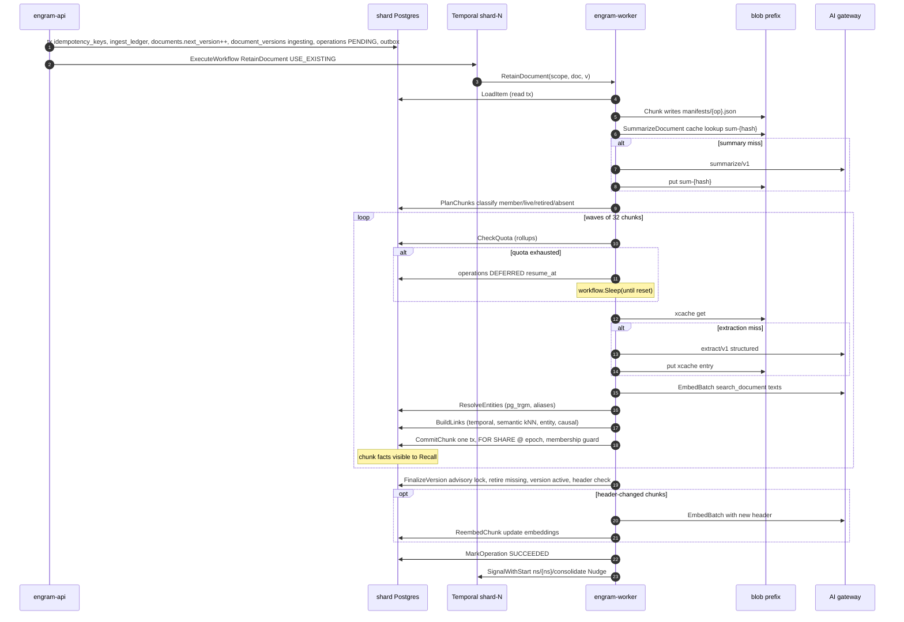
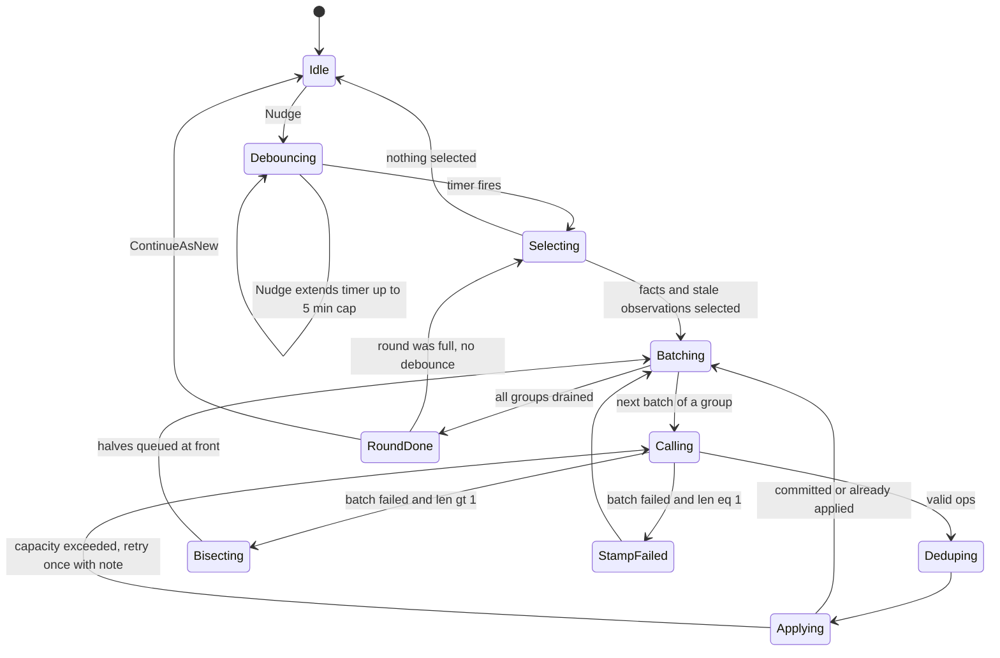
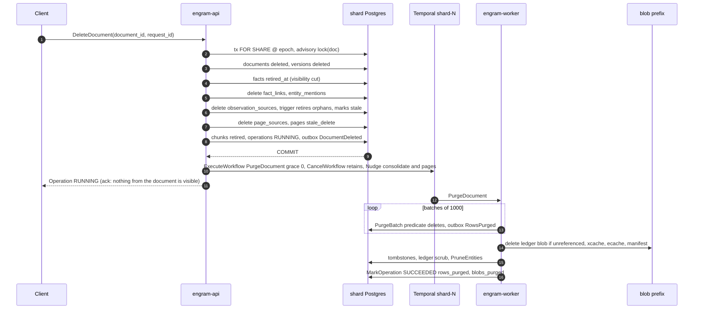

## 5. Pipelines

This section is the runtime behaviour of everything that writes: what runs as a Temporal
workflow versus an activity, what makes each step safe to execute twice, where the epoch fence
is checked, where a transaction begins and ends, which outbox events leave the transaction, and
what a crash at any point leaves behind. Tables are referenced by the names of §3 and messages
by the names of §4; neither DDL nor protos are restated. Every decision that is not already a
row of the register is collected under "New decisions" at the end (numbered `N5-n` so they do
not collide with the `N1…` series of §1–§2).

### 5.0 Conventions shared by every pipeline

**Workflow vs activity.** Workflows are deterministic orchestration: no I/O, no clocks other
than `workflow.Now`, no randomness other than `workflow.SideEffect`. Every activity is a method
on a struct that holds a `router.ShardRouter`; it derives its `ShardHandle` from the
`shard_id` in the workflow input (`ForShard`), never from the catalog (D4). Every workflow input
embeds `workflowv1.NamespaceScope{namespace_id, tenant_id, shard_id, epoch}` and every
workflow sets the Temporal search attributes `NamespaceId`, `TenantId`, `Epoch`,
`OperationKind`, `OperationId` at start (they are what the move drain and the namespace delete
query, §5.4–5.5).

**Fencing.** Every *write* activity opens `store.WithNamespaceTx(write)`, which executes the D2
sequence — `SET LOCAL engram.namespace_id / tenant_id / epoch`, then
`SELECT 1 FROM namespace_ownership WHERE namespace_id=$1 AND epoch=$2 AND state='active' FOR SHARE`.
The row lock is held to commit, so a `Freeze` (§5.5) cannot flip the state under a committing
writer. Outcomes: `active` at the caller's epoch → proceed; `frozen` → `errs.NamespaceFrozen`
(retryable: the freeze lasts seconds); anything else (`incoming`, `moved_out`, missing row,
epoch mismatch) → `errs.WrongShardOrEpoch` (**non-retryable**: the workflow is running against
the wrong shard or a stale epoch and must not be allowed to succeed by retrying). *Read*
activities use `WithNamespaceTx(read)`, which accepts `active` and `frozen`. Two activities
run outside the fence by design and are marked so in their tables: the mover's target-side
writes (fence `state='incoming' AND epoch=e+1`, §5.5) and the admin-role purge of a
`moved_out` namespace (§5.5 Cleanup).

**Retry-policy notation.** `initial / coefficient / max interval / max attempts / non-retryable
error types`. Named policies used in the tables (`ScheduleToClose` bounds the whole retry
chain; `StartToClose` bounds one attempt):

| Policy | initial / coeff / max interval / attempts | Non-retryable | Used for |
|---|---|---|---|
| `P-pure` | — / — / — / 3 | everything (a pure function fails only on a bug) | `Chunk`, `GroupBatches`, `ApplyDeltaOps` |
| `P-db` | 500 ms / 2.0 / 10 s / 10 | `WrongShardOrEpoch`, `Validation`, `IntegrityViolation` | every read/write tx activity |
| `P-frozen` | 1 s / 1.5 / 5 s / unlimited within `ScheduleToClose` | `WrongShardOrEpoch`, `Validation` | write activities that may meet a freeze (`CommitChunk`, `FinalizeVersion`, `ApplyBatch`, `CommitPageVersion`, `PurgeBatch`) — same as `P-db` plus `NamespaceFrozen` treated as retryable with a 10 min `ScheduleToClose` |
| `P-llm` | 2 s / 2.0 / 60 s / 8 | `PermanentLLMError`, `Validation`, `WrongShardOrEpoch` | gateway structured/chat calls |
| `P-embed` | 1 s / 2.0 / 30 s / 8 | `PermanentLLMError`, `Validation` | gateway embed calls |
| `P-blob` | 200 ms / 2.0 / 5 s / 10 | `Validation` | blob get/put/list/delete |
| `P-poll` | 30 s / 1.0 / 30 s / unlimited within `ScheduleToClose` 48 h | `PermanentLLMError` (job rejected) | batch-job polling |
| `P-catalog` | 500 ms / 2.0 / 5 s / 20 | `Validation`, `MovePrecondition` | catalog transactions in the move |
| `P-temporal` | 1 s / 2.0 / 10 s / 10 | `Validation` | activities that call the Temporal client (list/terminate/start) |

**Transaction-boundary column values.** `none` (pure or blob/gateway only), `read tx` (RLS,
`active|frozen`), `write tx` (fenced, `active`), `target tx (incoming)` (move only),
`catalog tx`, `admin tx` (role `engram_maint`, `BYPASSRLS`, used only by the mover's cleanup,
the namespace purge and per-shard sweepers that must enumerate namespaces).

**Operation rows.** Activities update `operations` with absolute values (`state`,
`progress.units_done = <count>`), never relative increments, except inside transactions that
are themselves exactly-once by a membership row (e.g. `CommitChunk`, §5.1.2 step 5f). State
transitions are monotone: `PENDING → RUNNING ⇄ DEFERRED → SUCCEEDED|FAILED|CANCELLED`; an
`UPDATE … WHERE state NOT IN (terminal)` guard makes a late activity from a terminated
workflow harmless.

**Heartbeats and history bounds.** Any activity that can run longer than 30 s heartbeats every
10 s with a resumable progress payload; heartbeat timeout = 30 s. Workflows continue-as-new
before their history reaches 10 k events (retain: every 500 chunks; consolidate: every round;
page refresh: every refresh; purge: every 200 batches; move: never — ≤ 200 events).

**Token accounting (D13).** Every gateway call returns a `Usage`; the activity that owns the
call carries it into the next fenced write transaction of the same pipeline, where it is
inserted as `token_usage_events(namespace_id, usage_key, day, op, model, prompt_tokens,
completion_tokens, cost_micros)` with `usage_key = sha256(activity idempotency key ‖ call
label)` and `ON CONFLICT DO NOTHING`; only a row that was actually inserted increments the
daily rollup `token_usage(day, op, model, …)` in the same statement group. An activity that
paid for a call and then crashed before its commit therefore under-counts by at most one call
per retry, never double-counts (N5-1). Rationale: quotas are enforced from the rollup, so
double counting would defer tenants spuriously; slight under-counting is harmless. Rejected:
counting in the gateway `UsageHook` at call time (double counts on every activity retry).

**Kafka, once for all pipelines.** No pipeline uses Kafka as a control channel, queue or
hand-off. Temporal is the durable orchestrator and the per-shard outbox is the ordered log;
the only Kafka touchpoint is the optional `kafka` sink of the relay (§5.6), which mirrors
outbox rows for external consumers. Each subsection still carries a one-line "Kafka" verdict
so a reader landing there gets the answer.

---

### 5.1 Retain

#### 5.1.1 API handler (`MemoryService.Retain`, unary, per item)

The ack promises durability of the raw input and of the operation, nothing more (D16).

1. **Validate**: `content` ≤ 4 MiB, `document_id` ≤ 256 B, ≤ 32 tags × 64 B, `timestamp`
   parses (default `now()`), `update_mode ∈ {REPLACE, APPEND}`, `entities` hints ≤ 64,
   deadline present, scope `memory.write`. Failures → `INVALID_ARGUMENT` + `ValidationError`.
2. **Rate quota**: `retains_per_min` token bucket, tenant then namespace →
   `RESOURCE_EXHAUSTED` + `QuotaExceeded`. (`llm_tokens_per_day` and `max_facts` are workflow
   concerns, D13.)
3. **Raw body**: `content_hash = sha256(content)`. Bodies > 64 KiB are `Put` to
   `{shard}/{tenant}/{ns}/ledger/{content_hash}` *before* the transaction (N7;
   content-addressed: a retry re-puts the same key; a crash here leaves an orphan blob that
   the weekly orphan sweep of §9 removes). Smaller bodies are stored inline in the ledger row.
4. **One fenced write transaction**, statement order:
   1. `INSERT idempotency_keys(namespace_id, request_id, request_hash, operation_id, expires_at = now() + 24 h) ON CONFLICT (namespace_id, request_id) DO NOTHING`.
      Conflict → read the row: same `request_hash` → return its operation and stop;
      different → `ALREADY_EXISTS` + `OperationConflict{IDEMPOTENCY_KEY_REUSED}`.
   2. `INSERT ingest_ledger(namespace_id, ledger_id uuidv7, document_id, content_hash, raw_inline | raw_key, item_timestamp, context, tags, metadata, entity_hints, update_mode, observation_scope, request_id, operation_id)`.
   3. `INSERT documents(namespace_id, document_id, next_version = 1, current_version = 0, state = 'live') ON CONFLICT (namespace_id, document_id) DO UPDATE SET next_version = documents.next_version + 1 RETURNING next_version AS v, current_version, state`.
      This assigns the **version** under the document's row lock, so versions are dense and
      monotone per document (D8). `state = 'deleted'` → `ABORTED` +
      `OperationConflict{DOCUMENT_PURGING}` (the purge must finish before the id is reused).
      For `APPEND`, `append_base_version = current_version` is recorded on the ledger row.
   4. `INSERT document_versions(namespace_id, document_id, version = v, content_hash, status = 'ingesting', operation_id, ledger_id)`.
   5. `INSERT operations(namespace_id, operation_id, kind = RETAIN_DOCUMENT, state = PENDING, target_id = document_id, request_id, config_snapshot)`.
      A client-supplied `operation_id` that already exists with a different `request_hash`
      → `ALREADY_EXISTS` + `OperationConflict{IDEMPOTENCY_KEY_REUSED}`.
   6. `INSERT outbox(namespace_id, epoch, event_type = OperationSubmitted, payload)`. Commit.
5. **Start the workflow**: `ExecuteWorkflow(RetainDocument, WorkflowID = "ns/{ns}/op/{op}",
   TaskQueue = "shard-{shard}", WorkflowIdReusePolicy = REJECT_DUPLICATE,
   WorkflowIdConflictPolicy = USE_EXISTING, input = {scope, document_id, version = v,
   ledger_id, update_mode, mode = ONLINE, config_snapshot})`. `USE_EXISTING` makes a retry
   after a crash between steps 4 and 5 attach to the running execution instead of failing.
   `SignalWithStart` is **not** used here: there is nothing to signal to a retain (it is used for
   the consolidation and page singletons). Rejected: `ALLOW_DUPLICATE` (a replay after a
   completed run would re-run the version's finalize — harmless but wasteful and confusing).
6. **Return** `Operation{PENDING}`. If step 5 fails after step 4 committed →
   `UNAVAILABLE` + `RetryInfo{1 s}`; the client's retry with the same `request_id` hits step
   4.1 and repeats only step 5. The per-shard `op-sweeper` schedule (N3) starts a workflow for
   any `PENDING` operation older than 2 min without an execution.

`config_snapshot` (≤ 1 KiB: model ids, prompt ids, `chunk.*`, quota keys) is resolved from the
catalog entry at submit time and carried in the workflow input (N5-2). Rationale: workers must
not call the catalog (D4) and a configuration change must apply deterministically to
operations submitted after it, not to a workflow mid-flight. Rejected: workers reading
`namespaces.config` per activity (catalog on the hot path; non-deterministic mid-run changes).

#### 5.1.2 Workflow `RetainDocument`

Input `RetainDocumentInput{scope, document_id, version v, ledger_id, update_mode, mode, config_snapshot, resume{next_chunk, manifest_key, counters}}`.

1. **`LoadItem`** (read tx + blob get): the ledger row (and raw blob), the current active
   version's chunk hash set (delta statistics), and for `APPEND` the base version's body
   (its ledger row). Sets `operations.state = RUNNING, phase = "chunk"`.
2. **`Chunk`** (pure): for `APPEND` the input is `base_body ‖ "\n\n" ‖ new_body`
   (monotonic append: if `append_base_version ≠ current_version` at `LoadItem` time the item
   is still chunked against the recorded base — a concurrent replace is resolved by version
   order in step 7, never by rejecting). Heading-anchored, content-defined boundaries per
   D11 (target 3 000, min 500, max 4 000 chars, no overlap). Output: a manifest
   `[{index, content_hash, heading_path, byte_range, mentioned_at}]` and `document_hash =
   sha256(all chunk hashes)`, written to blob `{prefix}/manifests/{operation_id}.json`; the
   activity result is `{manifest_key, chunk_count}` so the workflow payload stays under 2 KiB
   regardless of document size. Deterministic: a re-execution overwrites the same bytes.
3. **`SummarizeDocument`** (gateway, cached): key
   `{prefix}/xcache/sum-{sha256(document_hash ‖ "summarize/v1" ‖ model)}.json`. Miss →
   `ChatStructured(summarize/v1)` → ≤ 200 chars → blob put. `PermanentLLMError` (content
   policy, schema refusal) is **not fatal**: the summary falls back to the first heading or
   the first 200 chars and the version is flagged `summary_fallback = true`.
4. **`PlanChunks`** (read tx, one query): for every manifest hash, `SELECT content_hash,
   retired_at, extraction_key FROM chunks WHERE namespace_id AND document_id AND content_hash
   = ANY($1)` plus `document_version_chunks` membership for version `v`. Classifies each
   chunk as `member` (already committed for `v` — the restart path), `live` (unchanged:
   membership row only), `retired` (un-retire, no LLM), `stale_extraction` (same hash but an
   older `extraction_key = prompt_version ‖ model ‖ schema_version` than the config
   snapshot's: treated as `absent`, N5-3), or `absent`. Delta retain (D8) is this
   classification. `content_hash = sha256(text)` excludes the contextual header (N6), so a
   changed document summary or heading path never causes re-extraction; the header hash is
   compared at `FinalizeVersion` (step 7) and only triggers re-embedding.
5. **Quota gate + fan-out**, waves of up to 32 chunks in flight, bounded by a workflow-side
   semaphore (the worker's activity slots are shared by every document on the queue, so one
   huge document may not monopolise them — the bound lives in workflow code).
   Before each wave, **`CheckQuota`** (read tx): `llm_tokens_per_day` is enforced entirely
   from the shard-local `token_usage` rollup. The namespace-level limit is exact. The
   *tenant*-level limit is enforced as a **per-namespace share** computed by the catalog and
   carried in `config_snapshot`: `share = tenant_limit × weight(ns) / Σ weight(tenant's
   namespaces)`, weight = `max(live_facts, 1 000)` recomputed daily (N5-4). Shares sum to
   the tenant limit, so the tenant limit is never exceeded; unused share in one namespace
   cannot be borrowed by another (conservative by design). Rationale: workers never call the
   catalog (D4, tightened in D18), and a cross-shard counter would need exactly that.
   Rejected: workers flushing usage to a catalog counter (violates D4); enforcing tenant
   tokens in the API (the API does not see worker usage). `max_facts` is read from the
   `namespace_stats.live_facts` rollup maintained by `CommitChunk`/`FinalizeVersion`/delete
   (tenant-level `max_facts` uses the same share rule).
   Exhausted → `MarkOperation(DEFERRED, DeferredInfo{quota, resume_at, scope})` and
   `workflow.Sleep(until resume_at)` (next UTC midnight for tokens; +1 h for `max_facts`,
   re-checked because deletes may free room); a `Cancel` signal wakes the sleep. Then per
   chunk with hash `h` (the activity idempotency key is `K = (namespace_id, epoch,
   document_id, v, h)` throughout):
   1. **`ExtractChunk`** (blob + gateway): key
      `{prefix}/xcache/{sha256(h ‖ prompt_version ‖ model ‖ schema_version)}.json` (D11).
      Hit → return the cached facts. Miss → `ChatStructured(extract/v1)` with the chunk
      header (`[summary] > [heading path]`) prepended → validate (≤ 40 facts, causal
      indices point to earlier facts, timestamps parse, text ≤ 2 000 chars, language
      preserved) → blob put (same key: idempotent) → return `{facts, usage}`.
      `PermanentLLMError` or validation failure after one repair attempt → returns
      `chunk_failed{reason}` as a *result*, not an error: the workflow records it in
      `operation_errors(operation_id, content_hash, reason)` and continues; the operation
      finishes `SUCCEEDED` with `progress.units_failed > 0` (the proto has no
      `SUCCEEDED_WITH_ERRORS` state; §1.4's mention of one should read this way).
   2. **`EmbedChunk`** (blob + gateway): texts = `search_document: {header}\n{fact.text}`
      for each fact and `search_document: {header}\n{chunk text}`; `EmbedBatch` ≤ 64 texts
      per call, L2-normalised by the client, `halfvec(768)`. Per-namespace embedding cache
      `{prefix}/ecache/{sha256(prefixed text ‖ model ‖ dims)}.f16` (same isolation argument
      as the extraction cache). Results > 256 KiB are spilled to blob and the key returned.
   3. **`ResolveEntities`** (read tx): per extracted entity `{name, type}`: normalise (NFKC,
      collapse whitespace, trim, drop names > 256 chars as extraction artefacts), then
      (a) exact hit in `entity_aliases(namespace_id, alias_norm)`; else (b)
      `SELECT entity_id, canonical_name, similarity(canonical_name_norm, $q) FROM entities
      WHERE namespace_id = $1 AND type = $2 AND canonical_name_norm % $q ORDER BY 3 DESC
      LIMIT 5` with `SET LOCAL pg_trgm.similarity_threshold = 0.3`; accept the best
      candidate at similarity ≥ 0.6 for a matching type, ≥ 0.85 when either side's type is
      `unknown`; else (c) plan a create. Intra-chunk merge: two planned creates of the same
      type with similarity ≥ 0.8 merge into the longer name. Caller hints (`entities` on the
      item) are force-resolved with their given type. **Type match is mandatory**: `person`
      never merges with `organization`, whatever the string similarity. Output per mention:
      `{entity_id | new{canonical, type}, alias}`; the create-or-merge itself happens in
      `CommitChunk` (`INSERT … ON CONFLICT (namespace_id, type, canonical_name_norm) DO UPDATE
      SET mention_count = mention_count + 1 RETURNING entity_id` resolves both cases; aliases
      `ON CONFLICT DO NOTHING`). Rationale for 0.6 over Hindsight's 0.15: trigram similarity
      at 0.15 merges "Ann" with "Anna Ng" and, worse, across tenants' worth of short names
      within a namespace; 0.6 plus the alias table keeps recall for spelling variants.
      Rejected: LLM adjudication of entity merges (cost per chunk, and the extractor already
      resolves coreference in-chunk).
   4. **`BuildLinks`** (read tx, then in memory), per new fact, hard-capped at 60 links:
      *temporal* ≤ 20: live facts of the namespace whose `occurred_start` (or `mentioned_at`
      for undated facts) is within ±24 h, nearest first, weight `max(0.3, 1 − |Δh|/24)`;
      *semantic* k = 10: HNSW kNN over `facts.embedding` (partition-pruned by namespace),
      cosine ≥ 0.75, plus within-chunk pairs computed in memory with the same threshold;
      *entity* ≤ 20: for each entity mention, the 10 most recent other facts mentioning that
      entity, weight 1.0, `entity_id` set; *causal*: `caused_by(target_index)` from the
      extraction, directed, weight 1.0. Links to retired or invalidated facts are never built.
   5. **`CommitChunk`** (fenced write tx), statement order:
      1. `WithNamespaceTx(write)` — ownership `FOR SHARE` at the caller's epoch.
      2. `SELECT state, current_version FROM documents WHERE … FOR SHARE`. `state = 'deleted'`
         → return `aborted{document_deleted}`; `current_version > v` → return `superseded`
         (the workflow skips straight to step 7 — this closes the window in which a slow
         older version could resurrect a chunk the newer version retired).
      3. `SELECT 1 FROM document_version_chunks WHERE (namespace_id, document_id, v, h)` →
         exists → `COMMIT`, return `already` (the exactly-once guard for this transaction).
      4. `INSERT chunks(namespace_id, chunk_id uuidv7, document_id, content_hash = h, index,
         text, header, heading_path, mentioned_at, embedding, extraction_key)
         ON CONFLICT (namespace_id, document_id, content_hash) DO UPDATE SET retired_at = NULL,
         purge_after = NULL, index = EXCLUDED.index, extraction_key = EXCLUDED.extraction_key
         RETURNING chunk_id, (xmax = 0) AS inserted`. `retired` → un-retired here, and
         `UPDATE facts SET retired_at = NULL, purge_after = NULL WHERE chunk_id = … AND
         extraction_key = $current` (facts of an older extraction key stay retired).
      5. If `inserted` or the chunk has no live facts under the current `extraction_key`:
         `INSERT facts(memory_id uuidv7, …, mentioned_at, occurred_start, occurred_end, tags,
         embedding, prompt_version, extraction_key, document_id, chunk_id)`; entities
         (`ON CONFLICT DO UPDATE … RETURNING`); `entity_aliases`; `entity_mentions`;
         `fact_links … ON CONFLICT DO NOTHING`, inserted in `(LEAST(from,to),
         GREATEST(from,to), link_type, entity_id)` order so two concurrent chunks never
         deadlock (undirected types are stored once with `from < to`; `causal` is directed).
      6. `INSERT document_version_chunks(namespace_id, document_id, v, h, chunk_id)`.
      7. `token_usage_events` / `token_usage` for the extract and embed calls (N5-1);
         `UPDATE namespace_stats SET live_facts = live_facts + $n`;
         `UPDATE operations SET progress.units_done = units_done + 1` (safe: step 3 makes
         this transaction run once per `K`).
      8. `INSERT outbox(ChunkCommitted{document_id, v, chunk_id, fact_ids, link_count})`.
         `COMMIT`. **The facts of this chunk are visible to Recall from this instant (D16).**
         The index is `Transactional` (HNSW/BM25 rows written by the same statements).
6. **`ContinueAsNew`** after 500 chunks with `resume{next_chunk, manifest_key, counters}`;
   the new run's `PlanChunks` sees the committed membership rows and never re-extracts.
7. **`FinalizeVersion`** (fenced write tx) — the per-document serialisation point:
   1. ownership `FOR SHARE`.
   2. `SELECT pg_advisory_xact_lock(hashtextextended(namespace_id || '/' || document_id, 0))`.
   3. `SELECT current_version AS c, state FROM documents … FOR UPDATE`. `state = 'deleted'`
      → mark the version `cancelled`, operation `CANCELLED{document_deleted}`, commit, return.
   4. **Case `v > c` (this version wins):** `UPDATE chunks SET retired_at = now(),
      purge_after = now() + 1 h WHERE namespace_id AND document_id AND retired_at IS NULL AND
      content_hash NOT IN (SELECT content_hash FROM document_version_chunks WHERE version =
      v)`; `UPDATE facts SET retired_at = now(), purge_after = now() + 1 h WHERE chunk_id IN
      (those)` in the same statement group (denormalised `retired_at`, D8). `fact_links`,
      `entity_mentions` and `observation_sources` of retired facts are **kept** until the
      purge (§5.4): recall filters `retired_at IS NULL` on the fact side of every join, so
      they are invisible, and keeping them makes un-retire within the 1 h grace free.
      `documents.current_version = v`; `document_versions(v).status = 'active'`,
      `document_versions(c).status = 'superseded'`; `namespace_stats.live_facts` adjusted;
      outbox `DocumentVersionActivated{document_id, v, retired_chunk_ids, retired_fact_ids}`
      + `FactsRetired`. **Header check (N6)**: `SELECT content_hash FROM chunks WHERE
      namespace_id AND document_id AND retired_at IS NULL AND header_hash <> $new_header_hash`
      for the member chunks → returned as `reembed_hashes` (the chunk text is unchanged, so
      extraction is not repeated; only the header-prefixed embeddings are stale). Commit.
   5. **Case `v ≤ c` (a higher version already finalised, or a replay):** run the *same*
      retire statement (it retires exactly the chunks this run committed that the current
      version does not contain, and can never un-retire anything), set
      `document_versions(v).status = 'superseded'` unless already terminal; commit; the
      operation is marked `SUCCEEDED` with `document_version = c` and `superseded_by = c` (no
      re-embed: the current version's headers are its own).
   6. If any chunk was retired: `ExecuteChildWorkflow(PurgeDocument, id =
      "ns/{ns}/purge/{document_id}/{v}", grace = 1 h, ParentClosePolicy = ABANDON)`.
8. **`ReembedChunk`** for every hash in `reembed_hashes`, ≤ 32 in flight: `EmbedChunk` with
   the new header, then a fenced write tx `UPDATE chunks SET embedding, header, header_hash`
   and `UPDATE facts SET embedding WHERE chunk_id AND retired_at IS NULL`, idempotent by
   `(K, new header_hash)` (a re-run rewrites identical vectors). Then **`MarkOperation`** →
   `SUCCEEDED` with `OperationResult{document_version = v, facts_written, chunks_reused}`.
   The version is active from step 7 (D16); `SUCCEEDED` is delayed by the re-embed so the
   read barrier also covers fresh embeddings.
9. **Nudge consolidation**: `SignalWithStart("ns/{ns}/consolidate", Nudge{operation_id,
   facts_written})` (D11; §5.2).

**Per-document serialisation, stated precisely (D8).** Versions are assigned in the API
transaction under the `documents` row lock, so they are monotone per document. Two
`RetainDocument` executions for versions `v₁ < v₂` of the same document may run steps 1–6
concurrently: their `CommitChunk` transactions touch shared chunk rows keyed by content hash
through `ON CONFLICT`, and their membership rows are per version. `FinalizeVersion` serialises
on the Postgres advisory lock keyed by `(namespace_id, document_id)`; whichever finalises
first or second, the **higher version wins**: a lower version finalising later only retires
its own surplus chunks and marks itself superseded, and a lower version still committing after
the higher one finalised is told `superseded` by `CommitChunk` step 2 and stops. The same
advisory lock is taken by the document delete cascade (§5.4), so a delete and a finalise
cannot interleave. Rejected: (a) a long-lived per-document mutex workflow
`ns/{ns}/doc/{document_id}` — one extra Temporal history per document (millions), a signal
round-trip per version, and one more thing to drain during a move; (b) strict serialisation
(`v₂` waits for `v₁`) — doubles latency for rapid re-saves for no gain, since the extraction
cache already makes the concurrent waste zero LLM calls (each distinct chunk hash is extracted
once) and only embedding/commit work is duplicated.

**Per-activity timeouts.**

| Activity | StartToClose | ScheduleToClose | Heartbeat | Retry |
|---|---|---|---|---|
| `LoadItem` | 60 s | 10 min | — | `P-db` |
| `Chunk` | 60 s | 5 min | — | `P-pure` |
| `SummarizeDocument` | 120 s | 6 h | 10 s | `P-llm` |
| `PlanChunks` | 30 s | 10 min | — | `P-db` |
| `CheckQuota` | 30 s | 10 min | — | `P-db` |
| `ExtractChunk` | 120 s | 6 h | 10 s | `P-llm` |
| `EmbedChunk` | 60 s | 6 h | 10 s | `P-embed` |
| `ResolveEntities` | 30 s | 10 min | — | `P-db` |
| `BuildLinks` | 60 s | 10 min | — | `P-db` |
| `CommitChunk` | 30 s | 10 min | — | `P-frozen` |
| `FinalizeVersion` | 60 s | 10 min | — | `P-frozen` |
| `ReembedChunk` | 60 s | 6 h | 10 s | `P-embed` then `P-frozen` for its write tx |
| `MarkOperation` | 10 s | 10 min | — | `P-db` |

The workflow has no `WorkflowExecutionTimeout` (a deferred operation may legitimately wait a
day); `WorkflowRunTimeout = 7 d` per continue-as-new run.

#### 5.1.3 Step table

| Step | Workflow or Activity | Idempotency key | Retry policy | Fencing check | Transaction boundary | Outbox events |
|---|---|---|---|---|---|---|
| API validate + quota | handler | — | client retry | authz interceptor resolves shard+epoch | none | — |
| Raw blob put (> 64 KiB) | handler | `ledger/{sha256(content)}` (N7) | client retry | — | none | — |
| Ledger + version + operation | handler | `(namespace_id, request_id)`; `(namespace_id, operation_id)` | client retry with same `request_id` | `FOR SHARE` active @ epoch | write tx | `OperationSubmitted` |
| Start workflow | handler | workflow id `ns/{ns}/op/{op}` (`USE_EXISTING`) | client retry; op-sweeper N3 | — | none | — |
| `LoadItem` | activity | `(ns, epoch, doc, v)` | `P-db` | read fence | read tx | — |
| `Chunk` | activity | `(ns, epoch, doc, v)` → same manifest bytes | `P-pure` | none | none | — |
| `SummarizeDocument` | activity | xcache `sum-…` key | `P-llm` | none | none | — |
| `PlanChunks` | activity | `(ns, epoch, doc, v)` | `P-db` | read fence | read tx | — |
| `CheckQuota` | activity | `(ns, epoch, doc, v, wave)` | `P-db` | read fence | read tx | — |
| `ExtractChunk` | activity | xcache key `sha256(h ‖ prompt ‖ model ‖ schema)` | `P-llm` | none | none | — |
| `EmbedChunk` | activity | ecache key per text | `P-embed` | none | none | — |
| `ResolveEntities` | activity | `K` | `P-db` | read fence | read tx | — |
| `BuildLinks` | activity | `K` | `P-db` | read fence | read tx | — |
| `CommitChunk` | activity | `K` via `document_version_chunks` | `P-frozen` | `FOR SHARE` active @ epoch + document state | write tx | `ChunkCommitted` |
| `FinalizeVersion` | activity | `(ns, epoch, doc, v)` + advisory lock | `P-frozen` | `FOR SHARE` active @ epoch | write tx | `DocumentVersionActivated`, `FactsRetired` |
| `ReembedChunk` (N6) | activity | `(K, header_hash)` | `P-embed` / `P-frozen` | `FOR SHARE` active @ epoch | write tx | `ChunkReembedded` |
| `MarkOperation` SUCCEEDED | activity | `(ns, epoch, op)` monotone state | `P-db` | `FOR SHARE` active @ epoch | write tx | `OperationFinished` |
| Nudge consolidate | workflow | signal is idempotent (debounced) | Temporal | — | none | — |

#### 5.1.4 Sequence

#### 5.1.5 Failure and crash scenarios

| Scenario | What happens | Net effect |
|---|---|---|
| API crashes (or `ExecuteWorkflow` fails) after the tx commits | The client sees `UNAVAILABLE` + `RetryInfo{1 s}` (N3: the ack is never weakened); its retry with the same `request_id` → idempotency hit → only step 5 repeats; if the client never retries, the per-shard `shard/{id}/op-sweeper` schedule (60 s) starts the workflow for any `PENDING` operation older than 2 min | exactly one execution |
| Worker dies during `ExtractChunk` after the gateway answered, before the blob put | Temporal retries on another worker; cache miss → the call is paid twice (bounded by one extra call per crash) | same facts (temperature 0 + schema; the cache key does not depend on the run) |
| Worker dies inside `CommitChunk` | Transaction rolled back; retry re-runs; membership guard makes a re-run after a *committed* attempt a no-op | exactly-once commit per `(v, h)` |
| Gateway returns 429/5xx for an hour | `P-llm` backs off to 60 s intervals for up to 6 h (`ScheduleToClose`); operation stays `RUNNING`; after 6 h the chunk is recorded in `operation_errors`, `units_failed++`, the rest of the document proceeds | no data loss; `engramctl op retry` re-runs failed chunks |
| Gateway returns 4xx (schema refusal, content policy) | `PermanentLLMError` → one repair attempt → `chunk_failed` result; the chunk text is still stored and searchable through the chunk arm (D10) | partial extraction, visible in `progress.units_failed` |
| Tenant daily token quota exhausted mid-document | Next wave's `CheckQuota` → `DEFERRED` with `resume_at`; already-committed chunks stay visible (per-chunk visibility is the documented model) | resumes at window reset |
| Namespace frozen by a move during `CommitChunk` | Transaction gets `NamespaceFrozen` → `P-frozen` retries; the mover terminates the workflow within the freeze window and re-executes it on the target with the same id (§5.5 Restart); the new run's `PlanChunks` skips committed chunks | no duplicate facts (membership rows moved with the namespace) |
| Stale execution still running on the source after cutover | Its next write meets `moved_out`/epoch mismatch → `WrongShardOrEpoch` (non-retryable) → workflow `FAILED`; the operation row on the target was already re-driven by the restarted execution | no write lands on the wrong shard |
| Two versions `v₁ < v₂` submitted 1 s apart | Both run; `v₂` finalises → `current_version = v₂`; `v₁`'s remaining `CommitChunk`s return `superseded`; `v₁`'s finalise retires only its surplus chunks | higher version wins; no resurrection |
| Document deleted mid-retain | Cascade sets `documents.state = 'deleted'` and cancels the workflow; a `CommitChunk` racing the cascade sees `deleted` (row lock ordering: the cascade holds the `documents` row) → `aborted`; `FinalizeVersion` marks the version `cancelled` | nothing from the document is visible after the delete ack |
| `CancelOperation` | Cooperative at the next wave boundary; committed chunks stay; `FinalizeVersion(abort)` marks the version `cancelled` and retires chunks that belong only to `v` (1 h grace) | consistent partial state, reported `CANCELLED` |

#### 5.1.6 Throughput and batch mode

`chunks/s per worker = min(32 / L_extract, R_extract_rpm / 60)` where 32 is the per-workflow
fan-out (and the worker's activity slots, set to 64 so two documents saturate a worker),
`L_extract ≈ 3–6 s` (A-3) and `R_extract_rpm` the gateway's per-model cap. Unconstrained:
5–10 chunks/s/worker ≈ 15–30 k chunks/h ≈ 60–120 k facts/h. A 600 RPM cap yields 10 chunks/s
cell-wide regardless of worker count; embedding (≤ 64 texts per call, ≈ 100 ms) and Postgres
(`CommitChunk` ≈ 15 ms) are not the bottleneck.

**`RetainBackfill`** (workflow `ns/{ns}/backfill/{backfill_id}` on `shard-{id}`, started by
`engramctl backfill` or by `Retain{priority = BATCH}`) exists to move extraction off the RPM
cap and onto the gateway batch API (~50 % cheaper). It does **not** re-implement retain: it
pre-warms the two caches and then runs ordinary `RetainDocument` children that hit them.

1. For each operation in the batch (≤ 10 000): `LoadItem` + `Chunk` (≤ 32 parallel) →
   manifests.
2. `PlanCacheMisses` (blob `Head` on every xcache key, batched 1 000 per activity) → the list
   of `(xcache_key, prompt input)` pairs.
3. `SubmitExtractBatch`: idempotent through the shard table
   `batch_jobs(namespace_id, batch_key = sha256(sorted xcache keys), job_id, kind)` — an
   existing row returns its `job_id`; otherwise `SubmitBatch` (≤ 10 k requests, `custom_id =
   xcache_key`, model + `extract/v1`) and insert. Cache keys are identical to the online path.
4. `PollBatch` (`P-poll`, heartbeat, `ScheduleToClose` 48 h).
5. `ApplyBatchResults`: stream results; validate each exactly as `ExtractChunk` does; blob put
   under `custom_id`; failures stay cache misses (the child will extract them online); usage
   per item recorded with `usage_key = sha256(job_id ‖ custom_id)`.
6. Steps 2–5 again for embeddings (`custom_id = ecache_key`).
7. `ExecuteChildWorkflow(RetainDocument, id = "ns/{ns}/op/{op}")` for each operation, ≤ 8
   concurrent: every chunk is a cache hit, so the children make no LLM calls and run at
   Postgres speed.

Rejected: a separate batch-only ingest path writing facts directly (two code paths for the
same invariants; the cache-warming design keeps one `CommitChunk`).

**Kafka: not used.** Retain is one durable Temporal workflow per operation; a queue in front of
it would add a second durable store to the write path (D6).

---

### 5.2 Consolidation

#### 5.2.1 Trigger and workflow shape

Workflow `Consolidate`, id `ns/{namespace_id}/consolidate`, queue `shard-{shard_id}` — one
long-lived execution per namespace, started and poked by `SignalWithStart(Nudge{operation_id,
facts_written})` (D11). Debounce: the first `Nudge` arms a 30 s timer; later nudges extend it
by 30 s up to a cap of 5 min after the first, so a continuous ingest stream still consolidates
every 5 min instead of never. A second source of nudges is the per-shard nightly sweep
`shard/{id}/consolidate-sweep` (Temporal schedule, 02:00 UTC + `shard_id` minutes), which runs
one admin-tx activity — `SELECT namespace_id FROM facts WHERE consolidated_at IS NULL AND
retired_at IS NULL AND invalidated_at IS NULL GROUP BY 1` `UNION` the namespaces with
`stale` observations — and signals each namespace's singleton with `Nudge{reason = sweep}`
(N5-5). Rejected: one Temporal schedule per namespace (10 000+ schedules for a nightly poke; a
namespace that never ingests would still be polled).

The execution `ContinueAsNew`s after every round, carrying `{pending_nudge, debounce_until,
rounds_done}` and draining its signal channel first (signals received during a round are not
lost). An idle execution costs nothing; a namespace with no facts never starts one.

#### 5.2.2 One round

1. **`SelectRound`** (read tx): ≤ 100 live unconsolidated facts — `WHERE consolidated_at IS
   NULL AND retired_at IS NULL AND invalidated_at IS NULL AND (consolidation_failed_at IS NULL
   OR consolidation_failed_at < now() − 7 d) ORDER BY created_at LIMIT 100` (D12) with their
   `observation_scope` and tags — plus ≤ 25 stale observations (`stale = true`, `retired_at
   IS NULL`, `ORDER BY stale_since`) with their remaining live sources. Empty → the round ends
   without LLM calls.
2. **`GroupBatches`** (pure, in-workflow): group key = *observation scope* — `combined`
   (default): the sorted tag set of the fact; `shared`: the empty set; `per_tag`: one group
   per tag (a fact appears in several); `custom`: the item's explicit tag lists (§4
   `RetainItem.observation_scope`; an item without the field is `combined`, A-P1). Facts of
   different scopes **never share an LLM call** (kept from Hindsight: it is the boundary that
   stops a `user:alice`-tagged fact from shaping a `user:bob` belief). Within a group,
   batches of 8 in `created_at` order; stale observations form separate batches of ≤ 8 with
   kind `stale`. Groups run in parallel ≤ 4; batches within a group run sequentially because
   consecutive batches may update the same observation.
3. Per batch:
   1. **`FindCandidates`** (read tx): for each fact's stored embedding, HNSW top-10 over the
      current `observation_versions` of live observations in the same scope (`ALL_STRICT` on
      the scope tags when scoped, `ANY` for `shared`); union, ranked by max cosine, top-10
      (D12). Returns `{observation_id, current text, source ids, proof_count}` plus the
      scope's live observation count against `max_observations_per_scope` (default 2 000,
      config `consolidate.max_observations_per_scope`, A-P2; `−1` = unlimited).
   2. **`ConsolidateBatch`** (gateway, `consolidate/v1`, temperature 0, `models.consolidate`):
      input = the facts (id, text, mentioned_at, occurred window, tags) and the candidate
      observations (id, text, sources); output = `{creates[], updates[], deletes[]}` with
      `source_fact_ids`, `quotes`, `reason` per op (§6.3). **Validation** (in the activity,
      before returning): every cited `source_fact_id` ∈ batch ∪ candidates' source sets (a
      quote may cite a candidate's existing source — that is how an update keeps old
      evidence), unknown id → the *op* is rejected, not the batch; `update`/`delete` must
      target a shown candidate; a `create` or `update` with an empty valid source list is
      rejected; every quote must be a substring (whitespace-normalised) of the cited fact's
      text, else the quote is dropped (the op survives); text ≤ 1 000 chars; ≤ 16 ops per
      response; a `create` whose whitespace-collapsed text equals a shown observation or
      another op's text is dropped (exact-text dedup). A response in which *every* op was
      rejected, or a schema failure, is a batch failure → returned as a result
      `{failed: reason}`; transient gateway errors retry under `P-llm`.
   3. **Bisect** (workflow logic): batch failure with `len > 1` → split at `len/2`, push both
      halves to the front of the group's queue (8 → 4 → 2 → 1, D12); `len = 1` and still
      failing → **`StampFailed`** (write tx: `facts.consolidation_failed_at = now()`); the
      fact is retried after 7 days (a newer prompt version may succeed; N5-6). Rejected:
      stamping `consolidated_at` on failure (hides the fact from every future round).
   4. **`Dedup`** (blob + gateway + read tx): embed each `create`/`update` text
      (`search_document:` prefix, ecache); kNN over live current observation versions in the
      scope, excluding the op's own target; a twin at cosine ≥ 0.97 → `dedup_adjudicate/v1`
      (§6.4) → `merge` rewrites the op: a `create` becomes `update(twin, merged text, sources
      ∪ twin.sources)`; an `update(X)` with twin `Y` becomes `update(Y, merged, sources ∪) +
      delete(X)`. **Adjudication rule**: an LLM failure, a schema error or a `keep` leaves the
      op unchanged — never merge silently; if `X` and `Y` are each other's twins, the
      lexicographically smaller `observation_id` survives (deterministic across retries).
   5. **`ApplyBatch`** (fenced write tx) — statement order:
      1. ownership `FOR SHARE` at the caller's epoch.
      2. `INSERT consolidation_applied(namespace_id, batch_key, op_key, op_index, kind,
         observation_id) ON CONFLICT (namespace_id, op_key) DO NOTHING` for every op, with
         `batch_key = sha256(sorted fact ids ‖ prompt_version ‖ model)` and `op_key =
         sha256(batch_key ‖ op_index)` (D12). Zero rows for every op → the batch was applied
         by an earlier attempt → `COMMIT`, return `already`.
      3. **Re-validate against current state**: cited facts must still be live (a delete or
         invalidate may have landed since `SelectRound`); dead ids are dropped from source
         lists; an op left with no sources is skipped and recorded as such; an
         `update`/`delete` whose target is now retired is skipped.
      4. `create`: `INSERT observations(observation_id uuidv7, scope_tags, current_version = 1,
         proof_count)`; `INSERT observation_versions(observation_id, version = 1, text,
         embedding, effective_at, prompt_version, model, reason, op_key)`;
         `INSERT observation_sources(observation_id, memory_id, quote, added_version = 1)`.
         `update`: `INSERT observation_versions(… version = current_version + 1 …)`;
         `DELETE FROM observation_sources WHERE observation_id = $1 AND memory_id <> ALL($new)`;
         `INSERT observation_sources … ON CONFLICT DO NOTHING`; `UPDATE observations SET
         current_version = v + 1, proof_count = (count), stale = false, stale_since = NULL`.
         `delete`: `UPDATE observations SET retired_at = now(), retired_reason = $reason`;
         `DELETE FROM observation_sources WHERE observation_id = $1` (the trigger would also
         retire it; the explicit update records the reason).
         **`effective_at` (D9, refined N5-7)**: `effective_at(v) = max(max(mentioned_at) over
         the version's cited sources, effective_at(v − 1))` — monotone across versions. The
         clamp is required, not cosmetic: the LLM that wrote `v` saw the text of `v − 1`,
         which may carry information from later-mentioned sources; without the clamp a
         version citing only older facts would become visible at an `as_of` earlier than the
         knowledge it was derived from, and the §7 `as_of` leak-freedom argument would not
         hold.
      5. `UPDATE facts SET consolidated_at = now() WHERE memory_id = ANY($batch) AND
         consolidated_at IS NULL` — the stamp and the writes it accounts for commit together
         (kept from Hindsight).
      6. `UPDATE pages SET stale_write = true, stale_seq = stale_seq + 1 WHERE
         engram_tag_match(tag_filter, $touched_scope_tags)` (§5.3; `engram_tag_match` is the
         SQL twin of the Lean-verified decision procedure, §7).
      7. `token_usage_events` / `token_usage` for the consolidate and adjudicate calls.
      8. outbox `ObservationCreated`, `ObservationVersionAdded`, `ObservationRetired`,
         `FactsConsolidated{memory_ids}`. `COMMIT`.
      **Capacity**: if after step 4 the scope's live observation count exceeds
      `max_observations_per_scope`, the transaction is rolled back and the activity returns
      `capacity_exceeded`; the workflow re-runs `ConsolidateBatch` once with the capacity note
      in the prompt ("at capacity: only updates and deletes are allowed"); a second overflow
      stamps the facts `consolidated_at` with `consolidation_note = 'capacity'` (no
      observation is created; the facts remain recallable).
4. **Round end**: `MarkRound` (write tx: `namespace_stats.consolidated_through = now()`,
   `operations` row of kind `CONSOLIDATE` for observability of `consolidation_lag`);
   `SignalWithStart("ns/{ns}/page/{page_id}", Nudge{reason = consolidation})` for every page
   whose `refresh_policy.after_consolidation` is set and whose `stale_write` was raised in
   this round (§5.3); if the round selected a full 100 facts, the next round starts
   immediately (no debounce); else the execution goes back to waiting. `ContinueAsNew`.

**Stale observations (reconsolidation).** A delete, invalidate or restore marks an observation
`stale` (§5.4). A `stale` batch shows the LLM the stale observation with its *remaining* live
sources and quotes and permits only `update` (rewrite to what the remaining evidence supports)
or `delete`; removed sources are not shown, so they cannot be cited (validation rule 3.2). The
apply path clears `stale`. An observation whose last source disappears never reaches this
path: the DB trigger retires it inside the deleting transaction.

**Orphan trigger (D12).** `AFTER DELETE ON observation_sources REFERENCING OLD TABLE AS removed
FOR EACH STATEMENT`: `UPDATE observations SET retired_at = now(), retired_reason = 'orphan'
WHERE observation_id IN (SELECT DISTINCT observation_id FROM removed) AND NOT EXISTS (SELECT 1
FROM observation_sources s WHERE s.observation_id = observations.observation_id)`; then
`UPDATE observations SET stale = true, stale_since = coalesce(stale_since, now()) WHERE
observation_id IN (removed) AND retired_at IS NULL`. It fires inside whichever transaction
deleted the sources — the delete cascade, `ApplyBatch`, or the purge — so "no observation
cites a deleted fact after the ack" is a property of a single commit.

**Caps.** ≤ 100 facts per round → ≤ 13 batches + ≤ 4 stale batches ≈ 20 LLM calls ≈ 60–120 s
per round; ≤ 4 groups in parallel; `max_observations_per_scope` per scope; ≤ 16 ops per
response; ≤ 1 000 chars per observation; `WorkflowRunTimeout` 24 h per continue-as-new run.

#### 5.2.3 Step table

| Step | Workflow or Activity | Idempotency key | Retry policy | Fencing check | Transaction boundary | Outbox events |
|---|---|---|---|---|---|---|
| Nudge / debounce | workflow (signal handler + timer) | workflow id `ns/{ns}/consolidate` | Temporal | — | none | — |
| Nightly sweep | schedule `shard/{id}/consolidate-sweep` → activity | `(shard, day)` | `P-db` | admin tx (read only) | admin tx | — |
| `SelectRound` | activity | `(ns, epoch, round_no)` — re-selection returns the same facts until stamped | `P-db` | read fence | read tx | — |
| `GroupBatches` | workflow (pure) | deterministic from selection | `P-pure` | — | none | — |
| `FindCandidates` | activity | `batch_key` | `P-db` | read fence | read tx | — |
| `ConsolidateBatch` | activity | `batch_key` (LLM call not cached: results depend on candidates) | `P-llm`; batch failure → bisect | none | none | — |
| `StampFailed` | activity | `(ns, epoch, memory_id)` | `P-db` | `FOR SHARE` active @ epoch | write tx | `FactConsolidationFailed` |
| `Dedup` | activity | `op_key` | `P-embed`/`P-llm`; failure → `keep` | read fence | read tx | — |
| `ApplyBatch` | activity | `op_key` per op via `consolidation_applied` | `P-frozen` | `FOR SHARE` active @ epoch | write tx | `ObservationCreated`, `ObservationVersionAdded`, `ObservationRetired`, `FactsConsolidated` |
| `MarkRound` | activity | `(ns, epoch, round_no)` | `P-db` | `FOR SHARE` active @ epoch | write tx | `ConsolidationRoundDone` |
| Page nudges | workflow | signal debounced by the page workflow | Temporal | — | none | — |

#### 5.2.4 State diagram

#### 5.2.5 Failure and crash scenarios

| Scenario | What happens | Net effect |
|---|---|---|
| Worker dies after `ApplyBatch` committed, before the activity result is recorded | Retry re-runs `ApplyBatch`; every `op_key` conflicts in `consolidation_applied` → `already` | exactly-once effect (the §7 `Consolidation.tla` property) |
| Worker dies during the LLM call | Retry repeats the call (not cached, temperature 0); a different but valid answer is possible; `batch_key` is unchanged, so `op_key`s are unchanged — but the op *contents* may differ from a half-applied earlier attempt? Impossible: application is one transaction per batch, so an earlier attempt either applied every op or none | at most one application per batch |
| Fact deleted between `SelectRound` and `ApplyBatch` | Re-validation drops the id; an op left without sources is skipped; the delete's own transaction already removed any `observation_sources` row citing it | no observation ever cites a deleted fact |
| Model returns ids not shown | The op is rejected in validation; if every op is rejected the batch bisects; a persistent single-fact failure stamps `consolidation_failed_at` | bounded LLM spend (≤ 15 calls for a batch of 8) |
| Near-duplicate observations created by two parallel groups | Groups are different scopes by construction, so their observations are not duplicates *within a scope*; within a group, batches are sequential and dedup sees earlier creates | duplicates only across scopes, which is intended |
| Namespace frozen during `ApplyBatch` | `P-frozen` retries until the mover terminates the singleton and restarts it by workflow id on the target (D5 step 5–6); the restarted execution re-selects the same unstamped facts and `consolidation_applied` rows moved with the namespace | no double application |
| Scope at capacity | Retry with the capacity note; second overflow stamps the facts with `consolidation_note = 'capacity'` | facts stay recallable; no observation |
| 10 000 facts arrive in one hour | Rounds of 100 run back-to-back without debounce (≈ 2 min each); `consolidation_lag` on operations exposes the backlog | eventual, no bound promised (D16) |

**Kafka: not used.** The singleton workflow plus the outbox already give a per-namespace,
ordered, durable trigger; a Kafka topic would add a consumer group for a job that is
inherently serialised per namespace.

---

### 5.3 Page refresh (phase 3)

#### 5.3.1 Triggers and staleness (D12)

A page (`pages(namespace_id, page_id, name, source_query, tag_filter, refresh_policy,
current_version, stale_write, stale_delete, stale_seq)`) is refreshed by the workflow
`PageRefresh`, id `ns/{namespace_id}/page/{page_id}`, queue `shard-{id}`, driven by
`SignalWithStart(Nudge{reason ∈ {consolidation, cron, manual, delete}, operation_id?})`.

| Trigger | Who sends it | Condition |
|---|---|---|
| After consolidation | `Consolidate` round end (§5.2 step 4) | `refresh_policy.after_consolidation` and the page's `stale_write` was raised by this round (its `tag_filter` matched a touched scope, evaluated by `engram_tag_match` inside `ApplyBatch`) |
| Cron | per-shard schedule `shard/{id}/page-cron` every 5 min (admin tx: `SELECT namespace_id, page_id FROM pages WHERE cron_next_due <= now()`) | `refresh_policy.cron` set; nudge only when `stale_write OR stale_delete` unless `refresh_policy.force_on_cron` |
| Manual | `PageService.RefreshPage` (creates an `operations` row of kind `REFRESH_PAGE`) | always |
| Delete | delete cascade / invalidate (§5.4) | `refresh_policy.on_delete = immediate` (default true) — otherwise the page waits for cron |

`stale_write = true` means "evidence matching my filter changed since my last refresh";
`stale_delete = true` means "something I cite was retired or invalidated" — the second is
the one Hindsight cannot detect (deletes leave no write artefact there). Both flags are set
with `stale_seq = stale_seq + 1`. A refresh captures `stale_seq` at evidence-gather time and
clears the flags only with `WHERE stale_seq = $captured`; a mark that landed during the
refresh leaves the page stale and a follow-up refresh runs. Debounce 60 s;
`refresh_policy.min_interval` (default 10 min) is honoured by sleeping until
`last_refreshed_at + min_interval` (manual refreshes bypass it).

#### 5.3.2 Steps

1. **`LoadPage`** (read tx + blob get): page row, current `page_versions` row and its markdown
   (`{prefix}/pages/{page_id}/v{n}.md`), `page_sources`, `stale_seq`.
2. **`GatherEvidence`** (read tx, no LLM): `recall.Planner` over `source_query` with the
   page's `tag_filter`, `as_of = now()`, `prefer_observations = true`, budget `mid`,
   `max_tokens = 2 × page.max_tokens`. Diff against `page_sources`: **added** = retrieved
   ids not in sources; **changed** = cited observations whose `current_version` advanced
   (old text and new text are both shown); **removed** = cited ids that are now retired or
   invalidated. Cited-but-not-retrieved live sources are *kept* ("absence is not
   contradiction"). If all three sets are empty and no flag is set → `NoChange`, no LLM call,
   no version.
3. **`DeltaEdit`** (gateway, `page_delta/v1`, `models.reflect`, temperature 0.2): input =
   the current markdown parsed into a structured document (sections by heading; blocks with
   stable ids `b{sha256(normalised block text)[:8]}`), the three evidence sets, the page
   `source_query`; output = `{operations: [replace_section | append_block | remove_block |
   rename_section]}` with `cites[]` per added/replaced block (§6.6). **Validation**: every
   `section`/`block_id` exists; ≤ 40 ops; rendered length ≤ 2 × (previous + added evidence)
   tokens; every `cite` ∈ added ∪ changed ∪ kept sources; a `remove_block` must name a
   block that cites a removed/changed source or be justified by a `changed` source (the
   Hindsight refutation threshold, enforced structurally). Failure → one retry with the
   validation errors appended; second failure → step 5.
4. **`ApplyDeltaOps`** (pure): apply ops to the structured document, render markdown,
   compute `page_sources' = (sources − removed) ∪ cites`. Unchanged blocks stay
   byte-identical.
5. **`FullRebuild`** fallback (gateway, `page_full/v1`): synthesis from all live evidence
   (kept ∪ added ∪ changed), same output validation minus the block references; used when
   delta validation failed twice, when there is no baseline (first version), or when
   `source_query` changed since the last version.
6. **`CommitPageVersion`** (blob put, then fenced write tx): put
   `{prefix}/pages/{page_id}/v{n+1}.md` (idempotent key); `INSERT page_versions(page_id,
   version = n + 1, markdown_blob_key, effective_at, prompt_version, model, based_on_seq,
   mode = delta|full) ON CONFLICT (namespace_id, page_id, version) DO NOTHING` — zero rows
   → a previous attempt committed → read it and return; `DELETE/INSERT page_sources`;
   `UPDATE pages SET current_version = n + 1, last_refreshed_at = now(), stale_write =
   false, stale_delete = false WHERE stale_seq = $captured` (else leave the flags);
   `token_usage_events`; `operations` (manual) → `SUCCEEDED{page_version}`; outbox
   `PageVersionCreated{page_id, version}`. `effective_at = max(effective_at of cited
   observation versions, mentioned_at of cited facts, effective_at(n))` — monotone, same
   argument as N5-7 (the model saw the previous text).
7. `ContinueAsNew` with `{pending_nudge}`.

#### 5.3.3 Step table

| Step | Workflow or Activity | Idempotency key | Retry policy | Fencing check | Transaction boundary | Outbox events |
|---|---|---|---|---|---|---|
| Nudge / debounce / min-interval | workflow | workflow id `ns/{ns}/page/{page_id}` | Temporal | — | none | — |
| `LoadPage` | activity | `(ns, epoch, page_id, n)` | `P-db` + `P-blob` | read fence | read tx | — |
| `GatherEvidence` | activity | `(ns, epoch, page_id, n, stale_seq)` | `P-db` | read fence | read tx | — |
| `DeltaEdit` | activity | `sha256(page_id ‖ n ‖ evidence digest ‖ prompt_version)` (not cached) | `P-llm`; validation failure → retry once → full | none | none | — |
| `ApplyDeltaOps` | activity (pure) | deterministic | `P-pure` | — | none | — |
| `FullRebuild` | activity | as `DeltaEdit` | `P-llm` | none | none | — |
| `CommitPageVersion` | activity | `(ns, page_id, n + 1)` unique | `P-blob` then `P-frozen` | `FOR SHARE` active @ epoch | write tx | `PageVersionCreated` |

#### 5.3.4 Sequence

#### 5.3.5 Failure and crash scenarios

| Scenario | What happens | Net effect |
|---|---|---|
| Crash after the blob put, before the tx | Retry re-puts the same key and inserts the version | one version |
| Crash after the tx, before the result is recorded | Retry hits `ON CONFLICT DO NOTHING` on `(page_id, n + 1)` → returns the committed version | one version |
| A delete lands mid-refresh | The cascade bumps `stale_seq`; the commit leaves `stale_delete = true`; the delete's nudge triggers another refresh | the page converges within two refreshes |
| Delta ops reference unknown blocks twice | Full rebuild; `page_versions.mode = 'full'` records it (alert if > 10 % of refreshes are full) | correctness over cost |
| Evidence exceeds the model context | `GatherEvidence` caps at `2 × max_tokens`; full rebuild uses the packer's skip-not-truncate rule | bounded prompt |
| Two nudges 1 s apart | One workflow execution, one refresh (the signal handler coalesces) | no duplicate LLM spend |

**Kafka: not used.** Pages are per-namespace singletons driven by signals from other
workflows in the same shard queue.

---

### 5.4 Delete cascade

#### 5.4.1 Document delete (`DocumentService.DeleteDocument`, unary)

The synchronous part is one fenced write transaction, in this exact statement order. The
order is chosen so that (i) locks are acquired in the same order as `CommitChunk`,
`FinalizeVersion` and `ApplyBatch` (documents → facts → links → mentions → observation
sources → pages), (ii) the `observation_sources` trigger fires inside the same commit, and
(iii) the invariant "no observation cites a deleted fact after the ack" is a property of a
single atomic commit rather than of a sequence of them.

1. `WithNamespaceTx(write)` — ownership `FOR SHARE` at the caller's epoch.
2. `SELECT pg_advisory_xact_lock(hashtextextended(namespace_id || '/' || document_id, 0))` —
   serialises against `FinalizeVersion` so a retain cannot activate a version after the
   delete has committed.
3. `UPDATE documents SET state = 'deleted', delete_operation_id = $op WHERE namespace_id AND
   document_id AND state <> 'deleted' RETURNING current_version` — zero rows → already
   deleted → return the existing delete operation (idempotent); no row at all →
   `NOT_FOUND`.
4. `UPDATE document_versions SET status = 'deleted' WHERE namespace_id AND document_id` —
   including any `ingesting` version (its workflow is cancelled in step 12; a racing
   `CommitChunk` sees `state = 'deleted'` in its step 2 because the `documents` row is locked
   here first).
5. `victims := SELECT memory_id FROM facts WHERE namespace_id AND document_id` — every fact of
   the document, live or retired-not-purged.
6. `UPDATE facts SET retired_at = coalesce(retired_at, now()), purge_after = now(),
   invalidated_at = NULL WHERE memory_id IN victims` — **the visibility cut**: from this
   commit, every recall arm, `GetMemory`, `ListMemories`, Reflect tools and new exports
   exclude these rows (D8: `retired_at IS NULL` everywhere).
7. `DELETE FROM fact_links WHERE namespace_id AND (from_id IN victims OR to_id IN victims)` —
   no orphan links (§7 invariant), both directions.
8. `DELETE FROM entity_mentions WHERE namespace_id AND memory_id IN victims`;
   `UPDATE entities SET mention_count = mention_count − n` per entity (zero-count entities are
   pruned by the purge, not here — an in-flight `CommitChunk` may be about to mention them).
9. `DELETE FROM observation_sources WHERE namespace_id AND memory_id IN victims` → the
   statement trigger retires observations left with no source (`retired_reason = 'orphan'`)
   and marks the others `stale = true`. After this statement, no `observation_sources` row
   references a victim, in this transaction's snapshot and therefore in every snapshot taken
   after commit.
10. `DELETE FROM page_sources WHERE namespace_id AND (memory_id IN victims OR observation_id
    IN (observations retired by step 9))`; `UPDATE pages SET stale_delete = true, stale_seq =
    stale_seq + 1 WHERE page_id IN (affected)`.
11. `UPDATE chunks SET retired_at = coalesce(retired_at, now()), purge_after = now() WHERE
    namespace_id AND document_id`.
12. `INSERT operations(operation_id, kind = DELETE_DOCUMENT, state = RUNNING, target_id =
    document_id, progress.phase = 'purge')`; `UPDATE operations SET state = CANCELLED, error
    = {document_deleted} WHERE target_id = document_id AND kind = RETAIN_DOCUMENT AND state IN
    (PENDING, RUNNING, DEFERRED)`; outbox `DocumentDeleted{document_id, fact_ids, chunk_ids,
    observations_retired, observations_stale, pages_stale}` + `FactsRetired`. `COMMIT`.

After the commit: `ExecuteWorkflow(PurgeDocument, id = "ns/{ns}/op/{op}", grace = 0,
USE_EXISTING)`; `CancelWorkflow` for the cancelled retain operations' ids;
`SignalWithStart("ns/{ns}/consolidate", Nudge{reason = delete})` and page nudges
(`reason = delete`) for the affected pages. Return `Operation{RUNNING}`.

**What the operation reports.** `RUNNING` with `phase ∈ {purge-rows, purge-blobs}` and
`units_done` = purge batches; `SUCCEEDED` with `rows_purged` and `blobs_purged`; the D16
promise (invisible everywhere) holds from the *ack*, which precedes the operation's first
progress update. A client that needs "physically gone" waits on the operation.

#### 5.4.2 `PurgeDocument` workflow

Input `{scope, document_id, versions = all | [v…], grace}`. Idempotent by construction:
every statement is a predicate delete that re-runs to zero rows.

1. `workflow.Sleep(grace)` — 1 h for retire-by-replace (the un-retire window for documents
   that flap), 0 for explicit delete. A `CancelOperation` during the grace un-retires nothing;
   it just stops the purge (the hourly `shard/{id}/purge-sweep` backstop deletes any row with
   `purge_after < now() − 24 h`, so a lost purge workflow cannot leave rows forever).
2. **`PurgeBatch`** loop (fenced write tx, 1 000 rows per batch, heartbeat):
   `DELETE FROM fact_links WHERE … from_id/to_id IN (next 1 000 retired facts of the
   document)`; `DELETE FROM entity_mentions …`; `DELETE FROM observation_sources …`
   (defensive: none should remain); `DELETE FROM facts WHERE namespace_id AND document_id AND
   retired_at IS NOT NULL AND purge_after <= now() AND ctid IN (SELECT ctid … LIMIT 1000)` —
   the `retired_at IS NOT NULL` predicate is the un-retire protection: a chunk brought back
   by a concurrent `CommitChunk` clears `retired_at` and is skipped; `DELETE FROM chunks …`
   with the same predicate; `DELETE FROM document_version_chunks` for `deleted`/`superseded`
   versions; outbox `RowsPurged{document_id, counts}`; commit; repeat until every statement
   deletes zero rows. Every 200 batches → `ContinueAsNew`.
3. **`PurgeBlobs`** (blob + write tx): (a) the raw body — `ledger/{content_hash}` is
   content-addressed and may be shared by another document with the same body, so it is
   deleted only when no other live `ingest_ledger` row of the namespace references the hash;
   (b) the ledger rows of the document are **scrubbed**: `raw_inline = NULL, raw_key = NULL`
   and a `ledger_tombstones(ledger_id, deleted_at, operation_id)` row is inserted — the only
   mutation the append-only ledger ever receives (N5-8; right-to-erasure outranks
   append-only purity, and the ledger's replay role is void for a deleted document; the
   metadata row and the tombstone preserve the audit trail); (c) `xcache`/`ecache` entries
   whose chunk hash is no longer referenced by any live chunk of the namespace (they contain
   extracted content); (d) the manifest. Each deletion is recorded in `blob_tombstones(key,
   deleted_at)` so a concurrent move's blob copy cannot resurrect it (§5.5). Outbox
   `BlobsDeleted{keys}`.
4. **`PruneEntities`** (fenced write tx): `DELETE FROM entity_aliases/entities WHERE
   namespace_id AND mention_count = 0 AND NOT EXISTS (SELECT 1 FROM entity_mentions …)`.
5. **`MarkOperation`** → `SUCCEEDED{rows_purged, blobs_purged}` (counts are sums of actual
   `RETURNING` counts carried in workflow state, so a retried batch that deletes zero rows
   does not inflate them). Outbox `OperationFinished`.

#### 5.4.3 Namespace delete

`NamespaceService.DeleteNamespace` → **catalog tx**: `namespaces.state = 'deleting'`,
`delete_operation_id`, `NOTIFY catalog_changes` (the resolver now rejects reads and writes
with `FAILED_PRECONDITION` + `PreconditionFailed{NAMESPACE_DELETING}`); then
`ExecuteWorkflow(PurgeNamespace, id = "ns/{ns}/op/{op}", queue = shard-{id})`. The
operation for a namespace delete lives in the **catalog** (`namespaces.delete_state,
delete_progress`) because the shard rows that would hold it are being purged;
`OperationService.GetOperation` special-cases `DELETE_NAMESPACE` to read it there (N5-9).

1. **`FenceForDelete`** (shard tx, admin role): `UPDATE namespace_ownership SET state =
   'frozen', freeze_reason = 'delete' WHERE namespace_id AND state = 'active'` — blocks every
   fenced writer (`P-frozen` retries will be cut short by step 2). A move in progress for
   the namespace → `ABORTED` + `OperationConflict{NAMESPACE_BUSY}` at the API before anything
   happens (the catalog's partial unique index on active moves is the check).
2. **`DrainWorkflows`** (Temporal client): `ListWorkflow("NamespaceId = '{ns}' AND
   ExecutionStatus = 'Running'")`, `TerminateWorkflow(reason = "namespace_delete")` each
   (ignore already-closed); their operations are not updated (the rows are about to go).
   **Task-queue cleanup**: queues are per shard, so nothing is deleted; Temporal schedules
   are per shard too; the only per-namespace Temporal objects are workflows, and they are
   gone after this step.
3. **`PurgeRows`** (admin tx, batches of 5 000, heartbeat, `ContinueAsNew` every 200
   batches) in dependency order: `page_sources, page_versions, pages, observation_sources,
   observation_versions, observations, fact_links, entity_mentions, facts, chunks,
   document_version_chunks, document_versions, documents, entity_aliases, entities,
   consolidation_applied, batch_jobs, token_usage_events, token_usage, namespace_stats,
   idempotency_keys, operation_errors, operations, ledger_tombstones, ingest_ledger,
   blob_tombstones, export_versions`. `outbox` rows are **not** deleted here (the relay and
   any Kafka consumer still need them in order; the daily trimmer removes them once every
   cursor has passed).
4. **`PurgeBlobs`**: list `{shard}/{tenant}/{ns}/` with pagination (1 000 keys per page,
   continuation token in heartbeat details), delete per page; repeat the listing until empty.
5. **`RemoveOwnership`** (shard tx): `DELETE FROM namespace_ownership WHERE namespace_id`.
6. **`MarkDeleted`** (catalog tx — the one non-move worker→catalog call, executed through the
   API's admin endpoint `NamespaceService.internalMarkDeleted` rather than a direct catalog
   connection, to honour D4): `namespaces.state = 'deleted', deleted_at`; the row is kept as
   a tombstone (ids are UUIDv7 and never reused); `NOTIFY catalog_changes`.

#### 5.4.4 Tenant delete

`TenantService.DeleteTenant` → catalog `tenants.state = 'deleting'` (every request for the
tenant now fails `PreconditionFailed{TENANT_DELETING}`); workflow `TenantDelete`, id
`tenant/{tenant_id}/delete`, on the cell's `control` task queue (N5-10: a queue for the few
workflows that are not shard-scoped; served by every worker), which runs `DeleteNamespace`
for every namespace of the tenant as child workflows on their own shard queues, ≤ 8 in
parallel, then `tenants.state = 'deleted'`. Rejected: a loop inside the API handler (not
durable across API restarts).

#### 5.4.5 Soft invalidate / restore

`MemoryService.Invalidate(memory_id, reason)` — one fenced write tx: `UPDATE facts SET
invalidated_at = now(), invalidation_reason WHERE memory_id AND invalidated_at IS NULL AND
retired_at IS NULL AND fact_type IN (world, experience)` (zero rows → `NOT_FOUND`, or
`PreconditionFailed{ALREADY_INVALIDATED | MEMORY_NOT_A_FACT}`); `UPDATE observations SET stale
= true, stale_since = coalesce(stale_since, now()) WHERE observation_id IN (SELECT
observation_id FROM observation_sources WHERE memory_id = $1)` — the source row is **kept**
(D8: restore must be cheap and lossless); `UPDATE pages SET stale_delete = true, stale_seq =
stale_seq + 1 WHERE page_id IN (SELECT page_id FROM page_sources WHERE memory_id = $1)`;
outbox `FactInvalidated`; commit; `Nudge` consolidate (reason `invalidate`). Recall, Reflect
tools, consolidation selection, candidate sources and exports filter `invalidated_at IS
NULL`. `Restore` clears the column, marks the same observations `stale` again (the belief
must be re-examined with the evidence back), outbox `FactRestored`, nudge. Links are kept in
both directions (the graph arm joins facts and applies the filter there). Rejected:
pruning links on invalidate (Hindsight) — makes restore rebuild links and is unnecessary
because every arm already joins `facts`.

#### 5.4.6 Grace timers and how derived state reacts

| Event | Facts | Links / mentions | Observations | Pages | Purge |
|---|---|---|---|---|---|
| Replace retires a chunk (`FinalizeVersion`) | `retired_at`, `purge_after = +1 h` | kept until purge | untouched until purge deletes the source rows (then trigger: orphan → retired, else stale) | untouched until then | `PurgeDocument` child, grace 1 h |
| Explicit delete | `retired_at`, `purge_after = now()` | deleted in the cascade | trigger fires **in the cascade** | `stale_delete` in the cascade | `PurgeDocument`, grace 0 |
| Invalidate | `invalidated_at` | kept | `stale` (sources kept) | `stale_delete` | never (until document delete) |
| Restore | cleared | kept | `stale` | `stale_delete` | — |
| Namespace delete | rows purged | purged | purged | purged | `PurgeNamespace` |

Note the asymmetry in the first row: a replace does not delete `observation_sources` in
`FinalizeVersion`, so an observation keeps citing a *retired* fact for up to 1 h + purge time.
This is deliberate: a document that is re-saved with a small edit should not churn its
observations, and the fact is invisible to every reader meanwhile. The invariant the register
promises is about *deleted* documents, whose cascade removes the citations synchronously.

#### 5.4.7 Step table

| Step | Workflow or Activity | Idempotency key | Retry policy | Fencing check | Transaction boundary | Outbox events |
|---|---|---|---|---|---|---|
| Cascade (§5.4.1) | API handler | `(namespace_id, request_id)`; `documents.state` guard | client retry | `FOR SHARE` active @ epoch + advisory lock | write tx | `DocumentDeleted`, `FactsRetired` |
| Start purge + cancel retains + nudges | API handler | workflow id `ns/{ns}/op/{op}` (`USE_EXISTING`) | client retry / op-sweeper | — | none | — |
| `Sleep(grace)` | workflow timer | — | — | — | none | — |
| `PurgeBatch` | activity | predicate deletes; `(ns, epoch, doc, batch_no)` | `P-frozen` | `FOR SHARE` active @ epoch | write tx | `RowsPurged` |
| `PurgeBlobs` | activity | key set is derived; `blob_tombstones` | `P-blob` then `P-db` | `FOR SHARE` active @ epoch | write tx (tombstones + ledger scrub) | `BlobsDeleted` |
| `PruneEntities` | activity | predicate delete | `P-db` | `FOR SHARE` active @ epoch | write tx | `EntitiesPruned` |
| `MarkOperation` | activity | monotone state | `P-db` | `FOR SHARE` active @ epoch | write tx | `OperationFinished` |
| `FenceForDelete` | activity (namespace) | predicate update | `P-db` | admin role | admin tx | — |
| `DrainWorkflows` | activity (namespace) | terminate is idempotent | `P-temporal` | — | none | — |
| `PurgeRows` | activity (namespace) | predicate deletes per table | `P-db` | admin role | admin tx | — |
| `RemoveOwnership` | activity (namespace) | predicate delete | `P-db` | admin role | admin tx | — |
| `MarkDeleted` | activity (namespace, via API admin endpoint) | `namespaces.state` predicate | `P-catalog` | — | catalog tx | catalog event |

#### 5.4.8 Sequence

#### 5.4.9 Failure and crash scenarios

| Scenario | What happens | Net effect |
|---|---|---|
| API crashes after the cascade commits, before starting the purge | Client retry with the same `request_id` returns the recorded operation and repeats the start; op-sweeper backstop; hourly purge-sweep as the last resort | invisible from the first commit; purge eventually |
| Retain finalising concurrently | The advisory lock orders them: finalise-then-delete (the cascade retires what was just activated) or delete-then-finalise (`FinalizeVersion` sees `state = 'deleted'` → version `cancelled`) | never a visible resurrected version |
| `CommitChunk` racing the cascade | It waits on the `documents` row lock; after the cascade commits it sees `deleted` → `aborted` | no post-ack insert |
| Purge worker dies mid-batch | Transaction rolls back; retry repeats the predicate delete | exactly-once effect |
| Consolidation `ApplyBatch` concurrent with the cascade | Its re-validation drops victims; if its snapshot predates the cascade it may still insert an `observation_sources` row for a victim? No: it holds `FOR SHARE` on the ownership row, not on facts, so it must lock the cited fact rows `FOR KEY SHARE` in step 3 — a victim locked by the cascade blocks, and after the cascade commits the re-read sees `retired_at` and drops it | invariant holds under concurrency (the §7 `DeleteVsRetain.tla` case) |
| Blob store down during `PurgeBlobs` | `P-blob` retries; rows are already gone; operation stays `RUNNING` with `phase = purge-blobs` | eventual |
| Namespace delete while a move is copying | Rejected at the API (`NAMESPACE_BUSY`); the operator aborts the move first | no interleaving |
