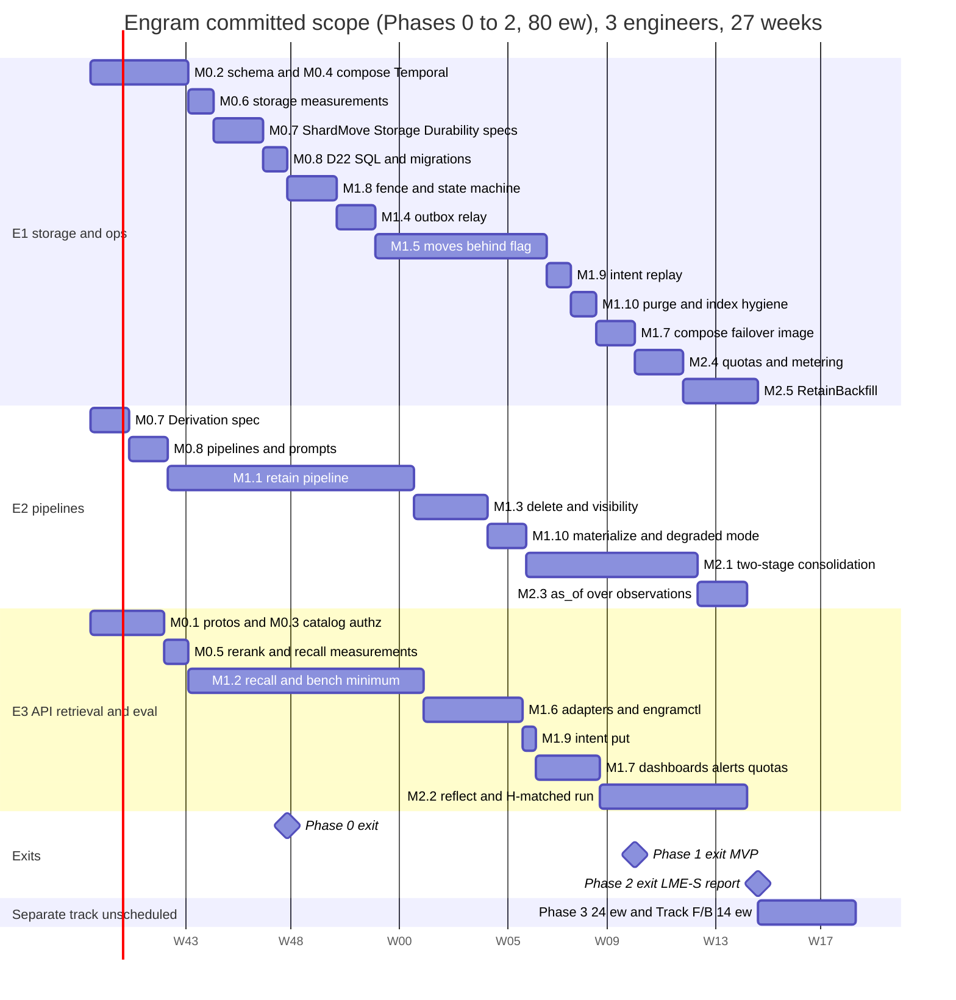

## 10. Phased roadmap

Effort follows D17 as re-estimated for the round-3 redesign (D22; `reviews/round-3.md`). Phase 0
≈ 15 engineer-weeks (ew), including a Phase 0′ of measurements and a Phase 0″ that lands D22 in
the sections, SQL and protos; Phase 1 ≈ 45 ew (moves behind an admin flag); Phase 2 ≈ 20 ew
(consolidation, Reflect, quotas and `RetainBackfill`, which **returned to the committed scope**
as a launch prerequisite, N130); Phase 3 ≈ 24 ew as a **separate track**; formal methods and
the evaluation harness ≈ 14 ew: **≈ 118 ew in total**. The **committed scope is Phases 0 to 2,
≈ 80 ew against 78 ew of capacity** for three engineers in 26 weeks (3 × 26): a 2-ew overrun,
so the Phase 2 exit lands in **week 27**, not 26, with no slack. That is stated, not hidden: the
redesign is neutral on Phases 0 and 1 (below) and the whole increase is `RetainBackfill`.
The calendar is drawn from **per-engineer serial chains**: every task has one owner, tasks of one
owner never overlap, and every 10-week window of every chain is exactly 10 ew (no engineer
carries more). Estimates include the tests the exit criterion names (§8 tiers), review and the §9
operational artefacts, and exclude vacations and on-call. "Green" means the named `make` target
passes in CI.

**What the redesign removes and adds (Phases 0 and 1 net to 0.0 ew):**

| | ew | Why |
|---|---|---|
| Removed: move replay, copy barrier, `p0`, catch-up rounds, event→row mapping, `move_applied`, the N81 event zoo (M1.5) | −3.0 | with immutable large tables the difference after a dirty copy is the rows inserted since the copy began (N124) |
| Removed: lineage walk, synchronous cascade, bounded paged events, `remote_apply` and the synchronous standby (M1.3) | −1.0 | a delete is an O(1) marker and visibility a read-time predicate (N115 to N117, N122) |
| Removed: `deletion-log` and `move:<ns>` consumers (M1.4), a smaller Phase 0″ (M0.8) | −0.5, −1.0 | fewer events and fewer mechanisms to land |
| Added: the Expunge workflow, derivation lock and degraded mode (M1.10) | +2.5 | all physical delete work is asynchronous (N119, N120) |
| Added: delete-intent store, restore and failover replay (M1.9) | +1.5 | RPO 0 for acknowledged deletes without a synchronous standby (N122, N123) |
| Added: visibility predicate and per-namespace index plan in recall (M1.2); as-`engram_app` plan gates and the partitioned-index procedure (M0.2); per-cell Temporal with a load test (M0.4) | +0.5, +0.5, +0.5 | N112, N116, P-5, P-9, P-10 |
| Added to Phase 2: `RetainBackfill` (M2.5, was M3.9) | +3.0 | ≈ 100 days to fill 1 B facts online (Table 6.8-B) |

### 10.1 Staffing and ownership

| Engineer | Primary ownership (packages, §2) | Alongside track (separate, see 10.2 "Track F/B") |
|---|---|---|
| **E1 — storage & operations** | `store`, `ledger`, migrations, `outbox`, `move`, `expunge` (purge, index hygiene), `intent` (replay, trim), `engramctl`, compose, backups/restore, failover, Postgres exporter, quotas and metering | `Outbox.tla`, `ShardMove.tla`, `Storage.tla`, `Durability.tla` (M0.7), gates and CI wiring, trace validators (F.1) |
| **E2 — pipelines** | `chunk`, `extract`, `entity`, `link`, `workflows`, `consolidate`, tombstones and visibility (markers, evidence segments), `expunge` (materialize, degraded mode), `pages`, `export`, prompts (§6) | `Derivation.tla`, `Consolidation.tla` (M0.7; F.2) |
| **E3 — API, retrieval & evaluation** | `proto`/buf, `api` (incl. the intent `put` on the delete path), `authz`, `catalog`, `router`, `gateway`, `recall`, `reflect`, `adapters/*`, `telemetry`, dashboards | Lean modules (F.3), bench harness and Hindsight comparison (B.1, B.2) |

Three vertical owners rather than feature squads: every §2 package has one owner for its
interface, so cross-package changes are two-person reviews. Rejected: a dedicated QA/SRE role;
the §8 tiers and §9 runbooks are deliverables of the engineers who own the code.

### 10.2 Milestones

**Phase 0 — Foundations, Phase 0′ and Phase 0″ (15 ew, weeks 1–8, all three engineers)**

| Id | Deliverable | Owner | ew | Exit criterion (measurable) |
|---|---|---|---|---|
| M0.1 | Repo, `buf` (lint + `breaking` against the `proto/v1.0.0` tag with the pre-1.0 exception list of N128), generated stubs for `memory.v1`, `memory.admin.v1`, `engram.internal.*` (incl. `engram.internal.errors.v1`); `PageService`/`ExportService` registered answering `UNIMPLEMENTED` (N14); CI with S + T0 | E3 | 1.5 | `buf breaking` blocks a field-number change; `make lint test-unit` < 30 s, green |
| M0.2 | Shard schema v1 (`migrations/shard/0001–0004`): all tables of §3 (content tables insert-only with `fillfactor 100`, vector side tables, markers, evidence rows), 16 hash partitions, RLS, `namespace_ownership` with `ready`, `outbox`, `shard_meta`, roles (`engram_move` and `engram_expunge` without `BYPASSRLS`), per-role GUCs, the partitioned-index procedure in `engramctl index`; testcontainers harness; `TestEveryTableHasRLS`; RLS canary; **every N19 `EXPLAIN` runs as `engram_app`** (P-5); `TestContent_InsertOnly` trigger | E1 | 2.5 | `make test-integration` green; `--check-rls` returns zero rows; on the real ParadeDB image the BM25 arm keeps Top-K pushdown **under RLS** (or `TsvectorIndex` is declared the MVP lexical arm with its p95), the trigram lookup via the `SECURITY DEFINER` wrapper is an index scan ≤ 10 ms as `engram_app` (REVIEW-4: 308 ms unwrapped), tags resolve outside RLS; no generated column exists |
| M0.3 | Catalog schema + `Resolver` (LRU 100 k, TTL 60 s, negative 5 s, `LISTEN` invalidation, stale entries served indefinitely); `authz.Interceptor` with N5 codes and the `ns_group` claim (N65); `DeadlineGuard` (N11); `internal/errs` (N1) | E3 | 1.5 | authz table test green on gRPC and Connect with byte-identical error details; resolve p99 < 2 ms on hit; a catalog paused 30 min serves every cached namespace |
| M0.4 | Dev compose (1 shard, catalog + failover agent, `DeterministicClient`, Envoy), **per-cell Temporal: split services, `numHistoryShards = 512`, its own Postgres with a pgBackRest stanza**, payload codec (N59); `make e2e` smoke; **Temporal load test with the retain activity shape** (P-9) | E1 | 1.5 | `make e2e` < 5 min from cold; Temporal sustains ≥ 1 000 events/s (≈ 17× an online cell's ≈ 58 events/s) at < 70 % history-service CPU and persistence p99 < 50 ms, recorded in `bench/results/phase0/`; the history-shard count is frozen in the register; a `temporal-postgres` restore drill passes |
| **M0.5 (0′)** | **Measurements on the real images**: gateway rerank throughput and latency for `bge-reranker-base` and `bge-reranker-v2-m3` at 50/150/300 pairs (A-R1); the recall critical path on synthetic facts against the 216 ms budget (N54) incl. the **pre-rerank path's p95/p99** (N106); pg_search behaviours; **recall p95 and CPU under concurrent ingest** (N114) | E3 | 1.0 | a one-page note under `bench/results/phase0/`; `rerank_top` per budget and the default reranker fixed in the register; the §9.1 CPU split confirmed or re-set |
| **M0.6 (0′)** | **Storage and plan measurements on the ParadeDB image** (N112, N114): per-namespace HNSW against exact scan with shared-topic vectors (the 2,000-vector crossover), per-namespace build rate, immutable-row footprint and WAL per fact at 10 M facts, page touches per MID recall and the IOPS table, `CommitChunk` latency, the move copy rate without HNSW, **facts per chunk A-F on 100 LME chunks and A-W** (N74) | E1 (E2: the extraction) | 1.0 | the 8.6.1 table filled with measured values; the 2,000/1,000 thresholds, `ef_search` and the N114 budgets confirmed or re-set in the register; A-F and A-W recorded and Table 6.8-B re-derived if either differs by more than 20 % |
| **M0.7 (0′)** | **Spec work for D22** (N96 re-scoped). **E1:** `ShardMove.tla` rewritten (dirty copy, margin re-copy, mutable diff, `ready`, rollback at every step, timeline fencing; the zero-margin configuration must fail) 1.0; `Storage.tla` and `Durability.tla` 0.5; gates, committed logs and CI wiring 0.5. **E2:** `Derivation.tla` (replaces `DocLifecycle.tla` and `AsOf.tla`; one shared `Deriv` operator; the configuration without the derivation lock must fail) 1.5 | E1 2.0, E2 1.5 | 3.5 (range 3–4) | `make formal-quick` < 5 min and green on every design and counterexample configuration; each must-fail configuration fails on the invariant its first comment line names; §7.1 lists exactly which configurations completed; the specs are preconditions of M1.3 and M1.10 (`Derivation`), M1.5 (`ShardMove`) and M1.9 (`Durability`) |
| **M0.8 (0″)** | **D22 lands** (N111 to N132) in §1 to §12, `sql/` and `proto/`: vector side tables, markers, `derived_hidden`, evidence segments, intent keys, the `ready` and rollback ownership edges, the N127/N128 contract changes; `make gen-docs` generates the ownership SQL and the events table | E1 1.0 (SQL, migrations), E2 1.5 (§5 pipelines, prompts) | 2.5 | `buf lint && buf build` and the DDL validation green; `make gen-docs` fails CI on a hand edit; `TestIso_Ownership_Transitions` skeleton compiles against the new DDL |

*Phase 0 exit (week 8):* M0.1–M0.8; `make test` green; the register is frozen for Phase 1; the A-F,
A-W, A-R1 and N112 numbers are measured, not assumed.

**Phase 1 — MVP (45 ew, weeks 4–23; moves behind an admin flag)**

| Id | Deliverable | Owner | ew | Exit criterion (measurable) |
|---|---|---|---|---|
| M1.1 | Retain: `CDCChunker` + contextual header with the summary refresh rule (N60), extractor (`extract/v1`, server-set `mentioned_at`), `SummarizeDocument`, `EmbedChunk` by blob key, entity resolver with ordered upserts (N69), linker (caps), `CommitChunk` into content and vector side tables under the per-document try-lock (N83) with the `status = 'ingesting'` check and `InputBlobMissing` re-runs, **`APPEND` chaining** with `append_base_version` (N56, H-16), `FinalizeVersion` with `chunk_tombstones` for `REPLACE` and `fact_hidden(reextract)` for a prompt bump, `curation_log` re-applied by `content_hash` (N115), `RetainDocument` (fan-out 32, keys-only input, continue-as-new at 100 chunks / 20 MB), derived `namespace_stats`, ledger, `op-sweeper` | E2 (store seams with E1) | 10.0 | T2 suite green incl. `TestRetain_HistoryBudget`; `TestRetain_CommitOrdering`, `TestRetain_ReplaceTombstones`, `TestRetain_ConcurrentAppendsChain` green; re-ingest of an unchanged document makes **0** LLM calls and 0 embeddings; re-embeddings per append ≈ 1 chunk, 0 facts; ≥ 8 chunks/s/worker with `GW_LATENCY_MS=3000` |
| M1.2 | Recall: five arms over `PostgresIndex` — vectors in side tables read by the namespace's current model, **exact scan below 2,000 vectors and a per-namespace partial HNSW above (swept by `engramctl index`)** (N111, N112), BM25 or `TsvectorIndex` per M0.2 — the **visibility predicate** (marker sets loaded once per request, array parameters, SQL anti-join above 16 k, `$allowed_docs` for tags; N116), graph arm seeded from lexical (30 ms), two-sided temporal probe (N68), exact-rational RRF (N67), gateway rerank 0/50/150 with the deadline skip (N53), bounded boosts, packer, streaming + `RecallStats`, `as_of` inside every arm, minimal bench harness | E3 | 9.5 | §8.5 grid green at T3; `TestHNSW_PerNamespace`, `TestPlans_AsEngramApp`, `TestRecall_SmallNamespaceExact`, `TestLexical_TopKPushdown` green; on a synthetic 10 M-fact shard at 50 QPS: **critical-path p95 ≤ 216 ms at MID with 50 rerank pairs**, p95 < 300 ms end to end, **rerank-skip < 1 %** (a p99 property of the pre-rerank path, N106); LME-S retrieval-only R@5 ≥ 0.93; recall p95 with 16 k pending markers is recorded as the degraded-mode number |
| M1.3 | **Delete and visibility** (N115 to N118, N126): `DeleteDocument` as the O(1) marker transaction (document lock, `document_tombstones`, `deletion_log`, outbox), `Invalidate`/`Restore` markers, evidence-segment predicates for observation and page versions (`root_version`, two `EXISTS`), `PAGE_HIDDEN`, entity `as_of` and delete safety, export expiry inside the marker transaction, namespace and tenant delete with `freeze_delete` before the ack, `OperationService.Get/Wait` exempt from the `deleting` rejection (N70) | E2 | 3.0 | `TestDelete_O1` (ack p95 ≤ 100 ms at 1 M facts), `TestVisibility_AllSurfaces`, `_SegmentHiding`, `_Pages`, `TestInvalidate_RestoreExact`, `TestExport_ExpiresOnMarker`, `TestEntities_DeleteAndAsOfSafe`, `TestDelete_NamespaceAndTenant` green |
| M1.4 | Outbox relay (direct connection through the virtual endpoint, **cursor advances batched to 1/s per consumer**, gap watchlist with strict-prefix delivery, A-F1 lint, 7-day trim); consumers `index` and optional `kafka` | E1 | 1.5 | outbox property suite, `TestOutbox_Watch1x`, T5 double-election green; relay drains 5 k events/s with lag < 30 s; `TestXID_Budget` (≤ 55 XIDs/s at 50 writes/s) |
| M1.5 | Move protocol **behind `moves.enabled`** (D5, N123 to N125): `MoveService`, `Move` workflow on the target queue; Plan (timeline, schema version and column-list hashes), BulkCopy (restartable `READ COMMITTED` ranges through a `TEMP` table under RLS, no HNSW on the target), Freeze (one 35 s attempt), **Reconcile** (margin re-copy of immutable tables with counts and hashes, merge-diff of mutable tables, blob check, relay drain), Drain/Restart from `operations` (N97), cutover through `ready` with the point of no return at (c), **rollback at every step before (c)**, `return_abort`, cleanup, `engramctl move` | E1 | 7.0 (range 6–9) | §8.4.3 table green at every step under the load generator; `TestMove_DirtyCopyReconcile`, `_RollbackEveryStep`, `_ReadyState`, `_ZombieFenced`, `_PlanRefusals`, `_CutoverOrder`, `_MoveBack`, `_VerifyFitsFreeze` green; freeze < 30 s at 100 k facts and the 1 M-fact freeze and copy rate (target ≥ 2 000 facts/s per stream) measured and recorded, not gated; cutover read-unavailability < 5 s with a dead mover |
| M1.6 | Adapters: Connect, MCP server (`/mcp/{tenant_id}/{namespace_id}`; token validated before listing tools, `/.well-known/oauth-protected-resource`, `request_id = sha256(session ‖ jsonrpc id ‖ tool)`, N127/N129), `engramctl` (migrate, shard add/check, secret rotate, stats, report), `WaitOperation` on long-poll with DB fallback (N70), protojson idempotency hashes (N72), generated config allow-list (N66) | E3 | 4.0 | §8.3 isolation matrix 100 % green on every surface; MCP tool list equals §4's mapping table (golden); 10 k concurrent `WaitOperation` long-polls stay under the per-process cap |
| M1.7 | Ops baseline: production compose by host class (§9.1), DNS endpoints, `engramctl shard failover` (the §9.3 restore path), automated catalog failover (D4), **shard image with pgBackRest and block incremental, `postgres_exporter` and its alerts, the generated GUC table and `config lint`**, restore drill, dashboards and alerts without a `tenant` label, runbooks, rate quotas in the interceptor | E1 1.5 (compose, failover, image, exporter), E3 2.5 (dashboards, alerts, quota interceptor) | 4.0 | restore and failover drills (both variants) pass with the relay on the new primary and the intent replay applied; every §9.4 alert links a runbook; `OutboxLagHigh`, `MoveStuck`, `CutoverInProgress`, `XIDAgeHigh`, `WALArchiveLag`, `ExpungeMaterializeSlow` fire in `make e2e-chaos`; `TestIso_Metrics_Labels` green |
| M1.8 | **Advisory-lock fence and ownership state machine** (D2, N64, N82, N113, N125): writers `pg_try_advisory_xact_lock_shared` (never waiting, `NamespaceFrozen`), exclusive takers a single 35 s attempt, three disjoint lock key spaces, the states × roles × statements table incl. `ready`, `frozen/{move,delete,restore}`, `reconcile_out`, `return_abort`, and the read fence that accepts only `active` and `frozen/move`, executed against the real DDL **before any move code exists** | E1 | 2.0 | `TestFence_*` and `TestDocLock_NoStarvation` green; every transition executed by `TestIso_Ownership_Transitions` as the role the table names; `TestIso_Move_Epoch` green |
| M1.9 | **Delete intents and replay** (N122, N123): intent `put` in every delete-class path before the marker transaction (E3), the control credential, `engramctl intent trim|audit`, `engramctl restore replay` with the admin marker transaction, bring-up `frozen/restore` with restricted `listen_addresses`, last-state-wins ordering, open-move reconcile on restore and failover (E1) | E1 1.0, E3 0.5 | 1.5 | `TestIntent_AckImpliesIntent`, `TestRestore_ReplaysIntents`, `TestFailover_ReplaysIntents`, `TestRestore_OpenMoves`, `TestDurability_NoSyncWait` green; delete ack p95 ≤ 100 ms with the `put`; every role has `synchronous_commit = local` (`config lint`) |
| M1.10 | **Expunge** (N119, N120): `ns/{ns}/expunge` (`SignalWithStart`, fenced `active`, paused by a move); Materialize under the exclusive derivation lock with `derived_hidden`, root-rebuild and `PageRefresh` nudges, degraded mode (E2); throttled Purge (1,000 rows, 50 ms) behind the cursor-pass check, blob tombstones, index hygiene (`DROP INDEX`, `REINDEX` above 5 % dead), Finish, metrics, alerts, runbook (E1) | E2 1.5, E1 1.0 | 2.5 | `TestExpunge_Stages`, `_DerivationLock`, `_DegradedMode`, `_FencedAndPaused`, `TestHNSW_DropNoRepair` green; the SLA projection for a 1 M-fact document (materialize ≤ 15 min, purge ≤ 24 h, index ≤ 48 h) recorded from measured rates; degraded-mode lookup ≤ 20 ms per arm |

*Phase 1 exit (the MVP, week 23):* M1.1–M1.10; T0–T5 green; LME-S retrieval R@5 ≥ 0.93;
critical-path p95 ≤ 216 ms at MID on the 10 M-fact synthetic shard with rerank-skip < 1 %;
isolation matrix green; a second engineer (not the author) adds a shard and, with the flag on in
staging, moves a namespace in < 30 min using only §9.

**Phase 2 — Consolidation, Reflect, quotas and backfill (20 ew, weeks 18–27)**

| Id | Deliverable | Owner | ew | Exit criterion (measurable) |
|---|---|---|---|---|
| M2.1 | Consolidation, **two-stage** (N121): per-namespace `Consolidate` workflow (30 s debounce); `consolidate_route/v1` per batch of 8 facts (decisions only), `consolidate_write/v1` per touched observation, `merge`/`drop_source`/hidden-segment/capacity cases as **root rebuilds**; `observation_versions.root_version`, `observation_inputs` with `document_id`; proposals persisted write-once (N43); apply re-verification under the shared derivation lock; append-only `fact_consolidation` and the watermark (H-15); batch re-queued ≤ 3 times; `dedup_adjudicate/v1` as a decision; `render_hash` (N87) | E2 | 7.0 | `Consolidation.tla` conformance and duplicate-activity chaos green; `TestConsolidation_TwoStage`, `_PersistedProposal`, `_AtomicKey`, `_ApplyReverifiesInputs`, `_PendingFromWatermark` green; **measured `calls_per_chunk` within 20 % of 3.5 and A-W within 20 % of 0.8**, else Table 6.8-B is re-derived; `consolidation_lag` p95 < 5 min at 10 chunks/s; after a 100-fact document delete the affected observations are rebuilt within the 15-min materialize SLA |
| M2.2 | Reflect: tool loop (`search_pages` stub until Phase 3, `search_memories`, `search_observations`, `get_page`, `expand_fact`, all through the N116 predicate), caps 10 / 100 k / 300 s / 10 s, map/reduce fallback at the context cap (N73), citation verifier, JSON-schema output, token streaming, mission/directives/disposition from the N66 keys; the H-matched Hindsight profile + adapter | E3 | 6.0 | cap tests and citation property green; `TestReflect_MapReduceAtCap` green; one LME-S `reflect` run against **H-matched** within 2.0 points (paired CI, §8.7) or the gap reported with the ablation table |
| M2.3 | `as_of` over observations in the semantic and lexical arms (the latest version with `effective_at ≤ T`, hidden by the segment predicate, no fallback); §8.5 observation-version, deleted-derived, inputs-not-only-cited, entity and Reflect leakage tests; `Derivation.tla` trace validation wired into nightly | E2 | 2.0 | `TestAsOf_ObservationVersions`, `_DeletedDerivedVersionStaysHidden`, `_InputsNotOnlyCited`, `_Entities`, `_Reflect` green; nightly trace validation green for 7 consecutive days |
| M2.4 | LLM quotas with deferral: **`quota.Reserve(tokens_estimate)` before every gateway call class** (extract, routing, write, page refresh, each Reflect iteration; N130), shares from trailing usage plus a floor, `token_usage` metering with `price_version` (N20), per-tenant cost via `engramctl report weekly` and the optional OTel delta export (N62), cost dashboards | E1 | 2.0 | deferral T2 + T5 tests green; first weekly report produced automatically with cost per 1 k facts within 25 % of Table 6.8-B (≈ $0.157) |
| M2.5 | **`RetainBackfill`** (N31, N130; moved back from Phase 3): extraction-cache pre-warm through the gateway batch API (`batch_jobs`), then ordinary `RetainDocument` children; time-to-fill and spend-to-fill reported per namespace | E1 | 3.0 | a 1 M-fact backfill completes with ≥ 95 % of extraction through the batch API at ≈ half the list extraction cost; the LME-S ingest runs through it at ≈ $93 (Table 6.8-B) |

*Phase 2 exit (week 27):* M2.1–M2.5; first LME-S report (§8.6) with the `reflect` arm and the
H-matched comparison; knowledge-update category ≥ H-matched; **ingest cost ≤ 1.25 × Table 6.8-B
at the measured A-F** (≤ $0.30 per LME-S haystack at A-F = 10).

**Phase 3 — Pages, export, multi-cell, per-tenant config (24 ew, separate track, not in the 27 weeks)**

| Id | Deliverable | Owner | ew | Exit criterion (measurable) |
|---|---|---|---|---|
| M3.1 | Pages: `PageService` incl. `SearchPages` (N73), `page_versions` with `root_version`, `page_version_inputs`, refresh after consolidation and on schedule (one `RefreshPolicy`, N128), delta edits (`page/v1`) only on visible pages and root rebuilds (`page_full/v1`) after a hide (N117) | E2 | 5.0 | `TestVisibility_Pages`; page `as_of` tests; `search_pages` R@1 on page titles ≥ 0.95 on the §6.6 goldens; ≤ 2 LLM calls per page per consolidation round (metered) |
| M3.2 | Export: snapshots (`manifest.json`, `*.jsonl.zst`, `pages/*.md`) from one `REPEATABLE READ` snapshot, always-emitted deltas as diffs of consecutive snapshots with delete records (N126), expiry in the marker transaction end to end, `StreamSnapshot` 1 MiB parts, thin `engram-sync` client | E2 | 4.0 | round-trip property green; `grep` over a synced snapshot finds 100 % of facts; `TestExport_ExpiresOnMarker` through the public surface; a 1 GB snapshot streams in < 2 min |
| M3.3 | Multi-cell: one-hop forwarding with a streaming `Forwarder` (N71), peer clusters with mTLS, catalog `shards.cell`, placement across cells, **one Temporal cluster per cell; cross-cell moves Drain from the source `operations` rows and Restart on the target cell's cluster**, 2-cell e2e profile | E3 (E1: compose/Envoy) | 5.0 | forwarded unary request adds ≤ 5 ms p95, forwarded stream ≤ 10 ms to first message; misrouted-request chaos test green; `engram_forward_total{hops="2"} == 0`; a cross-cell move completes and its operations restart in the other cell's cluster |
| M3.4 | Config inheritance system ⊂ tenant ⊂ namespace for every N66 key, `TenantService`, typed `Directive{text, priority, active, tags}` and `GetEffectiveConfig` (N129), allow-list and proto comment generated from one Go table | E3 | 2.5 | inheritance table tests; an override is in effect within 60 s; `buf lint` fails if the proto comment and the Go table disagree |
| M3.5 | Optional Kafka sink (`engram.events.shard-{id}`), BSR schema publishing, `RestoreMarker` event | E1 | 1.5 | broker-down-for-1 h chaos drains without loss; schema resolvable from the BSR |
| M3.6 | Hardening: shard decommission executed in staging, quarterly restore and failover drills automated, `ExternalIndex` stub with the N116 read-time join, A/B of `FixedChunker` vs `CDCChunker` | E1 | 2.0 | `shard drain` → `remove` completes in staging; drill job scheduled; `TestVisibility_AllSurfaces` green against the stub |
| M3.7 | Fill rehearsal (after M2.5): a 100 M-fact backfill on a 4-shard staging cell with measured time-to-fill and spend-to-fill against Table 6.8-B (≈ 100 days online and ≈ $160 k per 1 B facts); one LME-M run under the `$2 000` guard | E1 | 2.0 | measured online fill rate within 25 % of 2.9 chunks/s per cell; LME-M report produced |
| M3.8 | Per-item observation scope (Q19), Reflect map/reduce tuning, the `tag_groups` decision (NG11) revisited with data | E2 | 2.0 | register row closing Q19; map/reduce accuracy on the 100 k-context subset within 1 pp of the unsplit answer |

*Phase 3 exit:* M3.1–M3.8; each §9.6 runbook exercised at least once in staging (log attached to the release notes).

**Track F/B — formal methods and evaluation (14 ew; the slices the committed exits need are
inside M0.7, M1.2 and M2.2, the rest runs alongside Phase 3)**

| Id | Deliverable | Owner | ew | Exit criterion |
|---|---|---|---|---|
| F.1 | `Outbox.tla`, `ShardMove.tla`, `Storage.tla`, `Durability.tla` at §7's bounds beyond M0.7's gate slice: counterexample and gate configurations on every PR, larger bounds nightly with a 30 min cap reporting INCOMPLETE as such; **trace validators** for the Go runs (`engramctl formal trace-to-tla`, the `TraceNext` modules, the chaos-run converter); `formal/MANIFEST.md` + manifest check pairing each spec with its §8.4.6 twin | E1 | 3.5 | `formal-quick` < 5 min on PRs; `make formal` < 30 min; nightly trace validation green |
| F.2 | `Derivation.tla` and `Consolidation.tla` extensions beyond M0.7 (bounds 2 documents × 2 facts, 2 observations × 3 versions, 1 page × 2 versions, non-atomic Materialize), same CI split and manifest pairing | E2 | 3.5 | same |
| F.3 | Lean 4: `TagMatch`, `RRF`, `Packer`, `TemporalWindow` + generated golden tables consumed by T1; `sorry` baseline driven to 0 | E3 | 1.5 | `lake build` in CI; Go parity tests read the tables; `SORRY_BASELINE = 0` |
| B.1 | `engram-bench` beyond the M1.2 minimum: report rendering, `bench.lock` drift banner, ablation flags incl. `--rerank-model`, `--rerank-top {0,50,150,300}` (N129) and `--ablate exact_scan`, smoke corpus, weekly job, `make bench-pg` | E3 | 3.0 | `make bench-smoke` on PRs; weekly LME-S report with the full ablation table |
| B.2 | Hindsight compose profile in both configurations (H-default in addition to M2.2's H-matched), weekly side-by-side job and report | E3 | 2.5 | the §8.7 comparison table filled for LME-S and LoCoMo with paired CIs |

Totals: Phase 0 15.0 (M0.1 to M0.6 = 9.0, M0.7 = 3.5, M0.8 = 2.5) + Phase 1 45.0 (M1.1 to M1.10 =
10 + 9.5 + 3 + 1.5 + 7 + 4 + 4 + 2 + 1.5 + 2.5) + Phase 2 20.0 = **80 ew committed** (E1 27.0, E2 26.5,
E3 26.5 over 26 weeks of 26.0 each: overrun E1 1.0, E2 0.5, E3 0.5 = 2.0 ew); Phase 3 24.0 +
Track F/B 14.0 = **38 ew on the separate track**; **118 ew in total**. Against the previous plan
(77 / 41 / 118): Phases 0 and 1 are unchanged in total, `RetainBackfill` +3.0 committed / −3.0
separate. If week 26 is a hard date, the cuts, in order, are M1.5's range (6 ew, no 1 M-fact
freeze measurement: −1.0) and Reflect map/reduce tuning (M3.8, already outside); the Phase 0″ and
M0.7 work is not on that list.

### 10.3 Calendar

Drawn from the per-engineer serial chains (one row per task, tasks of one engineer never overlap,
`after` edges are the chains; 1 ew is drawn as 7 days). E2 starts M1.1 in week 3 because it
depends only on M0.1's stubs, and E2's Phase 2 work starts in week 18 while E1 is still in M1.5.

(Start date is illustrative. E2's two 1.5-ew slices are drawn as 11-day bars. The last row is a
placeholder for the 38 ew that are *not* committed: with three engineers it would take ≈ 13 more
weeks; with a fourth engineer alongside, Track F/B could run from week 6.) Load check: every chain
is continuous, so every 10-week window carries exactly 10.0 ew (E1 weeks 1 to 27 = 27.0, E2 26.5,
E3 26.5); none is above 10.

### 10.4 Critical path

`M0.2/M0.4 → M0.6 → M0.7 → M0.8 → M1.8 → M1.4 → M1.5 (moves behind the flag) → M1.9 → M1.10 →
M1.7 → M2.4 → M2.5 → Phase 2 exit` is E1's chain and the longest (27 weeks, no slack); the Phase 1
exit (the MVP) is week 23, when M1.7 ends. `M0.7 → M0.8 → M1.1 → M1.3 → M1.10 → M2.1 → M2.3` is
E2's (26.5 weeks); E3's `M0.5 → M1.2 → M1.6 → M1.9 → M1.7 → M2.2` ends in week 26.5. The places a
week is most likely to be lost are **M1.5** (the only milestone with a distributed protocol under
load; its chaos table is the exit gate, which is why it ships behind a flag and the MVP can be
declared without it) and **M1.2's** critical-path p95 (if M0.5's measured pairs/s is below A-R1
the fallback is `rerank_top.mid = 0` with the skip reported as an SLO breach, not a redesign). The
redesign shortened the riskiest chain: M1.5 lost the replay machinery that regressed twice, and
what replaced it (reconcile by set difference, a `ready` state, rollback at every step) is
smaller and specified before it is built (M0.7). The new risk on the critical path is M2.5 at the
end of E1's chain: a late `RetainBackfill` delays the launch, not the committed demo.

### 10.5 How exit criteria are measured

| Criterion | Measured by | Where recorded |
|---|---|---|
| Tier greenness (T0–T5, F, S) | CI status on the release tag | release notes |
| Critical-path p95 ≤ 216 ms at MID (50 pairs), p95 < 300 ms, rerank-skip < 1 % | `engram-bench synth --facts 10000000 --qps 50 --minutes 10` on a staging shard sized per D3; `RecallStats` attribution | `bench/results/synth/` |
| Rerank pairs/s (A-R1), pg_search pushdown, HNSW crossover, IOPS table, copy rate, A-F, A-W, Temporal events/s | the Phase 0′ notes (M0.4 to M0.6) and `make bench-pg` (§8.6.1) | `bench/results/phase0/` |
| Delete ack ≤ 100 ms, expunge SLAs, degraded-mode recall | `TestDelete_O1`, `TestExpunge_SLAs`, `TestExpunge_DegradedMode`; the *Expunge and visibility* dashboard | CI logs, `bench/results/delete/` |
| LME-S R@5 ≥ 0.93, H-matched within 2.0 points | `engram-bench` with the current `bench.lock`, 3 repeats, paired bootstrap | `bench/results/{date}/lme_s/` |
| Operator time to add a shard, move a namespace, fail over a shard | timed run by a non-author following §9.5–§9.6 only | staging log |
| Restore and failover drills (with intent replay) | `engramctl backup drill --shard N --with-deletes`; `engramctl shard failover N` in the `ha` profile | drill report in `_backups/drills/` |
| Cost per haystack and per 1 k facts, calls per chunk vs Table 6.8-B | `engramctl report weekly` | weekly report |

### Round-3 changes

| Milestone | Before | After | Change |
|---|---|---|---|
| M0.2 / M0.4 | 2.0 / 1.0 | 2.5 / 1.5 | as-`engram_app` plan gates and the partitioned-index procedure; per-cell Temporal with a load test |
| M0.7 / M0.8 | 3.5 / 3.5 | 3.5 / 2.5 | specs re-scoped to `Derivation`, `Storage`, `Durability`, rewritten `ShardMove`; a smaller landing |
| M1.2 | 9.0 | 9.5 | visibility predicate and per-namespace index plan |
| M1.3 | 4.0 | 3.0 | O(1) marker delete and read-time segment predicate replace the cascade and the lineage walk |
| M1.4 | 2.0 | 1.5 | no `deletion-log` or `move:<ns>` consumers |
| M1.5 | 10.0 | 7.0 | dirty copy and reconcile replace replay, barrier, `p0` and catch-up |
| M1.9 (new) | | 1.5 | delete intents and replay |
| M1.10 (new) | | 2.5 | Expunge |
| M2.5 (was M3.9) | | 3.0 | `RetainBackfill` in the committed scope |
| Committed / separate / total | 77 / 41 / 118 | 80 / 38 / 118 | capacity 78 ew: overrun 2 ew, exit week 27 |
