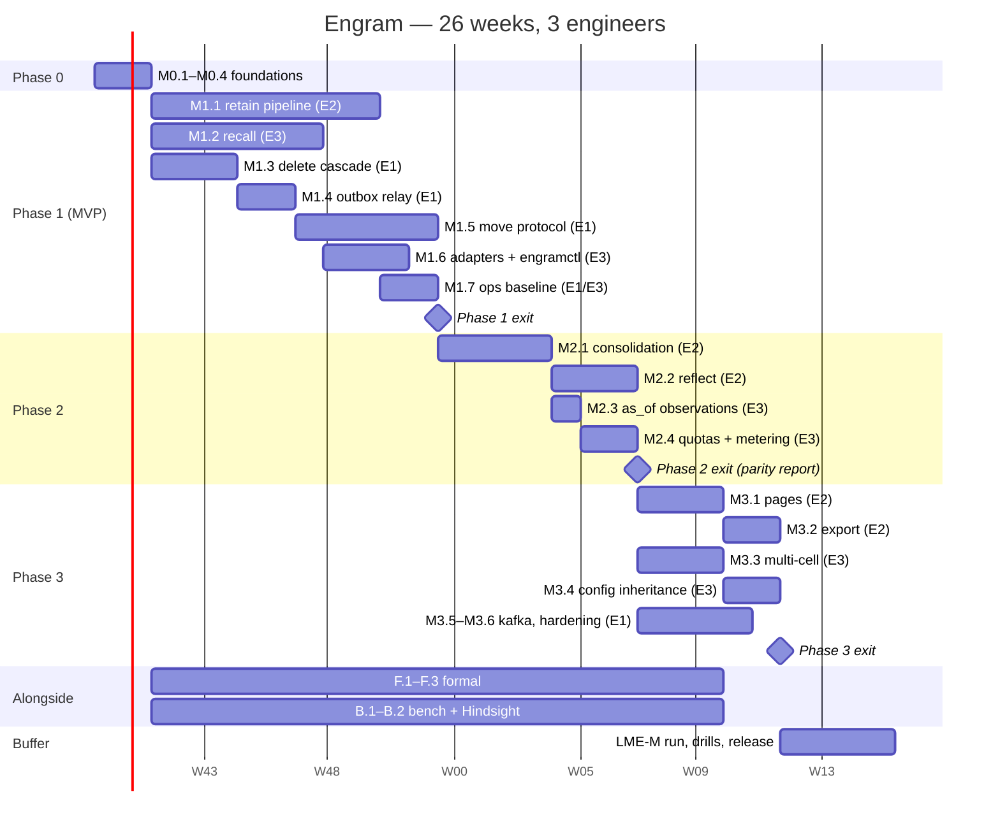

## 10. Phased roadmap

Effort follows D17: Phase 0 ≈ 6 engineer-weeks (ew), Phase 1 ≈ 30, Phase 2 ≈ 14, Phase 3
≈ 14, with formal methods and the evaluation harness ≈ 10 alongside — ≈ 74 ew in total.
Staffing assumption (A-R1): **three engineers for 26 calendar weeks** = 78 ew of capacity,
leaving ≈ 4 ew (5 %) of slack. That is thin, so the order below front-loads the critical path
and makes every phase-3 milestone individually droppable without touching the MVP. Each
estimate includes the tests the milestone's exit criterion names (§8 tiers), code review and
the §9 operational artefacts; it excludes vacations and on-call. "Green" means the named
`make` target passes in CI, not on a laptop.

### 10.1 Staffing and ownership

| Engineer | Primary ownership (packages, §2) | Alongside track |
|---|---|---|
| **E1 — storage & operations** | `store`, `ledger`, migrations, `outbox`, `move`, `engramctl`, compose, backups/restore, dashboards | `Outbox.tla`, `ShardMove.tla`, trace validators (F.1) |
| **E2 — pipelines** | `chunk`, `extract`, `entity`, `link`, `workflows`, `consolidate`, `reflect`, `pages`, `export`, prompts (§6) | `DocLifecycle.tla`, `Consolidation.tla`, `AsOf.tla` (F.2) |
| **E3 — API, retrieval & evaluation** | `proto`/buf, `api`, `authz`, `catalog`, `router`, `gateway`, `recall`, `adapters/*`, `quota`, `telemetry` | Lean modules (F.3), bench harness and Hindsight comparison (B.1, B.2) |

Rationale for three vertical owners rather than feature squads: every §2 package has one
owner for its interface, so cross-package changes are two-person reviews, not committee
reviews. Rejected: a dedicated QA/SRE role — the §8 tiers and §9 runbooks are deliverables of
the engineers who own the code, which is the only way the tests stay honest at this team
size.

### 10.2 Milestones

Per-engineer load is balanced to ≤ 10.5 ew per engineer in Phase 1 (10 calendar weeks).

**Phase 0 — Foundations (6 ew, weeks 1–2, all three engineers)**

| Id | Deliverable | Owner | ew | Exit criterion (measurable) |
|---|---|---|---|---|
| M0.1 | Repo, `buf` (lint + `breaking --against main`), generated stubs for `memory.v1`, `memory.admin.v1`, `engram.internal.*`; `PageService`/`ExportService` registered answering `UNIMPLEMENTED` (N14); CI with S + T0 | E3 | 1.5 | `buf breaking` blocks a field-number change in CI; `make lint test-unit` < 30 s, green |
| M0.2 | Shard schema v1 (`migrations/shard/0001–0003`): all tables of §3, 16 hash partitions, RLS policies, `namespace_ownership`, `outbox`, `shard_meta` (ND-10), roles (N2/N4); testcontainers harness; `TestEveryTableHasRLS`; empty RLS canary | E1 | 2.0 | `make test-integration` green; `engramctl migrate --check-rls` returns zero rows on a fresh shard |
| M0.3 | Catalog schema + `Resolver` (LRU 100 k, TTL 60 s, negative 5 s, `LISTEN` invalidation, `stale_max` 10 min); `authz.Interceptor` with N5 codes; `DeadlineGuard` with N11 caps; `internal/errs` (N1) | E3 | 1.5 | authz table test green on gRPC and Connect with byte-identical error details; resolve p99 < 2 ms on hit (micro-benchmark) |
| M0.4 | Dev compose (1 shard, catalog, Temporal, `DeterministicClient`, Envoy), `make e2e` with a create-namespace → retain (stub workflow) → `WaitOperation` → recall (stub arm) smoke | E1 | 1.0 | `make e2e` passes in < 5 min from a cold `docker compose up` |

*Phase 0 exit:* M0.1–M0.4; `make test` green; the decision register is frozen for Phase 1
(changes go through D18).

**Phase 1 — MVP (30 ew, weeks 3–12)**

| Id | Deliverable | Owner | ew | Exit criterion (measurable) |
|---|---|---|---|---|
| M1.1 | Retain: `CDCChunker` + contextual header (N6), extractor (`extract/v1`, per-namespace cache), `SummarizeDocument`, `EmbedChunk` (N13), entity resolver, linker (caps), `CommitChunk` with the version-row `FOR SHARE` + `status = 'ingesting'` check, `FinalizeVersion` with the newer-version check (N40), `RetainDocument` workflow (fan-out 32, `ContinueAsNew` 500), ledger (N7), `op-sweeper` (N3) | E2 (store seams with E1) | 8.0 | T2 suite green; `TestDocLifecycle_CommitAfterDelete`/`_CommitAfterSupersede`/`_LateFinalize` green; re-ingest of an unchanged document makes **0** LLM calls and 0 embeddings; ≥ 8 chunks/s/worker with `GW_LATENCY_MS=3000` (D3: `32/3 ≈ 10`) |
| M1.2 | Recall: five arms over `PostgresIndex` (HNSW + pg_search), RRF k=60, gateway rerank with deadline skip, bounded boosts, packer, streaming + `RecallStats`, `as_of` inside every arm, 5 tag modes, type filters | E3 | 6.0 | §8.5 grid green at T3; p95 < 300 ms at mid budget on a synthetic 10 M-fact shard (`engram-bench synth`, 50 QPS); LME-S retrieval-only R@5 ≥ 0.93 (session level, real models) |
| M1.3 | Delete cascade (D8) over sources **and** `observation_inputs` with `stale_delete` hiding (N41), replace-retire grace semantics (N42), `deletion_log` (ND-8), `PurgeDocument` (cascading like a delete), `Invalidate`/`Restore`, namespace and tenant delete | E1 (E2: invalidate/restore, namespace delete) | 3.0 | delete p95 < 500 ms; after-ack invisibility test on Recall/GetMemory/List/Export including derived observations; `DocLifecycle` conformance, `TestDocLifecycle_InputHidesObservation` and `_ReplaceKeepsSources` green |
| M1.4 | Outbox relay (direct-connection election, ND-1; cursors; gap watchlist with strict-prefix delivery; A-F1 lint: outbox `INSERT` last, `statement_timeout = idle_in_transaction_session_timeout = 30 s`; 7-day trim), consumers `index` (no-op), `deletion-log`, `move:<ns>` | E1 | 2.0 | outbox property suite + `TestOutbox_Watch1x` + T5 double-election green; relay drains 5 k events/s with lag < 30 s |
| M1.5 | Move protocol (D5 as amended, N2, N45): `MoveService`, the `Move` workflow (`move/{ns}/{epoch}`) on the target queue, copy behind the copy barrier (`p0` inside the snapshot), catch-up from `seq > p0` with the 10-round give-up, freeze/drain, cutover in the order (a)–(e), cleanup, rollback, `engramctl move start|status|rollback|cleanup`, schema-version refusal (ND-10) | E1 | 5.0 | §8.4 crash-mid-move table green at every phase and every cutover sub-step under the load generator; `TestMove_CopyBarrier`, `TestMove_CutoverOrder`, `TestMove_CatchUpGivesUp` green; freeze window < 30 s under load (watchdog 120 s, D5); a 1 M-fact namespace moves in < 2 h in staging |
| M1.6 | Adapters: Connect (generated, same port), MCP server (`/mcp/{tenant_id}/{namespace_id}`, read tools, write tools gated by scope), `engramctl` (migrate, shard add/check, secret rotate, stats, report) | E3 (E1: `engramctl` ops commands) | 3.0 | §8.3 isolation matrix 100 % green on every surface; MCP tool list equals §4's mapping table (golden) |
| M1.7 | Ops baseline: production compose (2 shards, Envoy policy ND-12), pgBackRest + restore drill with deletion replay and epoch bump (ND-11/ND-14), dashboards, alerts, runbooks, rate quotas in the interceptor | E1 (E3: dashboards, alerts, quota interceptor) | 3.0 | restore drill passes end to end; every §9.4 alert links a runbook; `OutboxLagHigh` and `MoveStuck` fire in `make e2e-chaos` |

*Phase 1 exit (the MVP):* M1.1–M1.7; T0–T5 green; LME-S retrieval R@5 ≥ 0.93; recall p95
< 300 ms at mid on the 10 M-fact synthetic shard; isolation matrix green; a second engineer
(not the author) adds a shard and moves a namespace in < 30 min using only §9.

**Phase 2 — Consolidation and Reflect (14 ew, weeks 13–17)**

| Id | Deliverable | Owner | ew | Exit criterion (measurable) |
|---|---|---|---|---|
| M2.1 | Consolidation: per-namespace `Consolidate` workflow (`SignalWithStart`, 30 s debounce), 8 facts/call, ≤ 100/round, top-10 candidate observations, bisect, proposals persisted write-once with `batch_key`/`op_key` over the stored list (N43), apply re-verification of every input `FOR SHARE` (N41), `observation_inputs`, `observation_versions` with `effective_at` over inputs ∪ candidates ∪ previous version (D9), zero-source retire trigger, `stale_write`/`stale_delete` from replaces and deletes | E2 | 6.0 | `Consolidation.tla` conformance and duplicate-activity chaos green; `TestConsolidation_PersistedProposal`, `_AtomicKey`, `_ApplyReverifiesInputs` green; "observation never outlives sources" and "lost input hides" trigger tests; `consolidation_lag` p95 < 5 min at 10 chunks/s |
| M2.2 | Reflect: tool loop (`search_memories`, `search_observations`, `get_page`, `expand_fact`), caps 10 / 100 k / 300 s / 10 s, citation verifier, JSON-schema output, token streaming, mission/directives/disposition | E2 | 5.0 | cap tests and citation property green; LME-S `reflect` arm within 2.0 points of H-matched (paired CI, §8.7) |
| M2.3 | `as_of` over observations in the semantic + lexical arms (visibility = `live` ∧ `effective_at ≤ T`, N41); §8.5 observation-version, inputs-not-only-cited and reflect leakage tests; `AsOf.tla` trace validation wired into nightly | E3 | 1.5 | §8.5 observation and reflect tests and `TestAsOf_InputsNotOnlyCited` green; nightly trace validation green for 7 consecutive days |
| M2.4 | LLM quotas with deferral (`llm_tokens_per_day`, `max_facts`), `token_usage` metering with `price_version` (ND-7), cost dashboards, `engramctl report weekly` | E3 | 1.5 | deferral T2 + T5 tests green; first weekly report produced automatically |

*Phase 2 exit:* M2.1–M2.4; first side-by-side report (§8.7) showing parity on LME-S;
knowledge-update category ≥ H-matched; ingest cost ≤ $0.10 per LME-S haystack (A-R2: §8.6
prices).

**Phase 3 — Pages, export, multi-cell, per-tenant config (14 ew, weeks 18–22)**

| Id | Deliverable | Owner | ew | Exit criterion (measurable) |
|---|---|---|---|---|
| M3.1 | Pages: `PageService`, `page_versions` + `page_sources`, refresh after consolidation and on schedule, delta edits (`page/v1`), `stale_write`/`stale_delete` | E2 | 4.0 | staleness tests for writes and deletes; page `as_of` tests; ≤ 2 LLM calls per page per consolidation round (metered) |
| M3.2 | Export: snapshots (`manifest.json`, `*.jsonl.zst`, `pages/*.md`), deltas from the outbox range, `StreamSnapshot` 1 MiB parts, thin `engram-sync` client | E2 | 3.0 | round-trip property green; `grep` over a synced snapshot finds 100 % of facts; a 1 GB snapshot streams in < 2 min |
| M3.3 | Multi-cell: one-hop forwarding (ND-3), peer clusters with mTLS, catalog `shards.cell`, placement across cells, 2-cell e2e profile | E3 (E1: compose/Envoy) | 3.0 | forwarded request adds ≤ 5 ms p95; misrouted-request chaos test green; `engram_forward_total{hops="2"} == 0` always |
| M3.4 | Config inheritance system ⊂ tenant ⊂ namespace (`models.*`, `chunk.*`, `recall.*`, `quota.*`), `TenantService`, resolver-cached config | E3 | 2.0 | inheritance table tests; a namespace override of `models.extract` is in effect within 60 s |
| M3.5 | Optional Kafka sink (`engram.events.shard-{id}`), BSR schema publishing, `RestoreMarker` event (ND-14 / N23) | E1 | 1.0 | broker-down-for-1 h chaos drains without loss; schema resolvable from the BSR |
| M3.6 | Hardening: shard decommission executed in staging, quarterly restore drills automated, `ExternalIndex` interface stub with the read-time liveness join (N44), A/B of `FixedChunker` vs `CDCChunker` recorded | E1 | 1.0 | `shard drain` → `remove` completes in staging; drill job scheduled; `TestDocLifecycle_AsyncIndexJoin` green against the stub |

*Phase 3 exit:* M3.1–M3.6; one LME-M run completed under the $1,000 budget guard; each
§9.6 runbook exercised at least once in staging (log attached to the release notes).

**Alongside — formal methods and evaluation (10 ew, weeks 3–24)**

| Id | Deliverable | Owner | ew | Exit criterion |
|---|---|---|---|---|
| F.1 | `Outbox.tla`, `ShardMove.tla` with TLC configs at §7's bounds: counterexample and `_Live` configurations on every PR, full-bound safety nightly with a 30 min cap (N46); trace validators for the Go runs; `formal/MANIFEST.md` + manifest check pairing each spec with its §8.4 regression tests | E1 | 3.0 | `formal-quick` < 2 min on PRs; `make formal` < 30 min; nightly trace validation green |
| F.2 | `DocLifecycle.tla`, `Consolidation.tla`, `AsOf.tla`, same CI split and manifest pairing | E2 | 2.0 | same |
| F.3 | Lean 4: `TagMatch`, `RRF`, `Packer`, `TemporalWindow` + generated golden tables consumed by T1 | E3 | 1.0 | `lake build` in CI; Go parity tests read the tables |
| B.1 | `engram-bench` (ingest/query/judge/report), dataset loaders, judge pin + `bench.lock` (ND-4), smoke corpus | E3 | 2.5 | `make bench-smoke` on PRs; first LME-S + LoCoMo run at M1.2 exit |
| B.2 | Hindsight compose profile + adapter (ND-5), ablation flags, weekly job and report | E3 | 1.5 | first side-by-side report at Phase 2 exit |

Totals: 6 + 30 + 14 + 14 + 10 = **74 ew**; per engineer E1 ≈ 25.5, E2 ≈ 25, E3 ≈ 23.5
(the 4 ew of slack sit with E3 in weeks 23–26, where the LME-M run and release hardening
land).

### 10.3 Calendar

(Start date is illustrative; weeks are what the estimates are in.)

### 10.4 Critical path

`M0.2 (schema) → M1.1 (retain) → M1.2 (recall needs facts to retrieve) → M1.4 (relay) →
M1.5 (move needs the relay) → Phase 1 exit → M2.1 (consolidation) → M2.2 (reflect) → parity
report → M3.1 (pages need observations)`. Everything else floats: M1.3, M1.6, M1.7 can slip
two weeks without moving the MVP date; M3.2–M3.6 are independent of each other and of M3.1.
The two places a week is most likely to be lost are **M1.5** (the only milestone with a
distributed protocol under load; its chaos table is the exit gate) and **M1.2's** p95 target
(if the gateway reranker is slower than A-2's 120 ms the fallback is a smaller `rerank_top`
at mid, not a redesign). The formal track is deliberately off the critical path: a TLC
counter-example changes a design before the code exists only if F.1 lands before M1.5,
which the calendar arranges (F.1 weeks 3–8, M1.5 weeks 8–12).

### 10.5 How exit criteria are measured

| Criterion | Measured by | Where recorded |
|---|---|---|
| Tier greenness (T0–T5, F, S) | CI status on the release tag | release notes |
| Recall p95 < 300 ms at mid | `engram-bench synth --facts 10000000 --qps 50 --minutes 10` on a staging shard sized per D3 | `bench/results/synth/` |
| LME-S R@5 ≥ 0.93, parity within 2.0 points | `engram-bench` with the current `bench.lock`, 3 repeats, paired bootstrap | `bench/results/{date}/lme_s/` |
| Operator time to add a shard / move a namespace | timed run by a non-author following §9.5 only | staging log |
| Restore drill | `engramctl backup drill --shard N --with-deletes` | drill report in `_backups/drills/` |
| Cost per haystack / per 1 k facts | `engramctl report weekly` | weekly report |
