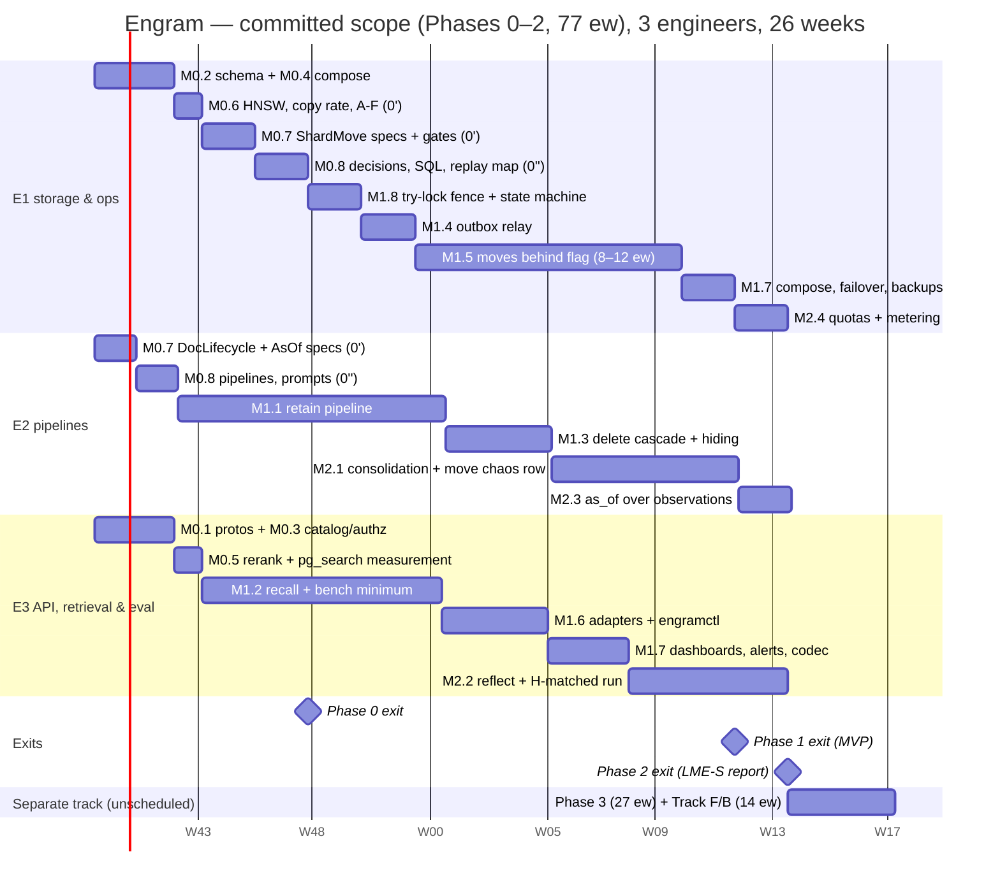

## 10. Phased roadmap

Effort follows D17 as amended after the first adversarial review (`REVIEW.md` F-16) and again
after the second (`REVIEW-2.md` G-27, N105): Phase 0 ≈ 15 engineer-weeks (ew) **including a
3-week Phase 0′ of measurements and a 3.5-ew Phase 0″** that lands decisions N79 to N108 in the
sections, SQL and protos and the failing configurations for G-1, G-3, G-6 and G-10 before any
move or consolidation code is written; Phase 1 ≈ 45 ew (moves behind an admin flag); Phase 2
≈ 17 ew (consolidation, Reflect; `RetainBackfill` left the committed scope, N105); Phase 3
≈ 27 ew as a **separate track** (it now pays for `RetainBackfill`); formal methods and the
evaluation harness ≈ 14 ew — **≈ 118 ew in total**. The **committed scope for three engineers
in six months is Phases 0–2, ≈ 77 ew** against 78 ew of capacity (3 × 26 weeks), i.e. ≈ 1 ew
of slack. That is a real loss against the first review's 4 ew (M0.7 at 3 to 4 ew *and* a 3.5-ew
Phase 0″ add 6 ew to the 9 ew base before `RetainBackfill` is subtracted); the register's N105
was corrected to these milestone sums. The slack is
real only because Phase 3 and most of the formal/eval track are *not* in the 26 weeks. The
previous plan's 74 ew was a lower bound dressed as a plan: E2's serial chain alone ran to
week 31 of a 26-week calendar, Phase 1 had zero slack, and M1.5 (a cross-database move
protocol with a ten-point chaos table) was budgeted at 5 ew. The calendar below is drawn from
**per-engineer serial chains**, not from phase totals: every task has one owner, tasks of one
owner never overlap, and no engineer carries more than 10 ew in any 10-week window. Each
estimate includes the tests the milestone's exit criterion names (§8 tiers), code review and
the §9 operational artefacts; it excludes vacations and on-call. "Green" means the named
`make` target passes in CI, not on a laptop.

### 10.1 Staffing and ownership

| Engineer | Primary ownership (packages, §2) | Alongside track (separate, see 10.2 "Track F/B") |
|---|---|---|
| **E1 — storage & operations** | `store`, `ledger`, migrations, `outbox`, `move`, `engramctl`, compose, backups/restore, failover, dashboards, metering | `Outbox.tla`, `ShardMove.tla` extensions (M0.7: W-8, W-9, W-11, W-12), gates and CI wiring, trace validators (F.1) |
| **E2 — pipelines** | `chunk`, `extract`, `entity`, `link`, `workflows`, `consolidate`, delete cascade and observation visibility, `pages`, `export`, prompts (§6), backfill | `DocLifecycle.tla`, `Consolidation.tla`, `AsOf.tla` extensions (M0.7: W-1, W-2, W-6, W-7, W-10; F.2) |
| **E3 — API, retrieval & evaluation** | `proto`/buf, `api`, `authz`, `catalog`, `router`, `gateway`, `recall`, `reflect`, `adapters/*`, `quota`, `telemetry` | Lean modules (F.3), bench harness and Hindsight comparison (B.1, B.2) |

Two ownership changes from the first draft, both to balance the chains: the delete cascade
and observation visibility (M1.3) move from E1 to E2, because per-version hiding (N41) is
observation logic; Reflect (M2.2) moves from E2 to E3, because it is an API-level loop over
recall and E2's Phase 1–2 chain was the longest. Rationale for three vertical owners rather
than feature squads is unchanged: every §2 package has one owner for its interface, so
cross-package changes are two-person reviews. Rejected: a dedicated QA/SRE role — the §8 tiers
and §9 runbooks are deliverables of the engineers who own the code.

### 10.2 Milestones

**Phase 0 — Foundations, Phase 0′ and Phase 0″ (15 ew, weeks 1–8, all three engineers)**

| Id | Deliverable | Owner | ew | Exit criterion (measurable) |
|---|---|---|---|---|
| M0.1 | Repo, `buf` (lint + `breaking --against main`), generated stubs for `memory.v1`, `memory.admin.v1`, `engram.internal.*`; `PageService`/`ExportService` registered answering `UNIMPLEMENTED` (N14); CI with S + T0 | E3 | 1.5 | `buf breaking` blocks a field-number change in CI; `make lint test-unit` < 30 s, green |
| M0.2 | Shard schema v1 (`migrations/shard/0001–0003`): all tables of §3, 16 hash partitions, RLS policies, `namespace_ownership`, `outbox`, `shard_meta` (N22), roles incl. `engram_move` without `BYPASSRLS` (N91 removed `engram_move_load`), `ALTER ROLE … SET lock_timeout` per role (N82); testcontainers harness; `TestEveryTableHasRLS`; empty RLS canary; **pg_search pushdown check** (N76) | E1 | 2.0 | `make test-integration` green; `engramctl migrate --check-rls` returns zero rows on a fresh shard; on the real ParadeDB image the lexical arm's `EXPLAIN` over a 16-partition fixture shows Top-K pushdown with the `ORDER BY score, memory_id` tiebreak, `text[]` tags tokenise literally and the composite `key_field` works — or `TsvectorIndex` is declared the MVP lexical arm with its own p95 number (review F-37) |
| M0.3 | Catalog schema + `Resolver` (LRU 100 k, TTL 60 s, negative 5 s, `LISTEN` invalidation, **stale entries served indefinitely, negative 10 min**, D4 as amended); `authz.Interceptor` with N5 codes and the `ns_group` claim (N65); `DeadlineGuard` with N11 caps; `internal/errs` (N1) | E3 | 1.5 | authz table test green on gRPC and Connect with byte-identical error details; resolve p99 < 2 ms on hit; a catalog paused for 30 min serves every cached namespace (T3 with `MemoryCatalog`) |
| M0.4 | Dev compose (1 shard, catalog + failover agent, Temporal with the payload codec (N59), `DeterministicClient`, Envoy with the 65 s read route and header stripping, N75/N71), `make e2e` with a create-namespace → retain (stub workflow) → `WaitOperation` → recall (stub arm) smoke | E1 | 1.0 | `make e2e` passes in < 5 min from a cold `docker compose up` |
| **M0.5 (0′)** | **Measurements on the real images** (review F-6, F-7, F-37): gateway rerank throughput and latency for `bge-reranker-base` and `bge-reranker-v2-m3` at 50/150/300 pairs (A-R1: ≥ 80 k pairs/s per cell); the recall critical path on synthetic facts (`engram-bench synth`, no LLM) against the 216 ms budget (N54), including the **pre-rerank path's p95/p99** against the `deadline − 106 ms` skip rule (N106); pg_search behaviours of M0.2 recorded as numbers | E3 | 1.0 | a one-page measurement note checked in under `bench/results/phase0/`; `rerank_top` per budget and the default reranker fixed in the register from the numbers (N53 amended if needed) |
| **M0.6 (0′)** | **Filtered-HNSW vs exact-scan measurement** (review F-8): a 16-partition fixture with ≈ 625 k facts per partition, namespaces of 1 k / 20 k / 200 k facts; candidate truncation and heap fetches per arm with the shared index, the exact scan and a partial index (N55); **facts-per-chunk measurement** on 100 LME chunks (A-F, N74) with E2's prompt; **cold exact-scan cost and `STORAGE MAIN` heap scans for facts, chunks and observation versions** (N94, replaces the withdrawn "30 MB, 5 to 15 ms" figure) and the **move copy rate with all indexes live** (N89, A-O17′: ≈ 1,000 facts/s per stream) | E1 (E2: the 100-chunk extraction) | 1.0 | the 20 k-fact threshold, the `live_rows >= 20,000 AND < 2 %` partial-index band and `ef_search ≥ cap` confirmed or re-set in N55/N94; the observation arm's `hnsw.ef_search` set from the recall measurement; A-O17′ recorded for M1.5; A-F measured and Table 6.8-B re-derived if it differs from 10 by more than 20 % |
| **M0.7 (0′)** | **Spec work items of N77 and N96** (reviews F-15, G-17), split by spec owner. **E1** (`ShardMove`): W-8 event-driven replay as the total N81 mapping with `ShardMove_DeleteDuringCatchup.cfg` and `ShardMove_RetryAfterCutover.cfg` (must fail); W-9 range snapshots, single floor `p0`, replica-mode load, `VerifyFK` with `ShardMove_PerTableNewSnapshot.cfg` (must fail); W-11 try-lock fence, `OtherNamespaceProgress` and mover starvation-freedom; W-12 cutover with the point of no return at (c), `NoExecutionOnSourceAfterFreeze`. **E2** (`DocLifecycle`/`AsOf`): W-1, W-2 reworded (semantic `deriv` from one shared module, `DocLifecycle_NoLineage.cfg` must fail with the G-1 trace), W-6 (claims restated), W-7 (`hidden_by_invalidation` counter, `AsOf_InvalidateSuperseded.cfg` must fail), W-10 (`AsOf_ChunkTwoItems.cfg` must fail). **E1 (third slice)**: gates, committed logs and CI wiring (every `*_Gate*.cfg` run and its log committed; `DocLifecycle_Gate.cfg` completes with 2 documents and 2 hashes or its bounds shrink; `AsOf_Gate.cfg` and `ShardMove_Gate.cfg` added; `Consolidation_Gate.cfg` deleted). The TLC queue was stopped on purpose until the specs carry the D20/D21 mechanisms (§7.6) | E1 2.0 (ShardMove + gates), E2 1.5 | 3.5 (range 3–4) | `make formal-quick` < 5 min and green on every design and counterexample configuration in the gate set; each of the new must-fail configurations fails on the invariant its first comment line names; §7.1 lists exactly which configurations completed, and W-6 to W-12 are preconditions of M1.5 and M2.1 |
| **M0.8 (0″)** | **Phase 0″: decisions N79 to N108 land** in §1 to §12, `sql/` and `proto/` (observation lineage, bounded paged events, `fact_consolidation`, `hidden_by_invalidation`, `observation_version_sources`, the N81 events and `replay_map` annotations, the try-lock fence, ownership transitions with `moved_out -> incoming`), and the failing configurations for G-1 (`DocLifecycle_NoLineage`), G-3 (`ShardMove_DeleteDuringCatchup`), G-6 (`AsOf_InvalidateSuperseded`) and G-10 (`ShardMove_PerTableNewSnapshot`) exist and fail as intended **before any move or consolidation code**; `make gen-docs` (N103) wired so the ownership SQL and the events table are generated, not copied | E1 2.0 (SQL, migrations, `replay_map` annotations), E2 1.5 (§5 pipelines, prompts, render hash) | 3.5 | `buf lint && buf build` and the DDL validation green on the amended files; `make gen-docs` fails CI on a hand edit; the four failing configurations are checked in with their TLC logs; `TestIso_Ownership_Transitions` skeleton compiles against the new DDL |

*Phase 0 exit (week 8):* M0.1–M0.8; `make test` green; the register is frozen for Phase 1
(changes go through D18/D20/D21); the A-F, A-R1 and N55 numbers are measured, not assumed.

**Phase 1 — MVP (45 ew, weeks 4–24; moves behind an admin flag)**

| Id | Deliverable | Owner | ew | Exit criterion (measurable) |
|---|---|---|---|---|
| M1.1 | Retain: `CDCChunker` + contextual header with the **summary refresh rule** (N60), extractor (`extract/v1` with `said_at`, server-set `mentioned_at`, D9), `SummarizeDocument`, `EmbedChunk` by blob key (N59), entity resolver with ordered upserts (N69), linker (caps), `CommitChunk` under the per-document try-lock (N83) with the `status = 'ingesting'` check and `InputBlobMissing` re-runs (N100), **`APPEND` chaining** (N56), `FinalizeVersion` with the newer-version check (N40) and the **`extraction_key` retire** (N58), `RetainDocument` (fan-out 32, keys-only `CommitChunkInput`, continue-as-new every 100 chunks / 20 MB, N59), derived `namespace_stats` and per-wave progress (N69), ledger (N7), `op-sweeper` (N3) | E2 (store seams with E1) | 10.0 | T2 suite green incl. `TestRetain_HistoryBudget`; `TestDocLifecycle_CommitAfterDelete`/`_CommitAfterSupersede`/`_LateFinalize`, `TestRetain_ConcurrentAppendsChain`, `TestRetain_PromptBumpRetiresOldFacts` green; re-ingest of an unchanged document makes **0** LLM calls and 0 embeddings; **re-embeddings per append ≈ 1 chunk, 0 facts**; ≥ 8 chunks/s/worker with `GW_LATENCY_MS=3000` |
| M1.2 | Recall: five arms over `PostgresIndex` (HNSW + pg_search or the `TsvectorIndex` fallback per M0.2), **semantic arm by namespace size** (exact scan < 20 k facts, partial HNSW above, N55), graph arm seeded from lexical first with a 30 ms budget (N54), two-sided temporal probe (N68), **exact-rational RRF** k=60 and normalised scores (N67), gateway rerank with `rerank_top` 0/50/150 and the deadline skip (N53), bounded boosts, packer, streaming + `RecallStats`, `as_of` inside every arm on the server-set `mentioned_at`, 5 tag modes, type filters; the minimal bench harness (`engram-bench ingest|query|judge` over LME-S) needed by the exit criterion | E3 | 9.0 | §8.5 grid green at T3; `TestRecall_SmallNamespaceExactScan`, `TestLexical_TopKPushdown` green; on a synthetic 10 M-fact shard at 50 QPS (`engram-bench synth`): **critical-path p95 ≤ 216 ms at MID with 50 rerank pairs** and p95 < 300 ms end to end, **rerank-skip rate < 1 %** at target QPS, judged as a p99 property of the pre-rerank path (skip only when pre-rerank time exceeds `deadline − 106 ms` = 194 ms at a 300 ms client deadline; M0.5 measures that path's p95/p99; deadlines below 300 ms skip by design and are not an SLO breach, N106) (review F-6/F-7, G-28); LME-S retrieval-only R@5 ≥ 0.93 (session level, real models) |
| M1.3 | Delete cascade (D8/N61: visibility-only synchronous part, links and mentions in `PurgeDocument`) over sources **and** `observation_inputs` with **per-version `derived_from_deleted`** (N41 as amended), replace-retire grace semantics (N42), `deletion_log` (N21), snapshot expiry (N59), reversible per-version `Invalidate`/`Restore` with the `hidden_by_invalidation` counter (N84), transitive lineage flagging (N79), paged bounded events with the 50 ms per 1 k facts plus one outbox row per 256 ids SLO (N80), synchronous-standby `remote_apply` for delete-class transactions (N92), namespace and tenant delete, `OperationService.Get/Wait` exempt from the `deleting` rejection (N70) | E2 | 4.0 | `TestDelete_CascadeScales` (p95 ≤ 50 ms per 1 k retired facts plus one outbox row per 256 ids; a 100 k-fact document deletes in ≈ 5 s and ≈ 400 rows — an estimate until the test runs it, N80); after-ack invisibility test on Recall/GetMemory/List/Export including derived observation versions; `TestAsOf_DeletedDerivedVersionStaysHidden`, `TestDocLifecycle_InputHidesObservation`, `_ReplaceKeepsSources`, `TestDelete_ExpiresSnapshots` green |
| M1.4 | Outbox relay (direct connection through the shard's virtual endpoint, N15/N63; cursors; gap watchlist with strict-prefix delivery; A-F1 lint: outbox `INSERT` last, `statement_timeout = idle_in_transaction_session_timeout = 30 s`; 7-day trim), consumers `index` (no-op), `deletion-log`, `move:<ns>` | E1 | 2.0 | outbox property suite + `TestOutbox_Watch1x` + T5 double-election green; relay drains 5 k events/s with lag < 30 s |
| M1.5 | Move protocol **behind the `moves.enabled` admin flag** (D5 as amended, N2, N45, N50, N51, N52): `MoveService`, the `Move` workflow on the target queue, copy in restartable key ranges with the single replay floor `p0` (N88), each range under its own short snapshot (N89), loaded through a `TEMP` table under RLS with `session_replication_role = replica` and no `BYPASSRLS` role (N91), `VerifyFK` and the two-stage `Verify` (N88, N90), **event-driven total replay (N81) and anti-join catch-up and drain** (never `seq > applied`), try-lock fence (N82), watchdog scaling (N90), cutover with the point of no return at (c) and `moved_out` permanence (N93, N98), reconcile-based Drain/Restart (N97), freeze/drain under the advisory-lock fence, cutover (b)–(d) as three sub-second-retry activities with the bounded read re-resolve, cleanup, rollback, `engramctl move start|status|rollback|cleanup`, schema-version refusal (N22) | E1 | 10.0 (range 8–12) | §8.4 crash-mid-move table green at every phase and every cutover sub-step under the load generator; `TestMove_CopyBarrier`, `TestMove_CutoverOrder`, `TestMove_CatchUpGivesUp`, **`TestMove_AntiJoinReplay`, `TestMove_LoadUnderRLS`, `TestMove_ReplayCoversEveryEvent`, `TestMove_ResumableCopy`, `TestMove_MoveBack`** green; freeze window < 30 s under load for namespaces ≤ 100,000 facts (N90; the freeze at 1 M facts is measured and recorded, not gated); cutover read-unavailability window < 5 s with a dead mover; the measured copy rate (A-O17′, M0.6) is recorded and a 1 M-fact namespace moves in < 2 h in staging **only if the measurement supports it** (N89). The "move under concurrent consolidation" chaos row is **not** in this exit (it cannot be covered before consolidation exists); it is in M2.1's. The flag ships **off**; the MVP is declared without moves if this milestone is the one that slips (review F-16) |
| M1.6 | Adapters: Connect (generated, same port), MCP server (`/mcp/{tenant_id}/{namespace_id}`, read tools, write tools gated by scope), `engramctl` (migrate, shard add/check, secret rotate, stats, report), `WaitOperation` on Temporal's long-poll with the DB fallback (N70), protojson idempotency hashes (N72), the generated config allow-list with the N66 keys | E3 | 4.0 | §8.3 isolation matrix 100 % green on every surface incl. `TestIso_Temporal_PayloadsEncrypted`; MCP tool list equals §4's mapping table (golden); 10 k concurrent `WaitOperation` long-polls stay under the per-process cap |
| M1.7 | Ops baseline: production compose (2 shards, Envoy policy N24/N75/N71, per-shard virtual endpoints and `engramctl shard failover` with the epoch bump, N63; automated catalog failover, D4), pgBackRest + restore drill with deletion replay and epoch bump (N21/N23), synchronous standby (`ANY 1`) on every shard and the failover restart of in-flight workflows (N92), dashboards and alerts **without a `tenant` label** (N62), runbooks, rate quotas in the interceptor | E1: compose, failover, backups (1.5); E3: dashboards, alerts, quota interceptor, Temporal codec rollout (2.5) | 4.0 | restore drill passes end to end; failover drill (both variants of §8.4) passes with the relay on the new primary; every §9.4 alert links a runbook; `OutboxLagHigh`, `MoveStuck`, `CutoverInProgress` fire in `make e2e-chaos`; `TestIso_Metrics_Labels` green |
| M1.8 | **Advisory-lock fence and ownership state machine** (D2 as amended, N64; review F-5/F-23): writers take `pg_try_advisory_xact_lock_shared` (never waiting, `NamespaceFrozen{retry_after = 200 ms}` on failure, N82) + a plain read of the ownership row; barrier/freeze/restore take the exclusive lock under `lock_timeout = 5 s` (exports take none, N82); the states × roles × statements table of §3.3.1 (incl. `freeze_reason`, `restoring`, the read fence) executed against the real DDL by a T3 test **before any move code exists** | E1 | 2.0 | `TestFence_AdvisoryLockFairness` green (and the `FOR SHARE` variant demonstrably starves); every transition of the state machine executed by `TestIso_Ownership_Transitions` against the DDL as the role the table names; `TestIso_Move_Epoch` green |

*Phase 1 exit (the MVP, week 20):* M1.1–M1.8; T0–T5 green; LME-S retrieval R@5 ≥ 0.93;
critical-path p95 ≤ 216 ms at MID on the 10 M-fact synthetic shard with rerank-skip < 1 %;
isolation matrix green; a second engineer (not the author) adds a shard and — with the flag
on in staging — moves a namespace in < 30 min using only §9.

**Phase 2 — Consolidation and Reflect (17 ew, weeks 18–26)**

| Id | Deliverable | Owner | ew | Exit criterion (measurable) |
|---|---|---|---|---|
| M2.1 | Consolidation: per-namespace `Consolidate` workflow (`SignalWithStart`, 30 s debounce), 8 facts/call, ≤ 100/round, top-10 candidate observations with **≤ 5 rendered quotes each** (N47), bisect, proposals persisted write-once with `batch_key`/`op_key` over the stored list (N43), apply re-verification of every input `FOR SHARE` (N41), `observation_inputs` = rendered facts only, **insert-before-delete update order** (N57), `observation_versions` with `effective_at` over inputs ∪ candidates ∪ previous version (D9), zero-source retire trigger, `stale_write`/`stale_delete` with per-version `derived_from_deleted` never cleared, hidden-first stale batches up to the full round, delete-priority nudge, consolidation blobs retained only for the purge grace (N59), **`observation_version_lineage` written per candidate version and transitive flagging in the cascade (N79)**, `fact_consolidation` rows and the `consolidation_state` watermark instead of `facts.consolidated_at` (N95), `render_hash` in the extraction key (N87), `BatchApplied` events (N81) | E2 | 7.0 | `Consolidation.tla` conformance and duplicate-activity chaos green; `TestConsolidation_PersistedProposal`, `_AtomicKey`, `_ApplyReverifiesInputs`, **`_DisjointSourceUpdateKeepsObservation`** green; "observation never outlives sources" and "lost input hides the version" trigger tests; `consolidation_lag` p95 < 5 min at 10 chunks/s; a 100-fact document delete flags ≤ 100 versions and the namespace's last `stale_delete` clears in < 15 min (§9.4 SLO); lineage T1 test (every version reachable from a flagged version is flagged); **chaos row "move under concurrent consolidation"** (a proposal stored, applied and `fact_consolidation`-marked while the namespace copies, catches up and cuts over; the target has the same `consolidation_applied`, `fact_consolidation` and observation rows; N81 `ProposalStored`/`BatchApplied` replay) passes — this row moved here from M1.5 (N105) |
| M2.2 | Reflect: tool loop (`search_pages` stub until Phase 3 answers `UNIMPLEMENTED`, `search_memories`, `search_observations`, `get_page`, `expand_fact`), caps 10 / 100 k / 300 s / 10 s, **map/reduce fallback at the context cap** (N73), citation verifier, JSON-schema output, token streaming, mission/directives/disposition from the N66 keys; the H-matched Hindsight profile + adapter needed by the exit criterion (the full B.2 is on the separate track) | E3 | 6.0 | cap tests and citation property green; `TestReflect_MapReduceAtCap` green; one LME-S run of the `reflect` arm against **H-matched** within 2.0 points (paired CI, §8.7) or the gap reported with the ablation table |
| M2.3 | `as_of` over observations in the semantic + lexical arms (visibility = `live` ∧ `effective_at ≤ T` ∧ ¬`derived_from_deleted`, N41 as amended); §8.5 observation-version, deleted-derived, inputs-not-only-cited and reflect leakage tests; `AsOf.tla` trace validation wired into nightly | E2 | 2.0 | `TestAsOf_ObservationVersions`, `TestAsOf_DeletedDerivedVersionStaysHidden`, `TestAsOf_InputsNotOnlyCited`, `TestAsOf_Reflect` green; nightly trace validation green for 7 consecutive days |
| M2.4 | LLM quotas with deferral (`llm_tokens_per_day`, `max_facts`), `token_usage` metering with `price_version` (N20), per-tenant cost from `token_usage` via `engramctl report weekly` and the optional OTel delta export (N62), cost dashboards | E1 | 2.0 | deferral T2 + T5 tests green; first weekly report produced automatically with cost per 1 k facts within 25 % of Table 6.8-B |

*Phase 2 exit (week 26):* M2.1–M2.4 (`RetainBackfill`, formerly M2.5, is M3.9 on the separate track, N105); first LME-S report (§8.6) with the `reflect` arm and
the H-matched comparison; knowledge-update category ≥ H-matched; **ingest cost ≤ 1.25 × Table
6.8-B at the measured A-F** (≤ $0.31 per LME-S haystack at A-F = 10; the earlier "≤ $0.10"
gate sat below the plan's own estimate, review F-17).

**Phase 3 — Pages, export, multi-cell, per-tenant config, backfill (27 ew, separate track, not in the
26 weeks)**

| Id | Deliverable | Owner | ew | Exit criterion (measurable) |
|---|---|---|---|---|
| M3.1 | Pages: `PageService` incl. **`SearchPages`** (N73), `page_versions` + `page_sources`, refresh after consolidation and on schedule, delta edits (`page/v1`), `stale_write`/`stale_delete` per version | E2 | 5.0 | staleness tests for writes and deletes; page `as_of` tests; `search_pages` R@1 on page titles ≥ 0.95 on the §6.6 goldens; ≤ 2 LLM calls per page per consolidation round (metered) |
| M3.2 | Export: snapshots (`manifest.json`, `*.jsonl.zst`, `pages/*.md`), deltas by sorted merge (N30) with the outbox range as an optimisation, **snapshot expiry on delete** end to end (N59), `StreamSnapshot` 1 MiB parts, thin `engram-sync` client; Q7 resolved | E2 | 4.0 | round-trip property green; `grep` over a synced snapshot finds 100 % of facts; `TestDelete_ExpiresSnapshots` through the public surface; a 1 GB snapshot streams in < 2 min |
| M3.3 | Multi-cell: one-hop forwarding with a **streaming `Forwarder`** (gRPC `ClientStream` proxy for `Recall`/`Reflect`/`StreamSnapshot`, N71), peer clusters with mTLS, catalog `shards.cell`, placement across cells, the fleet Temporal cluster shared by both cells, 2-cell e2e profile | E3 (E1: compose/Envoy) | 5.0 | forwarded unary request adds ≤ 5 ms p95, forwarded stream ≤ 10 ms to first message; misrouted-request chaos test green; `engram_forward_total{hops="2"} == 0` always; a cross-cell move drains and restarts in the one Temporal cluster |
| M3.4 | Config inheritance system ⊂ tenant ⊂ namespace for every N66 key, `TenantService`, resolver-cached config, allow-list and proto comment generated from one Go table | E3 | 2.5 | inheritance table tests; a namespace override of `models.extract` or `prompts.extract` is in effect within 60 s; `buf lint` fails if the proto comment and the Go table disagree |
| M3.5 | Optional Kafka sink (`engram.events.shard-{id}`), BSR schema publishing, `RestoreMarker` event (N23) | E1 | 1.5 | broker-down-for-1 h chaos drains without loss; schema resolvable from the BSR |
| M3.6 | Hardening: shard decommission executed in staging, quarterly restore and failover drills automated, `ExternalIndex` interface stub with the read-time liveness join (N44), A/B of `FixedChunker` vs `CDCChunker` recorded | E1 | 2.0 | `shard drain` → `remove` completes in staging; drill job scheduled; `TestDocLifecycle_AsyncIndexJoin` green against the stub |
| M3.7 | Fill rehearsal (after M3.9): a 100 M-fact backfill through `RetainBackfill` on a 4-shard staging cell with measured time-to-fill and spend-to-fill against N74 (≈ 29 days / ≈ $160 k for 1 B at list prices); one LME-M run under the `$2 000` guard | E1 | 2.0 | measured fill rate within 25 % of 10 chunks/s per cell; LME-M report produced |
| M3.8 | Per-item observation scope (Q19) and Reflect map/reduce tuning on long sessions; the `tag_groups` decision (NG11) revisited with data | E2 | 2.0 | register row closing Q19; map/reduce accuracy on the 100 k-context subset within 1 pp of the unsplit answer |

| M3.9 | **`RetainBackfill`** (N31; moved out of committed scope by N105): extraction-cache pre-warm through the gateway batch API (`batch_jobs`), then ordinary `RetainDocument` children; time-to-fill and spend-to-fill reported per namespace | E1 | 3.0 | a 1 M-fact backfill completes with ≥ 95 % of extraction through the batch API at ≈ half the list cost; the LME-S ingest runs through it at ≈ $100 (Table 6.8-B) |

*Phase 3 exit:* M3.1–M3.9; each §9.6 runbook exercised at least once in staging (log
attached to the release notes).

**Track F/B — formal methods and evaluation (14 ew; the slices the committed exits need are
inside M0.7, M1.2 and M2.2 above, the rest runs alongside Phase 3)**

| Id | Deliverable | Owner | ew | Exit criterion |
|---|---|---|---|---|
| F.1 | `Outbox.tla`, `ShardMove.tla` at §7's bounds with the N77 extensions beyond M0.7's W-8, W-9, W-11, W-12 gate slice (the remaining multi-snapshot and fair-queue-fence variants are superseded by W-9/W-11): counterexample and gate configurations on every PR, larger bounds nightly with a 30 min cap reporting INCOMPLETE as such (N46/N77); **trace validators** for the Go runs (`engramctl formal trace-to-tla`, the `TraceNext` modules, the chaos-run converter); `formal/MANIFEST.md` + manifest check pairing each spec with its §8.4 regression tests | E1 | 4.0 | `formal-quick` < 5 min on PRs; `make formal` < 30 min; nightly trace validation green. (The first draft's 3.0 ew covered two specs *and* the trace tooling; the converter plus five state-machine harnesses against real Postgres is the bulk and is estimated on its own here, review F-16) |
| F.2 | `DocLifecycle.tla`, `Consolidation.tla`, `AsOf.tla`: the N77 extensions beyond M0.7's gate set, same CI split and manifest pairing | E2 | 3.0 | same |
| F.3 | Lean 4: `TagMatch`, `RRF` (1-based ranks, exact `Nat`/`Rat` scaling matching the Go `big.Rat` fusion), `Packer`, `TemporalWindow` + generated golden tables consumed by T1; `sorry` baseline driven to 0 | E3 | 1.5 | `lake build` in CI; Go parity tests read the tables; `SORRY_BASELINE = 0` |
| B.1 | `engram-bench` beyond the M1.2 minimum: report rendering, `bench.lock` drift banner, ablation flags incl. `--rerank-model` and `--ablate exact_scan`, smoke corpus, weekly job | E3 | 3.0 | `make bench-smoke` on PRs; weekly LME-S report with the full ablation table |
| B.2 | Hindsight compose profile in both configurations (H-default in addition to M2.2's H-matched), weekly side-by-side job and report | E3 | 2.5 | the §8.7 comparison table filled for LME-S and LoCoMo with paired CIs |

Totals: Phase 0 15 (M0.1 to M0.6 = 8, M0.7 = 3.5, M0.8 = 3.5) + Phase 1 45 + Phase 2 17 =
**77 ew committed** (E1 25.5, E2 26.0, E3 25.5 over 26 weeks; slack E1 0.5, E2 0.0, E3 0.5 =
1 ew); Phase 3 27 (24 + `RetainBackfill` 3) + Track F/B 14 = **41 ew on the separate track**;
**118 ew in total**. Changes against the first-review plan (74 / 38 / 112): M0.7 1.0 → 3.5
(+2.5), Phase 0″ (M0.8) +3.5, `RetainBackfill` −3.0 committed / +3.0 separate. The register
(N105) now quotes these sums. With 1 ew of slack against 78 ew of capacity any slip in M0.7, M0.8 or
M1.5 moves the Phase 2 exit past week 26 (E2 has no slack at all). If more slack is needed, the cut to make is M1.5's range (8 ew, no `VerifyFK` window measurement) or
Phase 2's Reflect map/reduce tuning, not the Phase 0″ work.

### 10.3 Calendar

Drawn from the per-engineer serial chains (one row per task, tasks of one engineer never
overlap, `after` edges are the chains). Phases overlap on the calendar on purpose: E2 starts
M1.1 in week 2 because it depends only on M0.1's stubs, and E2's Phase 2 work starts in week
16 while E1 is still in M1.5.

(Start date is illustrative; weeks are what the estimates are in. E2's two 1.5-ew slices are drawn as 11-day bars. The last row is a
placeholder for the 41 ew that are *not* committed: with three engineers it would take ≈ 14
more weeks; with a fourth engineer alongside, Track F/B could run from week 6.) Load check
per 10-week window (worst windows): E1 weeks 9–18 = 10.0 ew (M1.8 + M1.4 + six weeks of
M1.5; M0.7 and M0.8 precede it), weeks 13–22 = 10.0 ew (ten weeks of M1.5); E2 is a continuous 1 ew/week chain from week 1 to 26, so every
window is exactly 10.0 ew and its slack is zero; E3 weeks 5–14 = 10.0 ew, weeks 14–23 = 9.5 ew — none above 10.

### 10.4 Critical path

`M0.2 (schema + pushdown check) → M0.7 (ShardMove specs) → M0.8 (decisions land) → M1.8 (fence +
state machine) → M1.4 (relay) → M1.5 (moves behind the flag) → M1.7 → Phase 1 exit` is E1's chain and
the longest one in Phase 1 (19.5 ew, weeks 5–24, no slack worth the name); `M0.7 → M0.8 → M1.1 (retain) → M1.3 (delete + hiding) → M2.1 (consolidation) →
M2.3 → Phase 2 exit` is E2's and the one the Phase 2 exit depends on; E3's
`M0.5 → M1.2 → M1.6 → M1.7 → M2.2` ends in week 26 with half a week of slack. The two
places a week is most likely to be lost are **M1.5** (the only milestone with a distributed
protocol under load; the chaos table plus the two new regression tests are the exit gate —
which is exactly why it ships behind a flag and the MVP can be declared without it) and
**M1.2's** critical-path p95 (if the measured pairs/s of M0.5 is below A-R1, the fallback is
`rerank_top.mid = 0` with the skip reported as an SLO breach, not a redesign). What is *not*
on the critical path any more: the formal trace-validation tooling (F.1) and the Hindsight
side-by-side beyond one H-matched run (B.2); both were on it before and neither could be
done in the time the first draft gave them. The formal track still changes designs before
code exists where it matters: M0.7's spec work items (W-6 to W-12) and M0.8's failing configurations
land in weeks 5–8, before M1.8 and M1.5, and are preconditions of M1.5 and M2.1 (N105).

### 10.5 How exit criteria are measured

| Criterion | Measured by | Where recorded |
|---|---|---|
| Tier greenness (T0–T5, F, S) | CI status on the release tag | release notes |
| Critical-path p95 ≤ 216 ms at MID (50 pairs), p95 < 300 ms, rerank-skip < 1 % | `engram-bench synth --facts 10000000 --qps 50 --minutes 10` on a staging shard sized per D3; `RecallStats` per-stage attribution; `engram_recall_rerank_skipped_total` | `bench/results/synth/` |
| Rerank pairs/s (A-R1), pg_search pushdown, filtered-HNSW truncation, A-F | the Phase 0′ measurement notes (M0.5, M0.6) | `bench/results/phase0/` |
| LME-S R@5 ≥ 0.93, H-matched within 2.0 points | `engram-bench` with the current `bench.lock`, 3 repeats, paired bootstrap | `bench/results/{date}/lme_s/` |
| Operator time to add a shard / move a namespace / fail over a shard | timed run by a non-author following §9.5–§9.6 only | staging log |
| Restore and failover drills | `engramctl backup drill --shard N --with-deletes`; `engramctl shard failover N` in the `ha` profile (both §8.4 variants) | drill report in `_backups/drills/` |
| Cost per haystack / per 1 k facts vs Table 6.8-B | `engramctl report weekly` | weekly report |

### New decisions: D21 "Review-2 follow-ups applied" (second adversarial review, `REVIEW-2.md`)

| Id | Decision applied in §10 | Where |
|---|---|---|
| N105 | M0.7 re-estimated at 3.5 ew (range 3 to 4) and split by spec owner (E1: `ShardMove` W-8, W-9, W-11, W-12 and the gates; E2: `DocLifecycle`/`AsOf` W-1, W-2, W-6, W-7, W-10); new **Phase 0″ (M0.8, 3.5 ew)** lands N79 to N108 in the sections, SQL and protos with the failing configurations for G-1, G-3, G-6, G-10 before any move or consolidation code; `RetainBackfill` leaves committed scope (M2.5 → M3.9, Phase 3 track); the "move under concurrent consolidation" chaos row moves from M1.5's exit to M2.1's. Totals recomputed from the rows: Phase 0 15, committed 77, separate track 41, total 118, slack 1 ew (the register's 12.5 / 75 / 4 does not follow from its own re-estimates; reported) | §10 intro, M0.7, M0.8, M1.5, M2.1, M3.9, totals, calendar |
| N96 | W-6 to W-12 are preconditions of M1.5 and M2.1; M0.7's exit lists the new must-fail configurations | M0.7, 10.4 |
| N88, N89, N90, N91 | M1.5 deliverable and exit follow restartable range copy, single floor `p0`, `VerifyFK`, replica-mode TEMP-table load without `BYPASSRLS`, two-stage `Verify`; M0.6 measures the copy rate (A-O17′) and cold exact-scan cost; the "1 M facts in < 2 h" criterion stays only if the measurement supports it; the < 30 s freeze criterion applies to namespaces ≤ 100,000 facts | M0.2, M0.6, M1.5 |
| N79, N80, N84, N92, N95 | M1.3 and M2.1 carry lineage flagging, paged bounded events, the reversible invalidation counter, `remote_apply` for delete-class transactions and `fact_consolidation`; M1.7 carries the synchronous standby | M1.3, M1.7, M2.1 |
| N82, N83, N87, N100 | M1.8 uses `pg_try_advisory_xact_lock_shared`; M1.1 uses the per-document try-lock and `InputBlobMissing` re-runs | M1.1, M1.8 |
| N106 | M1.2's rerank-skip criterion is a p99 property of the pre-rerank path measured in M0.5; the 106 ms reserve and the ≥ 300 ms client deadline assumption | M1.2 |
