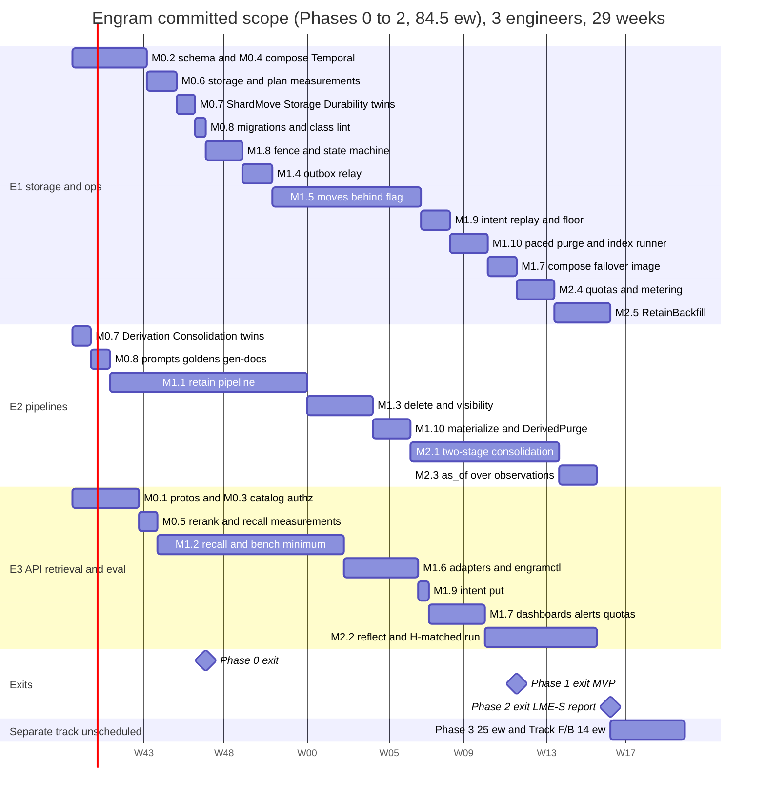

## 10. Phased roadmap

Effort follows D17 as re-estimated after round 4 (D23; `reviews/round-4.md`). Phase 0 ≈ 13.5
engineer-weeks (ew), including a Phase 0′ of measurements and a Phase 0″ that lands the design in
the repository; Phase 1 ≈ 50 ew (moves behind an admin flag); Phase 2 ≈ 21 ew (consolidation,
Reflect, quotas and `RetainBackfill`, a launch prerequisite in the committed scope, N130);
Phase 3 ≈ 25 ew as a **separate track**; formal methods and the evaluation harness ≈ 14 ew:
**≈ 123.5 ew in total**. The **committed scope is Phases 0 to 2, ≈ 84.5 ew against 78 ew of
capacity** for three engineers in 26 weeks (3 × 26): a 6.5-ew overrun, so the Phase 2 exit lands in
**week 29**, the MVP in **week 24**, with no slack. The specs of N96/N141 are **already written
and model-checked** (`formal/tla/`, logs in `formal/tla/results/`, §7.1), so M0.7 pays only for
their conformance and trace validation and M0.8 only for the real-repository migrations and
generators; round 4 adds mechanisms (below) that cost more than that saves.
The calendar is drawn from **per-engineer serial chains**: every task has one owner, tasks of one
owner never overlap, and every 10-week window of every chain is exactly 10 ew (no engineer
carries more). Estimates include the tests the exit criterion names (§8 tiers), review and the §9
operational artefacts, and exclude vacations and on-call. "Green" means the named `make` target
passes in CI.

### 10.1 Staffing and ownership

| Engineer | Primary ownership (packages, §2) | Alongside track (separate, see 10.2 "Track F/B") |
|---|---|---|
| **E1 — storage & operations** | `store`, `ledger`, migrations, `outbox`, `move`, `expunge` (purge, WAL pacing), the index runner (builds, hygiene), `intent` (replay, trim), `engramctl`, compose, backups/restore, failover, Postgres exporter, quotas and metering | conformance of `Outbox`, `ShardMove`, `Storage`, `Durability` (M0.7), gates and CI wiring, trace validators (F.1) |
| **E2 — pipelines** | `chunk`, `extract`, `entity`, `link`, `workflows`, `consolidate`, tombstones and visibility (markers, evidence segments), `expunge` (materialize, degraded mode), `pages`, `export`, prompts (§6) | conformance of `Derivation`, `Consolidation` (M0.7; F.2) |
| **E3 — API, retrieval & evaluation** | `proto`/buf, `api` (incl. the intent `put` on the delete path), `authz`, `catalog`, `router`, `gateway`, `recall`, `reflect`, `adapters/*`, `telemetry`, dashboards | Lean modules (F.3), bench harness and Hindsight comparison (B.1, B.2) |

Three vertical owners rather than feature squads: every §2 package has one owner for its
interface, so cross-package changes are two-person reviews. Rejected: a dedicated QA/SRE role;
the §8 tiers and §9 runbooks are deliverables of the engineers who own the code.

### 10.2 Milestones

**Phase 0 — Foundations, Phase 0′ and Phase 0″ (13.5 ew, weeks 1–8, all three engineers)**

| Id | Deliverable | Owner | ew | Exit criterion (measurable) |
|---|---|---|---|---|
| M0.1 | Repo, `buf` (lint + `breaking` baselined on `main@HEAD~1` until `v1.0.0`, one labelled exception and changelog entry per intended break, N128/N139), generated stubs for `memory.v1`, `memory.admin.v1`, `engram.internal.*` (incl. `engram.internal.errors.v1`); `PageService`/`ExportService` registered answering `UNIMPLEMENTED` (N14); **a stub module of the §2 signatures that `go vet` compiles, with the depguard allow-list (N140)**; CI with S + T0 | E3 | 2.0 | `buf breaking` blocks a field-number change; the stub module vets (no import cycle); `make lint test-unit` < 30 s, green |
| M0.2 | Shard schema v1 (`migrations/shard/0001–0004`): all tables of §3 (content tables insert-only with `fillfactor 100`, vector side tables, markers, evidence rows without a foreign key to `facts`), 16 hash partitions, RLS, `namespace_ownership` with `ready`, `outbox`, `shard_meta`, roles (`engram_app`, `engram_relay` and `engram_move` without `BYPASSRLS`, `engram_admin` for the Expunge purge and `engramctl`, `engram_migrate` as owner and the index runner's role; no worker or expunge role, N133e; 30 s timeouts on every outbox-writing role), per-role GUCs, the partitioned-index procedure in `engramctl index`; testcontainers harness; `TestEveryTableHasRLS`; RLS canary; **every N19 `EXPLAIN` runs as `engram_app`** (P-5); `TestContent_InsertOnly` trigger | E1 | 2.5 | `make test-integration` green; `--check-rls` returns zero rows; on the real ParadeDB image the BM25 arm keeps Top-K pushdown **under RLS** (or `TsvectorIndex` is declared the MVP lexical arm with its p95), the trigram lookup via the `SECURITY DEFINER` wrapper is an index scan ≤ 10 ms as `engram_app` (308 ms unwrapped), tags resolve outside RLS; no generated column exists |
| M0.3 | Catalog schema + `Resolver` (LRU 100 k, TTL 60 s, negative 5 s, `LISTEN` invalidation, stale entries served indefinitely); `authz.Interceptor` with N5 codes and the `ns_group` claim (N65); `DeadlineGuard` (N11); `internal/errs` (N1) | E3 | 1.5 | authz table test green on gRPC and Connect with byte-identical error details; resolve p99 < 2 ms on hit; a catalog paused 30 min serves every cached namespace |
| M0.4 | Dev compose (1 shard, catalog + failover agent, `DeterministicClient`, Envoy), **per-cell Temporal: split services, `numHistoryShards = 512`, its own Postgres with a pgBackRest stanza**, payload codec (N59); `make e2e` smoke; **Temporal load test with the retain activity shape** (P-9) | E1 | 1.5 | `make e2e` < 5 min from cold; Temporal sustains the `RetainBackfill` peak §9 sizes for, **5 800 events/s** (580 to 5 800, 10 to 100× an online cell's ≈ 58 events/s), at < 70 % history-service CPU and persistence p99 < 50 ms, recorded in `bench/results/phase0/` — or the lower peak the rig reached is written into §9 and `RetainBackfill` concurrency is capped to it (N139); the history-shard count is frozen in the register; a `temporal-postgres` restore drill passes |
| **M0.5 (0′)** | **Measurements on the real images**: gateway rerank throughput and latency for `bge-reranker-base` and `bge-reranker-v2-m3` at 50/150/300 pairs (A-R1); the recall critical path on synthetic facts against the 216 ms budget (N54) incl. the **pre-rerank path's p95/p99** (N106); pg_search behaviours; **recall p95 and CPU under concurrent ingest** (N114) | E3 | 1.0 | a one-page note under `bench/results/phase0/`; `rerank_top` per budget and the default reranker fixed in the register; the §9.1 CPU split confirmed or re-set |
| **M0.6 (0′)** | **Storage and plan measurements on the ParadeDB image** (N112, N114, N138): per-namespace HNSW against exact scan with shared-topic vectors (the 2,000-vector crossover), per-namespace build rate and memory (2.4 KB per vector to 2 M), **the selectivity sweep** (tags 100/20/5/2/1 %, `as_of` deciles, p95 per arm, fixing θ), immutable-row footprint and WAL per fact at 8 M facts, **page touches per MID recall and the IOPS table from the real arm SQL** (graph arm, exact path, 10 % and 1 % tag filters, old `as_of`) and the hot set with the links reverse index, purge WAL per 1 000 facts, `CommitChunk` latency, the move copy rate without HNSW, **facts per chunk A-F on 100 LME chunks and A-W** (N74) | E1 (E2: the extraction) | 1.5 | the 8.6.1 table filled with measured values; the 2,000/1,000 thresholds, θ, `ef_search` and the N114 budgets (8 M / 12 M / 600 GB / ≥ 50 k IOPS) confirmed or re-set in the register; `TestRecall_FilteredArm` green on the real image; A-F and A-W recorded and Table 6.8-B re-derived if either differs by more than 20 % |
| **M0.7 (0′)** | **Conformance and trace validation of the written specs** (N46, N96, N141; the specs exist: `Derivation`, `Storage`, `Durability`, `ShardMove`, `Outbox`, `Consolidation`, §7.1). **E1:** the Go twins and `faultinject` knobs of `ShardMove`, `Storage`, `Durability` (§8.4.6), `formal/MANIFEST.md` and `scripts/formal-manifest-check.sh`, committed logs and CI wiring of every must-fail configuration 1.0. **E2:** the Go twins of `Derivation` and `Consolidation`, the `Served` equals SQL-rule check 1.0 | E1 1.0, E2 1.0 | 2.0 | `make formal-quick` < 5 min and green on every design and must-fail configuration, each must-fail failing on the invariant its first comment line names, logs in `formal/tla/results/`; every twin of §8.4.6 compiles and its `faultinject` knob reproduces the flaw; the specs are preconditions of M1.3 and M1.10 (`Derivation`), M1.5 (`ShardMove`) and M1.9 (`Durability`) |
| **M0.8 (0″)** | **Real-repository migrations and generators**: the reference `sql/` and `proto/` of D22/D23 become the repository's `migrations/` and `proto/` (class tags, `ins_seq` and `engram_seq_log`, `vector_indexes` machine, fail-closed predicates), `engramlint sql` class check, `make gen-docs` (ownership SQL, events table, enum `CHECK` lists, error details, GUC table, register constants such as 106 ms, pool 16 and vector sizes) and its enum lint | E1 0.5 (migrations, lint), E2 1.0 (prompt files and goldens from §6, pipeline constants, generated docs) | 1.5 | `buf lint && buf build` and the DDL validation green; `make gen-docs` fails CI on a hand edit; `TestIso_Ownership_Transitions` skeleton compiles against the new DDL |

*Phase 0 exit (week 8):* M0.1–M0.8; `make test` green; the register is frozen for Phase 1; the A-F,
A-W, A-R1, N112 and N114 numbers are measured, not assumed.

**Phase 1 — MVP (50 ew, weeks 3–24; moves behind an admin flag)**

| Id | Deliverable | Owner | ew | Exit criterion (measurable) |
|---|---|---|---|---|
| M1.1 | Retain: `CDCChunker` + contextual header with the summary refresh rule (N60), extractor (`extract/v1`, server-set `mentioned_at`), `SummarizeDocument`, `EmbedChunk` by blob key, entity resolver with ordered upserts (N69), linker (caps), `CommitChunk` into content and vector side tables under the per-document try-lock (N83) with the `status = 'ingesting'` check and `InputBlobMissing` re-runs, **`APPEND` chaining** with `append_base_version` (N56, H-16), `FinalizeVersion` with `chunk_tombstones` for `REPLACE` and, for a prompt bump, `fact_hidden(cause = 'reextract')` plus `observations.stale_write` (re-extraction is a write, N135; evidence rows have no foreign key to `facts`), `curation_log` re-applied by `content_hash` (N115), owner-keyed blobs (N104), `RetainDocument` (fan-out 32, keys-only input, continue-as-new at 100 chunks / 20 MB), derived `namespace_stats`, ledger, `op-sweeper` | E2 (store seams with E1) | 10.5 | T2 suite green incl. `TestRetain_HistoryBudget`; `TestRetain_CommitOrdering`, `TestRetain_ReplaceTombstones`, `TestReextract_Rebuilds`, `TestBlob_OwnerKeyed`, `TestRetain_ConcurrentAppendsChain` green; re-ingest of an unchanged document makes **0** LLM calls and 0 embeddings; re-embeddings per append ≈ 1 chunk, 0 facts; ≥ 8 chunks/s/worker **against the uncapped `DeterministicClient`** with `GW_LATENCY_MS=3000` (at the D3 cap of 600 RPM a cell sustains ≈ 2.9 chunks/s, N139) |
| M1.2 | Recall: five arms over `PostgresIndex` — vectors in side tables read by the namespace's current model, the **selectivity-aware semantic plan** (eligible-row estimate from `fact_count` or the monthly `mentioned_at` histogram; **exact path** below θ, HNSW iterative scan with `hnsw.max_scan_tuples` above, `RecallStats.partial`, `enable_seqscan = off` per arm; `fact_type` on `fact_vectors`; N138), **exact scan below 2,000 vectors and a per-namespace partial HNSW above (built by the index runner)** (N111, N112), BM25 or `TsvectorIndex` per M0.2 — the **visibility predicate** (`doc_tomb`/`chunk_tomb` sets loaded once per request, invalidations by PK anti-join, SQL anti-join above 16 k, `$allowed_docs` for tags and metadata; N116), `store.ReadNamespace` → `ReadSession` with one short read transaction per arm (N140), graph arm seeded from lexical (30 ms), two-sided temporal probe (N68), exact-rational RRF (N67), gateway rerank 0/50/150 with the deadline skip at 106 ms (N53, N106), bounded boosts, packer, streaming + `RecallStats`, `as_of` inside every arm, minimal bench harness | E3 | 10.0 | §8.5 grid green at T3; `TestHNSW_PerNamespace`, `TestRecall_FilteredArm`, `TestPlans_AsEngramApp`, `TestRecall_SmallNamespaceExact`, `TestLexical_TopKPushdown` green; on a synthetic 8 M-fact shard at 50 QPS: **critical-path p95 ≤ 216 ms at MID with 50 rerank pairs**, p95 < 300 ms end to end, **rerank-skip < 1 %** (a p99 property of the pre-rerank path, N106); LME-S retrieval-only R@5 ≥ 0.93; recall p95 with 16 k pending markers is recorded as the degraded-mode number |
| M1.3 | **Delete and visibility** (N115 to N118, N126, N135, N136): `DeleteDocument` as the O(1) marker transaction (document lock, `expected_version` check inside it, `document_tombstones(document_id, up_to_version)`, `deletion_log` with `prev_operation_id`, summary/context/metadata cleared, outbox) with immediate re-use of the `document_id` from `up_to_version + 1` (N133c), `Invalidate`/`Restore` markers (`fact_hidden` keyed by cause), evidence-segment predicates for observation and page versions (fail closed on a missing version row, served-at-`T` rule, zero-source rule), `PAGE_HIDDEN`, the DocumentService tombstone view, `DELETE_*` operation mapping, entity `as_of` and delete safety, export expiry inside the marker transaction, namespace and tenant delete with `freeze_delete` before the ack (`DELETE_TENANT` derived from the `tenants` row, N133d), `OperationService.Get/Wait` exempt from the `deleting` rejection (N70) | E2 | 3.5 | `TestDelete_O1` (ack p95 ≤ 100 ms at 1 M facts), `TestDelete_ReuseDocumentID`, `TestVisibility_AllSurfaces` (REPLACE, purge, delete in sequence), `_SegmentHiding`, `_Pages`, `TestInvalidate_RestoreExact`, `TestDocument_TombstoneView`, `TestOperation_DeleteKinds`, `TestExport_ExpiresOnMarker`, `TestEntities_DeleteAndAsOfSafe`, `TestDelete_NamespaceAndTenant` green |
| M1.4 | Outbox relay (direct connection through the virtual endpoint, **cursor advances batched to 1/s per consumer**, gap watchlist with strict-prefix delivery, A-F1 lint, 7-day trim); consumers `index` and optional `kafka` | E1 | 1.5 | outbox property suite, `TestOutbox_Watch1x`, T5 double-election green; relay drains 5 k events/s with lag < 30 s; `TestXID_Budget` (≤ 55 XIDs/s at 50 writes/s) |
| M1.5 | Move protocol **behind `moves.enabled`** (D5, N123 to N125): `MoveService`, `Move` workflow on the target queue; Plan (timeline, schema version and column-list hashes), BulkCopy (restartable `READ COMMITTED` ranges through a `TEMP` table under RLS, no HNSW on the target), Freeze (one 35 s attempt), **pre-freeze verification** of the active namespace, **Reconcile** (three table classes, `ins_seq` re-copy from `engram_seq_floor`, merge-diff of mutable tables, relay drain; N137), Drain/Restart from `operations` (N97), cutover through `ready` with the **catalog CAS (a″) as the point of no return**, **rollback at every step before (a″)**, `return_abort`, cleanup with the 28-day blob-prefix hold, `engramctl move` | E1 | 8.0 (range 7–10) | §8.4.3 table green at every step under the load generator; `TestMove_DirtyCopyReconcile`, `_ActiveBacklog`, `_RollbackEveryStep`, `_ReadyState`, `_ClassLint`, `_ZombieFenced`, `_PlanRefusals`, `_CutoverOrder`, `_MoveBack`, `_VerifyFitsFreeze`, `_FailoverBetweenCAndD` green; freeze < 30 s at 100 k facts and the 1 M-fact freeze (on a namespace with a consolidation backlog) and copy rate (target ≥ 2 000 facts/s per stream) measured and recorded, not gated; cutover read-unavailability < 5 s with a dead mover |
| M1.6 | Adapters: Connect, MCP server (`/mcp/{tenant_id}/{namespace_id}`; token validated before listing tools, `/.well-known/oauth-protected-resource`, `request_id = sha256(session ‖ jsonrpc id ‖ tool)`, N127/N129), `engramctl` (migrate, shard add/check, secret rotate, stats, report), `WaitOperation` on long-poll with DB fallback (N70), protojson idempotency hashes (N72), generated config allow-list (N66) | E3 | 4.0 | §8.3 isolation matrix 100 % green on every surface; MCP tool list equals §4's mapping table (golden); 10 k concurrent `WaitOperation` long-polls stay under the per-process cap |
| M1.7 | Ops baseline: production compose by host class (§9.1), DNS endpoints, `engramctl shard failover` (the §9.3 restore path), automated catalog failover (D4), **shard image with pgBackRest and block incremental, `postgres_exporter` and its alerts, the generated GUC table and `config lint`, per-role DSNs and pools, archive budget and the 13 GB differential trigger**, restore drill, dashboards and alerts without a `tenant` label (relation-byte capacity, WAL pacing, index runner), runbooks, rate quotas in the interceptor | E1 1.5 (compose, failover, image, exporter), E3 3.0 (dashboards, alerts, quota interceptor) | 4.5 | restore and failover drills (both variants) pass with the relay on the new primary and the intent replay applied; every §9.4 alert links a runbook; `OutboxLagHigh`, `MoveStuck`, `CutoverInProgress`, `XIDAgeHigh`, `WALArchiveLag`, `ExpungeMaterializeSlow` fire in `make e2e-chaos`; `TestIso_Metrics_Labels`, `TestConfig_Lint` green |
| M1.8 | **Advisory-lock fence and ownership state machine** (D2, N64, N82, N113, N125): writers `pg_try_advisory_xact_lock_shared` (never waiting, `NamespaceFrozen`), exclusive takers a single 35 s attempt, three disjoint lock key spaces, the states × roles × statements table incl. `ready`, `frozen/{move,delete,restore}`, `reconcile_out`, `return_abort`, and the read fence that accepts only `active` and `frozen/move`, executed against the real DDL **before any move code exists** | E1 | 2.0 | `TestFence_*` and `TestDocLock_NoStarvation` green; every transition executed by `TestIso_Ownership_Transitions` as the role the table names; `TestIso_Move_Epoch` green |
| M1.9 | **Delete intents and replay** (N122, N123, N134): the marker transaction, then the intent `put`, then the ack in every delete-class path, with the duplicate-attempt put-if-absent (E3); the control credential, `engramctl intent trim|audit`; `engramctl restore replay` applying intents verbatim per subject chain with the admin marker transaction; `catalog.shards.replay_floor` (lowered by `min()`, never raised); `restore_delete` edge; per-namespace tenant intents and `TENANT_DELETING`; bring-up `frozen/restore` with restricted `listen_addresses`; open-move reconcile by the catalog CAS on restore and failover (E1) | E1 1.5, E3 0.5 | 2.0 | `TestIntent_AckImpliesIntent`, `_DuplicateAttempt`, `TestRestore_ReplaysIntents`, `_ChainOrder`, `_NoUnackedEffect`, `_FloorInCatalog`, `_DeletingNamespaces`, `_OpenMoves`, `TestFailover_ReplaysIntents`, `TestDurability_NoSyncWait` green; delete ack p95 ≤ 100 ms with the `put`; every role has `synchronous_commit = local` (`config lint`) |
| M1.10 | **Expunge and the index runner** (N119, N120, N136, N138): `ns/{ns}/expunge` (`SignalWithStart`, fenced `active`, paused by a move, two per shard); Materialize under the exclusive derivation lock re-reading per batch, `derived_hidden`, root-rebuild and `PageRefresh` nudges, degraded mode, the system `ExportSnapshot`, **`DerivedPurge` stubs and transcript deletion** (E2); **WAL-paced** Purge (1,000 rows, ≤ 25 MB/s, zstd) behind the cursor-pass check for `MARKERS`, `CHUNK_TOMBSTONES`, `REEXTRACTED_FACTS`, `OLD_EMBEDDING_MODEL`, owner-keyed blob deletion, post-delete differential, the **index runner** (`requested → building → ready`, lease, `indisvalid`, xmin guard, `maintenance_work_mem` per build) and hygiene at 1 % purged, Finish, metrics, alerts, runbooks (E1) | E2 2.0, E1 2.0 | 4.0 | `TestExpunge_Stages` (zero victim derived rows, vectors, BM25 hits, markdown, transcripts), `_DerivationLock`, `_DegradedMode`, `_FencedAndPaused`, `_WALBudget`, `TestIndex_RunnerLifecycle`, `_Hygiene`, `_BuildMemory`, `TestMarkers_BoundedByLag` green; the SLA projection for a 1 M-fact document (materialize ≤ 15 min, purge ≤ 24 h, index ≤ 48 h) recorded from measured rates; degraded-mode lookup ≤ 20 ms per arm |

*Phase 1 exit (the MVP, week 24):* M1.1–M1.10; T0–T5 green; LME-S retrieval R@5 ≥ 0.93;
critical-path p95 ≤ 216 ms at MID on the 8 M-fact synthetic shard with rerank-skip < 1 %;
isolation matrix green; a second engineer (not the author) adds a shard and, with the flag on in
staging, moves a namespace in < 30 min using only §9.

**Phase 2 — Consolidation, Reflect, quotas and backfill (21 ew, weeks 18–29)**

| Id | Deliverable | Owner | ew | Exit criterion (measurable) |
|---|---|---|---|---|
| M2.1 | Consolidation, **two-stage** (N121): per-namespace `Consolidate` workflow (30 s debounce); `consolidate_route/v1` per batch of 8 facts (decisions only), `consolidate_write/v1` per touched observation, `merge`/`drop_source`/hidden-segment/capacity cases as **root rebuilds**; `observation_versions.root_version`, `observation_inputs` with `document_id`; **proposals keyed `(batch_key, attempt)` with `base_version`, discard and capacity retries as new attempts, all-skip batches stamped** (N43, N121); **one derivation commit rule for every writer** (shared lock, fresh re-verification of both marker causes, base check, re-derive on failure; N120); append-only `fact_consolidation` and the watermark (H-15); batch re-queued ≤ 3 times; `dedup_adjudicate/v1` as a decision; `render_hash` (N87) | E2 | 8.0 | `Consolidation.tla` and `Derivation.tla` conformance and duplicate-activity chaos green; `TestConsolidation_TwoStage`, `_PersistedProposal`, `_AtomicKey`, `_ApplyReverifiesInputs`, `_StaleProposalDiscarded`, `_AllSkipStamps`, `_CapacityAttempt`, `_PendingFromWatermark`, `TestDerivation_CommitRule` green; **measured `calls_per_chunk` within 20 % of 3.5 and A-W within 20 % of 0.8**, else Table 6.8-B is re-derived; `consolidation_lag` p95 < 5 min **at the D3 cap (600 RPM ≈ 2.9 chunks/s per cell)**, or at 10 chunks/s against the uncapped fake (both profiles named); after a 100-fact document delete the affected observations are rebuilt within the 15-min materialize SLA |
| M2.2 | Reflect: tool loop (`search_pages` a stub until Phase 3 and then the first forced step, N139; `search_memories`, `search_observations`, `get_page`, `expand_fact`, all through the N116 predicate), caps 10 / 100 k / 300 s / 10 s, map/reduce fallback at the context cap (N73), citation verifier, JSON-schema output, token streaming, mission/directives/disposition from the N66 keys; the H-matched Hindsight profile + adapter | E3 | 6.0 | cap tests and citation property green; `TestReflect_MapReduceAtCap` green; one LME-S `reflect` run against **H-matched** within 2.0 points (paired CI, §8.7) or the gap reported with the ablation table |
| M2.3 | `as_of` over observations in the semantic and lexical arms (the version current at `T`, nothing served when it is hidden, no fallback, N117); §8.5 observation-version, deleted-derived, inputs-not-only-cited, entity and Reflect leakage tests; `Derivation.tla` trace validation wired into nightly | E2 | 2.0 | `TestAsOf_ObservationVersions`, `_DeletedDerivedVersionStaysHidden`, `_InputsNotOnlyCited`, `_Entities`, `_Reflect` green; nightly trace validation green for 7 consecutive days |
| M2.4 | LLM quotas with deferral: **`quota.Reserve(tokens_estimate)` before every gateway call class** (extract, routing, write, page refresh, each Reflect iteration; N130), shares from trailing usage plus a floor, `token_usage` metering with `price_version` (N20), per-tenant cost via `engramctl report weekly` and the optional OTel delta export (N62), cost dashboards | E1 | 2.0 | deferral T2 + T5 tests green; first weekly report produced automatically with cost per 1 k facts within 25 % of Table 6.8-B (≈ $0.157) |
| M2.5 | **`RetainBackfill`** (N31, N130; moved back from Phase 3): extraction-cache pre-warm through the gateway batch API (`batch_jobs`), then ordinary `RetainDocument` children; time-to-fill and spend-to-fill reported per namespace | E1 | 3.0 | a 1 M-fact backfill completes with ≥ 95 % of extraction through the batch API at ≈ half the list extraction cost; the LME-S ingest runs through it at ≈ $93 (Table 6.8-B) |

*Phase 2 exit (week 29):* M2.1–M2.5; first LME-S report (§8.6) with the `reflect` arm and the
H-matched comparison; knowledge-update category ≥ H-matched; **ingest cost ≤ 1.25 × Table 6.8-B
at the measured A-F** (≤ $0.30 per LME-S haystack at A-F = 10).

**Phase 3 — Pages, export, multi-cell, per-tenant config (25 ew, separate track, not in the 29 weeks)**

| Id | Deliverable | Owner | ew | Exit criterion (measurable) |
|---|---|---|---|---|
| M3.1 | Pages: `PageService` incl. `SearchPages` (N73) over `page_versions.text` (BM25) and `page_version_vectors` (N111), `page_version_inputs`, refresh after consolidation and on schedule (one `RefreshPolicy`, N128), the N120 commit rule in `CommitPageVersion`, delta edits (`page/v1`) only on visible pages and root rebuilds (`page_full/v1`) after a hide (N117) | E2 | 5.5 | `TestVisibility_Pages`; page `as_of` tests; `search_pages` R@1 on page titles ≥ 0.95 on the §6.6 goldens; ≤ 2 LLM calls per page per consolidation round (metered) |
| M3.2 | Export: snapshots (`manifest.json`, `*.jsonl.zst`, `pages/*.md`) built from short `READ COMMITTED` ranges bounded by the `ins_seq` watermark (no long snapshot), always-emitted deltas as diffs of consecutive snapshots with delete records and the live `hidden_overlay` for curation (N126), expiry in the marker transaction end to end, the system snapshot after a delete, `StreamSnapshot` 1 MiB parts, thin `engram-sync` client | E2 | 4.5 | round-trip property green; `grep` over a synced snapshot finds 100 % of facts; `TestExport_ExpiresOnMarker` and `_HiddenOverlay` through the public surface; a 1 GB snapshot streams in < 2 min |
| M3.3 | Multi-cell: one-hop forwarding with a streaming `Forwarder` (N71), peer clusters with mTLS, catalog `shards.cell`, placement across cells, **one Temporal cluster per cell; cross-cell moves Drain from the source `operations` rows and Restart on the target cell's cluster**, 2-cell e2e profile | E3 (E1: compose/Envoy) | 5.0 | forwarded unary request adds ≤ 5 ms p95, forwarded stream ≤ 10 ms to first message; misrouted-request chaos test green; `engram_forward_total{hops="2"} == 0`; a cross-cell move completes and its operations restart in the other cell's cluster |
| M3.4 | Config inheritance system ⊂ tenant ⊂ namespace for every N66 key, `TenantService`, typed `Directive{text, priority, active, tags}` and `GetEffectiveConfig` (N129), allow-list and proto comment generated from one Go table | E3 | 2.5 | inheritance table tests; an override is in effect within 60 s; `buf lint` fails if the proto comment and the Go table disagree |
| M3.5 | Optional Kafka sink (`engram.events.shard-{id}`), BSR schema publishing, `RestoreMarker` event | E1 | 1.5 | broker-down-for-1 h chaos drains without loss; schema resolvable from the BSR |
| M3.6 | Hardening: shard decommission executed in staging, quarterly restore and failover drills automated, `ExternalIndex` stub with the N116 read-time join, A/B of `FixedChunker` vs `CDCChunker` | E1 | 2.0 | `shard drain` → `remove` completes in staging; drill job scheduled; `TestVisibility_AllSurfaces` green against the stub |
| M3.7 | Fill rehearsal (after M2.5): a 100 M-fact backfill on a 4-shard staging cell with measured time-to-fill and spend-to-fill against Table 6.8-B (≈ 100 days online and ≈ $160 k per 1 B facts); one LME-M run under the `$2 000` guard | E1 | 2.0 | measured online fill rate within 25 % of 2.9 chunks/s per cell; LME-M report produced |
| M3.8 | Per-item observation scope (Q19), Reflect map/reduce tuning, the `tag_groups` decision (NG11) revisited with data | E2 | 2.0 | register row closing Q19; map/reduce accuracy on the 100 k-context subset within 1 pp of the unsplit answer |

*Phase 3 exit:* M3.1–M3.8; each §9.6 runbook exercised at least once in staging (log attached to the release notes).

**Track F/B — formal methods and evaluation (14 ew; the slices the committed exits need are
inside M0.7, M1.2 and M2.2, the rest runs alongside Phase 3)**

| Id | Deliverable | Owner | ew | Exit criterion |
|---|---|---|---|---|
| F.1 | `Outbox`, `ShardMove`, `Storage`, `Durability` at §7's bounds beyond M0.7's conformance slice: every must-fail configuration on every PR, larger bounds nightly with a 30 min cap reporting INCOMPLETE as such; **trace validators** for the Go runs (`engramctl formal trace-to-tla`, the `TraceNext` modules, the chaos-run converter); `formal/MANIFEST.md` + manifest check pairing each spec with its §8.4.6 twin | E1 | 3.5 | `formal-quick` < 5 min on PRs; `make formal` < 30 min; nightly trace validation green |
| F.2 | `Derivation` and `Consolidation` trace validation and larger bounds beyond M0.7 (2 documents × 2 facts, 2 observations × 3 versions, 1 page × 2 versions, two writers, per-batch Materialize), same CI split and manifest pairing | E2 | 3.5 | same |
| F.3 | Lean 4: `TagMatch`, `RRF`, `Packer`, `TemporalWindow` + generated golden tables consumed by T1; `sorry` baseline driven from 3 to 0 (the Lake skeleton, `lakefile.lean`, `lean-toolchain` and `SORRY_BASELINE = 3`, is part of the plan's `formal/lean/`, N141) | E3 | 1.5 | `lake build` in CI; Go parity tests read the tables; `SORRY_BASELINE = 0` |
| B.1 | `engram-bench` beyond the M1.2 minimum: report rendering, `bench.lock` drift banner, ablation flags incl. `--rerank-model`, `--rerank-top {0,50,150,300}` (N129) and `--ablate exact_scan`, smoke corpus, weekly job, `make bench-pg` | E3 | 3.0 | `make bench-smoke` on PRs; weekly LME-S report with the full ablation table |
| B.2 | Hindsight compose profile in both configurations (H-default in addition to M2.2's H-matched), weekly side-by-side job and report | E3 | 2.5 | the §8.7 comparison table filled for LME-S and LoCoMo with paired CIs |

Totals: Phase 0 13.5 (M0.1 to M0.6 = 10.0, M0.7 = 2.0, M0.8 = 1.5) + Phase 1 50.0 (M1.1 to M1.10 =
10.5 + 10 + 3.5 + 1.5 + 8 + 4 + 4.5 + 2 + 2 + 4) + Phase 2 21.0 (8 + 6 + 2 + 2 + 3) = **84.5 ew
committed** (E1 28.5, E2 28.0, E3 28.0 over 26 weeks of 26.0 each: overrun E1 2.5, E2 2.0, E3 2.0 =
6.5 ew); Phase 3 25.0 + Track F/B 14.0 = **39 ew on the separate track**; **123.5 ew in total**.
Against the previous plan (80 / 38 / 118): the specs are already written, so M0.7 falls from 3.5
to 2.0 and M0.8 from 2.5 to 1.5 (−2.5); round 4 adds +7.0 (table below) and Phase 3 +1.0. If week
26 is a hard date, the cuts, in order, are M1.5's range (7 ew, no 1 M-fact freeze measurement:
−1.0) and Reflect map/reduce tuning (M3.8, already outside); the conformance work of M0.7 is not
on that list.

### 10.3 Calendar

Drawn from the per-engineer serial chains (one row per task, tasks of one engineer never overlap,
`after` edges are the chains; 1 ew is drawn as 7 days). E2 starts M1.1 in week 3 because it
depends only on M0.1's stubs, and E2's Phase 2 work starts in week 18 while E1 is still in M1.5.

(Start date is illustrative; 1 ew is drawn as 7 days and the specs are already written, so Phase 0 is
conformance work. The last row is a placeholder for the 39 ew that are *not* committed: with three engineers it would take ≈ 13 more
weeks; with a fourth engineer alongside, Track F/B could run from week 6.) Load check: every chain
is continuous, so every 10-week window carries exactly 10.0 ew (E1 weeks 1 to 29 = 28.5, E2 28.0,
E3 28.0); none is above 10.

### 10.4 Critical path

`M0.2/M0.4 → M0.6 → M0.7 → M0.8 → M1.8 → M1.4 → M1.5 (moves behind the flag) → M1.9 → M1.10 →
M1.7 → M2.4 → M2.5 → Phase 2 exit` is E1's chain and the longest (28.5 weeks, no slack); the Phase 1
exit (the MVP) is week 24, when M1.7 ends. `M0.7 → M0.8 → M1.1 → M1.3 → M1.10 → M2.1 → M2.3` is
E2's (28 weeks); E3's `M0.5 → M1.2 → M1.6 → M1.9 → M1.7 → M2.2` ends in week 28. The places a week is
most likely to be lost are **M1.5** (the only milestone with a distributed protocol under load;
its chaos table is the exit gate, which is why it ships behind a flag and the MVP can be declared
without it) and **M1.2's** critical-path p95 (if M0.5's measured pairs/s is below A-R1 the
fallback is `rerank_top.mid = 0` with the skip reported as an SLO breach, not a redesign; if the
M0.6 IOPS table misses the 50 k budget, R37 applies before the shard size is touched). The move
is smaller than the one it replaced and specified before it is built (the written `ShardMove`
spec and its must-fail configurations; M0.7 checks the Go twin against it). The new risk on the
critical path is M2.5 at the end of E1's chain: a late `RetainBackfill` delays the launch, not
the committed demo.

### 10.5 How exit criteria are measured

| Criterion | Measured by | Where recorded |
|---|---|---|
| Tier greenness (T0–T5, F, S) | CI status on the release tag | release notes |
| Critical-path p95 ≤ 216 ms at MID (50 pairs), p95 < 300 ms, rerank-skip < 1 % | `engram-bench synth --facts 8000000 --qps 50 --minutes 10` on a staging shard sized per D3 (8 vCPU, 128 GB, 600 GB NVMe ≥ 50 k IOPS); `RecallStats` attribution | `bench/results/synth/` |
| Rerank pairs/s (A-R1), pg_search pushdown, HNSW crossover, selectivity sweep (θ), IOPS table and hot set, purge WAL, build memory, copy rate, A-F, A-W, Temporal events/s at the backfill peak | the Phase 0′ notes (M0.4 to M0.6) and `make bench-pg` (§8.6.1) | `bench/results/phase0/` |
| Delete ack ≤ 100 ms, expunge SLAs, WAL pacing, degraded-mode recall | `TestDelete_O1`, `TestExpunge_SLAs`, `_WALBudget`, `_DegradedMode`; the *Expunge and visibility* dashboard | CI logs, `bench/results/delete/` |
| LME-S R@5 ≥ 0.93, H-matched within 2.0 points | `engram-bench` with the current `bench.lock`, 3 repeats, paired bootstrap | `bench/results/{date}/lme_s/` |
| Operator time to add a shard, move a namespace, fail over a shard | timed run by a non-author following §9.5–§9.6 only | staging log |
| Restore and failover drills (with intent replay) | `engramctl backup drill --shard N --with-deletes`; `engramctl shard failover N` in the `ha` profile | drill report in `_backups/drills/` |
| Cost per haystack and per 1 k facts, calls per chunk vs Table 6.8-B | `engramctl report weekly` | weekly report |

### Round-4 changes

| Item | Before | After | Why |
|---|---|---|---|
| M0.1 / M0.6 | 1.5 / 1.0 | 2.0 / 1.5 | vet-checked stub module of the §2 signatures; selectivity sweep, measured IOPS and purge WAL |
| M0.7 / M0.8 | 3.5 / 2.5 | 2.0 / 1.5 | the specs are written and model-checked (§7.1): conformance and trace validation, then real-repository migrations and generators |
| M1.1 / M1.2 / M1.3 | 10.0 / 9.5 / 3.0 | 10.5 / 10.0 / 3.5 | re-extraction as a write and owner-keyed blobs; the selectivity-aware plan and `ReadSession`; tombstone view and fail-closed predicates |
| M1.5 | 7.0 | 8.0 | table classes, `ins_seq` re-copy, pre-freeze verification, catalog CAS |
| M1.7 / M1.9 | 4.0 / 1.5 | 4.5 / 2.0 | per-role pools, archive budget, new alerts; intent after commit, chain order, catalog floor |
| M1.10 | 2.5 | 4.0 | `DerivedPurge`, WAL pacing, the index runner and hygiene |
| M2.1 | 7.0 | 8.0 | one commit rule for every writer, proposal attempts |
| M3.1 / M3.2 | 5.0 / 4.0 | 5.5 / 4.5 | page commit rule; short-range snapshots, hidden overlay |
| Committed / separate / total | 80 / 38 / 118 | 84.5 / 39 / 123.5 | capacity 78 ew: overrun 6.5 ew, MVP week 24, exit week 29 |
